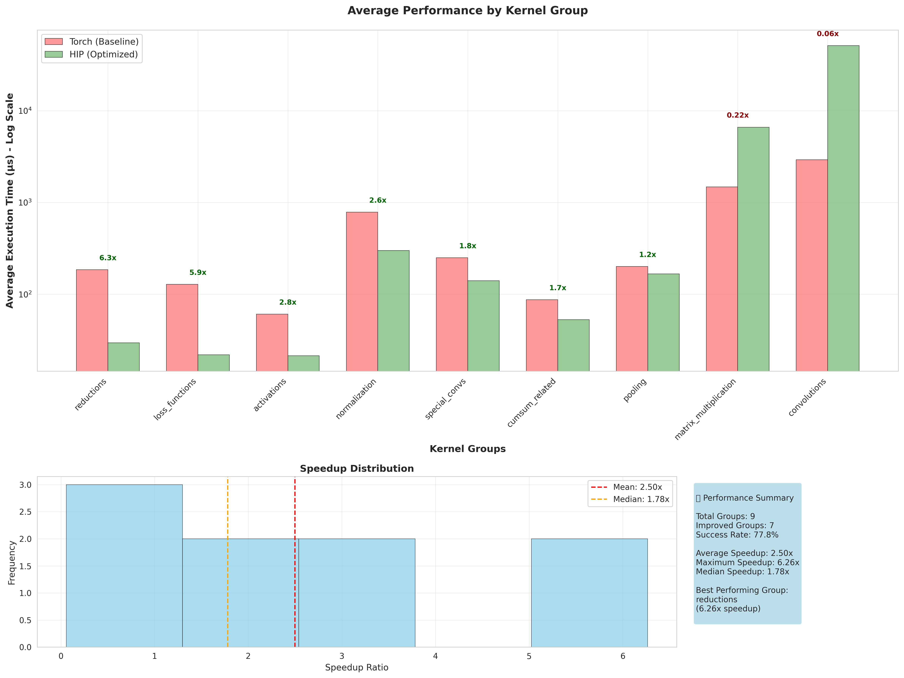
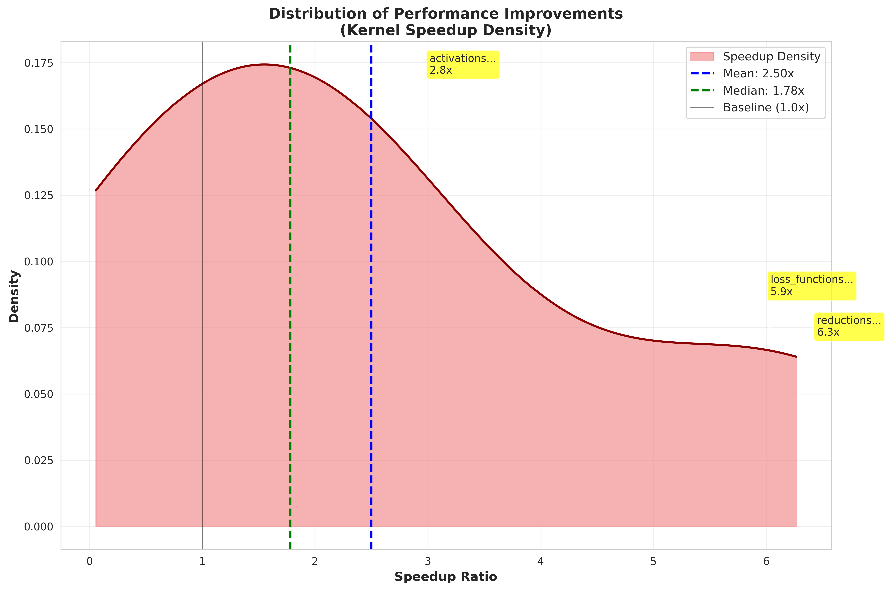
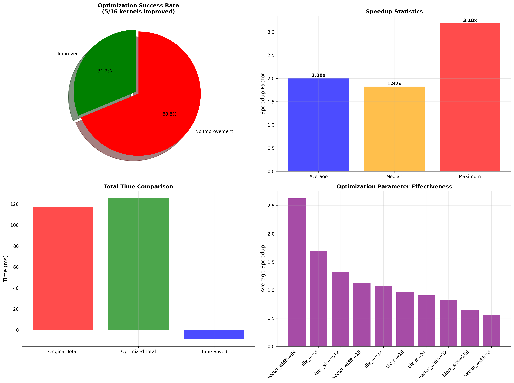
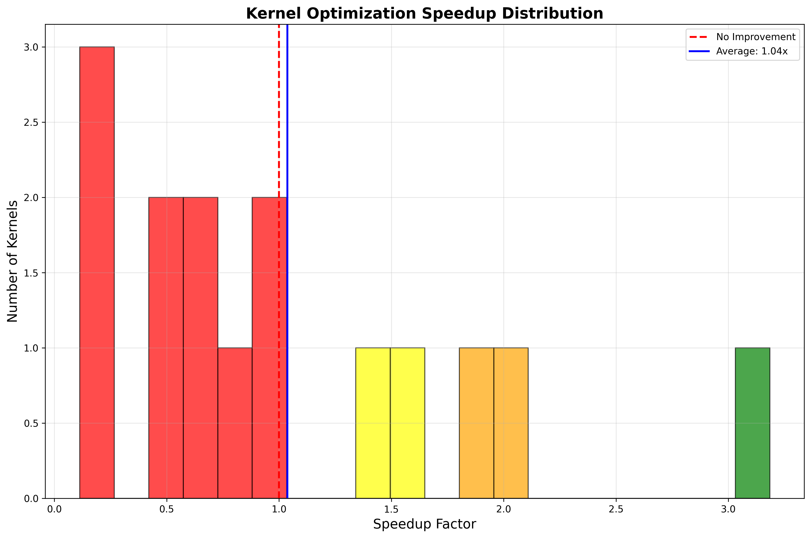
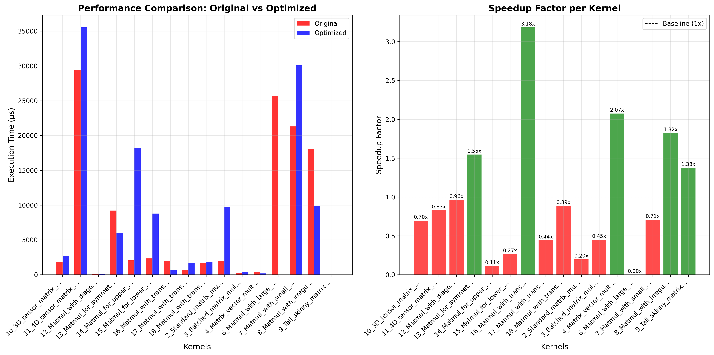
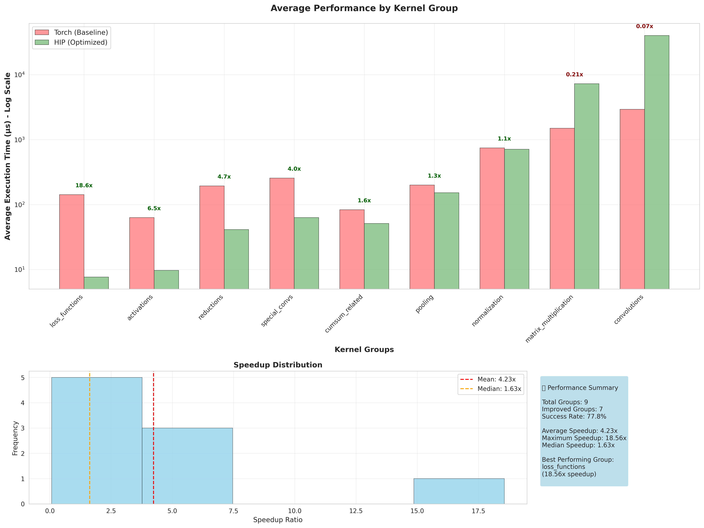
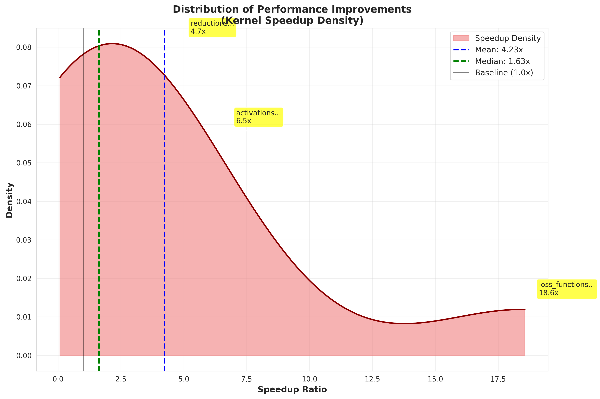

# HIP Kernel Benchmark evalboard 🏆

Welcome to the HIP Kernel Benchmark evalboard! This page tracks the performance of different optimization runs across various kernel categories.

## 📊 Rankings

**Mode Legend:**
- **P2K**: PyTorch-to-Kernel generation
- **K2K**: Kernel-to-Kernel optimization

| Rank | Run Name | Date/Version | Mode | Overall Speedup | Success Rate (%) | Avg Torch Time (μs) | Avg HIP Time (μs) | Total Kernels | Configuration |
|------|----------|--------------|------|-----------------|------------------|-------------------|----------------|---------------|---------------|
| 1| KernelBench-level1-v0 | KernelBench-level1-v0 | P2K | 0.53x | 100.0% | 1165.8 | 15029.1 | 101 | Mode: P2K, Lang: hip, Search: genetic, Gen: o3 |
| 2| MatMul-level1 | MatMul-level1 | K2K | 0.50x | 100.0% | 7301.4 | 9461.5 | 16 | Mode: K2K, Lang: hip, Search: genetic, Gen: o3 |
| 3| KernelBench-level1-v1 | KernelBench-level1-v1 | P2K | 0.30x | 100.0% | 1191.1 | 12788.1 | 99 | Mode: P2K, Lang: hip, Search: genetic, Gen: o3 |

## 📈 Performance Charts

### KernelBench-level1-v0

#### Average Performance by Group

#### Performance Distribution

### MatMul-level1

#### Kernel Optimization Results

#### Speedup Distribution

#### Performance Comparison

### KernelBench-level1-v1

#### Average Performance by Group

#### Performance Distribution

*Showing 3 performance chart(s)*

## 📋 Kernel Optimization Reports

### MatMul-level1 - Kernel Optimization Analysis

# Kernel Optimization Analysis Report

## 📊 Summary Statistics

- **Total Kernels Analyzed**: 16
- **Successfully Optimized**: 5 (31.2%)
- **Average Speedup**: 2.00x
- **Median Speedup**: 1.82x
- **Maximum Speedup**: 3.18x
- **Overall Performance Improvement**: 0.93x

## 📈 Performance Analysis

### Time Comparison
- **Total Original Time**: 116822.5 μs
- **Total Optimized Time**: 125689.5 μs
- **Time Saved**: -8867.0 μs

## 🎯 Individual Kernel Results

| Kernel Name | Original (μs) | Optimized (μs) | Speedup | Status |
|-------------|---------------|----------------|---------|---------|
| 10_3D_tensor_matrix_multiplication_best | 1852.0 | 2660.9 | 0.70x | ❌ No improvement |
| 11_4D_tensor_matrix_multiplication_best | 29451.6 | 35538.8 | 0.83x | ❌ No improvement |
| 12_Matmul_with_diagonal_matrices__best | 44.9 | 46.6 | 0.96x | ❌ No improvement |
| 13_Matmul_for_symmetric_matrices_best | 9219.1 | 5961.4 | 1.55x | ✅ Improved |
| 14_Matmul_for_upper_triangular_matrices_best | 2060.6 | 18239.1 | 0.11x | ❌ No improvement |
| 15_Matmul_for_lower_triangular_matrices_best | 2334.3 | 8793.2 | 0.27x | ❌ No improvement |
| 16_Matmul_with_transposed_A_best | 1966.0 | 617.4 | 3.18x | ✅ Improved |
| 17_Matmul_with_transposed_B_best | 722.2 | 1632.8 | 0.44x | ❌ No improvement |
| 18_Matmul_with_transposed_both_best | 1660.6 | 1873.7 | 0.89x | ❌ No improvement |
| 2_Standard_matrix_multiplication__best | 1918.9 | 9749.0 | 0.20x | ❌ No improvement |
| 3_Batched_matrix_multiplication_best | 189.1 | 419.5 | 0.45x | ❌ No improvement |
| 4_Matrix_vector_multiplication__best | 345.9 | 166.8 | 2.07x | ✅ Improved |
| 6_Matmul_with_large_K_dimension__best | 25694.3 | 0.0 | 0.00x | ❌ No improvement |
| 7_Matmul_with_small_K_dimension__best | 21304.9 | 30079.9 | 0.71x | ❌ No improvement |
| 8_Matmul_with_irregular_shapes__best | 18052.3 | 9905.9 | 1.82x | ✅ Improved |
| 9_Tall_skinny_matrix_multiplication__best | 5.9 | 4.2 | 1.38x | ✅ Improved |

## 🔧 Optimization Techniques Applied

### 10_3D_tensor_matrix_multiplication_best
- **Speedup achieved**: 0.70x
- **Parameters optimized**:
  - `block_size`: 256
  - `vector_width`: 32
  - `tile_m`: 16

### 11_4D_tensor_matrix_multiplication_best
- **Speedup achieved**: 0.83x
- **Parameters optimized**:
  - `block_size`: 0
  - `vector_width`: 2
  - `tile_m`: 32

### 12_Matmul_with_diagonal_matrices__best
- **Speedup achieved**: 0.96x
- **Parameters optimized**:
  - `block_size`: 256
  - `vector_width`: 8
  - `tile_m`: 32

### 13_Matmul_for_symmetric_matrices_best
- **Speedup achieved**: 1.55x
- **Parameters optimized**:
  - `block_size`: 512
  - `vector_width`: 32
  - `tile_m`: 64

### 14_Matmul_for_upper_triangular_matrices_best
- **Speedup achieved**: 0.11x
- **Parameters optimized**:
  - `block_size`: 2
  - `vector_width`: 3
  - `tile_m`: 0

### 15_Matmul_for_lower_triangular_matrices_best
- **Speedup achieved**: 0.27x
- **Parameters optimized**:
  - `block_size`: 512
  - `vector_width`: 8
  - `tile_m`: 64

### 16_Matmul_with_transposed_A_best
- **Speedup achieved**: 3.18x
- **Parameters optimized**:
  - `block_size`: 512
  - `vector_width`: 64
  - `tile_m`: 8

### 17_Matmul_with_transposed_B_best
- **Speedup achieved**: 0.44x
- **Parameters optimized**:
  - `block_size`: 256
  - `vector_width`: 16
  - `tile_m`: 32

### 18_Matmul_with_transposed_both_best
- **Speedup achieved**: 0.89x
- **Parameters optimized**:
  - `block_size`: 512
  - `vector_width`: 32
  - `tile_m`: 16

### 2_Standard_matrix_multiplication__best
- **Speedup achieved**: 0.20x
- **Parameters optimized**:
  - `block_size`: 512
  - `vector_width`: 32
  - `tile_m`: 8

### 3_Batched_matrix_multiplication_best
- **Speedup achieved**: 0.45x
- **Parameters optimized**:
  - `block_size`: 256
  - `vector_width`: 8
  - `tile_m`: 16

### 4_Matrix_vector_multiplication__best
- **Speedup achieved**: 2.07x
- **Parameters optimized**:
  - `block_size`: 128
  - `vector_width`: 64
  - `tile_m`: 32

### 8_Matmul_with_irregular_shapes__best
- **Speedup achieved**: 1.82x
- **Parameters optimized**:
  - `block_size`: 512
  - `vector_width`: 16
  - `tile_m`: 16

## 🔬 Optimization Methodology

This analysis used the kernel2kernel optimization pipeline, which:

1. **Analyzes existing kernels** to understand their computational patterns and identify bottlenecks
2. **Applies targeted optimizations** using LLM-guided code improvements
3. **Iteratively refines** kernels based on profiling feedback
4. **Performs hyperparameter optimization** to fine-tune kernel parameters

The optimization process focuses on:
- Memory access pattern improvements
- Compute utilization optimization  
- Register usage optimization
- Shared memory optimization
- Architecture-specific optimizations

## 📝 Notes

- Speedup is calculated as: `Original Time / Optimized Time`
- Results include both algorithmic improvements and parameter tuning
- All timings are in microseconds (μs)
- Optimizations maintain functional correctness while improving performance

---
*Report generated on 2025-07-15 22:26:14*

*Showing 1 optimization report(s)*

## ⚙️ Detailed Configuration

### KernelBench-level1-v0

#### Pipeline Settings
- **Kernel Language**: hip
- **RAG Enabled**: ❌
- **Online Search**: ❌
- **Cheat Sheet**: ✅
- **Omnivise**: ✅
- **Correctness Check**: ❌

#### Search Configuration
- **Method**: genetic
- **Population**: 16
- **Generations**: 20
- **Patience**: 12

#### Model Configuration
- **Torch Analyser**: GPT-4o
- **Kernel Generator**: o3
- **Multi-Model Setup**: ✅ (Different models for analysis vs generation)

#### Prompts Used
📝 **Prompt Files**: [View all prompts](reports/KernelBench-level1-v0/prompts/PROMPTS_SUMMARY.md)

**Key Prompt Files**:
- [`error_refine.txt`](reports/KernelBench-level1-v0/prompts/error_refine.txt)
- [`hip_naive.txt`](reports/KernelBench-level1-v0/prompts/hip_naive.txt)
- [`hip_opt.txt`](reports/KernelBench-level1-v0/prompts/hip_opt.txt)
- [`hip_optimize.txt`](reports/KernelBench-level1-v0/prompts/hip_optimize.txt)
- [`optimization.txt`](reports/KernelBench-level1-v0/prompts/optimization.txt)
- [`refinement.txt`](reports/KernelBench-level1-v0/prompts/refinement.txt)

#### Cheat Sheets
📋 **Cheat Sheets**: [View cheat sheets](reports/KernelBench-level1-v0/cheat_sheets/)

### MatMul-level1

#### Pipeline Settings
- **Kernel Language**: hip
- **RAG Enabled**: ❌
- **Online Search**: ❌
- **Cheat Sheet**: ✅
- **Omnivise**: ✅
- **Correctness Check**: ❌

#### Search Configuration
- **Method**: genetic
- **Population**: 16
- **Generations**: 20
- **Patience**: 12

#### Model Configuration
- **Torch Analyser**: GPT-4o
- **Kernel Generator**: o3
- **Multi-Model Setup**: ✅ (Different models for analysis vs generation)

#### Prompts Used
📝 **Prompt Files**: [View all prompts](reports/MatMul-level1/prompts/PROMPTS_SUMMARY.md)

**Key Prompt Files**:
- [`error_refine.txt`](reports/MatMul-level1/prompts/error_refine.txt)
- [`hip_naive.txt`](reports/MatMul-level1/prompts/hip_naive.txt)
- [`hip_opt.txt`](reports/MatMul-level1/prompts/hip_opt.txt)
- [`hip_optimize.txt`](reports/MatMul-level1/prompts/hip_optimize.txt)
- [`optimization.txt`](reports/MatMul-level1/prompts/optimization.txt)
- [`refinement.txt`](reports/MatMul-level1/prompts/refinement.txt)

#### Cheat Sheets
📋 **Cheat Sheets**: [View cheat sheets](reports/MatMul-level1/cheat_sheets/)

### KernelBench-level1-v1

#### Pipeline Settings
- **Kernel Language**: hip
- **RAG Enabled**: ❌
- **Online Search**: ❌
- **Cheat Sheet**: ✅
- **Omnivise**: ✅
- **Correctness Check**: ❌

#### Search Configuration
- **Method**: genetic
- **Population**: 16
- **Generations**: 20
- **Patience**: 12

#### Model Configuration
- **Torch Analyser**: GPT-4o
- **Kernel Generator**: o3
- **Multi-Model Setup**: ✅ (Different models for analysis vs generation)

#### Prompts Used
📝 **Prompt Files**: [View all prompts](reports/KernelBench-level1-v1/prompts/PROMPTS_SUMMARY.md)

**Key Prompt Files**:
- [`error_refine.txt`](reports/KernelBench-level1-v1/prompts/error_refine.txt)
- [`hip_naive.txt`](reports/KernelBench-level1-v1/prompts/hip_naive.txt)
- [`hip_opt.txt`](reports/KernelBench-level1-v1/prompts/hip_opt.txt)
- [`hip_optimize.txt`](reports/KernelBench-level1-v1/prompts/hip_optimize.txt)
- [`optimization.txt`](reports/KernelBench-level1-v1/prompts/optimization.txt)
- [`refinement.txt`](reports/KernelBench-level1-v1/prompts/refinement.txt)

#### Cheat Sheets
📋 **Cheat Sheets**: [View cheat sheets](reports/KernelBench-level1-v1/cheat_sheets/)

*Showing 3 detailed configuration(s)*

## 📝 Notes

- **Overall Speedup**: Harmonic mean of individual kernel speedups (Torch time / HIP time)
- **Success Rate**: Percentage of kernels that successfully compiled and executed
- **Avg Times**: Average execution times across all kernels in microseconds
- **Configuration**: Key settings used for the optimization run
- **Prompts**: Links to actual prompt files used during optimization

---
*Last updated: 2025-07-15 22:26:14*
