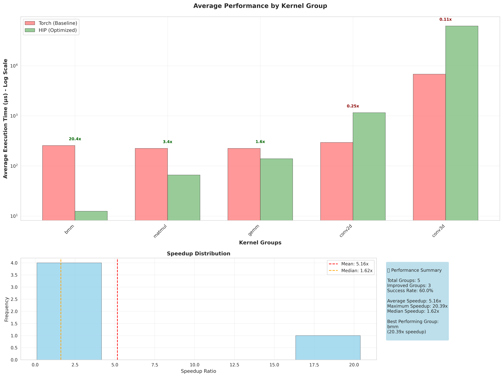
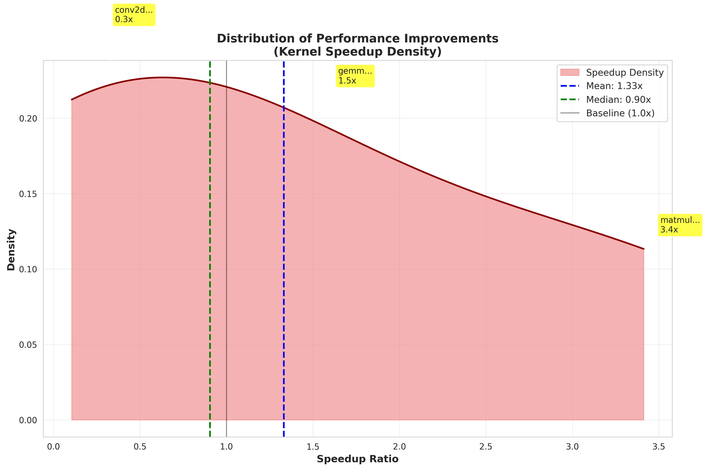

# HIP Kernel Benchmark evalboard 🏆

Welcome to the HIP Kernel Benchmark evalboard! This page tracks the performance of different optimization runs across various kernel categories.

## 📊 Rankings

**Mode Legend:**
- **P2K**: PyTorch-to-Kernel generation
- **K2K**: Kernel-to-Kernel optimization

| Rank | Run Name | Date/Version | Mode | Overall Speedup | Success Rate (%) | Avg Torch Time (μs) | Avg HIP Time (μs) | Total Kernels | Configuration |
|------|----------|--------------|------|-----------------|------------------|-------------------|----------------|---------------|---------------|
| 1| KernelBench-level1-v0 | KernelBench-level1-v0 | P2K | 0.53x | 100.0% | 1165.8 | 15029.1 | 101 | Mode: P2K, Lang: hip, Search: genetic, Gen: o3 |
| 2| MatMul-level1 | MatMul-level1 | K2K | 0.50x | 100.0% | 7301.4 | 9461.5 | 16 | Mode: K2K, Lang: hip, Search: genetic, Gen: o3 |
| 3| KernelBench-level1-v1 | KernelBench-level1-v1 | P2K | 0.30x | 100.0% | 1191.1 | 12788.1 | 99 | Mode: P2K, Lang: hip, Search: genetic, Gen: o3 |
| 4| level2_kernelbench | level2_kernelbench | P2K | 0.29x | 100.0% | 2172.4 | 18612.9 | 96 | Mode: P2K, Lang: hip, Search: genetic, Gen: o3 |

## 📈 Performance Charts

### KernelBench-level1-v0

#### Average Performance by Group

#### Performance Distribution

### MatMul-level1

#### Kernel Optimization Results

### KernelBench-level1-v1

#### Average Performance by Group

#### Performance Distribution

### level2_kernelbench

#### Average Performance by Group

#### Performance Distribution

*Showing 4 performance chart(s)*

## 📋 Kernel Optimization Reports

*No kernel optimization reports available yet.*

## ⚙️ Detailed Configuration

### KernelBench-level1-v0

#### Pipeline Settings
- **Kernel Language**: hip
- **RAG Enabled**: ❌
- **Online Search**: ❌
- **Cheat Sheet**: ✅
- **Omnivise**: ✅
- **Correctness Check**: ❌

#### Search Configuration
- **Method**: genetic
- **Population**: 16
- **Generations**: 20
- **Patience**: 12

#### Model Configuration
- **Torch Analyser**: GPT-4o
- **Kernel Generator**: o3
- **Multi-Model Setup**: ✅ (Different models for analysis vs generation)

#### Prompts Used
📝 **Prompt Files**: [View all prompts](reports/KernelBench-level1-v0/prompts/PROMPTS_SUMMARY.md)

**Key Prompt Files**:
- [`error_refine.txt`](reports/KernelBench-level1-v0/prompts/error_refine.txt)
- [`hip_naive.txt`](reports/KernelBench-level1-v0/prompts/hip_naive.txt)
- [`hip_opt.txt`](reports/KernelBench-level1-v0/prompts/hip_opt.txt)
- [`hip_optimize.txt`](reports/KernelBench-level1-v0/prompts/hip_optimize.txt)
- [`optimization.txt`](reports/KernelBench-level1-v0/prompts/optimization.txt)
- [`refinement.txt`](reports/KernelBench-level1-v0/prompts/refinement.txt)

#### Cheat Sheets
📋 **Cheat Sheets**: [View cheat sheets](reports/KernelBench-level1-v0/cheat_sheets/)

### MatMul-level1

#### Pipeline Settings
- **Kernel Language**: hip
- **RAG Enabled**: ❌
- **Online Search**: ❌
- **Cheat Sheet**: ✅
- **Omnivise**: ✅
- **Correctness Check**: ❌

#### Search Configuration
- **Method**: genetic
- **Population**: 16
- **Generations**: 20
- **Patience**: 12

#### Model Configuration
- **Torch Analyser**: GPT-4o
- **Kernel Generator**: o3
- **Multi-Model Setup**: ✅ (Different models for analysis vs generation)

#### Prompts Used
📝 **Prompt Files**: [View all prompts](reports/MatMul-level1/prompts/PROMPTS_SUMMARY.md)

**Key Prompt Files**:
- [`error_refine.txt`](reports/MatMul-level1/prompts/error_refine.txt)
- [`hip_naive.txt`](reports/MatMul-level1/prompts/hip_naive.txt)
- [`hip_opt.txt`](reports/MatMul-level1/prompts/hip_opt.txt)
- [`hip_optimize.txt`](reports/MatMul-level1/prompts/hip_optimize.txt)
- [`optimization.txt`](reports/MatMul-level1/prompts/optimization.txt)
- [`refinement.txt`](reports/MatMul-level1/prompts/refinement.txt)

#### Cheat Sheets
📋 **Cheat Sheets**: [View cheat sheets](reports/MatMul-level1/cheat_sheets/)

### KernelBench-level1-v1

#### Pipeline Settings
- **Kernel Language**: hip
- **RAG Enabled**: ❌
- **Online Search**: ❌
- **Cheat Sheet**: ✅
- **Omnivise**: ✅
- **Correctness Check**: ❌

#### Search Configuration
- **Method**: genetic
- **Population**: 16
- **Generations**: 20
- **Patience**: 12

#### Model Configuration
- **Torch Analyser**: GPT-4o
- **Kernel Generator**: o3
- **Multi-Model Setup**: ✅ (Different models for analysis vs generation)

#### Prompts Used
📝 **Prompt Files**: [View all prompts](reports/KernelBench-level1-v1/prompts/PROMPTS_SUMMARY.md)

**Key Prompt Files**:
- [`error_refine.txt`](reports/KernelBench-level1-v1/prompts/error_refine.txt)
- [`hip_naive.txt`](reports/KernelBench-level1-v1/prompts/hip_naive.txt)
- [`hip_opt.txt`](reports/KernelBench-level1-v1/prompts/hip_opt.txt)
- [`hip_optimize.txt`](reports/KernelBench-level1-v1/prompts/hip_optimize.txt)
- [`optimization.txt`](reports/KernelBench-level1-v1/prompts/optimization.txt)
- [`refinement.txt`](reports/KernelBench-level1-v1/prompts/refinement.txt)

#### Cheat Sheets
📋 **Cheat Sheets**: [View cheat sheets](reports/KernelBench-level1-v1/cheat_sheets/)

### level2_kernelbench

#### Pipeline Settings
- **Kernel Language**: hip
- **RAG Enabled**: ✅
- **Online Search**: ❌
- **Cheat Sheet**: ✅
- **Omnivise**: ❌
- **Correctness Check**: ❌

#### Search Configuration
- **Method**: genetic
- **Population**: 16
- **Generations**: 20
- **Patience**: 12

#### Model Configuration
- **Torch Analyser**: GPT-4o
- **Kernel Generator**: o3
- **Multi-Model Setup**: ✅ (Different models for analysis vs generation)

#### Prompts Used
📝 **Prompt Files**: [View all prompts](reports/level2_kernelbench/prompts/PROMPTS_SUMMARY.md)

**Key Prompt Files**:
- [`error_refine.txt`](reports/level2_kernelbench/prompts/error_refine.txt)
- [`hip_naive.txt`](reports/level2_kernelbench/prompts/hip_naive.txt)
- [`hip_opt.txt`](reports/level2_kernelbench/prompts/hip_opt.txt)
- [`hip_optimize.txt`](reports/level2_kernelbench/prompts/hip_optimize.txt)
- [`optimization.txt`](reports/level2_kernelbench/prompts/optimization.txt)
- [`refinement.txt`](reports/level2_kernelbench/prompts/refinement.txt)

#### Cheat Sheets
📋 **Cheat Sheets**: [View cheat sheets](reports/level2_kernelbench/cheat_sheets/)

*Showing 4 detailed configuration(s)*

## 📝 Notes

- **Overall Speedup**: Harmonic mean of individual kernel speedups (Torch time / HIP time)
- **Success Rate**: Percentage of kernels that successfully compiled and executed
- **Avg Times**: Average execution times across all kernels in microseconds
- **Configuration**: Key settings used for the optimization run
- **Prompts**: Links to actual prompt files used during optimization

---
*Last updated: 2025-07-17 18:08:04*
