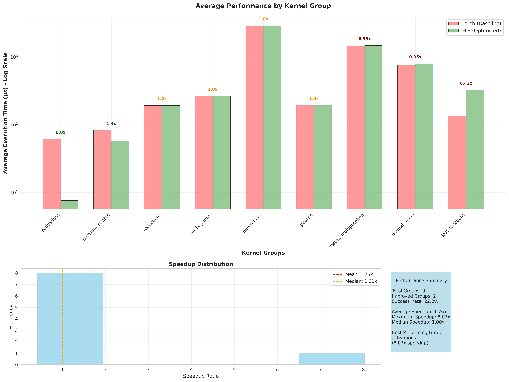
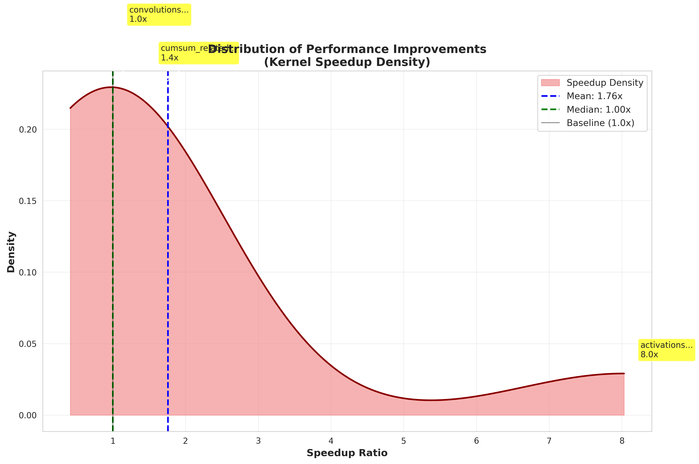
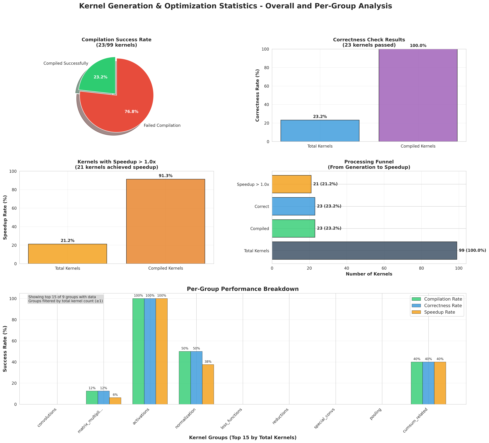
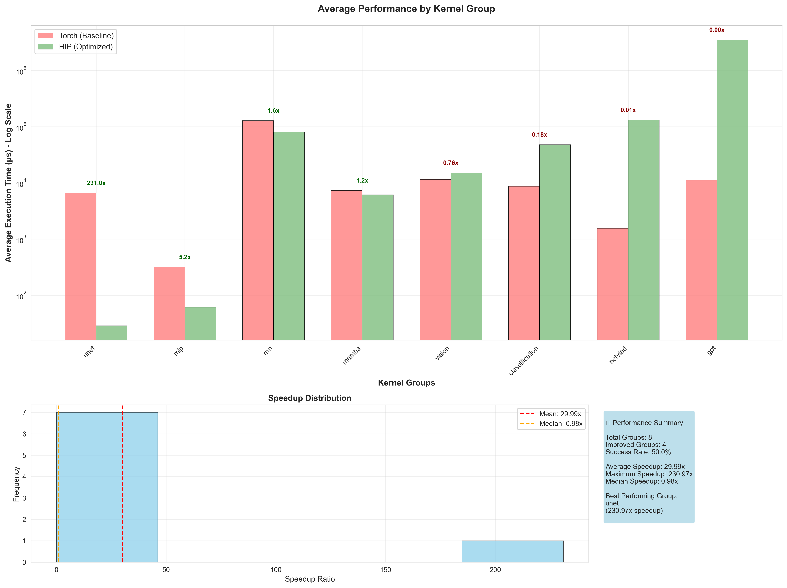
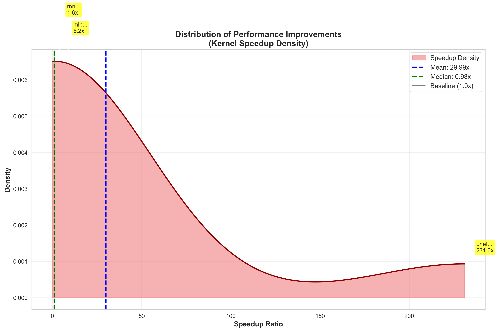
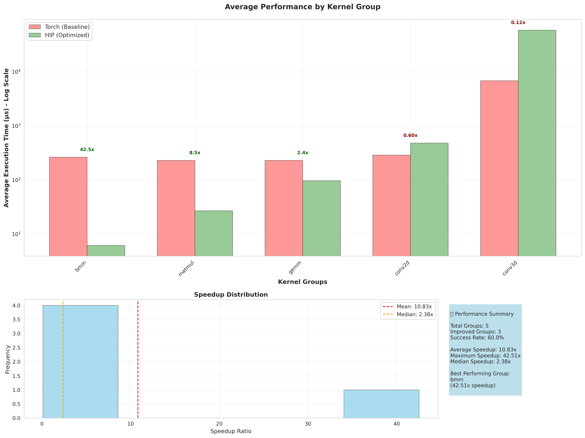
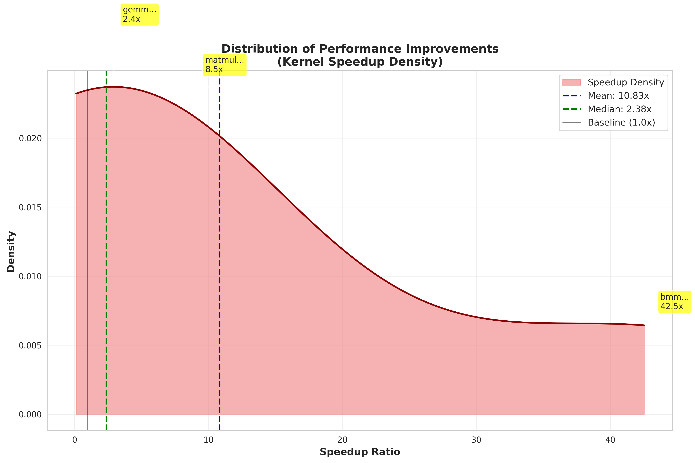

# HIP Kernel Benchmark evalboard 🏆

Welcome to the HIP Kernel Benchmark evalboard! This page tracks the performance of different optimization runs across various kernel categories.

## 📊 Rankings

**Mode Legend:**
- **P2K**: PyTorch-to-Kernel generation
- **K2K**: Kernel-to-Kernel optimization

| Rank | Run Name | Date/Version | Mode | Overall Speedup | Success Rate (%) | Avg Torch Time (μs) | Avg HIP Time (μs) | Total Kernels | Configuration |
|------|----------|--------------|------|-----------------|------------------|-------------------|----------------|---------------|---------------|
| 1| logsl1-ctypes-correctness | logsl1-ctypes-correctness | P2K | 1.13x | 100.0% | 1177.9 | 1173.3 | 98 | Mode: P2K, Lang: hip, Search: genetic, Gen: Claude-4 |
| 2| logs_ctypes | logs_ctypes | P2K | 1.05x | 100.0% | 1170.6 | 1179.8 | 97 | Mode: P2K, Lang: hip, Search: genetic, Gen: Claude-4 |
| 3| KernelBench-level1-v0 | KernelBench-level1-v0 | P2K | 0.53x | 100.0% | 1165.8 | 15029.1 | 101 | Mode: P2K, Lang: hip, Search: genetic, Gen: o3 |
| 4| MatMul-level1 | MatMul-level1 | K2K | 0.50x | 100.0% | 7301.4 | 9461.5 | 16 | Mode: K2K, Lang: hip, Search: genetic, Gen: o3 |
| 5| level2_kernelbench_textdb | level2_kernelbench_textdb | P2K | 0.44x | 100.0% | 2168.2 | 17246.0 | 96 | Mode: P2K, Lang: hip, Search: genetic, Gen: o3 |
| 6| KernelBench-level1-v1 | KernelBench-level1-v1 | P2K | 0.30x | 100.0% | 1191.1 | 12788.1 | 99 | Mode: P2K, Lang: hip, Search: genetic, Gen: o3 |
| 7| level2_kernelbench | level2_kernelbench | P2K | 0.29x | 100.0% | 2172.4 | 18612.9 | 96 | Mode: P2K, Lang: hip, Search: genetic, Gen: o3 |
| 8| level3_v0 | level3_v0 | P2K | 0.02x | 100.0% | 31862.7 | 316613.0 | 50 | Mode: P2K, Lang: hip, Search: genetic, Gen: o3 |
| 1 | logsl1-ctypes-correctness | 0.0% | 0.0% | 0.0% | 21.4% | 0.0% |

## 📈 Performance Charts

### logsl1-ctypes-correctness

#### Average Performance by Group

#### Performance Distribution

#### Kernel Generation Statistics

### logs_ctypes

#### Average Performance by Group

#### Performance Distribution

### KernelBench-level1-v0

#### Average Performance by Group

#### Performance Distribution

### level2_kernelbench_textdb

#### Average Performance by Group

#### Performance Distribution

### KernelBench-level1-v1

#### Average Performance by Group

#### Performance Distribution

### level2_kernelbench

#### Average Performance by Group

#### Performance Distribution

### level3_v0

#### Average Performance by Group

#### Performance Distribution

*Showing 7 performance chart(s)*

## 📋 Kernel Optimization Reports

*No kernel optimization reports available yet.*

## ⚙️ Detailed Configuration

### logsl1-ctypes-correctness

#### Pipeline Settings
- **Kernel Language**: hip
- **RAG Enabled**: ❌
- **Online Search**: ❌
- **Cheat Sheet**: ✅
- **Omnivise**: ❌
- **Correctness Check**: ❌

#### Search Configuration
- **Method**: genetic
- **Population**: 16
- **Generations**: 20
- **Patience**: 6

#### Model Configuration
- **Torch Analyser**: GPT-4o
- **Kernel Generator**: Claude-4
- **Multi-Model Setup**: ✅ (Different models for analysis vs generation)

#### Prompts Used
📝 **Prompt Files**: [View all prompts](reports/logsl1-ctypes-correctness/prompts/PROMPTS_SUMMARY.md)

**Key Prompt Files**:
- [`error_refine.txt`](reports/logsl1-ctypes-correctness/prompts/error_refine.txt)
- [`hip_naive.txt`](reports/logsl1-ctypes-correctness/prompts/hip_naive.txt)
- [`hip_opt.txt`](reports/logsl1-ctypes-correctness/prompts/hip_opt.txt)
- [`hip_optimize.txt`](reports/logsl1-ctypes-correctness/prompts/hip_optimize.txt)
- [`optimization.txt`](reports/logsl1-ctypes-correctness/prompts/optimization.txt)
- [`refinement.txt`](reports/logsl1-ctypes-correctness/prompts/refinement.txt)

#### Cheat Sheets
📋 **Cheat Sheets**: [View cheat sheets](reports/logsl1-ctypes-correctness/cheat_sheets/)

### logs_ctypes

#### Pipeline Settings
- **Kernel Language**: hip
- **RAG Enabled**: ❌
- **Online Search**: ❌
- **Cheat Sheet**: ✅
- **Omnivise**: ❌
- **Correctness Check**: ❌

#### Search Configuration
- **Method**: genetic
- **Population**: 16
- **Generations**: 20
- **Patience**: 6

#### Model Configuration
- **Torch Analyser**: GPT-4o
- **Kernel Generator**: Claude-4
- **Multi-Model Setup**: ✅ (Different models for analysis vs generation)

#### Prompts Used
📝 **Prompt Files**: [View all prompts](reports/logs_ctypes/prompts/PROMPTS_SUMMARY.md)

**Key Prompt Files**:
- [`error_refine.txt`](reports/logs_ctypes/prompts/error_refine.txt)
- [`hip_naive.txt`](reports/logs_ctypes/prompts/hip_naive.txt)
- [`hip_opt.txt`](reports/logs_ctypes/prompts/hip_opt.txt)
- [`hip_optimize.txt`](reports/logs_ctypes/prompts/hip_optimize.txt)
- [`optimization.txt`](reports/logs_ctypes/prompts/optimization.txt)
- [`refinement.txt`](reports/logs_ctypes/prompts/refinement.txt)

#### Cheat Sheets
📋 **Cheat Sheets**: [View cheat sheets](reports/logs_ctypes/cheat_sheets/)

### KernelBench-level1-v0

#### Pipeline Settings
- **Kernel Language**: hip
- **RAG Enabled**: ❌
- **Online Search**: ❌
- **Cheat Sheet**: ✅
- **Omnivise**: ✅
- **Correctness Check**: ❌

#### Search Configuration
- **Method**: genetic
- **Population**: 16
- **Generations**: 20
- **Patience**: 12

#### Model Configuration
- **Torch Analyser**: GPT-4o
- **Kernel Generator**: o3
- **Multi-Model Setup**: ✅ (Different models for analysis vs generation)

#### Prompts Used
📝 **Prompt Files**: [View all prompts](reports/KernelBench-level1-v0/prompts/PROMPTS_SUMMARY.md)

**Key Prompt Files**:
- [`error_refine.txt`](reports/KernelBench-level1-v0/prompts/error_refine.txt)
- [`hip_naive.txt`](reports/KernelBench-level1-v0/prompts/hip_naive.txt)
- [`hip_opt.txt`](reports/KernelBench-level1-v0/prompts/hip_opt.txt)
- [`hip_optimize.txt`](reports/KernelBench-level1-v0/prompts/hip_optimize.txt)
- [`optimization.txt`](reports/KernelBench-level1-v0/prompts/optimization.txt)
- [`refinement.txt`](reports/KernelBench-level1-v0/prompts/refinement.txt)

#### Cheat Sheets
📋 **Cheat Sheets**: [View cheat sheets](reports/KernelBench-level1-v0/cheat_sheets/)

### MatMul-level1

#### Pipeline Settings
- **Kernel Language**: hip
- **RAG Enabled**: ❌
- **Online Search**: ❌
- **Cheat Sheet**: ✅
- **Omnivise**: ✅
- **Correctness Check**: ❌

#### Search Configuration
- **Method**: genetic
- **Population**: 16
- **Generations**: 20
- **Patience**: 12

#### Model Configuration
- **Torch Analyser**: GPT-4o
- **Kernel Generator**: o3
- **Multi-Model Setup**: ✅ (Different models for analysis vs generation)

#### Prompts Used
📝 **Prompt Files**: [View all prompts](reports/MatMul-level1/prompts/PROMPTS_SUMMARY.md)

**Key Prompt Files**:
- [`error_refine.txt`](reports/MatMul-level1/prompts/error_refine.txt)
- [`hip_naive.txt`](reports/MatMul-level1/prompts/hip_naive.txt)
- [`hip_opt.txt`](reports/MatMul-level1/prompts/hip_opt.txt)
- [`hip_optimize.txt`](reports/MatMul-level1/prompts/hip_optimize.txt)
- [`optimization.txt`](reports/MatMul-level1/prompts/optimization.txt)
- [`refinement.txt`](reports/MatMul-level1/prompts/refinement.txt)

#### Cheat Sheets
📋 **Cheat Sheets**: [View cheat sheets](reports/MatMul-level1/cheat_sheets/)

### level2_kernelbench_textdb

#### Pipeline Settings
- **Kernel Language**: hip
- **RAG Enabled**: ✅
- **Online Search**: ❌
- **Cheat Sheet**: ✅
- **Omnivise**: ❌
- **Correctness Check**: ❌

#### Search Configuration
- **Method**: genetic
- **Population**: 16
- **Generations**: 20
- **Patience**: 12

#### Model Configuration
- **Torch Analyser**: GPT-4o
- **Kernel Generator**: o3
- **Multi-Model Setup**: ✅ (Different models for analysis vs generation)

#### Prompts Used
📝 **Prompt Files**: [View all prompts](reports/level2_kernelbench_textdb/prompts/PROMPTS_SUMMARY.md)

**Key Prompt Files**:
- [`error_refine.txt`](reports/level2_kernelbench_textdb/prompts/error_refine.txt)
- [`hip_naive.txt`](reports/level2_kernelbench_textdb/prompts/hip_naive.txt)
- [`hip_opt.txt`](reports/level2_kernelbench_textdb/prompts/hip_opt.txt)
- [`hip_optimize.txt`](reports/level2_kernelbench_textdb/prompts/hip_optimize.txt)
- [`optimization.txt`](reports/level2_kernelbench_textdb/prompts/optimization.txt)
- [`refinement.txt`](reports/level2_kernelbench_textdb/prompts/refinement.txt)

#### Cheat Sheets
📋 **Cheat Sheets**: [View cheat sheets](reports/level2_kernelbench_textdb/cheat_sheets/)

### KernelBench-level1-v1

#### Pipeline Settings
- **Kernel Language**: hip
- **RAG Enabled**: ❌
- **Online Search**: ❌
- **Cheat Sheet**: ✅
- **Omnivise**: ✅
- **Correctness Check**: ❌

#### Search Configuration
- **Method**: genetic
- **Population**: 16
- **Generations**: 20
- **Patience**: 12

#### Model Configuration
- **Torch Analyser**: GPT-4o
- **Kernel Generator**: o3
- **Multi-Model Setup**: ✅ (Different models for analysis vs generation)

#### Prompts Used
📝 **Prompt Files**: [View all prompts](reports/KernelBench-level1-v1/prompts/PROMPTS_SUMMARY.md)

**Key Prompt Files**:
- [`error_refine.txt`](reports/KernelBench-level1-v1/prompts/error_refine.txt)
- [`hip_naive.txt`](reports/KernelBench-level1-v1/prompts/hip_naive.txt)
- [`hip_opt.txt`](reports/KernelBench-level1-v1/prompts/hip_opt.txt)
- [`hip_optimize.txt`](reports/KernelBench-level1-v1/prompts/hip_optimize.txt)
- [`optimization.txt`](reports/KernelBench-level1-v1/prompts/optimization.txt)
- [`refinement.txt`](reports/KernelBench-level1-v1/prompts/refinement.txt)

#### Cheat Sheets
📋 **Cheat Sheets**: [View cheat sheets](reports/KernelBench-level1-v1/cheat_sheets/)

### level2_kernelbench

#### Pipeline Settings
- **Kernel Language**: hip
- **RAG Enabled**: ✅
- **Online Search**: ❌
- **Cheat Sheet**: ✅
- **Omnivise**: ❌
- **Correctness Check**: ❌

#### Search Configuration
- **Method**: genetic
- **Population**: 16
- **Generations**: 20
- **Patience**: 12

#### Model Configuration
- **Torch Analyser**: GPT-4o
- **Kernel Generator**: o3
- **Multi-Model Setup**: ✅ (Different models for analysis vs generation)

#### Prompts Used
📝 **Prompt Files**: [View all prompts](reports/level2_kernelbench/prompts/PROMPTS_SUMMARY.md)

**Key Prompt Files**:
- [`error_refine.txt`](reports/level2_kernelbench/prompts/error_refine.txt)
- [`hip_naive.txt`](reports/level2_kernelbench/prompts/hip_naive.txt)
- [`hip_opt.txt`](reports/level2_kernelbench/prompts/hip_opt.txt)
- [`hip_optimize.txt`](reports/level2_kernelbench/prompts/hip_optimize.txt)
- [`optimization.txt`](reports/level2_kernelbench/prompts/optimization.txt)
- [`refinement.txt`](reports/level2_kernelbench/prompts/refinement.txt)

#### Cheat Sheets
📋 **Cheat Sheets**: [View cheat sheets](reports/level2_kernelbench/cheat_sheets/)

### level3_v0

#### Pipeline Settings
- **Kernel Language**: hip
- **RAG Enabled**: ❌
- **Online Search**: ❌
- **Cheat Sheet**: ✅
- **Omnivise**: ✅
- **Correctness Check**: ❌

#### Search Configuration
- **Method**: genetic
- **Population**: 16
- **Generations**: 20
- **Patience**: 12

#### Model Configuration
- **Torch Analyser**: GPT-4o
- **Kernel Generator**: o3
- **Multi-Model Setup**: ✅ (Different models for analysis vs generation)

#### Prompts Used
📝 **Prompt Files**: [View all prompts](reports/level3_v0/prompts/PROMPTS_SUMMARY.md)

**Key Prompt Files**:
- [`error_refine.txt`](reports/level3_v0/prompts/error_refine.txt)
- [`hip_naive.txt`](reports/level3_v0/prompts/hip_naive.txt)
- [`hip_opt.txt`](reports/level3_v0/prompts/hip_opt.txt)
- [`hip_optimize.txt`](reports/level3_v0/prompts/hip_optimize.txt)
- [`optimization.txt`](reports/level3_v0/prompts/optimization.txt)
- [`refinement.txt`](reports/level3_v0/prompts/refinement.txt)

#### Cheat Sheets
📋 **Cheat Sheets**: [View cheat sheets](reports/level3_v0/cheat_sheets/)

*Showing 8 detailed configuration(s)*

## 📝 Notes

- **Overall Speedup**: Harmonic mean of individual kernel speedups (Torch time / HIP time)
- **Success Rate**: Percentage of kernels that successfully compiled and executed
- **Avg Times**: Average execution times across all kernels in microseconds
- **Configuration**: Key settings used for the optimization run
- **Prompts**: Links to actual prompt files used during optimization

---
*Last updated: 2025-07-30 17:41:59*
