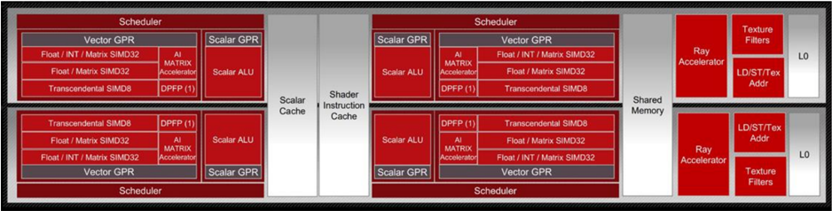
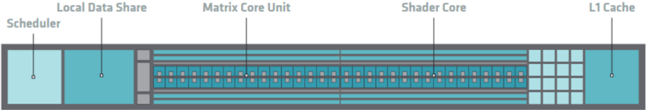
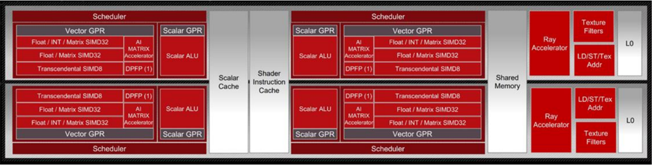
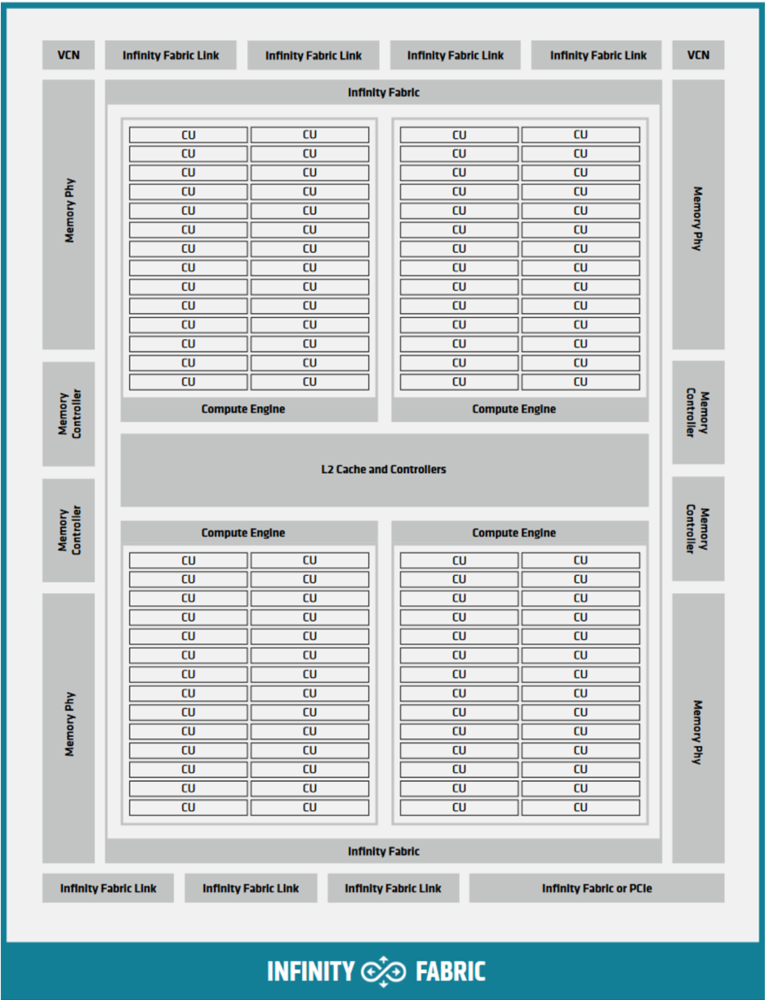

## HIP Documentation Release 6.1.40092

Advanced Micro Devices, Inc.

Sep 13, 2024

## INSTALL
**Following table contains:** The table appears to represent a structured outline or table of contents for a document or guide related to installing and building HIP (Heterogeneous-Compute Interface for Portability). Each row corresponds to a section or subsection of the document.

- The first column seems to indicate the main section number or title.
- The second column provides a more detailed section or subsection number.
- The third column contains the title or description of the section or subsection.
- The fourth column appears to indicate a page number where the section or subsection can be found.

Noteworthy values include:
- The main sections are "1 Overview" and "3 Build HIP from source."
- Subsections under "Install HIP" include "Prerequisites," "Installation," and "Verify your installation."
- The page numbers suggest that the "Overview" section spans pages 3 to 6, while "Build HIP from source" starts on page 7.


| 1 Overview   | 1 Overview                                                   | 1 Overview                                                   | 3     |
|--------------|--------------------------------------------------------------|--------------------------------------------------------------|-------|
|              | Install HIP                                                  | Install HIP                                                  |       |
| 2            |                                                              |                                                              | 5     |
|              | 2.1                                                          | Prerequisites . . . . . . . . .                              | 5     |
|              | 2.2                                                          | Installation . . .                                           | 5     |
|              | 2.3                                                          | . . . . . Verify your installation . . .                     | 6     |
| 3            | Build HIP from source                                        | Build HIP from source                                        | 7     |
|              | 3.1 Prerequisites                                            | . . . . . .                                                  |       |
|              |                                                              | . .                                                          | 7     |
|              | 3.2 Building the HIP runtime 3.3 . .                         | .                                                            | 7     |
|              | Build HIP tests . . .                                        | Build HIP tests . . .                                        | 10    |
|              | . . . 3.4 Run HIP . . . . . . . . . . .                      | . . . 3.4 Run HIP . . . . . . . . . . .                      | 11    |
| 4            | HIP programming model                                        | HIP programming model                                        | 13    |
|              | 4.1                                                          | 4.1                                                          | 13    |
| 4.2          | RDNA &CDNAarchitecture summary Heterogeneous Programming . . | RDNA &CDNAarchitecture summary Heterogeneous Programming . . | 14    |
|              | Single instruction multiple threads (SIMT) . . .             | Single instruction multiple threads (SIMT) . . .             | 14    |
| 4.3 4.4      | Inherent thread model . .                                    | Inherent thread model . .                                    | 15    |
| 4.5          | . . . . 4.4.1 Cooperative groups thread                      | . . . . 4.4.1 Cooperative groups thread                      | 16    |
|              | Memory model . . . . . . . . .                               | Memory model . . . . . . . . .                               | 16    |
|              | 4.6 Execution model .                                        | . . . . .                                                    | 17    |
|              | 4.6.1 Host-side                                              | 4.6.1 Host-side                                              |       |
|              |                                                              | execution                                                    | 17 17 |
|              | 4.6.2                                                        | Device-side execution . .                                    |       |
|              | 4.6.3                                                        | Kernel launch .                                              | 18    |
| 5            | Hardware implementation                                      | Hardware implementation                                      | 19    |
|              | Compute units                                                | . . . . . . .                                                | 19    |
|              |                                                              | . . . . .                                                    | 20    |
| 5.1          | 5.1.1 5.1.2                                                  | SIMD . . Vector cache . .                                    | 20    |
|              | 5.1.3                                                        | . . Local data share . .                                     | 20    |
|              | 5.1.4                                                        | Scalar Unit . . . .                                          | 20    |
|              | 5.2 CDNA architecture .                                      | . . . .                                                      | 20    |
|              | 5.3 RDNA architecture . .                                    | . . . .                                                      | 21    |
|              | 5.4 Shader engines . .                                       | . . . .                                                      | 21    |
|              | (CLR)                                                        | (CLR)                                                        |       |
| 6            | AMDcommon language runtimes                                  | AMDcommon language runtimes                                  | 23    |
|              | 6.1 Project organization                                     | . . . .                                                      | 23    |
|              | How to build/install .                                       | . . .                                                        | 23    |
| 6.2          | 6.2.1                                                        | Prerequisites . . .                                          | 23    |
|              | 6.2.2                                                        | Linux . . . . . . .                                          | 23    |
|              | 6.2.3                                                        | Test . . . . . . . .                                         | 24    |

|                                           | 6.2.4                                                                                      | Release notes . . . . . . . . . . . . . . . . . . . . .                                    | 24    |
|-------------------------------------------|--------------------------------------------------------------------------------------------|--------------------------------------------------------------------------------------------|-------|
| HIP programming manual                    | HIP programming manual                                                                     | HIP programming manual                                                                     | 25    |
| 7 7.1                                     | Host Memory . . . . .                                                                      | . . . . . . . . . . . . . . . . . . . . .                                                  | 25    |
|                                           | 7.1.1                                                                                      | Introduction . . . . . . . . . . . . . . .                                                 | 25    |
|                                           | 7.1.2                                                                                      | . . . . . . . Memory allocation flags . . . . . . . . .                                    | 25    |
|                                           | 7.1.3                                                                                      | . . . . . . Numa-aware host memory allocation . . . . . . . . .                            | 26    |
|                                           | 7.1.4                                                                                      | Coherency Controls . . . . . . . . .                                                       | 26    |
|                                           | 7.1.5                                                                                      | . . . . . . . . . Visibility of Zero-Copy Host Memory . . . . . . . .                      | 27    |
|                                           | 7.1.6                                                                                      | hipEventSynchronize . . . . . . . . . . .                                                  | 27    |
|                                           | 7.1.7                                                                                      | . . . . Summary and Recommendations . . . . . . . . . . .                                  | 27    |
|                                           | 7.1.8                                                                                      | Managed memory allocation . . . . . . . . . . . . .                                        | 28    |
|                                           | 7.1.9                                                                                      | HIP Stream Memory Operations . . . . . . . . . . .                                         | 28    |
| 7.2                                       | Direct Dispatch . . . . . .                                                                | . . . . . . . . . . . . . . . . . . .                                                      | 28    |
| 7.3                                       | HIP Runtime Compilation                                                                    | . . . . . . . . . .                                                                        | 29    |
| 7.4                                       | . . . . . . . . . HIP Graph . . . . . . . . . . . . . . . . .                              | . . . . . . . . . .                                                                        | 29    |
| 7.5                                       | Device-Side Malloc . . . . . .                                                             | . . . . . . . . . . . . .                                                                  | 29    |
| 7.6                                       | . . . Use of Per-thread default stream . . .                                               | . . . . . . . . . . . . .                                                                  | 29    |
| 7.7                                       | Use of Long Double Type . . . . .                                                          | . . . . . . . . . . . . . .                                                                | 30    |
| 7.8                                       | Use of _Float16 Type . . . . . . .                                                         | Use of _Float16 Type . . . . . . .                                                         | 30    |
| 7.9                                       | . . . . . . . . . . . . . . FMA and contractions . . . . . . . . . . . . . . . . . . . . . | . . . . . . . . . . . . . . FMA and contractions . . . . . . . . . . . . . . . . . . . . . | 30    |
| 7.10                                      | Math functions with special rounding modes . . . . . . . . . . . . . . . .                 | . . . . .                                                                                  | 30    |
| 7.11                                      | Creating Static Libraries . . .                                                            | . . . . .                                                                                  | 30    |
| 8 HIP porting guide . . . . . . . . . . . | 8 HIP porting guide . . . . . . . . . . .                                                  | 8 HIP porting guide . . . . . . . . . . .                                                  | 33    |
| 8.1                                       | Porting a New CUDA Project .                                                               | . . . . .                                                                                  | 33    |
|                                           |                                                                                            | General Tips . .                                                                           |       |
|                                           | 8.1.1                                                                                      | . . . . . . . . . . . . . . . . . . .                                                      | 33    |
|                                           | 8.1.2                                                                                      | Scanning existing CUDA code to scope the porting effort 'in-place' . . . . . . . . . .     | 33 34 |
|                                           | 8.1.3                                                                                      | Converting a project . .                                                                   |       |
|                                           | 8.1.4                                                                                      | Library Equivalents . . . . . . . . . . . . . . . . . .                                    | 35 35 |
| 8.2                                       | Distinguishing 8.2.1                                                                       | Compiler Modes . . . . . . . . . . . . . . . . Identifying HIP Target Platform . . .       | 35    |
|                                           | 8.2.2                                                                                      | . . . . . . . . Identifying the Compiler: hip-clang or NVCC . . .                          | 36    |
|                                           | 8.2.3                                                                                      | . Identifying Current Compilation Pass: Host or Device                                     | 36    |
|                                           | 8.2.4                                                                                      | Compiler Defines: Summary . . . . . . . . . . . . . . .                                    | 37    |
| 8.3                                       | Identifying Architecture Features . .                                                      | . . . . . . . . . . . . .                                                                  | 37    |
|                                           | 8.3.1                                                                                      | HIP_ARCH Defines . . . . . . . . . . . . . . .                                             | 37    |
|                                           | 8.3.2                                                                                      | Device-Architecture Properties . . . . . . . . . . . .                                     | 38    |
|                                           | 8.3.3                                                                                      | Table of Architecture Properties . . . . . . . . . . . . . . . . . .                       | 38    |
| 8.4                                       | Finding HIP . . . . . . .                                                                  | . . . . . . . . . . . .                                                                    | 39 40 |
| 8.5 8.6                                   | Identifying HIP Runtime . . . . . hipLaunchKernelGGL . . . . .                             | . . . . . . . . . . . . . . . . . . . . . . . . . . . . . .                                | 40    |
| 8.7                                       | Compiler Options . . . . . . . 8.7.1 Compiler options supported                            | . . . . . . . . . . . . . . . .                                                            | 40    |
|                                           |                                                                                            | on AMDplatforms . . .                                                                      | 40    |
| 8.8                                       | Linking Issues . . .                                                                       | . . . . . . . . . . . . . . . . . . . .                                                    | 41    |
|                                           | . . 8.8.1 Linking With hipcc                                                               | . . . . . . . . . . . . . . . . . .                                                        | 41    |
|                                           | 8.8.2                                                                                      | -lm Option . . . . . . . . . . . . . . . . .                                               | 41    |
| 8.9                                       | . . . . . Linking Code With Other Compilers                                                | . . . . . . . . . . . . .                                                                  | 41    |
|                                           | 8.9.1 libc++ and libstdc++                                                                 | 8.9.1 libc++ and libstdc++                                                                 |       |
|                                           |                                                                                            | . . . . . . . . . . . . . . . . .                                                          | 41    |
|                                           | 8.9.2                                                                                      | HIP Headers ( hip_runtime.h , hip_runtime_api.h Compiler . . . . . . . . . . .             | 42 42 |
|                                           | 8.9.3 Using a Standard C++ 8.9.3.1 . .                                                     | . . . . . . . . . . . .                                                                    | 42    |
|                                           | cuda.h . . . . . 8.9.4 Choosing HIP File Extensions . .                                    | . . . . . . . . . . . .                                                                    | 42    |
| 8.10                                      | Workarounds . . . . . . . . . . . .                                                        | . . . . . . . . . . . .                                                                    | 43    |

8.10.1

.

.

.

.

.

.

.

.

.

.

.

.

.

.

.

.

.

.

.

.

.

.

.

.

.

.

.

.

.

.

.

.

.

.

.

.

.

.

.

.

.

.

.

.

43

|      |                                                                                                                                                                           |                                                                                                                                                                           | warpSize                                                                                                                                                                  |       |
|------|---------------------------------------------------------------------------------------------------------------------------------------------------------------------------|---------------------------------------------------------------------------------------------------------------------------------------------------------------------------|---------------------------------------------------------------------------------------------------------------------------------------------------------------------------|-------|
|      |                                                                                                                                                                           | 8.10.2 Kernel launch with group size > 256 . . . . . . . . . . . . . . . . . . . . .                                                                                      | 8.10.2 Kernel launch with group size > 256 . . . . . . . . . . . . . . . . . . . . .                                                                                      | 43    |
|      | 8.11                                                                                                                                                                      | memcpyToSymbol . . . . . . . . . . . . . . . . . . . . . . . . . . . . . . . .                                                                                            | memcpyToSymbol . . . . . . . . . . . . . . . . . . . . . . . . . . . . . . . .                                                                                            | 43    |
|      | 8.12                                                                                                                                                                      | CU_POINTER_ATTRIBUTE_MEMORY_TYPE                                                                                                                                          | . . .                                                                                                                                                                     | 44    |
|      | 8.13                                                                                                                                                                      | threadfence_system . . .                                                                                                                                                  | . . . . . . . .                                                                                                                                                           | 45    |
|      |                                                                                                                                                                           | . . . . . . 8.13.1 Textures and Cache Control . . .                                                                                                                       | . . . . . . . .                                                                                                                                                           | 45    |
|      | 8.14                                                                                                                                                                      | More Tips . . . .                                                                                                                                                         | . . . . . . . . .                                                                                                                                                         | 46    |
|      | 8.14.1                                                                                                                                                                    | . . . . . . . . . . . HIP Logging . . . . . . . . .                                                                                                                       | . . . . . . . . .                                                                                                                                                         | 46    |
|      | 8.14.2                                                                                                                                                                    | Debugging hipcc                                                                                                                                                           | . . . . . . . . . . . . . . . .                                                                                                                                           | 47    |
|      | 8.14.3                                                                                                                                                                    | Editor Highlighting . .                                                                                                                                                   | . . . . . . . . . . . . .                                                                                                                                                 | 47    |
| 9    | Porting CUDA driver API                                                                                                                                                   | Porting CUDA driver API                                                                                                                                                   | Porting CUDA driver API                                                                                                                                                   | 49    |
| 9.1  | Introduction to the CUDA Driver and Runtime APIs . . . . . . . .                                                                                                          | Introduction to the CUDA Driver and Runtime APIs . . . . . . . .                                                                                                          | Introduction to the CUDA Driver and Runtime APIs . . . . . . . .                                                                                                          | 49    |
|      | 9.1.1                                                                                                                                                                     | cuModule API . . . . . . . . . . . . . .                                                                                                                                  | cuModule API . . . . . . . . . . . . . .                                                                                                                                  | 49    |
|      | 9.1.2                                                                                                                                                                     | . . . . . . . . . cuCtx API . . . . . . . . . . . . . . . . . . . . . . . . .                                                                                             | . . . . . . . . . cuCtx API . . . . . . . . . . . . . . . . . . . . . . . . .                                                                                             | 50    |
| 9.2  | HIP                                                                                                                                                                       | Module and Ctx APIs . . . . . . . . . . . . .                                                                                                                             | . . .                                                                                                                                                                     | 50    |
|      | 9.2.1                                                                                                                                                                     | hipModule API . . . . . . . . . . . . . . . . . . . . . . . . . . .                                                                                                       | hipModule API . . . . . . . . . . . . . . . . . . . . . . . . . . .                                                                                                       | 50    |
|      | 9.2.2                                                                                                                                                                     | . hipCtx API . . . . . . . . . . . . . . . . . . . . . . . . . . . . . .                                                                                                  | . hipCtx API . . . . . . . . . . . . . . . . . . . . . . . . . . . . . .                                                                                                  | 51    |
|      | 9.2.3                                                                                                                                                                     | hipify translation of CUDA Driver API . . . . . .                                                                                                                         | hipify translation of CUDA Driver API . . . . . .                                                                                                                         | 51    |
|      |                                                                                                                                                                           | 9.2.3.1                                                                                                                                                                   | Address Spaces . . . . . .                                                                                                                                                | 51    |
|      |                                                                                                                                                                           | 9.2.3.2                                                                                                                                                                   | . . . . . . Using hipModuleLaunchKernel . .                                                                                                                               | 51    |
|      |                                                                                                                                                                           | 9.2.3.3                                                                                                                                                                   | Additional Information                                                                                                                                                    | 51    |
|      | 9.2.4                                                                                                                                                                     | . . . . . . . . . . . hip-clang Implementation Notes . . . . . . . . . .                                                                                                  | . . . . . . . . . . . hip-clang Implementation Notes . . . . . . . . . .                                                                                                  | 51    |
|      |                                                                                                                                                                           | 9.2.4.1                                                                                                                                                                   | .hip_fatbin . . . . . . . . . . . . .                                                                                                                                     | 51    |
|      |                                                                                                                                                                           | 9.2.4.2                                                                                                                                                                   | Initialization and Termination Functions                                                                                                                                  | 52    |
|      |                                                                                                                                                                           | 9.2.4.3                                                                                                                                                                   | Kernel Launching                                                                                                                                                          | 52    |
|      | 9.2.5                                                                                                                                                                     | . . . . . . . . . . . . . . . . . . NVCC Implementation Notes . . . . . . . . . . . . . . . . .                                                                           | . . . . . . . . . . . . . . . . . . NVCC Implementation Notes . . . . . . . . . . . . . . . . .                                                                           | 52    |
|      |                                                                                                                                                                           | . . . . 9.2.5.1 Interoperation between HIP and CUDA Driver . . . . . . .                                                                                                  | . . . . 9.2.5.1 Interoperation between HIP and CUDA Driver . . . . . . .                                                                                                  | 52    |
|      |                                                                                                                                                                           | 9.2.5.2 Compilation Options . . .                                                                                                                                         | . . . . . .                                                                                                                                                               | 53    |
| 9.3  | HIP                                                                                                                                                                       | Module and Texture Driver API . . . .                                                                                                                                     | . . . . . . .                                                                                                                                                             | 55    |
| 10   | Programming for HIP runtime compiler (RTC)                                                                                                                                | Programming for HIP runtime compiler (RTC)                                                                                                                                | Programming for HIP runtime compiler (RTC)                                                                                                                                | 57    |
| 10.1 | Example . . . . . . . . . . . . . . . . . . . . . . . . . . . . . .                                                                                                       | Example . . . . . . . . . . . . . . . . . . . . . . . . . . . . . .                                                                                                       | Example . . . . . . . . . . . . . . . . . . . . . . . . . . . . . .                                                                                                       | 57    |
| 10.2 | HIPRTC                                                                                                                                                                    | specific options . . . . . . . .                                                                                                                                          | . . . . . . . . .                                                                                                                                                         | 61    |
|      | 10.2.1                                                                                                                                                                    | Bitcode . . . . . . . . . . . . . . . . . . . . . . . . . . . . . . . . . . .                                                                                             | Bitcode . . . . . . . . . . . . . . . . . . . . . . . . . . . . . . . . . . .                                                                                             | 62    |
|      | 10.2.2                                                                                                                                                                    | CU Mode vs WGP mode . . . . . .                                                                                                                                           | CU Mode vs WGP mode . . . . . .                                                                                                                                           | 62    |
| 10.3 | Linker                                                                                                                                                                    | APIs . . . . . . . . . . . . . . . . . . . . . . . . . . . . . . .                                                                                                        | APIs . . . . . . . . . . . . . . . . . . . . . . . . . . . . . . .                                                                                                        | 62    |
|      | 10.3.1                                                                                                                                                                    | Example . . . . . . . . . . . . . . . . . . . . . . . . . . . . . . . . .                                                                                                 | Example . . . . . . . . . . . . . . . . . . . . . . . . . . . . . . . . .                                                                                                 | 63 63 |
|      | 10.3.2                                                                                                                                                                    | 10.3.1.1 Note . . . . . . . . . . . . . . . . . . . . . . . . . . . . . . . Input Types . . . . . . . . . . . . . . . . . . . . . . . . . . . . . . .                     | 10.3.1.1 Note . . . . . . . . . . . . . . . . . . . . . . . . . . . . . . . Input Types . . . . . . . . . . . . . . . . . . . . . . . . . . . . . . .                     | 64    |
|      | 10.3.3                                                                                                                                                                    | . Backward Compatibility of LLVM Bitcode/IR . . . . . . . . . . . . . .                                                                                                   | . Backward Compatibility of LLVM Bitcode/IR . . . . . . . . . . . . . .                                                                                                   | 64    |
|      | 10.3.4                                                                                                                                                                    | Link Options . . . . . . . . . .                                                                                                                                          | . . . . . . . .                                                                                                                                                           | 64    |
| 10.4 | Error Handling . . . . . . . . . . . . . . . . . . . . . . . . . . . . . .                                                                                                | Error Handling . . . . . . . . . . . . . . . . . . . . . . . . . . . . . .                                                                                                | Error Handling . . . . . . . . . . . . . . . . . . . . . . . . . . . . . .                                                                                                | 65    |
| 10.5 | HIPRTC General APIs . . . . . . . . . . . . . . . . . . . . . . . . . . . . . . . . . .                                                                                   | HIPRTC General APIs . . . . . . . . . . . . . . . . . . . . . . . . . . . . . . . . . .                                                                                   | HIPRTC General APIs . . . . . . . . . . . . . . . . . . . . . . . . . . . . . . . . . .                                                                                   | 65    |
| 10.6 | Lowered Names (Mangled Names) . . . . . . . . . . .                                                                                                                       | Lowered Names (Mangled Names) . . . . . . . . . . .                                                                                                                       | Lowered Names (Mangled Names) . . . . . . . . . . .                                                                                                                       | 66    |
|      | 10.6.1 10.6.2                                                                                                                                                             | Note . . . . . . . . . . . . . . . . . . . . . . . . . . . Example . . . . . . . . . . . . . . . . . . . . . . . . .                                                      | Note . . . . . . . . . . . . . . . . . . . . . . . . . . . Example . . . . . . . . . . . . . . . . . . . . . . . . .                                                      | 66 66 |
| 10.7 | . . . . . . . . . . .                                                                                                                                                     | . . . . . . . . . . .                                                                                                                                                     | . . . . . . . . . . .                                                                                                                                                     | 67    |
| 10.8 | Versioning . . . . . . . . . . . . . . . . . . . . . . . . . . . . . . . . . . . . . HIP header support . . . . . . . . . . . . . . . . . . . . . . . . . . . . . . . . . | Versioning . . . . . . . . . . . . . . . . . . . . . . . . . . . . . . . . . . . . . HIP header support . . . . . . . . . . . . . . . . . . . . . . . . . . . . . . . . . | Versioning . . . . . . . . . . . . . . . . . . . . . . . . . . . . . . . . . . . . . HIP header support . . . . . . . . . . . . . . . . . . . . . . . . . . . . . . . . . | 68    |
| 10.9 | Deprecation notice . . . . . . . . . . . . . . . . . . . . . . . . . . . . . . . . .                                                                                      | Deprecation notice . . . . . . . . . . . . . . . . . . . . . . . . . . . . . . . . .                                                                                      | Deprecation notice . . . . . . . . . . . . . . . . . . . . . . . . . . . . . . . . .                                                                                      | 68    |
| 11   |                                                                                                                                                                           |                                                                                                                                                                           |                                                                                                                                                                           | 69    |
| 11.1 | Performance guidelines Parallel                                                                                                                                           | execution                                                                                                                                                                 | . . . . . . . . . . . . . . . . . . . . .                                                                                                                                 | 69    |

11.1.2

Device level

.

.

.

.

.

.

.

.

.

.

.

.

.

.

.

.

.

.

.

.

.

.

.

.

.

.

.

.

.

.

.

.

.

.

.

.

.

.

.

.

.

.

.

69

|                                               | 11.1.3                                                            | Multiprocessor level . . . . . . . . . . . . . .                                       | 70      |
|-----------------------------------------------|-------------------------------------------------------------------|----------------------------------------------------------------------------------------|---------|
| 11.2                                          | Memory                                                            | optimization . . . . . . . . . . . .                                                   | 70      |
|                                               | 11.2.1                                                            | Data Transfer . . . . . . . . . . . . .                                                | 70      |
|                                               | 11.2.2                                                            | . . Device Memory Access . . . . . . . . . .                                           | 71      |
| 11.3                                          | Optimization for maximum instruction throughput                   | Optimization for maximum instruction throughput                                        | 71      |
|                                               | 11.3.1                                                            | Arithmetic instructions . . . . . . . . .                                              | 72      |
|                                               | 11.3.2                                                            | . Control flow instructions . . . . . . . . .                                          | 72      |
|                                               | 11.3.3                                                            | Synchronization . . . . . . . . . .                                                    | 72      |
| 11.4                                          | . . . . Minimizing memory thrashing .                             | . . . . . . . . . .                                                                    | 73      |
| 12 Debugging with HIP                         | 12 Debugging with HIP                                             | 12 Debugging with HIP                                                                  | 75      |
| 12.1                                          | Tracing . .                                                       | . . . . . . . . . . . . . . . . . . . . .                                              | 75      |
| 12.2                                          | Debugging . . . . . .                                             | . . . . . . . .                                                                        | 77      |
|                                               | . . . . . . . 12.2.1 Debugging HIP applications                   | . . . . . . .                                                                          | 77      |
| 12.3                                          | Useful environment variables                                      | . . . . . . .                                                                          | 79      |
|                                               | 12.3.1                                                            | . . . . Kernel enqueue serialization . . . . . . .                                     | 79      |
|                                               | 12.3.2                                                            | Making device visible . . . . . . . . . . .                                            | 79      |
|                                               | 12.3.3                                                            | Dump code object . .                                                                   | 79      |
|                                               | 12.3.4                                                            | . . . . . . . . . . . HSA-related environment variables (Linux)                        | 80      |
|                                               | 12.3.5 HIP environment variable summary . .                       | .                                                                                      | 80      |
| 12.4                                          | General debugging tips . . .                                      | . . . . . . . . . . . .                                                                | 82      |
| 13 Logging HIP activity                       | 13 Logging HIP activity                                           | 13 Logging HIP activity                                                                | 83      |
| 13.1                                          | Logging level . . . . . . . .                                     | . . . . . . . . . . . .                                                                | 83      |
| 13.2                                          | Logging mask . . . . .                                            | . . .                                                                                  | 84      |
| 13.3                                          | . . . . . . . . . . . Logging command . . . . . . . . . . . . . . | . . .                                                                                  | 84      |
| 13.4                                          | Logging examples . . . . . .                                      | . . . . . . . . . . .                                                                  | 85      |
| 14 Cooperative groups . . . . . . . . . . . . | 14 Cooperative groups . . . . . . . . . . . .                     | 14 Cooperative groups . . . . . . . . . . . .                                          | 89      |
| 14.1                                          | Cooperative groups thread model . . .                             | Cooperative groups thread model . . .                                                  | 89      |
| 14.2                                          | Group types . . . . . . . . group                                 | . . . . . . . . .                                                                      | 90      |
|                                               | 14.2.1                                                            | Thread-block . . . . . . . . . . . . .                                                 | 90      |
|                                               | 14.2.2                                                            | Grid group . . . . . . . . . . . . . .                                                 | 90      |
|                                               | 14.2.3                                                            | . Multi-grid group . . . . . . . . . . . . .                                           | 90      |
|                                               | 14.2.4 14.2.5                                                     | Thread-block tile . . . . . . . . . . . . . Coalesced groups . . . . . . . . . . . . . | 91 91   |
| 14.3                                          | Cooperative groups simple example . .                             | . . . . . .                                                                            | 92      |
| 14.4                                          | Synchronization . . . . . .                                       | . . . . . . . .                                                                        | 94      |
| 14.5                                          | . . . .                                                           | . . . .                                                                                | 97      |
|                                               | Unsupported NVIDIA CUDA features . . .                            | Unsupported NVIDIA CUDA features . . .                                                 |         |
| 15 Unified memory                             | 15 Unified memory                                                 | 15 Unified memory                                                                      | 99      |
| 15.1                                          | Unified memory . . .                                              | . . . . . . . . . . . . . . .                                                          | 99 99   |
| 15.2                                          | System requirements . . . . .                                     | . . . . . . . . . . .                                                                  | 100     |
| 15.3                                          | Unified memory programming models                                 | . . . . . .                                                                            |         |
|                                               | 15.3.1                                                            | Checking unified memory management support                                             | 100     |
|                                               | 15.3.2 Example for unified memory management                      | 15.3.2 Example for unified memory management                                           | 101     |
| 15.4                                          | Using unified memory management (UMM)                             | . . .                                                                                  | 104     |
| 15.5                                          | Unified memory HIP runtime hints . . . . .                        | for the better performance                                                             | 104     |
|                                               | 15.5.1                                                            | Data prefetching . . . . . . . . .                                                     | 105     |
|                                               | 15.5.2                                                            | Memory advice . . . . . . . . . . . . . .                                              | 106 107 |
|                                               | 15.5.3 15.5.4                                                     | Memory range attributes . . . . . . . . . Asynchronously attach memory to a stream     | 108     |
| 16 Virtual memory management                  | 16 Virtual memory management                                      | 16 Virtual memory management                                                           | 109     |

| 16.1                          | Memory allocation . . . . . . . . . . . . . . . . . . . . . . . . . . . . . . . . . . . . . 16.1.1                                                                                                                                                | . . . 109 . . .     |
|-------------------------------|---------------------------------------------------------------------------------------------------------------------------------------------------------------------------------------------------------------------------------------------------|---------------------|
|                               | Allocate physical memory . . . . . . . . . . . . . . . . . . . . . . . . . . . .                                                                                                                                                                  | 109                 |
| 16.1.2                        | Reserve virtual address range . . . . . . . . . . . . . . . . . . . . . . . . . . .                                                                                                                                                               | . . . 110           |
| 16.1.3                        | Set memory access . . . . . . . . . . . . . . . . . . . . . . . . . . . . . . . .                                                                                                                                                                 | . . . 110           |
|                               | Free virtual memory . . . . . . . . . . . . . . . . . . . . . . . . . . . . . . .                                                                                                                                                                 | . . . 110           |
| 16.2                          | 16.1.4 Memory usage . . . . . . . . . . . . . . . . . . . . . . . . . . . . . . . . . . . . . . .                                                                                                                                                 | . . . 111           |
|                               | 16.2.1 Dynamically increase allocation size . . . . . . . . . . . . . . . . . . . . . . .                                                                                                                                                         | . . . 111           |
| 17 Frequently asked questions | 17 Frequently asked questions                                                                                                                                                                                                                     | 113                 |
| 17.1                          | What APIs and features does HIP support? . . . . . . . . . . . . . . . . . . . . . . . . . . . . . . . . . .                                                                                                                                      | . . . 113           |
| 17.2                          | What is not supported? . . . . . . . . . . . . . . . . . . . . . . . . .                                                                                                                                                                          | . . . 113           |
|                               | 17.2.1 Runtime/Driver API features . . . . . . . . . . . . . . . . . . . . . . . . . . .                                                                                                                                                          | . . . 113           |
|                               | 17.2.2 Kernel language features . . . . . . . . . . . . . . . . . . . . . . . . . . . . .                                                                                                                                                         | . . . 114           |
| 17.3 Is                       | HIP a drop-in replacement for CUDA? . . . . . . . . . . . . . . . . . . . . . . . . .                                                                                                                                                             | . . . 114           |
| 17.4                          | What specific version of CUDA does HIP support? . . . . . . . . . . . . . . . . . . . .                                                                                                                                                           | . . . 114           |
| 17.5                          | What libraries does HIP support? . . . . . . . . . . . . . . . . . . . . . . . . . . . . .                                                                                                                                                        | . . . 115           |
| 17.6                          | How does HIP compare with OpenCL? . . . . . . . . . . . . . . . . . . . . . . . . . .                                                                                                                                                             | . . . 115           |
| 17.7                          | How does porting CUDA to HIP compare to porting CUDA to OpenCL? . . . . . . . . . . . . . . . . . . . . . . . . . . . . .                                                                                                                         | . . . 115           |
| 17.8                          | What hardware does HIP support? . . . . . . . .                                                                                                                                                                                                   | . . . 116           |
| 17.9                          | Do HIPIFY tools automatically convert all source code? . . . . . . . . . . . . . . . . . . . . . . . . . . . . . . . . . . . . .                                                                                                                  | . . . 116           |
| 17.10                         | What is NVCC? . . . . . . . . . . . . . . . .                                                                                                                                                                                                     | . . . 116           |
| 17.11                         | . . What is HIP-Clang? . . . . . . . . . . . . . . . . . . . . . . . . . . . . . . . . . . . .                                                                                                                                                    | . . . 116           |
| 17.12                         | Why use HIP rather than supporting CUDA directly? . . . . . . . . . . . . . . . . . . .                                                                                                                                                           | . . . 116 117       |
| 17.13                         | Can I develop HIP code on an NVIDIA CUDA platform? . . . . . . . . . . . . . . . . Can I develop HIP code on an AMDHIP-Clang platform? . . . . . . . . . . . . . . . .                                                                            | . . . . . . 117     |
| 17.14                         | How to use HIP-Clang to build HIP programs? . . . . . . . . . . . . . . . . . . . . . . . . . .                                                                                                                                                   | . . . 117           |
| 17.15                         | . . . . . . . . . . . . . .                                                                                                                                                                                                                       |                     |
| 17.16 17.17                   | What is AMDclr? . . . . . . . . . . . . . . . . . . . What is hipother? . . . . . . . . . . . . . . . . . . . . . . . . . . . . . . . . . . . . . .                                                                                               | . . . 117 . . . 118 |
| 17.18                         | Can I get HIP open source repository . . . . . . . . . . . . . . . .                                                                                                                                                                              | . . . 118           |
| 17.19                         | for Windows? . . . Can a HIP binary run on both AMDand NVIDIA platforms? .                                                                                                                                                                        | . . . 118           |
| 17.20 or                      | . . . . . . . . . . . . . On HIP-Clang, can I link HIP code with host code compiled with another compiler such clang? . . . . . . . . . . . . . . . . . . . . . . . . . . . . . . . . . . . . . . . . . .                                         | icc, . . . 118      |
| 17.21                         | Can HIP API support C style application? What is the difference between C and C++? . .                                                                                                                                                            | . . . 118           |
| 17.22                         | Can I install both CUDA SDK and HIP-Clang on the same machine? . . . . . . . . .                                                                                                                                                                  | . . . 119           |
| 17.23                         | HIP detected my platform (HIP-Clang vs NVCC) incorrectly * what should I do? . . . . . . . . . . . . . . .                                                                                                                                        | . . . 119           |
| 17.24                         | On CUDA, can I mix CUDA code with HIP code? . . . . . . . . . . . . . .                                                                                                                                                                           | . . . 120           |
| 17.25                         | How do I trace HIP application flow? . . . . . . . . . . . . . . . . . . . . . .                                                                                                                                                                  | . . . 120           |
| 17.26                         | What are the maximum limits of kernel launch parameters? . . . . . . . . . . . . . . .                                                                                                                                                            | . . . 120           |
| 17.27                         | Are __shfl_*_sync functions supported on HIP platform? . . . . . . . . . . . . . . .                                                                                                                                                              | . . . 120           |
| 17.28                         | How to create a guard for code that is specific to the host or the GPU? . . . . . . . . . .                                                                                                                                                       | . . . 120           |
| 17.29                         | Why _OpenMP is undefined when compiling with -fopenmp ? . . . . . . . . . . . . . .                                                                                                                                                               | . . . 121           |
| 17.30                         | Does the HIP-Clang compiler support extern shared declarations? . . . . . . . . . . . .                                                                                                                                                           | . . . 121 code      |
| 17.31                         | I have multiple HIP enabled devices and I am getting an error hipErrorSharedObjectInitFailed with the message 'Error: shared object initialization failed'? . . . . . . . . . . . . . . . . . . . . . . . . . . . . . . . . . . . . . . . . . . . | . . . 121           |
| 17.32                         | How to use per-thread default stream in HIP? . . . . . . . . . . . . . . . . . . . . . . .                                                                                                                                                        | . . . 122           |
| 17.33                         | How to use complex multiplication and division operations? . . . . . . . . .                                                                                                                                                                      | . . . 122           |
| 17.34                         | . . . . . . Can I develop applications with HIP APIs on Windows the same on Linux? . . . . . . . . . . . . . . . . . . . . . . . . . . . . .                                                                                                      | . . . 122           |
| 17.35                         | Does HIP support LUID? . . . . . . . . . . .                                                                                                                                                                                                      | . . . 123           |
| 17.36                         | How can I know the version of HIP? . . . . . . . . . . . . . . . . . . . . . . . . . . . .                                                                                                                                                        | . . . 123           |
| 18 HIP Runtime 18.1 Related   | API Reference Pages . . . . . . . . . . . . . . . . . . . . . . . . . . . . . . . . . . . . . . . .                                                                                                                                               | 125 . . . 126       |

18.3

Namespaces

.

.

.

.

.

.

.

.

.

.

.

.

.

.

.

.

.

.

.

.

.

.

.

.

.

.

.

.

.

.

.

.

.

.

.

.

.

.

.

.

.

.

.

.

.

.

.

126

|      | 18.3.1                                                                                                                  | Namespace List . . . . . . . . . . . . . . . . . . . . . . . . . . . . . . . . .                                        | Namespace List . . . . . . . . . . . . . . . . . . . . . . . . . . . . . . . . .                                        | 126     |
|------|-------------------------------------------------------------------------------------------------------------------------|-------------------------------------------------------------------------------------------------------------------------|-------------------------------------------------------------------------------------------------------------------------|---------|
|      | 18.3.2                                                                                                                  | Namespace Members . . . . . . . . . . . . . .                                                                           | Namespace Members . . . . . . . . . . . . . .                                                                           | 126     |
|      |                                                                                                                         | 18.3.2.1 Namespace Members . . . . .                                                                                    | 18.3.2.1 Namespace Members . . . . .                                                                                    | 126     |
|      |                                                                                                                         | 18.3.2.2 Namespace Members .                                                                                            | 18.3.2.2 Namespace Members .                                                                                            | 126     |
| 18.4 | . . . . . Data Structures . . . . . . . . . . . . . . . . . . .                                                         | . . . . . Data Structures . . . . . . . . . . . . . . . . . . .                                                         | . . . . . Data Structures . . . . . . . . . . . . . . . . . . .                                                         | 126     |
|      | 18.4.1 Data                                                                                                             | Structures . . . . . . . .                                                                                              | . .                                                                                                                     | 126     |
|      | 18.4.2                                                                                                                  | . . . Data Structure Index . . . . . . . .                                                                              | . . . Data Structure Index . . . . . . . .                                                                              | 126     |
|      | 18.4.3                                                                                                                  | . . . Class Hierarchy . . . . . . . . . . . . . .                                                                       | . . . Class Hierarchy . . . . . . . . . . . . . .                                                                       | 126     |
|      | 18.4.4                                                                                                                  | . . Data Fields . . . . . . . . . . . . . . . . . .                                                                     | . . Data Fields . . . . . . . . . . . . . . . . . .                                                                     | 126     |
|      |                                                                                                                         | 18.4.4.1 All . . . . . . . . . . . . . .                                                                                | .                                                                                                                       | 126     |
|      |                                                                                                                         | 18.4.4.1.1                                                                                                              | Data Fields . . . . .                                                                                                   | 126     |
|      |                                                                                                                         | 18.4.4.1.2                                                                                                              | Data Fields . . . . .                                                                                                   | 126     |
|      |                                                                                                                         | 18.4.4.1.3                                                                                                              | Data Fields . . . . .                                                                                                   | 126     |
|      |                                                                                                                         | 18.4.4.1.4                                                                                                              | Data Fields . . . . .                                                                                                   | 126     |
|      |                                                                                                                         | 18.4.4.1.5                                                                                                              | Data Fields . . . . .                                                                                                   | 126     |
|      |                                                                                                                         | 18.4.4.1.6                                                                                                              | Data Fields . . . .                                                                                                     | 126     |
|      |                                                                                                                         | 18.4.4.1.7                                                                                                              | . Data Fields . . . . . .                                                                                               | 126     |
|      |                                                                                                                         | 18.4.4.1.8                                                                                                              | Data Fields . . . .                                                                                                     | 126     |
|      |                                                                                                                         | 18.4.4.1.9                                                                                                              | Data Fields . . . . . . .                                                                                               | 126     |
|      |                                                                                                                         | 18.4.4.1.10                                                                                                             | Data Fields . . .                                                                                                       | 126     |
|      |                                                                                                                         | 18.4.4.1.11                                                                                                             | Data Fields . . . . . . .                                                                                               | 126     |
|      |                                                                                                                         | 18.4.4.1.12                                                                                                             | Data Fields . . .                                                                                                       | 126     |
|      |                                                                                                                         | 18.4.4.1.13                                                                                                             | Data Fields . . . . . Data Fields .                                                                                     | 126     |
|      |                                                                                                                         | 18.4.4.1.14                                                                                                             | . . . . Data Fields                                                                                                     | 126     |
|      |                                                                                                                         | 18.4.4.1.15                                                                                                             | . . . . . .                                                                                                             | 126     |
|      |                                                                                                                         | 18.4.4.1.16                                                                                                             | Data Fields . . . .                                                                                                     | 126     |
|      |                                                                                                                         | 18.4.4.1.17                                                                                                             | Data Fields . . . . .                                                                                                   | 126     |
|      |                                                                                                                         | 18.4.4.1.18                                                                                                             | Data Fields . . . . .                                                                                                   | 126     |
|      |                                                                                                                         | 18.4.4.1.19                                                                                                             | Data Fields . . . . .                                                                                                   | 126     |
|      |                                                                                                                         | 18.4.4.1.20                                                                                                             | Data Fields . . . . . .                                                                                                 | 126     |
|      |                                                                                                                         | 18.4.4.1.21                                                                                                             | Data Fields . . . .                                                                                                     | 126     |
|      |                                                                                                                         | 18.4.4.1.22                                                                                                             | Data Fields . . . . .                                                                                                   | 126     |
|      |                                                                                                                         | 18.4.4.1.23                                                                                                             | Data Fields . . . . .                                                                                                   | 126     |
|      |                                                                                                                         | 18.4.4.1.24                                                                                                             | Data Fields . . . .                                                                                                     | 126     |
|      |                                                                                                                         | 18.4.4.1.25                                                                                                             | . Data Fields . . . . .                                                                                                 | 126 126 |
|      | 18.4.4.2 Data Fields - Functions . . . . . . . . . . . . . 18.4.4.3 Variables . . . . . . . . . . . . . . . . . . . . . | 18.4.4.2 Data Fields - Functions . . . . . . . . . . . . . 18.4.4.3 Variables . . . . . . . . . . . . . . . . . . . . . | 18.4.4.2 Data Fields - Functions . . . . . . . . . . . . . 18.4.4.3 Variables . . . . . . . . . . . . . . . . . . . . . | 126     |
|      |                                                                                                                         | 18.4.4.3.1                                                                                                              | Data Fields - Variables                                                                                                 | 126     |
|      |                                                                                                                         | 18.4.4.3.2                                                                                                              | Data Fields - Variables                                                                                                 | 126     |
|      |                                                                                                                         | 18.4.4.3.3                                                                                                              | Data Fields - Variables                                                                                                 | 126     |
|      |                                                                                                                         | 18.4.4.3.4                                                                                                              | Data Fields - Variables                                                                                                 | 126     |
|      |                                                                                                                         | 18.4.4.3.5                                                                                                              | Data Fields - Variables                                                                                                 | 126     |
|      |                                                                                                                         | 18.4.4.3.6                                                                                                              | Data Fields - Variables                                                                                                 | 126     |
|      |                                                                                                                         | 18.4.4.3.7                                                                                                              | Data Fields - Variables                                                                                                 | 126     |
|      |                                                                                                                         | 18.4.4.3.8                                                                                                              | Data Fields - Variables                                                                                                 | 126     |
|      |                                                                                                                         | 18.4.4.3.9                                                                                                              | Data Fields - Variables                                                                                                 | 126     |
|      |                                                                                                                         | 18.4.4.3.10                                                                                                             | Data Fields - Variables                                                                                                 | 126     |
|      |                                                                                                                         | 18.4.4.3.11                                                                                                             | Data Fields - Variables                                                                                                 | 126     |
|      |                                                                                                                         | 18.4.4.3.12                                                                                                             | Data Fields - Variables                                                                                                 | 126     |
|      |                                                                                                                         | 18.4.4.3.13                                                                                                             | Data Fields - Variables                                                                                                 | 126     |
|      |                                                                                                                         | 18.4.4.3.14 18.4.4.3.15                                                                                                 | Data Fields - Variables Data Fields - Variables                                                                         | 126 126 |
|      |                                                                                                                         | 18.4.4.3.16                                                                                                             | Data Fields - Variables                                                                                                 | 126     |

18.4.4.3.17

Data Fields - Variables

.

.

.

.

.

.

.

.

.

.

.

.

.

.

.

.

.

.

.

.

.

.

.

.

.

.

.

126

|           |                                                                                                 | 18.4.4.3.18                                                                                     | Data Fields - Variables                                                                         | . . . . . . . . . . . . . . . . . . . . . . . . . . . . . . . . .                                                               | 126     |
|-----------|-------------------------------------------------------------------------------------------------|-------------------------------------------------------------------------------------------------|-------------------------------------------------------------------------------------------------|---------------------------------------------------------------------------------------------------------------------------------|---------|
|           |                                                                                                 | 18.4.4.3.19                                                                                     | Data Fields - Variables                                                                         | . . . . . . . . . . . . . . . . . . . . .                                                                                       | 126     |
|           |                                                                                                 | 18.4.4.3.20                                                                                     | Data Fields -                                                                                   | Variables . . . . . . . . . . . . . . . . . . . . . . . . . . . . . . . .                                                       | 126     |
|           |                                                                                                 | 18.4.4.3.21                                                                                     | Data Fields - Variables                                                                         | . . . . . . . . . . . . . . . . . . . . . .                                                                                     | 126     |
|           |                                                                                                 | 18.4.4.3.22                                                                                     | Data                                                                                            | Fields - Variables . . . . . . . . . . . . . . . . . . . . .                                                                    | 126     |
|           |                                                                                                 | 18.4.4.3.23                                                                                     | Data Fields -                                                                                   | . . . . . . Variables . . . . . . . . . . . . . . . . . . . . . . . . . . .                                                     | 126     |
|           |                                                                                                 | 18.4.4.3.24                                                                                     | Data                                                                                            | Fields - Variables . . . . . . . . . . . . . . . . . . . . . . . . . . .                                                        | 126     |
|           |                                                                                                 | 18.4.4.3.25                                                                                     | Data                                                                                            | Fields - Variables . . . . . . . . . . . . . . . . . . . . . . . . . . .                                                        | 126     |
| 18.5      | 18.4.4.4 Data Fields - Related Symbols . .                                                      | . . . . . . . . .                                                                               | 18.4.4.4 Data Fields - Related Symbols . .                                                      | . . . . . . . . . . . . . . . . . . . . . . . . . . 126 . . . . . . . . .                                                       | 126     |
|           | Files 18.5.1                                                                                    | File List . . . . .                                                                             | . . . . . . . . . . . . . .                                                                     | . . . . . . . . . . . . . . . . . . . . . . . . . . . . . . . . . . . . . . . . . . . . . . . . . . . . . . . . . . .           | 126     |
|           | 18.5.2                                                                                          | Globals . . .                                                                                   | . . . . . . . .                                                                                 | . . . . . . . . . . . . . . . . . . . . . . . . . . . . . . . . .                                                               | 126     |
|           |                                                                                                 | 18.5.2.1 All . .                                                                                | . . . . . . . . . .                                                                             | . . . . . . . . . . . . . . . . . . . . . . . . . . . . . . .                                                                   | 126     |
|           |                                                                                                 | 18.5.2.1.1                                                                                      | Globals . . . .                                                                                 | . . . . . . . . . . . . . . . . . . . . . . . . . . . . . . .                                                                   | 126     |
|           |                                                                                                 | 18.5.2.1.2                                                                                      | Globals . . . .                                                                                 | . . . . . . . . . . . . . . . . . . . . . . . . . . . . . . .                                                                   | 126     |
|           |                                                                                                 | 18.5.2.1.3                                                                                      | Globals . . . .                                                                                 | . . . . . . . . . . . . . . . . . . . . . . . . .                                                                               | 126     |
|           |                                                                                                 | 18.5.2.1.4                                                                                      | Globals . . . .                                                                                 | . . . . . . . . . . . . . . . . . . . . . . . . . . . . . . . . . . . . .                                                       | 126     |
|           |                                                                                                 | 18.5.2.1.5                                                                                      | Globals . . . .                                                                                 | . . . . . . . . . . . . . . . . . . . . . . . . . . . . . . .                                                                   | 126     |
|           |                                                                                                 | 18.5.2.1.6                                                                                      | Globals . . . .                                                                                 | . . . . . . . . . . . . . . . . . . . . . . . . . . . . . . .                                                                   | 126     |
|           |                                                                                                 | 18.5.2.1.7                                                                                      | Globals . . . .                                                                                 | . . . . . . . . . . . . . . . . . . . . . . . . . . . . . .                                                                     | 126     |
|           |                                                                                                 | 18.5.2.1.8                                                                                      | Globals . .                                                                                     | . . . . . . . . . . . . . . . . . . . . . . . . . . . . . . .                                                                   | 126     |
|           |                                                                                                 | 18.5.2.1.9                                                                                      | Globals                                                                                         |                                                                                                                                 | 126     |
|           |                                                                                                 |                                                                                                 | . .                                                                                             | . . . . . . . . . . . . . . . . . . . . . . . . . . . . . . . . . . . .                                                         | 126     |
|           |                                                                                                 | 18.5.2.2 Functions 18.5.2.2.1                                                                   | . . . . . . . Globals . . .                                                                     | . . . . . . . . . . . . . . . . . . . . . . . . . . . . . . . . . . . . . . . . . . . . . . . . . . . . . . . . . . . . . . . . | 126     |
|           |                                                                                                 | 18.5.2.2.2                                                                                      | Globals . .                                                                                     | . . . . . . . . . . . . . . . . . . . . . . . . . . . . . . .                                                                   | 126     |
|           |                                                                                                 | 18.5.2.2.3                                                                                      | Globals . .                                                                                     | . . . . . . . . . . . . . . . . . . . . . . . . . . . . . . . . . .                                                             | 126     |
|           |                                                                                                 | 18.5.2.3 Globals                                                                                | . . . . . . .                                                                                   | . . . . . . . . . . . . . . . . . . . . . . . . . . . . . . . . . .                                                             | 126     |
|           |                                                                                                 | 18.5.2.4 Globals                                                                                | . . . . . . .                                                                                   | . . . . . . . . . . . . . . . . . . . . . . . . . . . . . . . . .                                                               | 126     |
|           |                                                                                                 |                                                                                                 | . . . . . .                                                                                     | . . . . . . . . . . . . . . . . . . . . . . . . . . . . . . . . . . . . .                                                       | 126     |
|           |                                                                                                 | 18.5.2.5 Globals                                                                                | Enumerator . . . . . .                                                                          | . . . . . . . . . . . . . . . . . . . . . . . . . . . . . . . .                                                                 | 126     |
|           |                                                                                                 | 18.5.2.6 18.5.2.6.1                                                                             | Globals . . . .                                                                                 | . . . . . . . . . . . . . . . . . . . . . . . . . . . . . . .                                                                   | 126     |
|           |                                                                                                 | 18.5.2.6.2                                                                                      | Globals .                                                                                       | . . . . . . . . . . . . . . . . . . . . . . . . . . . . . .                                                                     | 126     |
|           |                                                                                                 | Globals                                                                                         | .                                                                                               | . . . .                                                                                                                         |         |
|           | 18.5.2.7                                                                                        |                                                                                                 | . . . . . .                                                                                     | . . . . . . . . . . . . . . . . . . . . . . . . . . . . . . . . . .                                                             | 126     |
|           | C++ language extensions                                                                         | C++ language extensions                                                                         | C++ language extensions                                                                         |                                                                                                                                 | 127     |
| 19.1      | Function-type                                                                                   | qualifiers                                                                                      | . . . . . . . . . .                                                                             | . . . . . . . . . . . . . . . . . . . . . . . . . . . . . . .                                                                   | 127 127 |
|           | 19.1.1                                                                                          | __device__ . .                                                                                  | . . . . . . . . . . . . . .                                                                     | . . . . . . . . . . . . . . . . . . . . . . . . . . . . . . . . . . . . . . . . . . . . . . . . . . . . . . . . . . . . . .     | 128     |
|           | 19.1.2                                                                                          | __global__                                                                                      | . . . . . .                                                                                     |                                                                                                                                 |         |
|           | 19.1.3                                                                                          | __host__ . . .                                                                                  | . . . . . . . . . .                                                                             | . . . . . . . . . . . . . . . . . . . . . . . . . . . . . . .                                                                   | 128     |
| 19.2 19.3 | Calling __global__ functions . . . . .                                                          | Calling __global__ functions . . . . .                                                          | . . . .                                                                                         | . . . . . . . . . . . . . . . . . . . . . . . . . . . . . . . . . . . . . . . . . . . . . . . . . . . . . . . . . . . . . .     | 128 129 |
| 19.4      | Kernel launch example . . . . . . . . Variable type qualifiers . . . . . . . .                  | Kernel launch example . . . . . . . . Variable type qualifiers . . . . . . . .                  | . .                                                                                             | . . . . . . . . . . . . . . . . . . . . . . . . . . . . . . .                                                                   | 130     |
|           | .                                                                                               | .                                                                                               | .                                                                                               |                                                                                                                                 | 130     |
|           | 19.4.1                                                                                          | __constant__                                                                                    | . . . . . . . . . .                                                                             | . . . . . . . . . . . . . . . . . . . . . . . . . . . . . . . .                                                                 |         |
|           | 19.4.2                                                                                          | __shared__ .                                                                                    | . . . . . . . . . .                                                                             | . . . . . . . . . . . . . . . . . . . . . . . . . . . . . .                                                                     | 130     |
|           | 19.4.3                                                                                          | __managed__ .                                                                                   | . . . . . . . . . .                                                                             | . . . . . . . . . . . . . . . . . . . . . . . . . .                                                                             | 130     |
|           | 19.4.4                                                                                          | __restrict__                                                                                    | . . . . . . . . .                                                                               | . . . . . . . . . . . . . . . . . . . . . . . . . . . . . . . . . . . .                                                         | 130     |
| 19.5      | . Built-in variables . . . . . . . . . . .                                                      | . Built-in variables . . . . . . . . . . .                                                      | . .                                                                                             | . . . . . . . . .                                                                                                               | 130     |
|           | 19.5.1                                                                                          | Coordinate built-ins                                                                            | . . . . . . .                                                                                   | . . . . . . . . . . . . . . . . . . . . . . . . . . . . . . . . . . . . . . . . . . . . . . . . . . . . . . .                   | 130     |
|           | 19.5.2                                                                                          | warpSize . . .                                                                                  | . . . . . . . . . .                                                                             | . . . . . . . . . . . . . . . . . . . . . . . . . . . . . . .                                                                   | 131     |
| 19.6      | Vector types . . . . . . . . . . . . . . . . . . . . . . . . . . . . . . . .                    | Vector types . . . . . . . . . . . . . . . . . . . . . . . . . . . . . . . .                    | Vector types . . . . . . . . . . . . . . . . . . . . . . . . . . . . . . . .                    | . . . . . . . . .                                                                                                               | 131     |
|           | 19.6.1                                                                                          | Short vector types                                                                              | . . . . . .                                                                                     | . . . . . . . . . . . . . . . . . . . . . . . . . . . . . . . . . . . . . . . .                                                 | 131     |
| 19.7      | 19.6.2 dim3 . . . . . . . . . . . . . . . . . . Memory fence instructions . . . . . . . . . . . | 19.6.2 dim3 . . . . . . . . . . . . . . . . . . Memory fence instructions . . . . . . . . . . . | 19.6.2 dim3 . . . . . . . . . . . . . . . . . . Memory fence instructions . . . . . . . . . . . | . . . . . . . . . . . . . . . . . . . . . . . . . . . . . . . . . . . . . . . . . . . . . . . . . . . . . . . . . . 132         | 132     |

19.8

Synchronization functions

.

.

.

.

.

.

.

.

.

.

.

.

.

.

.

.

.

.

.

.

.

.

.

.

.

.

.

.

.

.

.

.

.

.

.

.

.

.

.

.

132

|                   | .                                                                                                             | . .                                                                                                           |         |
|-------------------|---------------------------------------------------------------------------------------------------------------|---------------------------------------------------------------------------------------------------------------|---------|
| 19.9              | Math                                                                                                          | functions . . . . . . . . . . .                                                                               | 132     |
| 19.10             | Texture                                                                                                       | functions . . . . . . . . . . . . .                                                                           | 133     |
| 19.11             | Surface                                                                                                       | functions . . . . . . . . . . . . .                                                                           | 133     |
| 19.12             | Timer                                                                                                         | functions . . . . . . . . . . . . . .                                                                         | 137     |
| 19.13             | Atomic                                                                                                        | functions                                                                                                     | 138     |
|                   | 19.13.1                                                                                                       | . . . . . . . . . . . . . Unsafe floating-point atomic RMWoperations                                          | 139     |
| 19.14             | Warp cross-lane                                                                                               | functions . .                                                                                                 | 140     |
|                   | 19.14.1                                                                                                       | . . . . . . Warp vote and ballot functions .                                                                  | 140     |
|                   | 19.14.2 Warp                                                                                                  | match functions . . . . .                                                                                     | 141     |
|                   | 19.14.3                                                                                                       | . Warp shuffle functions . . . . .                                                                            | 142     |
| 19.15             | Cooperative groups                                                                                            | functions . . . . . .                                                                                         | 142     |
| 19.16             | Warp matrix                                                                                                   | functions . . . . . . .                                                                                       | 143     |
| 19.17             | Independent                                                                                                   | . . . thread scheduling . . . . . .                                                                           | 144     |
| 19.18             | Profiler                                                                                                      | Counter Function . . . . . . . .                                                                              | 144     |
| 19.19             | Assert . . . . .                                                                                              | . . . . . . . . . . . . . .                                                                                   | 144     |
| 19.20             | . . . .                                                                                                       | printf . . . . . . . . . . . . . .                                                                            | 144     |
| 19.21             |                                                                                                               | Device-Side Dynamic Global Memory Allocation . . . . . . . .                                                  | 145     |
| 19.22             |                                                                                                               | __launch_bounds__ . .                                                                                         | 145     |
|                   | 19.22.1                                                                                                       | Compiler Impact . . . . . . . .                                                                               | 145     |
|                   | 19.22.2                                                                                                       | CU and EU Definitions . . . . .                                                                               | 146 146 |
|                   | 19.22.3 19.22.4 maxregcount                                                                                   | Porting from CUDA __launch_bounds . . . . . . . . . .                                                         | 146     |
| 19.23             |                                                                                                               | Asynchronous Functions . . . . . . . . .                                                                      | 147     |
|                   | 19.23.1                                                                                                       | Memory stream . . . . . . . . .                                                                               | 147     |
|                   | 19.23.2                                                                                                       | Peer to peer . . . . . .                                                                                      | 163     |
|                   | 19.23.3                                                                                                       | . . . . . Memory management . . .                                                                             | 165     |
|                   | 19.23.4                                                                                                       | . . . External Resource Interoperability                                                                      | 195     |
|                   | Register                                                                                                      | Keyword . . . . . . . . . . . . .                                                                             | 197     |
| 19.24             | 19.25 Pragma                                                                                                  | Unroll . . . . . . . . . . . . .                                                                              | 198     |
| 19.26             | In-Line                                                                                                       | Assembly . . . . . . . . . . . .                                                                              | 198     |
| 19.27             | Kernel                                                                                                        | Compilation . . . . . . . . . . .                                                                             | 198     |
| 19.28             |                                                                                                               |                                                                                                               |         |
|                   |                                                                                                               | gfx-arch-specific-kernel . . . . . . . . .                                                                    | 199     |
| C++ language 20.1 | 20.1.1                                                                                                        | Modern C++ support . . . . . . . . . . . C++11 support . . . . . . . . .                                      | 201 201 |
|                   | 20.1.2                                                                                                        | C++14 support . . . . . . . . .                                                                               | 202     |
|                   | 20.1.3                                                                                                        | C++17 support . . . . . . . . .                                                                               | 202     |
|                   | 20.1.4                                                                                                        | C++20 support . . . . . . . . .                                                                               | 202     |
| 20.2              | Extensions                                                                                                    | and restrictions . . . . . . . .                                                                              | 202     |
|                   | 20.2.1                                                                                                        | Global functions . .                                                                                          | 202     |
|                   | 20.2.2                                                                                                        | . . . . . . Device space memory specifiers . . . .                                                            | 202     |
|                   | 20.2.3                                                                                                        | Exception handling . . . . .                                                                                  | 203     |
|                   | 20.2.4                                                                                                        | Kernel parameters . . . . . .                                                                                 | 203     |
|                   | 20.2.5                                                                                                        | Classes . . . .                                                                                               | 203     |
|                   | 20.2.6                                                                                                        | . . . . . . . . . Polymorphic function wrappers .                                                             | 203     |
|                   | 20.2.7                                                                                                        | Extended lambdas . . . . . . . .                                                                              | 203     |
|                   |                                                                                                               | Inline namespaces                                                                                             |         |
|                   | 20.2.8                                                                                                        | . . . . . . .                                                                                                 | 203     |
|                   |                                                                                                               | .                                                                                                             | 205     |
| 21 HIP math       | API                                                                                                           | API                                                                                                           | 205     |
| 21.1              | Single precision mathematical functions . . . . Double precision mathematical functions . . . Integer . . . . | Single precision mathematical functions . . . . Double precision mathematical functions . . . Integer . . . . | 215     |
| 21.2              | intrinsics . . . . . . . . . . . .                                                                            | intrinsics . . . . . . . . . . . .                                                                            |         |
| 21.3              |                                                                                                               |                                                                                                               | 225     |

|    | 21.4                                                                                       | Floating-point Intrinsics . . . . . . . . . . . . . .                                      | 227   |
|----|--------------------------------------------------------------------------------------------|--------------------------------------------------------------------------------------------|-------|
| 22 | Table                                                                                      | comparing syntax for different compute APIs                                                | 231   |
|    | 22.1                                                                                       | Notes . . . . . . . . . . . . . . . . . . . . . . . .                                      | 232   |
| 23 | HIP                                                                                        | Cooperative groups API                                                                     | 233   |
|    | 23.1                                                                                       | Cooperative kernel launches . . . . . . . . . . . .                                        | 233   |
|    | 23.2                                                                                       | Cooperative groups classes . . . . . . . . . . . . .                                       | 234   |
|    | 23.3                                                                                       | Cooperative groups construct functions . . . .                                             | 237   |
|    | 23.4                                                                                       | . . Cooperative groups exposed API functions . . . .                                       | 238   |
| 24 | HSA runtime API for ROCm                                                                   | HSA runtime API for ROCm                                                                   | 241   |
| 25 | HIP managed memory allocation API                                                          | HIP managed memory allocation API                                                          | 247   |
| 26 | HIP virtual memory management API                                                          | HIP virtual memory management API                                                          | 251   |
| 27 | HIP deprecated                                                                             | runtime API functions                                                                      |       |
|    |                                                                                            |                                                                                            | 257   |
|    | 27.1                                                                                       | Context management . . . . . . . . . . . . . . . .                                         | 257   |
|    | 27.2                                                                                       | Memory management . . . . . . . . . . . . . . . . . .                                      | 258   |
|    | 27.3                                                                                       | Profiler control . . . . . . . . . . . . . . . .                                           | 258   |
|    | 27.4                                                                                       | Texture management . . . . . . . . . . . . . . . .                                         | 258   |
| 28 | SAXPY - Hello, HIP                                                                         | SAXPY - Hello, HIP                                                                         | 261   |
|    | 28.1 Prerequisites . . . . . .                                                             | . . . . . . . . . . .                                                                      | 261   |
|    | . . . 28.2 Heterogeneous programming                                                       | . . . . . . . . .                                                                          | 261   |
|    | . . 28.3 Your first lines of HIP code . . .                                                | . . . . . .                                                                                | 261   |
|    | . . . 28.4 Compiling on the command line . . . .                                           | . . . . . .                                                                                | 263   |
|    | 28.4.1 Setting up the command line                                                         | . . . . . . .                                                                              | 263   |
|    | 28.4.2                                                                                     | Invoking the compiler manually . . . . .                                                   | 266   |
| 29 | Reduction                                                                                  | Reduction                                                                                  | 273   |
|    | 29.1 The algorithm . . . 29.2                                                              | . . . . . . . . . . . . . . . .                                                            | 273   |
|    | Reduction on GPUs                                                                          | . . . . . . . . . . . . . . . .                                                            | 273   |
|    | 29.2.1 Naive shared reduction                                                              | . . . . . . . . . .                                                                        | 274   |
|    | 29.2.2                                                                                     | Reducing thread divergence . . . . . . . .                                                 | 276   |
|    | 29.2.3                                                                                     | Resolving bank conflicts . . . . . . . . .                                                 | 276   |
|    | 29.2.4                                                                                     | Utilize upper half of the block . . . . . . . . . . . . .                                  | 277   |
|    | 29.2.5                                                                                     | Unroll all loops . . . . . . .                                                             | 281   |
|    | 29.2.6                                                                                     | Communicate using warp-collective functions                                                | 282   |
|    | 29.2.7                                                                                     | Prefer warp communication over shared                                                      | 282   |
|    | 29.2.8                                                                                     | . Amortize bookkeeping variable overhead                                                   | 284   |
|    | 29.2.8.1 Reading ItemsPerThread                                                            | . . .                                                                                      | 285   |
|    | 29.2.8.2 Processing ItemsPerThread                                                         | . .                                                                                        | 286   |
|    | 29.2.9 Two-pass reduction                                                                  | . . . . . . . . . . . .                                                                    | 286   |
|    | 29.2.10 Global data share                                                                  | . . . . . . . . . . . . .                                                                  | 286   |
|    | 29.3 Conclusion . . . . .                                                                  | . . . . . . . . . . . . . . . .                                                            | 287   |
| 30 | Cooperative groups .                                                                       | Cooperative groups .                                                                       | 289   |
|    | 30.1 Prerequisites                                                                         | . . . . . . . . . . . . . . . . . . .                                                      | 289   |
|    | 30.2 Simple HIP Code                                                                       | . . . . . . . . . . . . . . . . . .                                                        | 289   |
|    | Tiled partition                                                                            | . . . . . . .                                                                              | 289   |
|    | 30.3 . . . . . . . . . . . . 30.3.1 Device-side code . . . . . .                           | . . .                                                                                      | 290   |
|    | . . . . 30.3.1.1 1. Initialization of the reduction                                        | . . . . 30.3.1.1 1. Initialization of the reduction                                        | 291   |
|    | function variables . . . 30.3.1.2 2. The reduction of thread block . . . . . . . . . . . . | function variables . . . 30.3.1.2 2. The reduction of thread block . . . . . . . . . . . . | 291   |

|                     | 30.3.1.3 3. The reduction of custom partition . . . . . . . . . . . . . . . . . . . . . . . . . .   |   291 |
|---------------------|-----------------------------------------------------------------------------------------------------|-------|
| 30.3.2              | Host-side code . . . . . . . . . . . .                                                              |   292 |
|                     | 30.3.2.1 1. Confirm the cooperative group support on AMDGPUs 30.3.2.2 . . . . .                     |   292 |
|                     | 2. Initialize the cooperative group configuration . . . . . . . . . . . . . . . . . . .             |   293 |
| 30.3.2.3 Conclusion | 4. Launch the kernel . . . . .                                                                      |   293 |
| 30.4 .              | . . . . . . . . . . . . . . . . . . . . . . . . . . . . .                                           |   293 |
| 31 License          |                                                                                                     |   295 |

Index

297

The Heterogeneous-computing Interface for Portability (HIP) API is a C++ runtime API and kernel language that lets developers create portable applications for AMD and NVIDIA GPUs from single source code.

For HIP supported AMD GPUs on multiple operating systems, see:

- Linux system requirements
- Microsoft Windows system requirements

The CUDA enabled NVIDIA GPUs are supported by HIP. For more information, see GPU Compute Capability.

On the AMD ROCm platform, HIP provides header files and runtime library built on top of HIP-Clang compiler in the repository Common Language Runtimes (CLR) , which contains source codes for AMD's compute languages runtimes as follows,

On non-AMD platforms, like NVIDIA, HIP provides header files required to support non-AMD specific back-end implementation in the repository 'hipother', which translates from the HIP runtime APIs to CUDA runtime APIs.

## Install

- Installing HIP
- Building HIP from source

## Conceptual

- HIP programming model
- Hardware implementation
- AMD common language runtimes (CLR)

## How to

- Programming manual
- HIP porting guide
- HIP porting: driver API guide
- Programming for HIP runtime compiler (RTC)
- Performance guidelines
- Debugging with HIP
- Logging HIP activity
- Unified memory
- Virtual memory
- Cooperative groups
- Frequently asked questions

## Reference

- HIP Runtime API Reference
- C++ language extensions
- C++ language support
- HIP math API
- Comparing syntax for different APIs
- HSA runtime API for ROCm
- HIP managed memory allocation API

## CHAPTER ONE

## OVERVIEW

- HIP virtual memory management API
- HIP Cooperative groups API
- List of deprecated APIs

## Tutorial

- HIP basic examples
- HIP examples
- HIP test samples
- SAXPY tutorial
- Reduction tutorial
- Cooperative groups tutorial

Known issues are listed on the HIP GitHub repository.

To contribute features or functions to the HIP project, refer to Contributing to HIP. To contribute to the documentation, refer to Contributing to ROCm docs page.

You can find licensing information on the Licensing page.

## CHAPTER

## TWO

## INSTALL HIP

HIP can be installed on AMD (ROCm with HIP-Clang) and NVIDIA (CUDA with NVCC) platforms.

Note: The version definition for the HIP runtime is different from CUDA. On an AMD platform, the hipRuntimeGerVersion function returns the HIP runtime version; on an NVIDIA platform, this function returns the CUDA runtime version.

## 2.1 Prerequisites

## AMD

Refer to the Prerequisites section in the ROCm install guides:

- System requirements (Linux)
- System requirements (Windows)

## NVIDIA

Check the system requirements in the NVIDIA CUDA Installation Guide.

## 2.2 Installation

## AMD

HIP is automatically installed during the ROCm installation. If you haven't yet installed ROCm, you can find installation instructions here:

- ROCm installation for Linux
- HIP SDK installation for Windows

By default, HIP is installed into /opt/rocm/hip .

Note: There is no autodetection for the HIP installation. If you choose to install it somewhere other than the default location, you must set the HIP\_PATH environment variable as explained in Build HIP from source.

## NVIDIA

1. Install the NVIDIA driver.

sudo apt-get install ubuntu-drivers-common &amp;&amp; sudo ubuntu-drivers autoinstall sudo reboot

Alternatively, you can download the latest CUDA Toolkit.

2. Install the hip-runtime-nvidia and hip-dev packages. This installs the CUDA SDK and HIP porting layer.
**Following code does:** This code snippet defines an enumeration `hipMemoryType` in C/C++ for the AMD platform, specifically within the HIP (Heterogeneous-Compute Interface for Portability) runtime API. The enumeration categorizes different types of memory based on their physical location and management. The types include:

- `hipMemoryTypeHost`: Memory located on the host (CPU).
- `hipMemoryTypeDevice`: Memory located on a specific device (GPU).
- `hipMemoryTypeArray`: Array memory located on a specific device.
- `hipMemoryTypeUnified`: Currently not used.
- `hipMemoryTypeManaged`: Managed memory that is automatically handled by the unified memory system.

This enumeration helps in identifying and managing different memory types in heterogeneous computing environments.


```
  | apt-get install hi
```
**Following code does:** The code snippet `<_Cuda_>` appears to be a placeholder or a symbolic representation rather than actual executable code. In the context of programming, particularly with Python, it might suggest a reference to CUDA, which is a parallel computing platform and application programming interface (API) model created by NVIDIA. CUDA allows developers to use a GPU for general purpose processing, which can significantly accelerate computations. However, without additional context or actual code, it is not possible to determine any specific functionality or purpose from this snippet alone.


```
tall hip-runtime-nvidia hip-dev
```

## The default paths are:

- CUDA SDK: /usr/local/cuda
- HIP: /opt/rocm/hip

You can optionally add /opt/rocm/bin to your path, which can make it easier to use the tools.

## 2.3 Verify your installation

Run hipconfig in your installation path.

/opt/rocm/bin/hipconfig --full

CHAPTER

## THREE

## BUILD HIP FROM SOURCE

## 3.1 Prerequisites

HIP code can be developed either on AMD ROCm platform using HIP-Clang compiler, or a CUDA platform with nvcc installed. Before building and running HIP, make sure drivers and prebuilt packages are installed properly on the platform.

You also need to install Python 3, which includes the CppHeaderParser package. Install Python 3 using the following command:
**Following code does:** It seems there is a formatting error in your request. The code snippet is labeled as C++ but is enclosed within Python code tags. Please provide the correct code snippet or clarify the language so I can assist you accurately.


```
    | apt-get install python3
```

Check and install CppHeaderParser package using the command:
**Following code does:** It seems there is a formatting error in your request. The code snippet is labeled as Python, but it contains a placeholder that suggests it should be C++ code. Please provide the correct code snippet or clarify the language so I can assist you accurately.


```
      | pip3 install CppHeaderParser
```

## 3.2 Building the HIP runtime

Set the repository branch using the variable: ROCM\_BRANCH . For example, for ROCm 6.1, use:
**Following code does:** This code snippet is part of a build process for a project that involves compiling CUDA code using the HIP (Heterogeneous-Compute Interface for Portability) compiler. The `export HIPCC_VERBOSE=1` command sets an environment variable to enable verbose output from the HIP compiler, which provides detailed information about the compilation process. The `make` command is then executed, which typically runs a Makefile to build the project. The output shown (`hipcc-cmd: ...`) indicates that the HIP compiler (`hipcc`) is being invoked to compile a CUDA source file (`backprop_cuda.cu`) with specific options, such as targeting the native architecture for offloading. This process is likely part of porting or optimizing CUDA code for different hardware using HIP.


```
| export
```
**Following code does:** The code snippet `<_Cuda_>` appears to be a placeholder or a symbolic representation rather than actual executable code. In the context of programming, "Cuda" typically refers to NVIDIA's parallel computing platform and application programming interface (API) model, which allows developers to use a CUDA-enabled graphics processing unit (GPU) for general purpose processing. However, without additional context or actual code, it's not possible to determine the specific functionality or purpose of this snippet. It might be used in documentation, pseudocode, or as a marker in a larger codebase to indicate where CUDA-related code or functionality is intended to be implemented.


```
<_Bash_>
```

## AMD

1. Get HIP source code.

Note: Starting in ROCM 5.6, CLR is a new repository that includes the former ROCclr, HIPAMD and OpenCl repositories. OpenCL provides headers that ROCclr runtime depends on.

Note: Starting in ROCM 6.1, a new repository hipother is added to ROCm, which is branched out from HIP. hipother provides files required to support the HIP back-end implementation on some non-AMD platforms, like NVIDIA.
**Following code does:** The provided code snippet appears to be a series of malformed XML declarations interspersed with various symbols and whitespace. It does not perform any functional operations or represent valid XML or Python code. Its high-level purpose is unclear, as it does not conform to any recognizable programming or markup language syntax. It seems to be a nonsensical or corrupted text rather than executable code.


```
<_Bash_>
```
**Following code does:** This code snippet is the beginning of a C++ program that is set up to use the HIP (Heterogeneous-computing Interface for Portability) API, which is designed for writing portable code that can run on both AMD and NVIDIA GPUs. The `#include` directives are used to include the necessary headers for HIP runtime functions (`hip_runtime.h` and `hip_runtime_api.h`) and standard C++ functionalities (`iostream` for input/output stream operations, `fstream` for file stream operations, and `vector` for using the vector container). This setup suggests that the program will likely involve GPU computations and possibly handle input/output operations and data storage using vectors.


```
:lone -b "$ROCM_BRANCH" https://github.com/ROCm/clr.git
:lone -b "$ROCM_BRANCH" https://github.com/ROCm/hip.git
```

CLR (Common Language Runtime) repository includes ROCclr, HIPAMD and OpenCL.

ROCclr (Radeon Open Compute Common Language Runtime) is a virtual device interface which is defined on the AMD platform. HIP runtime uses ROCclr to interact with different backends.

HIPAMD provides implementation specifically for HIP on the AMD platform.

OpenCL provides headers that ROCclr runtime currently depends on. hipother provides headers and implementation specifically for non-AMD HIP platforms, like NVIDIA.

2. Set the environment variables.
3. Build HIP.
**Following code does:** This code snippet is a C++ program that includes headers for HIP (Heterogeneous-Compute Interface for Portability) runtime and API, which are used for GPU programming, particularly with AMD hardware. Additionally, it includes standard C++ headers for input/output operations (`iostream`), file handling (`fstream`), and using the vector container (`vector`). The purpose of this setup is likely to perform GPU-accelerated computations while also handling input/output operations and managing data using vectors in a C++ application.


```
<_Bash_>
```
**Following code does:** This code snippet is a C++ program that uses the HIP (Heterogeneous-Compute Interface for Portability) API to perform a vector copy operation on a GPU. The program is designed to work on both AMD and NVIDIA platforms, as indicated by the conditional compilation directives. Here's a high-level summary of what the code does:

1. **Define Constants**: It defines constants for the length of the vectors (`LEN`) and the size in bytes (`SIZE`).

2. **Platform-Specific File Names**: Depending on whether the code is compiled for an AMD or NVIDIA platform, it sets the appropriate file name for the compiled GPU kernel.

3. **Initialize Vectors**: It allocates and initializes two float arrays, `A` and `B`, each of length `LEN`. Array `A` is initialized with sequential float values, while `B` is initialized with zeros.

4. **GPU Initialization (NVIDIA only)**: If compiled for an NVIDIA platform, it initializes the HIP runtime, gets a device, and creates a context.

5. **Memory Allocation on GPU**: It allocates memory on the GPU for both arrays `A` and `B`.

6. **Data Transfer to GPU**: It copies the contents of arrays `A` and `B` from host memory to the allocated GPU memory.

7. **Kernel Loading and Execution Setup**: It loads a GPU module from a file and retrieves a function (kernel) named "hello_world" from the module. It prepares the arguments for the kernel launch.

The code is incomplete, as it ends abruptly, but it appears to be setting up for launching a GPU kernel that would likely perform some operation on the vectors `A` and `B`.


```
        cd "$CLR_DIR"
        mkdir -p build; cd build
        cmake -DHIP_COMMON_DIR=$HIP_DIR -DHIP_PLATFORM=amd -DCMAKE_PREFIX_PATH="/opt/rocm/"_
        ---DCMAKE_INSTALL_PREFIX=$PWD/install -DHIP_CATCH_TEST=0 -DCLR_BUILD_HIP=ON -DCLR_
        --BUILD_OCL=OFF..
        
        make -j$(nproc)
        sudo make install
```

Note: Note, if you don't specify CMAKE\_INSTALL\_PREFIX , the HIP runtime is installed at &lt;ROCM\_PATH&gt;/hip .

By default, release version of HIP is built. If need debug version, you can put the option CMAKE\_BUILD\_TYPE=Debug in the command line.

Default paths and environment variables:

- HIP is installed into &lt;ROCM\_PATH&gt;/hip . This can be overridden by setting the HIP\_PATH environment variable.

•

HSA is in

&lt;ROCM\_PATH&gt;/hsa

. This can be overridden by setting the

HSA\_PATH

environment variable.

- Clang is in &lt;ROCM\_PATH&gt;/llvm/bin . This can be overridden by setting the HIP\_CLANG\_PATH environment variable.
- The device library is in &lt;ROCM\_PATH&gt;/lib . This can be overridden by setting the DEVICE\_LIB\_PATH environment variable.
- Optionally, you can add &lt;ROCM\_PATH&gt;/bin to your PATH , which can make it easier to use the tools.
- Optionally, you can set HIPCC\_VERBOSE=7 to output the command line for compilation.

After you run the make install command, make sure HIP\_PATH points to $PWD/install/hip .

1. Generate a profiling header after adding/changing a HIP API.

Whenyouadd or change a HIP API, you may need to generate a new hip\_prof\_str.h header. This header is used by ROCm tools to track HIP APIs, such as rocprofiler and roctracer .

To generate the header after your change, use the hip\_prof\_gen.py tool located in hipamd/src .

Usage:
**Following code does:** The code snippet appears to be part of a larger program that utilizes HIP (Heterogeneous-Compute Interface for Portability) to perform parallel computation on a GPU. Here's a high-level summary of what the code does:

1. **Kernel Launch**: It launches a GPU kernel using `hipModuleLaunchKernel`. The kernel is specified by `Function`, and it is configured to execute with a grid size of 1x1x1 and a block size of `LEN`x1x1. The kernel is passed a configuration parameter `config`.

2. **Data Transfer**: After the kernel execution, the code copies data from the device (GPU) to the host (CPU) using `hipMemcpyDtoH`. The data is copied from `Bd` (device memory) to `B` (host memory), with the size specified by `SIZE`.

3. **Output**: It iterates over the length `LEN` and prints the values of arrays `A` and `B` to the standard output, displaying them in a formatted manner.

4. **Context Detachment**: If the code is compiled for an NVIDIA platform (`__HIP_PLATFORM_NVIDIA__`), it detaches the HIP context using `hipCtxDetach`.

5. **Return**: The function returns 0, indicating successful execution.

Overall, this code is part of a GPU computing application that sets up and executes a kernel on a GPU, retrieves the results, and prints them.


```
<_PHP_>
```
**Following code does:** This code snippet is part of a CUDA or HIP (Heterogeneous-Compute Interface for Portability) program, which is used for parallel computing on GPUs. It declares an external 2D texture reference named `tex` that holds floating-point data. The snippet also includes the beginning of a kernel function definition, `tex2dKernel`, which is intended to be executed on the GPU. This kernel function takes a parameter `outputData`, which is likely an array where the results of the texture operations will be stored. The `hipLaunchParm lp` is a parameter used for launching the kernel with specific execution configurations. The code is incomplete, so the specific operations performed by the kernel are not shown.


```
                                                                                                                                                                                                        |                                                                                                                                                                                                       
                                                                                                                                                                                                        <! hip_prof_gen.py                                                                                                                                                                                                        </!                                                                                                                                                                                                        >
                                                                                                                                                                                                       <?php                                                                                                                                                                                                        +
```

## Flags:

- -v : Verbose messages
- -r : Process source directory recursively
- -t : API types matching check
- --priv : Private API check
- -e : On error exit mode
- -p : HIP\_INIT\_API macro patching mode

Example usage:
**Following code does:** This code snippet is part of a host program that interacts with a GPU using the HIP (Heterogeneous-Compute Interface for Portability) API, which is used for writing portable applications across different GPU architectures. The code sets up a 2D texture reference for use in GPU computations. Specifically, it retrieves a texture reference from a module, sets the address mode for both dimensions to wrap (which means texture coordinates will wrap around), and sets the filter mode to point sampling (which means the nearest texel value will be used). This setup is typically used to configure how textures are accessed and sampled in GPU kernels.


```
<_Bash_>
```

## NVIDIA
**Following code does:** This code snippet is configuring a texture reference in a HIP (Heterogeneous-Compute Interface for Portability) application, which is used for GPU programming. Specifically, it sets the flags for the texture reference to zero, specifies the format of the texture data as a single-channel floating-point format, and associates the texture reference with a specified array while overriding the format. This setup is typically used to prepare texture data for use in GPU computations, such as in graphics or parallel processing tasks.


```
git clone -b "$ROCM_BRANCH" https://github.com/ROCm/clr.git
git clone -b "$ROCM_BRANCH" https://github.com/ROCm/hip.git
git clone -b "$ROCM_BRANCH" https://github.com/ROCm/hipother.git
```
**Following code does:** The code snippet `<_C_>` appears to be incomplete or not a valid Python code. It does not represent any recognizable Python construct or functionality. It might be a placeholder or a typo. Without additional context or surrounding code, it's not possible to determine its purpose or functionality.


```
--- ---

    1. Get the HIP source code.
        git clone -b "$ROCM_BRANCH"
        git clone -b "$ROCM_BRANCH"
        git clone -b "$ROCM_BRANCH"

    2. Set the environment variables.
```
**Following code does:** This code snippet is a call to the `hiprtcCreateProgram` function, which is part of the HIP Runtime Compilation (HIPRTC) API. The function is used to create a program object for a GPU kernel written in CUDA C/C++. The parameters provided include the kernel source code as a string, the name of the file for the kernel, the number of header files, and arrays containing the header source code and their corresponding names. This setup is typically used to compile and execute GPU kernels dynamically at runtime.


```
export CLR_DIR="$(readlink -f clr)"
export HIP_DIR="$(readlink -f hip)"
export HIP_OTHER="$(readlink -f hipother)"
```
**Following code does:** This code snippet appears to be a call to the `hiprtcCompileProgram` function, which is part of the HIP (Heterogeneous-Compute Interface for Portability) runtime compilation library. The function is used to compile a HIPRTC program, which is typically written in a CUDA-like language, into a binary that can be executed on a GPU. In this specific call, the function is provided with a `hiprtcProgram` object (`prog`) and is instructed to compile it with zero additional options (`0`), although there is a placeholder for options (`options`) which suggests that options could be passed if needed. The comment indicates that supported Clang options can be used, but none are specified here.


```
3.  Build HIP.
```
**Following code does:** It seems there is a formatting error in your request. The code snippet is labeled as Python, but the placeholder `<_C++_>` suggests it might be intended for C++. Please provide the correct code snippet or clarify the language so I can assist you accurately.


```
cd "$CLR_DIR"
mkdir -p build; cd build
cmake -DHIP_COMMON_DIR=$HIP_DIR -DHIP_PLATFORM=nvidia -DCMAKE_INSTALL_PREFIX=$PWD/
 --install -DHIP_CATCH_TEST=0 -DCLR_BUILD_HIP=ON -DCLR_BUILD_OCL=OFF -DHIPNV_DIR=
 --$HIP_OTHER/hipnv..
make -j$(nproc)
sudo make install
```

## 3.3 Build HIP tests

## AMD

- Build HIP catch tests.
**Following code does:** This code snippet retrieves the compiled binary code of a GPU kernel using the HIP runtime compilation (hipRTC) API. It first determines the size of the compiled code with `hiprtcGetCodeSize`, storing it in `codeSize`. Then, it allocates a vector `kernel_binary` of the appropriate size to hold the binary data. Finally, it populates this vector with the actual compiled kernel code using `hiprtcGetCode`. This process is typically part of a workflow where GPU kernels are dynamically compiled and executed.


```
git clone -b "$ROCM_BRANCH" https://github.com/ROCm/hip-tests.git  |
```
**Following code does:** This code snippet is using the HIP (Heterogeneous-Compute Interface for Portability) API to load and prepare a GPU kernel for execution. Specifically, it performs the following high-level tasks:

1. Loads a compiled GPU kernel binary into a HIP module using `hipModuleLoadData`.
2. Retrieves a specific function, named "vector_add", from the loaded module using `hipModuleGetFunction`.

This setup is typically used in GPU programming to execute parallel computations on a GPU, where "vector_add" likely refers to a kernel function that performs vector addition.


```
        - npm -m -cos no-source.

            export HIPTESTS_DIR="$(readlink -f hip-tests)"
            cd "$HIPTESTS_DIR"
            mkdir -p build; cd build
            cmake../catch -DHIP_PLATFORM=amd -DHIP_PATH=$CLR_DIR/build/
            --install  # or any path where HIP is installed; for example: ``/
            --opt/rocm``
            make build_tests
            ctest # run tests
```
**Following code does:** The code snippet provided is essentially empty and does not perform any operations or have any functionality. It consists only of whitespace and a comment symbol (`//`), which is typically used for comments in languages like C, C++, and Java, but not in Python. In Python, comments are denoted by the `#` symbol. Therefore, this snippet does not execute any code or serve any purpose.


```
AMD

     *  Build HIP catch tests.

                HIP catch tests are separate from the HIP project and use Catch2.

                    - Get HIP tests source code.
```
**Following code does:** The code snippet provided consists entirely of a series of angle brackets (`<` and `>`) and hyphens (`-`). It does not contain any executable Python code or meaningful syntax. Therefore, it does not perform any operations or have any functional purpose in a Python program. It appears to be a visual pattern or placeholder rather than actual code.


```
      - command: command.json.
        
          cd "$HIPTESTS_DIR"
          hipcc $HIPTESTS_DIR/catch/unit/memory/hipPointerGetAttributes.cc \
          -I./catch/include./catch/hipTestMain/standalone_main.cc \
          -I./catch/external/Catch2 -o hipPointerGetAttributes
         ./hipPointerGetAttributes
         ...

          All tests passed
```

## NVIDIA

The commands to build HIP tests on an NVIDIA platform are the same as on an AMD platform. However, you must first set -DHIP\_PLATFORM=nvidia .

## 3.4 Run HIP

After installation and building HIP, you can compile your application and run. A simple example is square sample.

## FOUR

## HIP PROGRAMMING MODEL

The HIP programming model makes it easy to map data-parallel C/C++ algorithms to massively parallel, wide single instruction, multiple data (SIMD) architectures, such as GPUs.

While the model may be expressed in most imperative languages, (for example Python via PyHIP) this document will focus on the original C/C++ API of HIP.

A basic understanding of the underlying device architecture helps you make efficient use of HIP and general purpose graphics processing unit (GPGPU) programming in general.

## 4.1 RDNA &amp; CDNA architecture summary

GPUs in general are made up of basic building blocks called compute units (CUs), that execute the threads of a kernel. These CUs provide the necessary resources for the threads: the Arithmetic Logical Units (ALUs), register files, caches and shared memory for efficient communication between the threads.

This design allows for efficient execution of kernels while also being able to scale from small GPUs embedded in APUs with few CUs up to GPUs designed for data centers with hundreds of CUs. Figure Block Diagram of an RDNA3 Compute Unit. and Block Diagram of a CDNA3 Compute Unit. show examples of such compute units.

For architecture details, check Hardware implementation .

Fig. 1: Block Diagram of an RDNA3 Compute Unit.

Schedule.

**Image description:** The image is a block diagram representing the architecture of a graphics processing unit (GPU). It is divided into two main sections, each containing multiple components that are responsible for different computational tasks. 

On the left side, there are two identical blocks labeled "Scheduler," each containing:
- Vector GPR (General Purpose Registers) for handling operations like Float/INT/Matrix SIMD32, Float/Matrix SIMD32, and Transcendental SIMD8.
- AI MATRIX Accelerator for artificial intelligence matrix operations.
- DPFP (Double Precision Floating Point) unit.
- Scalar GPR and Scalar ALU (Arithmetic Logic Unit) for scalar operations.

In the center, there are two caches:
- Scalar Cache for storing scalar data.
- Shader Instruction Cache for storing shader instructions.

On the right side, there are two identical blocks labeled "Scheduler," each containing:
- Scalar GPR and Scalar ALU.
- Vector GPR for similar operations as the left side.
- AI MATRIX Accelerator and DPFP unit.

Adjacent to these blocks is a section labeled "Shared Memory," which is used for data exchange between different processing units.

Finally, on the far right, there are components for handling graphics-specific tasks:
- Ray Accelerator for ray tracing operations.
- Texture Filters for texture processing.
- LD/ST/Tex Addr for load/store and texture addressing.
- L0 cache for fast data access.

The diagram uses red to highlight the functional units and white for the cache and shared memory areas, indicating a focus on computational and memory management capabilities within the GPU architecture.



Fig. 2: Block Diagram of a CDNA3 Compute Unit.

The image depicts a horizontal bar chart titled "Local Data Share." The chart is divided into two main sections: the left section and the right section.

### Left Section:
- **Title:** "Local Data Share"
- **X-axis:** Labeled "Schedule"
- **Y-axis:** Labeled "Matrix Core Unit"
- **Data Points:** 10
- **Data Points:** 10
- **Data Points:** 10
- **Data Points:** 10
- **Data Points:** 10
- **Data Points:** 10
- **Data Points:** 10
- **Data Points:** 10
- **Data Points:** 10
- **Data Points:** 10
- **Data Points:** 10
- **Data Points:** 10
- **Data Points:** 10
- **Data Points:** 10
-

**Image description:** The image depicts a horizontal bar chart titled "Local Data Share." The chart is divided into two main sections: the left section and the right section.

### Left Section:
- **Title:** "Local Data Share"
- **X-axis:** Labeled "Schedule"
- **Y-axis:** Labeled "Matrix Core Unit"
- **Data Points:** 10
- **Data Points:** 10
- **Data Points:** 10
- **Data Points:** 10
- **Data Points:** 10
- **Data Points:** 10
- **Data Points:** 10
- **Data Points:** 10
- **Data Points:** 10
- **Data Points:** 10
- **Data Points:** 10
- **Data Points:** 10
- **Data Points:** 10
- **Data Points:** 10
-


## 4.2 Heterogeneous Programming

The HIP programming model assumes two execution contexts. One is referred to as host while compute kernels execute on a device . These contexts have different capabilities, therefor slightly different rules apply. The host execution is defined by the C++ abstract machine, while device execution follows the SIMT model of HIP. These execution contexts in code are signified by the \_\_host\_\_ and \_\_device\_\_ decorators. There are a few key differences between the two:

- The C++ abstract machine assumes a unified memory address space, meaning that one can always access any given address in memory (assuming the absence of data races). HIP however introduces several memory namespaces, an address from one means nothing in another. Moreover, not all address spaces are accessible from all contexts.
- Looking at Block Diagram of an RDNA3 Compute Unit. and Block Diagram of a CDNA3 Compute Unit. , you can see that every CU has an instance of storage backing the namespace \_\_shared\_\_ . Even if the host were to have access to these regions of memory, the performance benefits of the segmented memory subsystem are supported by the inability of asynchronous access from the host.
- Not all C++ language features map cleanly to typical device architectures, some are very expensive (meaning slow) to implement on GPU devices, therefor they are forbidden in device contexts to avoid users tapping into features that unexpectedly decimate their program's performance. Offload devices targeted by HIP aren't general purpose devices, at least not in the sense that a CPU is. HIP focuses on data parallel computations and as such caters to throughput optimized architectures, such as GPUs or accelerators derived from GPU architectures.
- Asynchrony is at the forefront of the HIP API. Computations launched on the device execute asynchronously with respect to the host, and it is the user's responsibility to synchronize their data dispatch/fetch with computations on the device.

Note: HIP does perform implicit synchronization on occasions, more advanced than other APIs such as OpenCL or SYCL, in which the responsibility of synchronization mostly depends on the user.

## 4.3 Single instruction multiple threads (SIMT)

The SIMT programming model behind the HIP device-side execution is a middle-ground between SMT (Simultaneous Multi-Threading) programming known from multicore CPUs, and SIMD (Single Instruction, Multiple Data) programming mostly known from exploiting relevant instruction sets on CPUs (for example SSE/AVX/Neon).

A HIP device compiler maps SIMT code written in HIP C++ to an inherently SIMD architecture (like GPUs). This is done by scalarizing the entire kernel and issuing the scalar instructions of multiple kernel instances (called threads) to each of the SIMD engine lanes, rather than exploiting data parallelism within a single instance of a kernel and spreading identical instructions over the available SIMD engines.

Consider the following kernel:
**Following code does:** The code snippet appears to be a fragment of a documentation header or title, rather than executable code. It likely indicates the version of a software release, specifically version 6.1.40092, for a project or product abbreviated as "HIP." This kind of line is typically used to label or identify the version of documentation associated with a particular release of the software.


```
__global__ void k(float4* a, const float4* b)
{
  int tid = threadIdx.x;
  int bid = blockIdx.x;
  int dim = blockDim.x;

  a[tid] += (tid + bid - dim) * b[tid];
}
```

The incoming four-vector of floating-point values b is multiplied by a scalar and then added element-wise to the fourvector floating-point values of a . On modern SIMD-capable architectures, the four-vector ops are expected to compile to a single SIMD instruction. However, GPU execution of this kernel will typically break down the vector elements into 4 separate threads for parallel execution, as seen in the following figure:

Fig. 3: Instruction flow of the sample SIMT program.

In HIP, lanes of the SIMD architecture are fed by mapping threads of a SIMT execution, one thread down each lane of an SIMD engine. Execution parallelism usually isn't exploited from the width of the built-in vector types, but across multiple threads via the thread ID constants threadIdx.x , blockIdx.x , etc.

## 4.4 Inherent thread model

The SIMT nature of HIP is captured by the ability to execute user-provided device programs, expressed as single-source C/C++ functions or sources compiled online/offline to binaries, in bulk.

All threads of a kernel are uniquely identified by a set of integral values, called thread IDs. The set of integers identifying a thread relate to the hierarchy in which the threads execute.

The thread hierarchy inherent to how AMD GPUs operate is depicted in the following figure.

Fig. 4: Hierarchy of thread groups.

## Warp (or Wavefront)

The innermost grouping of threads is called a warp, or a wavefront in ISA terms. A warp is the most tightly coupled groups of threads, both physically and logically. Threads inside a warp are also called lanes, and the integral value identifying them is the lane ID.

Tip: Lane IDs aren't queried like other thread IDs, but are user-calculated. As a consequence, they are only as multidimensional as the user interprets the calculated values to be.

The size of a warp is architecture dependent and always fixed. For AMD GPUs the wavefront is typically 64 threads, though sometimes 32 threads. Warps are signified by the set of communication primitives at their disposal, as discussed in Warp cross-lane functions .

The middle grouping is called a block or thread block. The defining feature of a block is that all threads in a block will share an instance of memory which they may use to share data or synchronize with one another.

The size of a block is user-configurable but is limited by the queryable capabilities of the executing hardware. The unique ID of the thread within a block is 3-dimensional as provided by the API. When linearizing thread IDs within a block, assume the 'fast index' being dimension x , followed by the y and z dimensions.

## Block

## Grid

The outermost grouping is called a grid. A grid manifests as a single dispatch of kernels for execution. The unique ID of each block within a grid is 3-dimensional, as provided by the API and is queryable by every thread within the block.

## 4.4.1 Cooperative groups thread model

The Cooperative groups API introduces new APIs to launch, group, subdivide, synchronize and identify threads, as well as some predefined group-collective algorithms, but most importantly a matching threading model to think in terms of. It relaxes some restrictions of the Inherent thread model imposed by the strict 1:1 mapping of architectural details to the programming model. Cooperative groups let you define your own set of thread groups which may fit your user-cases better than the defaults defined by the hardware.

Note: The implicit groups defined by kernel launch parameters are still available when working with cooperative groups.

For further information, see Cooperative groups.

## 4.5 Memory model

The hierarchy of threads introduced by the Inherent thread model is induced by the memory subsystem of GPUs. The following figure summarizes the memory namespaces and how they relate to the various levels of the threading model.

Fig. 5: Memory hierarchy.

## Local or per-thread memory

Read-write storage only visible to the threads defining the given variables, also called per-thread memory. The size of a block for a given kernel, and thereby the number of concurrent warps, are limited by local memory usage. This relates to an important aspect: occupancy. This is the default memory namespace.

## Shared memory

Read-write storage visible to all the threads in a given block.

## Global

Read-write storage visible to all threads in a given grid. There are specialized versions of global memory with different usage semantics which are typically backed by the same hardware storing global.

## Constant

Read-only storage visible to all threads in a given grid. It is a limited segment of global with queryable size.

## Texture

Read-only storage visible to all threads in a given grid and accessible through additional APIs.

## Surface

A read-write version of texture memory.

## 4.6 Execution model

HIP programs consist of two distinct scopes:

- The host-side API running on the host processor. There are two APIs available:
- -The HIP runtime API which enables use of the single-source programming model.
- -The HIP driver API which sits at a lower level and most importantly differs by removing some facilities provided by the runtime API, most importantly around kernel launching and argument setting. It is geared towards implementing abstractions atop, such as the runtime API itself. Offers two additional pieces of functionality not provided by the Runtime API: hipModule and hipCtx APIs. For further details, check HIP driver API.
- The device-side kernels running on GPUs. Both the host and the device-side APIs have synchronous and asynchronous functions in them.

Note: The HIP does not present two separate APIs link NVIDIA CUDA. HIP only extends the HIP runtime API with new APIs for hipModule and hipCtx .

## 4.6.1 Host-side execution

The part of the host-side API which deals with device management and their queries are synchronous. All asynchronous APIs, such as kernel execution, data movement and potentially data allocation/freeing all happen in the context of device streams.

Streams are FIFO buffers of commands to execute relating to a given device. Commands which enqueue tasks on a stream all return promptly and the command is executed asynchronously. All side effects of a command on a stream are visible to all subsequent commands on the same stream. Multiple streams may point to the same device and those streams may be fed from multiple concurrent host-side threads. Execution on multiple streams may be concurrent but isn't required to be.

Asynchronous APIs involving a stream all return a stream event which may be used to synchronize the execution of multiple streams. A user may enqueue a barrier onto a stream referencing an event. The barrier will block until the command related to the event does not complete, at which point all side effects of the command shall be visible to commands following the barrier, even if those side effects manifest on different devices.

Streams also support executing user-defined functions as callbacks on the host. The stream will not launch subsequent commands until the callback completes.

## 4.6.2 Device-side execution

The SIMT programming model behind the HIP device-side execution is a middle-ground between SMT (Simultaneous Multi-Threading) programming known from multicore CPUs, and SIMD (Single Instruction, Multiple Data) programming mostly known from exploiting relevant instruction sets on CPUs (for example SSE/AVX/Neon).

## 4.6.3 Kernel launch

Kernels may be launched in multiple ways all with different syntaxes and intended use-cases.

- Using the triple-chevron &lt;&lt;&lt;...&gt;&gt;&gt; operator on a \_\_global\_\_ annotated function.
- Using hipLaunchKernelGGL() on a \_\_global\_\_ annotated function.

Tip: This name by default is a macro expanding to triple-chevron. In cases where language syntax extensions are undesirable, or where launching templated and/or overloaded kernel functions define the HIP\_TEMPLATE\_KERNEL\_LAUNCH preprocessor macro before including the HIP headers to turn it into a templated function.

- Using the launch APIs supporting the triple-chevron syntax directly.

Caution: These APIs are intended to be used/generated by tools such as the HIP compiler itself and not intended towards end-user code. Should you be writing a tool having to launch device code using HIP, consider using these over the alternatives.

## HARDWARE IMPLEMENTATION

This chapter describes the typical hardware implementation of GPUs supported by HIP, and how the Inherent thread model maps to the hardware.

## 5.1 Compute units

The basic building block of a GPU is a compute unit (CU), also known as streaming multiprocessor (SM) on NVIDIA GPUs. The thread blocks making up a grid are scheduled for execution on CUs. Each block is assigned to an individual CU, and a CU can accommodate several blocks. Depending on their resource usage up to thousands of threads can reside on a CU.

CUs contain an array of processing elements, referred to as vector ALU (VALU), that execute the actual instructions of the threads according to the SIMT model , together with the necessary registers and caches.

The threads are executed in groupings called warps. The amount of threads making up a warp is architecture dependent. On AMD GPUs the warp size is commonly 64 threads, except in RDNA architectures which can utilize a warp size of 32 or 64 respectively. The warp size of supported AMD GPUs is listed in the Accelerator and GPU hardware specifications. NVIDIA GPUs have a warp size of 32.

In contrast to CPUs, GPUs generally do not employ complex cache structures or control logic, like branch prediction or out-of-order execution, but instead rely on massive hardware multithreading to hide latency.

Context switching between warps residing on a CU incurs no overhead, as the context for the warps is stored on the CU and does not need to be fetched from memory. If there are not enough free registers to accommodate all warps of a block, the block can not be scheduled to that CU and it has to wait until other blocks finish execution.

The amount of warps that can reside concurrently on a CU, known as occupancy, is determined by the warp's resource usage of registers and shared memory.

Fig. 1: An AMD Graphics Core Next (GCN) CU. The CDNA and RDNA CUs are based on variations of the GCN CU.

On AMD GCN GPUs the basic structure of a CU is:

- four Single Instruction Multiple Data units (SIMDs)
- a vector cache
- a local data share
- and a scalar unit

## 5.1.1 SIMD

A SIMD consists of a VALU, that executes the instruction of a warp, together with a register file, that provides the registers warps.

The size of the warp is inherently related to the width of the vector ALU of the SIMD. On GCN compute units the width of the VALU is 16, so a warp can be issued to a SIMD every 4 cycles. Since a CU has 4 SIMDs it issues one warp per cycle. The instructions of a warp are effectively executed in lock-step.

A SIMD always executes the same instruction for the whole VALU. If the control flow of a warp diverges, the performance is decreased, as the results for the threads that do not participate in that branch have to be masked out, and the instructions of the other branch have to be executed in the same way. The best performance can therefore be achieved when thread divergence is kept to a warp level, i.e. when all threads in a warp take the same execution path.

## 5.1.2 Vector cache

The usage of cache on a GPU differs from that on a CPU, as there is less cache available per thread. Its main purpose is to coalesce memory accesses of the warps in order to reduce the amount of accesses to device memory, and make that memory available for other warps that currently reside on the compute unit, that also need to load those values.

## 5.1.3 Local data share

The local data share is memory that is accessible to all threads within a block. Its latency and bandwidth is comparable to that of the vector cache. It can be used to share memory between the threads in a block, or as a software managed cache.

## 5.1.4 Scalar Unit

The scalar unit performs instructions that are uniform within a warp. It thereby improves efficiency and reduces the pressure on the vector ALUs and the vector register file.

## 5.2 CDNA architecture

The general structure of CUs stays mostly as it is in GCN architectures. The most prominent change is the addition of matrix ALUs, which can greatly improve the performance of algorithms involving matrix multiply-accumulate operations for int8, float16, bfloat16 or float32.

Fig. 2: Block Diagram of a CDNA3 Compute Unit.

The image depicts a horizontal bar chart titled "Local Data Share." The chart is divided into two main sections: the left section and the right section.

### Left Section:
- **Title:** Local Data Share
- **X-Axis:** Labeled as "Scheduler" and "Matrix Core Unit"
- **Y-Axis:** Labeled as "Local Data Share"
- **Data Points:**
  - **Leftmost Data Point:** 100
  - **Rightmost Data Point:** 100
  - **Leftmost Data Point:** 100
  - **Rightmost Data Point:** 100

### Right Section:
- **Title:** Shader Core
- **X-Axis:** Labeled as "L1 Cache"
- **Y-Axis:** Labeled as "Shader Core"
- **Data Points:**
  - **Leftmost Data Point:** 100
  - **Rightmost

**Image description:** The image depicts a horizontal bar chart titled "Local Data Share." The chart is divided into two main sections: the left section and the right section.

### Left Section:
- **Title:** Local Data Share
- **X-Axis:** Labeled as "Scheduler" and "Matrix Core Unit"
- **Y-Axis:** Labeled as "Local Data Share"
- **Data Points:**
  - **Leftmost Data Point:** 100
  - **Rightmost Data Point:** 100
  - **Leftmost Data Point:** 100
  - **Rightmost Data Point:** 100

### Right Section:
- **Title:** Shader Core
- **X-Axis:** Labeled as "L1 Cache"
- **Y-Axis:** Labeled as "Shader Core"
- **Data Points:**
  - **Leftmost Data Point:** 100
  - **Rightmost



## 5.3 RDNA architecture

RDNA makes a fundamental change to CU design, by changing the size of a warp to 32 threads. This is done by effectively combining two GCN5 SIMDs, creating a VALU of width 32, so that a whole warp can be issued in one cycle. The CU is also replaced by the work group processor (WGP), which encompasses two CUs. For backwards compatibility the WGP can also run in wave64 mode, in which it issues a warp of size 64 in two cycles.

It also adds an extra layer of cache to the WGP, shared by the CUs within it. This cache is referred to as L1 cache, promoting the per-CU cache to an L0 cache.

Fig. 3: Block Diagram of an RDNA3 work group processor.

Scheduler Vector GPR.

**Image description:** The image is a block diagram illustrating the architecture of a graphics processing unit (GPU) or a similar parallel processing unit. The diagram is divided into two main sections, each representing a compute unit with various components.

Each compute unit contains:
- **Scheduler**: Manages the execution of instructions.
- **Vector GPR (General Purpose Registers)**: Handles vector operations with components like "Float/INT/Matrix SIMD32" for single instruction, multiple data operations, "AI MATRIX Accelerator" for AI-related tasks, and "Transcendental SIMD8" for complex mathematical functions.
- **Scalar GPR**: Manages scalar operations.
- **Scalar ALU (Arithmetic Logic Unit)**: Performs arithmetic and logical operations on scalar data.
- **DPFP (Double Precision Floating Point)**: Indicates support for double precision calculations.

The central part of the diagram shows:
- **Scalar Cache** and **Shader Instruction Cache**: These are shared resources for storing scalar data and shader instructions, respectively.

On the right side of the diagram:
- **Shared Memory**: A memory space accessible by all units for efficient data sharing.
- **Ray Accelerator**: Dedicated hardware for accelerating ray tracing operations.
- **LD/ST/Tex Addr**: Likely stands for Load/Store/Texture Address, handling memory operations and texture addressing.
- **Texture Filters**: Processes texture data for rendering.
- **L0**: Possibly indicates a level of cache or memory hierarchy.

The diagram uses a consistent color scheme with red blocks indicating functional units and white/grey blocks for caches and shared resources. The layout suggests a focus on parallel processing capabilities, with emphasis on both vector and scalar operations, AI acceleration, and ray tracing support.



## 5.4 Shader engines

For hardware implementation's sake, multiple CUs are grouped together into a Shader Engine or Compute Engine, typically sharing some fixed function units or memory subsystem resources.

Fig. 4: Block Diagram of a CDNA2 Graphics Compute Die.

The image is a table that contains data about different types of fabric. The table is divided into rows and columns, with each row representing a different type of fabric. The columns are labeled as follows:

- Memory
- Memory Controller
- Memory Controller
- Memory Controller
- Memory Controller
- Memory Controller
- Memory Controller
- Memory Controller
- Memory Controller
- Memory Controller
- Memory Controller
- Memory Controller
- Memory Controller
- Memory Controller
- Memory Controller
- Memory Controller
- Memory Controller
- Memory Controller
- Memory Controller
- Memory Controller
- Memory Controller
- Memory Controller
- Memory Controller
- Memory Controller
- Memory Controller
- Memory Controller
- Memory Controller
- Memory Controller
- Memory Controller
- Memory Controller
- Memory Controller
- Memory Controller
- Memory Controller
- Memory Controller
- Memory Controller
- Memory Controller
- Memory Controller
- Memory Controller
- Memory Controller
- Memory Controller

**Image description:** The image is a table that contains data about different types of fabric. The table is divided into rows and columns, with each row representing a different type of fabric. The columns are labeled as follows:

- Memory
- Memory Controller
- Memory Controller
- Memory Controller
- Memory Controller
- Memory Controller
- Memory Controller
- Memory Controller
- Memory Controller
- Memory Controller
- Memory Controller
- Memory Controller
- Memory Controller
- Memory Controller
- Memory Controller
- Memory Controller
- Memory Controller
- Memory Controller
- Memory Controller
- Memory Controller
- Memory Controller
- Memory Controller
- Memory Controller
- Memory Controller
- Memory Controller
- Memory Controller
- Memory Controller
- Memory Controller
- Memory Controller
- Memory Controller
- Memory Controller
- Memory Controller
- Memory Controller
- Memory Controller
- Memory Controller
- Memory Controller
- Memory Controller
- Memory Controller
- Memory Controller
- Memory Controller



## CHAPTER

## SIX

## AMD COMMON LANGUAGE RUNTIMES (CLR)

CLRcontains source codes for AMD's compute languages runtimes: HIP and OpenCL ™ . CLR is the part of HIP runtime which is supported on the AMD ROCm platform, it provides a header and runtime library built on top of HIP-Clang compiler. For developers and users, CLR implements HIP runtime APIs including streams, events, and memory APIs, which is a object library that is linked with the application. The source codes for all headers and the library implementation are available on GitHub in the CLR repository.

## 6.1 Project organization

CLR includes the following source code,

- hipamd - contains implementation of HIP language on the AMD platform. It is hosted at clr/hipamd.
- opencl - contains implementation of OpenCL™ on AMD platform. It is hosted at clr/opencl.
- rocclr - contains common runtime used in HIP and OpenCL™ . This is hosted at clr/rocclr.

## 6.2 How to build/install

## 6.2.1 Prerequisites

Please refer to Quick Start Guide in ROCm Docs.

Building CLR requires rocm-hip-libraries meta package, which provides the pre-requisites for CLR.

## 6.2.2 Linux

- Clone this repository
- For OpenCL ™
**Following code does:** The provided code snippet appears to be a series of closing curly braces (`}`) with no accompanying opening braces or any other code. In most programming languages, such as C, C++, Java, or JavaScript, curly braces are used to define blocks of code, such as functions, loops, or conditional statements. However, without any opening braces or context, this snippet does not perform any meaningful operation or represent a valid code structure. It is likely incomplete or incorrectly formatted.


```
                                                                                                                                                                                                       
                                                                                                                                                                                                       

                                                                                                                                                                                                        * For HIP
```
**Following code does:** This code snippet is written in C++ and is used to compile a HIP (Heterogeneous-Compute Interface for Portability) runtime compilation program. It sets up a compilation option for the program by creating a string `sarg` with the value "-fgpu-rdc", which is a flag typically used to enable relocatable device code in GPU programming. This string is then converted to a C-style string and stored in an array `options`. The `hiprtcCompileProgram` function is called with the program `prog`, specifying that there is one compilation option, and passing the `options` array to apply the "-fgpu-rdc" flag during the compilation process.


```
<_Bash_>
```
**Following code does:** This code snippet is used to retrieve the compiled bitcode of a HIP (Heterogeneous-Compute Interface for Portability) program. It first determines the size of the bitcode using `hiprtcGetBitcodeSize`, storing the size in `bitCodeSize`. Then, it creates a vector `kernel_bitcode` of the appropriate size to hold the bitcode. Finally, it retrieves the actual bitcode from the program `prog` and stores it in the `kernel_bitcode` vector using `hiprtcGetBitcode`. This process is typically part of compiling and managing GPU kernels in a HIP runtime environment.


```
<_Haskell_>
```

Users can also build OCL and HIP at the same time by passing -DCLR\_BUILD\_HIP=ON -DCLR\_BUILD\_OCL=ON to configure command.

For detail instructions, please refer to build HIP.

## 6.2.3 Test

hip-tests is a separate repository hosted at hip-tests.

To run hip-tests please go to the repository and follow the steps.

## 6.2.4 Release notes

HIP provides release notes in CLR change log, which has records of changes in each release.

## 7.1 Host Memory

## 7.1.1 Introduction

hipHostMalloc allocates pinned host memory which is mapped into the address space of all GPUs in the system, the memory can be accessed directly by the GPU device, and can be read or written with much higher bandwidth than pageable memory obtained with functions such as malloc() . There are two use cases for this host memory:

- Faster HostToDevice and DeviceToHost Data Transfers: The runtime tracks the hipHostMalloc allocations and can avoid some of the setup required for regular unpinned memory. For exact measurements on a specific system, experiment with --unpinned and --pinned switches for the hipBusBandwidth tool.
- Zero-Copy GPU Access: GPU can directly access the host memory over the CPU/GPU interconnect, without need to copy the data. This avoids the need for the copy, but during the kernel access each memory access must traverse the interconnect, which can be tens of times slower than accessing the GPU's local device memory. Zerocopy memory can be a good choice when the memory accesses are infrequent (perhaps only once). Zero-copy memory is typically 'Coherent' and thus not cached by the GPU but this can be overridden if desired.

## 7.1.2 Memory allocation flags

There are flags parameter which can specify options how to allocate the memory, for example, hipHostMallocPortable , the memory is considered allocated by all contexts, not just the one on which the allocation is made. hipHostMallocMapped , will map the allocation into the address space for the current device, and the device pointer can be obtained with the API hipHostGetDevicePointer() . hipHostMallocNumaUser is the flag to allow host memory allocation to follow Numa policy by user. Please note this flag is currently only applicable on Linux, under development on Windows.

All allocation flags are independent, and can be used in any combination without restriction, for instance, hipHostMalloc can be called with both hipHostMallocPortable and hipHostMallocMapped flags set. Both usage models described above use the same allocation flags, and the difference is in how the surrounding code uses the host memory.

## HIP PROGRAMMING MANUAL

## 7.1.3 Numa-aware host memory allocation

Numa policy determines how memory is allocated. Target of Numa policy is to select a CPU that is closest to each GPU. Numa distance is the measurement of how far between GPU and CPU devices.

By default, each GPU selects a Numa CPU node that has the least Numa distance between them, that is, host memory will be automatically allocated closest on the memory pool of Numa node of the current GPU device. Using hipSetDevice API to a different GPU will still be able to access the host allocation, but can have longer Numa distance. Note, Numa policy is so far implemented on Linux, and under development on Windows.

## 7.1.4 Coherency Controls

ROCm defines two coherency options for host memory:

- Coherent memory : Supports fine-grain synchronization while the kernel is running. For example, a kernel can perform atomic operations that are visible to the host CPU or to other (peer) GPUs. Synchronization instructions include threadfence\_system and C++11-style atomic operations. In order to achieve this fine-grained coherence, many AMD GPUs use a limited cache policy, such as leaving these allocations uncached by the GPU, or making them read-only.
- Non-coherent memory : Can be cached by GPU, but cannot support synchronization while the kernel is running. Non-coherent memory can be optionally synchronized only at command (end-of-kernel or copy command) boundaries. This memory is appropriate for high-performance access when fine-grain synchronization is not required.

HIP provides the developer with controls to select which type of memory is used via allocation flags passed to hipHostMalloc and the HIP\_HOST\_COHERENT environment variable. By default, the environment variable HIP\_HOST\_COHERENT is set to 0 in HIP. The control logic in the current version of HIP is as follows:

- No flags are passed in: the host memory allocation is coherent, the HIP\_HOST\_COHERENT environment variable is ignored.
- hipHostMallocCoherent=1 : The host memory allocation will be coherent, the HIP\_HOST\_COHERENT environment variable is ignored.
- hipHostMallocMapped=1 : The host memory allocation will be coherent, the HIP\_HOST\_COHERENT environment variable is ignored.
- hipHostMallocNonCoherent=1 , hipHostMallocCoherent=0 , and hipHostMallocMapped=0 : The host memory will be non-coherent, the HIP\_HOST\_COHERENT environment variable is ignored.
- hipHostMallocCoherent=0 , hipHostMallocNonCoherent=0 , hipHostMallocMapped=0 , but one of the other HostMalloc flags is set:
- -If HIP\_HOST\_COHERENT is defined as 1, the host memory allocation is coherent.
- -If HIP\_HOST\_COHERENT is not defined, or defined as 0, the host memory allocation is non-coherent.
- hipHostMallocCoherent=1 , hipHostMallocNonCoherent=1 : Illegal.

## 7.1.5 Visibility of Zero-Copy Host Memory

Coherent host memory is automatically visible at synchronization points. Non-coherent

| HIP API Synchronization Effect                                                                        | Fence                 | Coherent Memory ity   | Host Visibil-   | Non-Coherent Host Memory Visi- bility   |
|-------------------------------------------------------------------------------------------------------|-----------------------|-----------------------|-----------------|-----------------------------------------|
| hipStreamSynchronize host waits for all commands in the spec- ified stream to complete                | system- scope release | yes                   |                 | yes                                     |
| hipDeviceSynchronize host waits for all commands in all streams on the specified device to com- plete | system- scope release | yes                   |                 | yes                                     |
| hipEventSynchronize host waits for the specified event to com- plete                                  | device- scope release | yes                   |                 | depends - see below                     |
| hipStreamWaitEvent stream waits for the specified event to complete                                   | none                  | yes                   |                 | no                                      |

## 7.1.6 hipEventSynchronize

Developers can control the release scope for hipEvents :

- By default, the GPU performs a device-scope acquire and release operation with each recorded event. This will make host and device memory visible to other commands executing on the same device.

A stronger system-level fence can be specified when the event is created with hipEventCreateWithFlags :

- hipEventReleaseToSystem : Perform a system-scope release operation when the event is recorded. This will make both Coherent and Non-Coherent host memory visible to other agents in the system, but may involve heavyweight operations such as cache flushing. Coherent memory will typically use lighter-weight in-kernel synchronization mechanisms such as an atomic operation and thus does not need to use hipEventReleaseToSystem .
- hipEventDisableTiming : Events created with this flag will not record profiling data and provide the best performance if used for synchronization.

## 7.1.7 Summary and Recommendations

- Coherent host memory is the default and is the easiest to use since the memory is visible to the CPU at typical synchronization points. This memory allows in-kernel synchronization commands such as threadfence\_system to work transparently.
- HIP/ROCm also supports the ability to cache host memory in the GPU using the 'Non-Coherent' host memory allocations. This can provide performance benefit, but care must be taken to use the correct synchronization.

## 7.1.8 Managed memory allocation

Managed memory, including the \_\_managed\_\_ keyword, is supported in HIP combined host/device compilation, on Linux, not on Windows (under development).

Managed memory, via unified memory allocation, allows data be shared and accessible to both the CPU and GPU using a single pointer. The allocation will be managed by AMD GPU driver using the Linux HMM (Heterogeneous Memory Management) mechanism, the user can call managed memory API hipMallocManaged to allocate a large chunk of HMMmemory, execute kernels on device and fetch data between the host and device as needed.

In HIP application, it is recommended to do the capability check before calling the managed memory APIs. For example:
**Following code does:** It seems there is a formatting error in your request. The code snippet is labeled as C++ but is enclosed within Python code tags. Please provide the correct code snippet or clarify the language so I can assist you accurately.


```
                                                                                                                                                                                                       
                                                                                                                                                                                                       

                                                                                                                                                                                                        <?>                                                                                                                                                                                                        </?>
```

Please note, the managed memory capability check may not be necessary, but if HMM is not supported, then managed malloc will fall back to using system memory and other managed memory API calls will have undefined behavior.

Note, managed memory management is implemented on Linux, not supported on Windows yet.

## 7.1.9 HIP Stream Memory Operations

HIP supports Stream Memory Operations to enable direct synchronization between Network Nodes and GPU. Following new APIs are added, hipStreamWaitValue32 hipStreamWaitValue64 hipStreamWriteValue32 hipStreamWriteValue64

Note, CPU access to the semaphore's memory requires volatile keyword to disable CPU compiler's optimizations on memory access. For more details, please check the documentation HIP-API.pdf .

Please note, HIP stream does not guarantee concurrency on AMD hardware for the case of multiple (at least 6) longrunning streams executing concurrently, using hipStreamSynchronize(nullptr) for synchronization.

## 7.2 Direct Dispatch

HIP runtime has Direct Dispatch enabled by default in ROCM 4.4 on Linux. With this feature we move away from our conventional producer-consumer model where the runtime creates a worker thread(consumer) for each HIP Stream, and the host thread(producer) enqueues commands to a command queue(per stream).

For Direct Dispatch, HIP runtime would directly enqueue a packet to the AQL queue (user mode queue on GPU) on the Dispatch API call from the application. That has shown to reduce the latency to launch the first wave on the idle GPU and total time of tiny dispatches synchronized with the host.

In addition, eliminating the threads in runtime has reduced the variance in the dispatch numbers as the thread scheduling delays and atomics/locks synchronization latencies are reduced.

This feature can be disabled via setting the following environment variable, AMD\_DIRECT\_DISPATCH=0

Note, Direct Dispatch is implemented on Linux. It is currently not supported on Windows.

## 7.3 HIP Runtime Compilation

HIP now supports runtime compilation (HIP RTC), the usage of which will provide the possibility of optimizations and performance improvement compared with other APIs via regular offline static compilation.

HIP RTC APIs accept HIP source files in character string format as input parameters and create handles of programs by compiling the HIP source files without spawning separate processes.

For more details on HIP RTC APIs, refer to HIP Runtime API Reference .

For Linux developers, the link here shows an example how to program HIP application using runtime compilation mechanism, and a detailed HIP RTC programming guide is also available.

## 7.4 HIP Graph

HIP graph is supported. For more details, refer to the HIP API Guide.

## 7.5 Device-Side Malloc

HIP-Clang now supports device-side malloc and free. This implementation does not require the use of hipDeviceSetLimit(hipLimitMallocHeapSize,value) nor respects any setting. The heap is fully dynamic and can grow until the available free memory on the device is consumed.

## 7.6 Use of Per-thread default stream

The per-thread default stream is supported in HIP. It is an implicit stream local to both the thread and the current device. This means that the command issued to the per-thread default stream by the thread does not implicitly synchronize with other streams (like explicitly created streams), or default per-thread stream on other threads. The per-thread default stream is a blocking stream and will synchronize with the default null stream if both are used in a program. The per-thread default stream can be enabled via adding a compilation option, -fgpu-default-stream=per-thread .

And users can explicitly use hipStreamPerThread as per-thread default stream handle as input in API commands. There are test codes as examples in the link.

## 7.7 Use of Long Double Type

In HIP-Clang, long double type is 80-bit extended precision format for x86\_64, which is not supported by AMDGPU. HIP-Clang treats long double type as IEEE double type for AMDGPU. Using long double type in HIP source code will not cause issue as long as data of long double type is not transferred between host and device. However, long double type should not be used as kernel argument type.

## 7.8 Use of \_Float16 Type

If a host function is to be used between clang (or hipcc) and gcc for x86\_64, i.e. its definition is compiled by one compiler but the caller is compiled by a different compiler, \_Float16 or aggregates containing \_Float16 should not be used as function argument or return type. This is due to lack of stable ABI for \_Float16 on x86\_64. Passing \_Float16 or aggregates containing \_Float16 between clang and gcc could cause undefined behavior.

## 7.9 FMA and contractions

By default HIP-Clang assumes -ffp-contract=fast-honor-pragmas . Users can use #pragma clang fp contract(on|off|fast) to control fp contraction of a block of code. For x86\_64, FMA is off by default since the generic x86\_64 target does not support FMA by default. To turn on FMA on x86\_64, either use -mfma or -march=native on CPU's supporting FMA.

When contractions are enabled and the CPU has not enabled FMA instructions, the GPU can produce different numerical results than the CPU for expressions that can be contracted. Tolerance should be used for floating point comparisons.

## 7.10 Math functions with special rounding modes

Note: Currently, HIP only supports basic math functions with rounding modern (round to nearest). HIP does not support basic math functions with rounding modes ru (round up), rd (round down), and rz (round towards zero).

## 7.11 Creating Static Libraries

HIP-Clang supports generating two types of static libraries. The first type of static library does not export device functions, and only exports and launches host functions within the same library. The advantage of this type is the ability to link with a non-hipcc compiler such as gcc. The second type exports device functions to be linked by other code objects. However, this requires using hipcc as the linker.

In addition, the first type of library contains host objects with device code embedded as fat binaries. It is generated using the flag -emit-static-lib. The second type of library contains relocatable device objects and is generated using ar .

Here is an example to create and use static libraries:

- Type 1 using --emit-static-lib :
- Type 2 using system ar :
**Following code does:** This code snippet is a function call to `hiprtcLinkAddData`, which is part of the HIPRTC (Heterogeneous Interface for Portability Runtime Compilation) API. The function is used to add input data, such as bitcode or other types of data, to a HIPRTC link state object. This is typically part of a process to compile or link GPU code at runtime. The parameters specify the link state object, the type and size of the input data, an optional name for the input, and any options or option values that might be applied to this input. In this case, no options or option values are provided.


```
<_Bash_>
```
**Following code does:** This code snippet is a function call to `hiprtcLinkAddFile`, which is part of the HIPRTC (Heterogeneous-Compute Interface for Portability Runtime Compilation) API. The function is used to add a file to the HIPRTC link state. Specifically, it adds a file containing input data or bitcode to the current link state, which is a part of the process of compiling and linking GPU code at runtime. The parameters specify the link state, the type of input, the file path to the bitcode, and options related to the input, although in this case, no additional options are provided (indicated by the zero values).


```
hipcc hipDevice.cpp -c -fgpu-rdc -o hipDevice.o
ar rcsD libHipDevice.a hipDevice.o
hipcc libHipDevice.a test.cpp -fgpu-rdc -o test.out
```

For more information, please see HIP samples host functions and device\_functions.

CHAPTER

## EIGHT

## HIP PORTING GUIDE

In addition to providing a portable C++ programming environment for GPUs, HIP is designed to ease the porting of existing CUDA code into the HIP environment. This section describes the available tools and provides practical suggestions on how to port CUDA code and work through common issues.

## 8.1 Porting a New CUDA Project

## 8.1.1 General Tips

- Starting the port on a CUDA machine is often the easiest approach, since you can incrementally port pieces of the code to HIP while leaving the rest in CUDA. (Recall that on CUDA machines HIP is just a thin layer over CUDA, so the two code types can interoperate on NVCC platforms.) Also, the HIP port can be compared with the original CUDA code for function and performance.
- Once the CUDA code is ported to HIP and is running on the CUDA machine, compile the HIP code using the HIP compiler on an AMD machine.
- HIP ports can replace CUDA versions: HIP can deliver the same performance as a native CUDA implementation, with the benefit of portability to both NVIDIA and AMD architectures as well as a path to future C++ standard support. You can handle platform-specific features through conditional compilation or by adding them to the open-source HIP infrastructure.
- Use hipconvertinplace-perl.sh to hipify all code files in the CUDA source directory.

## 8.1.2 Scanning existing CUDA code to scope the porting effort

The hipexamine-perl.sh tool will scan a source directory to determine which files contain CUDA code and how much of that code can be automatically hipified.
**Following code does:** The code snippet `<_C_>` is not a valid or recognizable Python code. It appears to be a placeholder or a typographical error rather than functional code. Without additional context or correction, it is not possible to determine its purpose or functionality.


```
<_Cuda_>
```

(continued from previous page)
**Following code does:** The code snippet appears to be part of a larger program written in C++ that uses the HIP (Heterogeneous-Compute Interface for Portability) API, which is designed for writing portable code that can run on both AMD and NVIDIA GPUs. The specific function call `hipModuleLoadData(&module, bina)` is used to load a compiled GPU module from binary data into the `module` variable. This is typically a step in preparing GPU code for execution, where `bina` represents the binary data of the compiled GPU program.


```
                                                                                                                                                                                                        (continued from previous page)
```

hipexamine-perl scans each code file (cpp, c, h, hpp, etc.) found in the specified directory:

- Files with no CUDA code ( kmeans.h ) print one line summary just listing the source file name.
- Files with CUDA code print a summary of what was found - for example the kmeans\_cuda\_kernel.cu file:
- Interesting information in kmeans\_cuda\_kernel.cu :
- -How many CUDA calls were converted to HIP (40)
- -Breakdown of the CUDA functionality used ( dev:0 mem:0 etc). This file uses many CUDA builtins (37) and texture functions (3).
- -Warning for code that looks like CUDA API but was not converted (0 in this file).
- -Count Lines-of-Code (LOC) - 185 for this file.
- hipexamine-perl also presents a summary at the end of the process for the statistics collected across all files. This has similar format to the per-file reporting, and also includes a list of all kernels which have been called. An example from above:
**Following code does:** The code snippet you provided, `binary);`, appears to be incomplete and does not represent a valid or meaningful Python statement on its own. It seems like it might be a fragment of a larger piece of code or a typographical error. Without additional context or surrounding code, it's not possible to determine its purpose or functionality.


```
<_SQL_>
```
**Following code does:** The code snippet `<_Cuda_>` appears to be a placeholder or a symbolic representation rather than actual executable code. In the context of programming, "Cuda" typically refers to NVIDIA's parallel computing platform and application programming interface (API) model, which allows developers to use a CUDA-enabled graphics processing unit (GPU) for general purpose processing. However, without additional context or actual code, it is not possible to determine the specific functionality or purpose of this snippet.


```
                                                                                                                                                                                                       
                                                                                                                                                                                                       

                                                                                                                                                                                                        --event:0                                                                                                                                                                                                        -event:0
```

## 8.1.3 Converting a project 'in-place'
**Following code does:** This code snippet is setting up options for a Just-In-Time (JIT) compilation process, likely related to GPU programming using the HIP (Heterogeneous-Compute Interface for Portability) runtime. The `isaopts` array contains command-line options for the LLVM compiler, specifically to set the inline threshold to 1, which influences function inlining decisions during compilation. The `jit_options` vector is initialized with specific JIT options that are likely used to configure the compilation process to include these LLVM options. The `isaoptssize` variable indicates the size of the `isaopts` array, which is used to pass these options to the compiler. Overall, this setup is preparing to customize the behavior of the JIT compiler with specific optimization settings.


```
>
```
**Following code does:** This code snippet is setting up and initiating a linking process for a HIP (Heterogeneous-Compute Interface for Portability) runtime compilation. It creates an array `lopts` containing pointers to ISA (Instruction Set Architecture) options and their size, which are then used as input parameters for the `hiprtcLinkCreate` function. This function initializes a `hiprtcLinkState` object, `linkstate`, which represents the state of the linking process. The purpose of this code is to configure and start the linking of compiled code for execution on a GPU using HIP.


```
| > hipify-perl --inplace
```

For each input file FILE, this script will:

- If FILE.prehip file does not exist, copy the original code to a new file with extension .prehip . Then hipify the code file.
- If FILE.prehip file exists, hipify FILE.prehip and save to FILE.

This is useful for testing improvements to the hipify toolset.

The hipconvertinplace-perl.sh script will perform inplace conversion for all code files in the specified directory. This can be quite handy when dealing with an existing CUDA code base since the script preserves the existing directory structure and filenames - and includes work. After converting in-place, you can review the code to add additional parameters to directory names.

- &gt; hipconvertinplace-perl.sh MY\_SRC\_DIR

## 8.1.4 Library Equivalents

Most CUDA libraries have a corresponding ROCm library with similar functionality and APIs. However, ROCm also provides HIP marshalling libraries that greatly simplify the porting process because they more precisely reflect their CUDAcounterparts and can be used with either the AMD or NVIDIA platforms (see 'Identifying HIP Target Platform' below). There are a few notable exceptions:

- MIOpen does not have a marshalling library interface to ease porting from cuDNN.
- RCCL is a drop-in replacement for NCCL and implements the NCCL APIs.
- hipBLASLt does not have a ROCm library but can still target the NVIDIA platform, as needed.
- EIGEN's HIP support is part of the library.

| CUDA brary   | Li-   | HIP Li- brary   | ROCm Li- brary   | Comment                                                                          |
|--------------|-------|-----------------|------------------|----------------------------------------------------------------------------------|
| cuBLAS       |       | hipBLAS         | rocBLAS          | Basic Linear Algebra Subroutines                                                 |
| cuBLASLt     |       | hip- BLASLt     | N/A              | Basic Linear Algebra Subroutines, lightweight and new flexible API               |
| cuFFT        |       | hipFFT          | rocFFT           | Fast Fourier Transfer Library                                                    |
| cuSPARSE     |       | hipSPARSE       | rocSPARSE        | Sparse BLAS + SPMV                                                               |
| cuSOLVER     |       | hip- SOLVER     | rocSOLVER        | Lapack library                                                                   |
| AmgX         |       | N/A             | rocALU- TION     | Sparse iterative solvers and preconditioners with algebraic multigrid            |
| Thrust       |       | N/A             | rocThrust        | C++ parallel algorithms library                                                  |
| CUB          |       | hipCUB          | rocPRIM          | Low Level Optimized Parallel Primitives                                          |
| cuDNN        |       | N/A             | MIOpen           | Deep learning Solver Library                                                     |
| cuRAND       |       | hipRAND         | rocRAND          | Random Number Generator Library                                                  |
| EIGEN        |       | EIGEN           | N/A              | C++ template library for linear algebra: matrices, vectors, numeri- cal solvers, |
| NCCL         |       | N/A             | RCCL             | Communications Primitives Library based on the MPI equivalents                   |

## 8.2 Distinguishing Compiler Modes

## 8.2.1 Identifying HIP Target Platform

All HIP projects target either AMD or NVIDIA platform. The platform affects which headers are included and which libraries are used for linking.

- HIP\_PLATFORM\_AMD is defined if the HIP platform targets AMD. Note, HIP\_PLATFORM\_HCC was previously defined if the HIP platform targeted AMD, it is deprecated.
- HIP\_PLATFORM\_NVDIA is defined if the HIP platform targets NVIDIA. Note, HIP\_PLATFORM\_NVCC was previously defined if the HIP platform targeted NVIDIA, it is deprecated.

## 8.2.2 Identifying the Compiler: hip-clang or NVCC

Often, it's useful to know whether the underlying compiler is HIP-Clang or NVCC. This knowledge can guard platformspecific code or aid in platform-specific performance tuning.
**Following code does:** It seems like you've provided a placeholder or incomplete code snippet. If you have a specific Python code snippet you'd like me to explain, please provide the actual code, and I'll be happy to help!


```
    #ifdef __HIP_PLATFORM_AMD__
    // Compiled with HIP-Clang
    #endif
```
**Following code does:** This code snippet is part of a program that uses the HIPRTC (Heterogeneous-Compute Interface for Portability Runtime Compilation) API to compile a GPU program at runtime. It attempts to compile a program represented by `prog` with a single compilation option specified in `opts`. The result of the compilation is stored in `result`. If the compilation fails (i.e., `result` is not `HIPRTC_SUCCESS`), it outputs an error message to the standard output, including the error string corresponding to the failure.


```
#ifdef __HIP_PLATFORM_NVIDIA__
// Compiled with nvcc
//  Could be compiling with CUDA language extensions enabled (for example, a ".cu file)
//  Could be in pass-through mode to an underlying host compile OR (for example, a.cpp_
--file)
```
**Following code does:** The code snippet appears to be the beginning of a C++ declaration for a static constant character array named `gpu_program`. This array is likely intended to store a sequence of characters, which could represent a GPU program or shader code. The `static constexpr` keywords suggest that this array is both constant and has static storage duration, meaning its value is fixed at compile time and it is shared across all instances of the class or file in which it is declared. The actual content of the array is not shown in the snippet.


```
        #ifdef __CUDACC__
        // Compiled with nvcc (CUDA language extensions enabled)
```
**Following code does:** This code snippet is written in C++ and is part of a program that likely involves GPU programming, possibly using the HIP runtime for compiling and managing GPU kernels. The code performs the following high-level tasks:

1. It initializes a vector `kernel_name_vec` with strings representing kernel function names or expressions. These names include `&f1`, `N1::N2::f2`, and `f3<int>`, which suggest different ways of referring to functions or templates in C++.

2. It iterates over each element in `kernel_name_vec` and calls the function `hiprtcAddNameExpression` with the current element converted to a C-style string (`c_str()`) and a program object `prog`. This function is likely used to register or associate these kernel names with the program for later compilation or execution on a GPU.

3. It initializes another vector `variable_name_vec` with a single string `&V1`, which might represent a variable name or address that could be used later in the program.

Overall, the code is setting up kernel and possibly variable names for a GPU program, preparing them for further processing or compilation.


```
; enab1ed)
```

Compiler directly generates the host code (using the Clang x86 target) and passes the code to another host compiler. Thus, they have no equivalent of the \_\_CUDACC\_\_ define.

## 8.2.3 Identifying Current Compilation Pass: Host or Device

NVCCmakestwo passes over the code: one for host code and one for device code. HIP-Clang will have multiple passes over the code: one for the host code, and one for each architecture on the device code. \_\_HIP\_DEVICE\_COMPILE\_\_ is set to a nonzero value when the compiler (HIP-Clang or NVCC) is compiling code for a device inside a \_\_global\_\_ kernel or for a device function. \_\_HIP\_DEVICE\_COMPILE\_\_ can replace #ifdef checks on the \_\_CUDA\_ARCH\_\_ define.
**Following code does:** This code snippet appears to be part of a loop in C++ (though it is formatted like Python, it is not valid Python syntax). It iterates over a collection named `variable_name_vec`, which is likely a vector or similar container of strings or string-like objects. For each element `x` in this collection, it calls the function `hiprtcAddNameExpression`, passing `prog` and `x.c_str()` as arguments. The purpose of this operation is to add name expressions to a HIPRTC (Heterogeneous-Compute Interface for Portability Runtime Compilation) program, where `prog` is likely a handle or reference to a runtime compilation program, and `x.c_str()` converts the string `x` to a C-style string (null-terminated character array). This is typically used in GPU programming to manage and compile code at runtime.


```
                                                                                                                                                                                                       
                                                                                                                                                                                                        #if __HIP__DEVICE__COMPILE__
```

Unlike \_\_CUDA\_ARCH\_\_ , the \_\_HIP\_DEVICE\_COMPILE\_\_ value is 1 or undefined, and it doesn't represent the feature capability of the target device.

## 8.2.4 Compiler Defines: Summary

| Define                      | HIP-Clang                                                         | NVCC                                                                                          | Other (GCC, ICC, Clang, etc.)                               |
|-----------------------------|-------------------------------------------------------------------|-----------------------------------------------------------------------------------------------|-------------------------------------------------------------|
| HIP-related defines:        |                                                                   |                                                                                               |                                                             |
| __HIP_PLATFORM_AMD__        | Defined                                                           | Undefined                                                                                     | Defined if targetingAMD platform; undefined oth- erwise     |
| __HIP_PLATFORM_NVIDIA__     | Undefined                                                         | Defined                                                                                       | Defined if targeting NVIDIA platform; unde- fined otherwise |
| __HIP_DEVICE_COMPILE__      | 1 if compiling for device; un- defined if compiling for host      | 1 if compiling for device; undefined if compiling for host                                    | Undefined                                                   |
| __HIPCC__                   | Defined                                                           | Defined                                                                                       | Undefined                                                   |
| __HIP_ARCH_*                | 0 or 1 depending on feature support (see below)                   | 0 or 1 depending on feature support (see below)                                               | 0                                                           |
| NVCC- related defines:      |                                                                   |                                                                                               |                                                             |
| __CUDACC__                  | Defined if source code is compiled by NVCC; unde- fined otherwise | Undefined                                                                                     |                                                             |
| __NVCC__ Undefined          | Defined                                                           | Undefined                                                                                     |                                                             |
| __CUDA_ARCH__               | Undefined                                                         | Unsigned representing compute capa- bility (e.g., '130') if in device code; 0 if in host code | Undefined                                                   |
| hip-clang- related defines: |                                                                   |                                                                                               |                                                             |
| __HIP__ HIP-Clang common    | Defined                                                           | Undefined                                                                                     | Undefined                                                   |
| defines: __clang__          | Defined                                                           | Defined                                                                                       | Undefined                                                   |

## 8.3 Identifying Architecture Features

## 8.3.1 HIP\_ARCH Defines

Some CUDA code tests \_\_CUDA\_ARCH\_\_ for a specific value to determine whether the machine supports a certain architectural feature. For instance,
**Following code does:** This code snippet appears to be part of a C++ program. It performs the following high-level actions:

1. It adds a string literal `"&N1::N2::V2"` to a vector named `variable_name_vec`. This vector is likely intended to store names or identifiers, possibly for variables or functions.

2. It then iterates over each element in `variable_name_vec` using a range-based for loop. For each element `x`, it calls a function or macro `hiprtcAddNameExp`. This function or macro is likely related to the HIP runtime compilation (hiprtc) library, which is used for compiling and managing GPU kernels in AMD's ROCm platform. The purpose of `hiprtcAddNameExp` is probably to register or process the names stored in the vector for use in GPU kernel compilation or execution.

Overall, the code is managing a collection of names and performing an operation on each name, likely in the context of GPU programming.


```
        | #if (__CUDA_ARCH__ >= 13 0)
```
**Following code does:** This code snippet iterates over a vector named `variable_name_vec` and retrieves the "lowered" name for each element in the vector using the `hiprtcGetLoweredName` function. The `decltype(variable_name_vec.size())` is used to ensure the loop index `i` is of the same type as the size of the vector. The `hiprtcGetLoweredName` function is likely part of the HIP runtime compilation (hipRTC) API, which is used for compiling and managing GPU kernels. The lowered name is stored in the `name` pointer for each variable in the vector.


```
    |// doubles are supported
```

This type of code requires special attention, since AMD and CUDA devices have different architectural capabilities. Moreover, you can't determine the presence of a feature using a simple comparison against an architecture's version

number. HIP provides a set of defines and device properties to query whether a specific architectural feature is supported.

The \_\_HIP\_ARCH\_* defines can replace comparisons of \_\_CUDA\_ARCH\_\_ values:
**Following code does:** This code snippet iterates over a vector named `kernel_name_vec`, which presumably contains kernel names as strings. For each kernel name in the vector, it calls the function `hiprtcGetLoweredName`, passing in a program object `prog`, the current kernel name, and a pointer to a `const char*` variable `name`. The purpose of this function call is likely to retrieve the "lowered" or transformed version of the kernel name, which is stored in the `name` variable. This is typically used in the context of GPU programming, where kernel names might need to be transformed or resolved for further processing or compilation.


```
//#if (__CUDA_ARCH__ >= 130)   // non-portable
if __HIP_ARCH_HAS_DOUBLES__ {  // portable HIP feature query
    // doubles are supported
}
```

For host code, the \_\_HIP\_ARCH\_\_* defines are set to 0. You should only use the \_\_HIP\_ARCH\_\_ fields in device code.

## 8.3.2 Device-Architecture Properties

Host code should query the architecture feature flags in the device properties that hipGetDeviceProperties returns, rather than testing the 'major' and 'minor' fields directly:
**Following code does:** This code snippet is part of a GPU programming workflow using the HIP (Heterogeneous-Compute Interface for Portability) API, which is designed for writing portable applications that can run on AMD and NVIDIA GPUs. The code performs the following high-level tasks:

1. It declares a variable `variable_addr` to hold the device pointer to a global variable within a GPU module, and a `bytes` variable to store the size of this global variable.
2. It retrieves the address and size of a global variable from a specified GPU module using `hipModuleGetGlobal`.
3. It copies an initial value from the host (CPU) memory to the device (GPU) memory at the location specified by `variable_addr` using `hipMemcpyHtoD`.

Overall, this code initializes a global variable in a GPU module with a specified initial value from the host.


```
hipGetDeviceProperties(&deviceProp, device);
//if ((deviceProp.major == 1 && deviceProp.minor < 2))  // non-portable
if (deviceProp.arch.hasSharedInt32Atomics) {            // portable HIP feature query
    // has shared int32 atomic operations...
}
```

## 8.3.3 Table of Architecture Properties

The table below shows the full set of architectural properties that HIP supports.

| Define (use only in device code)                                                                                               | Device Property (run- time query)                       | Comment                                                                                                                                |
|--------------------------------------------------------------------------------------------------------------------------------|---------------------------------------------------------|----------------------------------------------------------------------------------------------------------------------------------------|
| 32-bit atomics:                                                                                                                |                                                         |                                                                                                                                        |
| __HIP_ARCH_HAS_GLOBAL_INT32_ATOMICS__ __HIP_ARCH_HAS_GLOBAL_FLOAT_ATOMIC_EXCH__                                                | hasGlobalInt32Atomics hasGlobalFloatAtomicExch          | 32-bit integer atomics for global memory 32-bit float atomic exchange for global mem- ory                                              |
| __HIP_ARCH_HAS_SHARED_INT32_ATOMICS__ __HIP_ARCH_HAS_SHARED_FLOAT_ATOMIC_EXCH__                                                | hasSharedInt32Atomics hasSharedFloatAtomicExch          | 32-bit integer atomics for shared memory 32-bit float atomic exchange for shared mem- ory                                              |
| __HIP_ARCH_HAS_FLOAT_ATOMIC_ADD__                                                                                              | hasFloatAtomicAdd                                       | 32-bit float atomic add in global and shared memory                                                                                    |
| 64-bit atomics:                                                                                                                |                                                         |                                                                                                                                        |
| __HIP_ARCH_HAS_GLOBAL_INT64_ATOMICS__ __HIP_ARCH_HAS_SHARED_INT64_ATOMICS__ Doubles:                                           | hasGlobalInt64Atomics hasSharedInt64Atomics             | 64-bit integer atomics for global memory 64-bit integer atomics for shared memory                                                      |
| __HIP_ARCH_HAS_DOUBLES__ Warp cross-lane operations:                                                                           | hasDoubles                                              | Double-precision floating point                                                                                                        |
| __HIP_ARCH_HAS_WARP_VOTE__ __HIP_ARCH_HAS_WARP_BALLOT__ __HIP_ARCH_HAS_WARP_SHUFFLE__ __HIP_ARCH_HAS_WARP_FUNNEL_SHIFT__ Sync: | hasWarpVote hasWarpBallot hasWarpShuffle hasFunnelShift | Warp vote instructions ( any , all ) Warp ballot instructions Warp shuffle operations ( shfl_* ) Funnel shift two input words into one |
|                                                                                                                                | hasThreadFenceSystem hasSyncThreadsExt                  | threadfence_system syncthreads_count , syncthreads_and                                                                                 |
| __HIP_ARCH_HAS_THREAD_FENCE_SYSTEM__                                                                                           |                                                         |                                                                                                                                        |
| __HIP_ARCH_HAS_SYNC_THREAD_EXT__                                                                                               |                                                         | , syncthreads_or                                                                                                                       |
| Miscellaneous:                                                                                                                 |                                                         |                                                                                                                                        |
| __HIP_ARCH_HAS_SURFACE_FUNCS__                                                                                                 | hasSurfaceFuncs                                         |                                                                                                                                        |
| __HIP_ARCH_HAS_3DGRID__                                                                                                        | has3dGrid                                               | Grids and groups are 3D                                                                                                                |
| __HIP_ARCH_HAS_DYNAMIC_PARALLEL__                                                                                              | hasDynamicParallelism                                   |                                                                                                                                        |

## 8.4 Finding HIP

Makefiles can use the following syntax to conditionally provide a default HIP\_PATH if one does not exist:

HIP\_PATH ?= $( shell hipconfig --path )

## 8.5 Identifying HIP Runtime

HIP can depend on rocclr, or CUDA as runtime

- AMDplatform On AMD platform, HIP uses Radeon Open Compute Common Language Runtime, called ROCclr. ROCclr is a virtual device interface that HIP runtimes interact with different backends which allows runtimes to work on Linux , as well as Windows without much efforts.
- NVIDIA platform On NVIDIA platform, HIP is just a thin layer on top of CUDA. On non-AMD platform, HIP runtime determines if CUDA is available and can be used. If available, HIP\_PLATFORM is set to nvidia and underneath CUDA path is used.

## 8.6 hipLaunchKernelGGL

hipLaunchKernelGGL is a macro that can serve as an alternative way to launch kernel, which accepts parameters of launch configurations (grid dims, group dims, stream, dynamic shared size) followed by a variable number of kernel arguments. It can replace &lt;&lt;&lt; &gt;&gt;&gt;, if the user so desires.

## 8.7 Compiler Options

hipcc is a portable compiler driver that will call NVCC or HIP-Clang (depending on the target system) and attach all required include and library options. It passes options through to the target compiler. Tools that call hipcc must ensure the compiler options are appropriate for the target compiler. The hipconfig script may helpful in identifying the target platform, compiler and runtime. It can also help set options appropriately.

## 8.7.1 Compiler options supported on AMD platforms

Here are the main compiler options supported on AMD platforms by HIP-Clang.

| Option      | Description                                                                                                                                                                                                                                                                                                                                                                           |
|-------------|---------------------------------------------------------------------------------------------------------------------------------------------------------------------------------------------------------------------------------------------------------------------------------------------------------------------------------------------------------------------------------------|
|             | --amdgpu-target=<gpu_arch> [DEPRECATED] This option is being replaced by --offload-arch=<target> . Generate code for the given GPU target. Supported targets are gfx701, gfx801, gfx802, gfx803, gfx900, gfx906, gfx908, gfx1010, gfx1011, gfx1012, gfx1030, gfx1031. This option could appear multiple times on the same command line to generate a fat binary for multiple targets. |
| --fgpu-rdc  | Generate relocatable device code, which allows kernels or device functions calling device functions in different translation units.                                                                                                                                                                                                                                                   |
| -ggdb       | Equivalent to -g plus tuning for GDB. This is recommended when using ROCm's GDB to debug GPU code.                                                                                                                                                                                                                                                                                    |
|             | --gpu-max-threads-per-block=<num> Generate code to support up to the specified number of threads per block.                                                                                                                                                                                                                                                                           |
| -O<n>       | Specify the optimization level.                                                                                                                                                                                                                                                                                                                                                       |
|             | -offload-arch=<target> Specify the AMDGPUtarget ID.                                                                                                                                                                                                                                                                                                                                   |
| -save-temps | Save the compiler generated intermediate files.                                                                                                                                                                                                                                                                                                                                       |
| -v          | Show the compilation steps.                                                                                                                                                                                                                                                                                                                                                           |

## 8.8 Linking Issues

## 8.8.1 Linking With hipcc

hipcc adds the necessary libraries for HIP as well as for the accelerator compiler (NVCC or AMD compiler). We recommend linking with hipcc since it automatically links the binary to the necessary HIP runtime libraries. It also has knowledge on how to link and to manage the GPU objects.

## 8.8.2 -lm Option

hipcc adds -lm by default to the link command.

## 8.9 Linking Code With Other Compilers

CUDA code often uses NVCC for accelerator code (defining and launching kernels, typically defined in .cu or .cuh files). It also uses a standard compiler (g++) for the rest of the application. NVCC is a preprocessor that employs a standard host compiler (gcc) to generate the host code. Code compiled using this tool can employ only the intersection of language features supported by both NVCC and the host compiler. In some cases, you must take care to ensure the data types and alignment of the host compiler are identical to those of the device compiler. Only some host compilers are supported-for example, recent NVCC versions lack Clang host-compiler capability.

HIP-Clang generates both device and host code using the same Clang-based compiler. The code uses the same API as gcc, which allows code generated by different gcc-compatible compilers to be linked together. For example, code compiled using HIP-Clang can link with code compiled using 'standard' compilers (such as gcc, ICC and Clang). Take care to ensure all compilers use the same standard C++ header and library formats.

## 8.9.1 libc++ and libstdc++

hipcc links to libstdc++ by default. This provides better compatibility between g++ and HIP.

If you pass --stdlib=libc++ to hipcc, hipcc will use the libc++ library. Generally, libc++ provides a broader set of C++ features while libstdc++ is the standard for more compilers (notably including g++).

When cross-linking C++ code, any C++ functions that use types from the C++ standard library (including std::string, std::vector and other containers) must use the same standard-library implementation. They include the following:

- Functions or kernels defined in HIP-Clang that are called from a standard compiler
- Functions defined in a standard compiler that are called from HIP-Clang.

Applications with these interfaces should use the default libstdc++ linking.

Applications which are compiled entirely with hipcc, and which benefit from advanced C++ features not supported in libstdc++, and which do not require portability to NVCC, may choose to use libc++.

## 8.9.2 HIP Headers ( hip\_runtime.h , hip\_runtime\_api.h )

The hip\_runtime.h and hip\_runtime\_api.h files define the types, functions and enumerations needed to compile a HIP program:

- hip\_runtime\_api.h : defines all the HIP runtime APIs (e.g., hipMalloc ) and the types required to call them. A source file that is only calling HIP APIs but neither defines nor launches any kernels can include hip\_runtime\_api.h . hip\_runtime\_api.h uses no custom Heterogeneous Compute (HC) language features and can be compiled using a standard C++ compiler.
- hip\_runtime.h : included in hip\_runtime\_api.h . It additionally provides the types and defines required to create and launch kernels. hip\_runtime.h can be compiled using a standard C++ compiler but will expose a subset of the available functions.

CUDAhasslightly different contents for these two files. In some cases you may need to convert hipified code to include the richer hip\_runtime.h instead of hip\_runtime\_api.h .

## 8.9.3 Using a Standard C++ Compiler

You can compile hip\_runtime\_api.h using a standard C or C++ compiler (e.g., gcc or ICC). The HIP include paths and defines ( \_\_HIP\_PLATFORM\_AMD\_\_ or \_\_HIP\_PLATFORM\_NVIDIA\_\_ ) must pass to the standard compiler; hipconfig then returns the necessary options:

- &gt;
**Following code does:** This code snippet is part of a HIP (Heterogeneous-Compute Interface for Portability) application, which is used for running code on GPUs. The code performs the following high-level tasks:

1. It retrieves a GPU kernel function from a given module using `hipModuleGetFunction`, storing the function in the `kernel` variable.
2. It then launches this kernel function on the GPU using `hipModuleLaunchKernel`. The kernel is launched with a grid and block size of 1x1x1, meaning it will execute a single thread. The function is executed with no shared memory (`0`), no stream (`nullptr`), no extra arguments (`nullptr`), and a configuration specified by `config`.

Overall, this code is setting up and executing a GPU kernel with minimal configuration, likely for testing or demonstration purposes.


```
|> hipconfig --cxx_config
```
**Following code does:** The provided code snippet appears to be a mix of PHP and HTML-like syntax, but it is mostly nonsensical and does not form a valid or functional script. It includes PHP opening and closing tags (`<?php` and `?>`), but the content within these tags is not meaningful or executable PHP code. The snippet also contains HTML-like tags (`<!`, `<%`, `</%>`) that do not correspond to any standard HTML or server-side scripting language syntax. Overall, this code does not serve any practical purpose and seems to be a random or corrupted text rather than a functional script.


```
                                                                                                                                                                                                        |  -D___HIP_PLATFORM_AMD___ -I/home/user1/hip/include
```

You can capture the hipconfig output and passed it to the standard compiler; below is a sample makefile syntax:
**Following code does:** This code snippet is an example of using the `ltrace` command to trace calls to HSA (Heterogeneous System Architecture) APIs. The command `ltrace -C -e "hsa*" ./hipGetChanDesc` is executed to monitor and log the function calls made by the `hipGetChanDesc` program that involve HSA-related libraries. The output shows a sequence of HSA API calls, including initialization, memory allocation, and event creation, along with their parameters and return values. This is useful for debugging or understanding the interactions between the program and the HSA runtime.


```
            |CPPFLAGS += $(shell $(HIP_PATH)/bin/hipconfig --cpp_config)
```
**Following code does:** The line you provided appears to be a version identifier or a header comment, rather than executable code. It likely indicates the version of a software release or documentation for a project named "HIP." This version is labeled as "6.1.40092." Such a line is typically used in documentation files to specify the version of the document or software it pertains to, helping users identify the correct version they are referencing or using.


```

)
```

NVCC includes some headers by default. However, HIP does not include default headers, and instead all required files must be explicitly included. Specifically, files that call HIP run-time APIs or define HIP kernels must explicitly include the appropriate HIP headers. If the compilation process reports that it cannot find necessary APIs (for example, error: identifier hipSetDevice is undefined ), ensure that the file includes hip\_runtime.h (or hip\_runtime\_api.h, if appropriate). The hipify-perl script automatically converts cuda\_runtime.h to hip\_runtime.h , and it converts cuda\_runtime\_api.h to hip\_runtime\_api.h , but it may miss nested headers or macros.

## 8.9.3.1 cuda.h

The HIP-Clang path provides an empty cuda.h file. Some existing CUDA programs include this file but don't require any of the functions.

## 8.9.4 Choosing HIP File Extensions

Many existing CUDA projects use the .cu and .cuh file extensions to indicate code that should be run through the NVCC compiler. For quick HIP ports, leaving these file extensions unchanged is often easier, as it minimizes the work required to change file names in the directory and #include statements in the files.

For new projects or ports which can be re-factored, we recommend the use of the extension .hip.cpp for source files, and .hip.h or .hip.hpp for header files. This indicates that the code is standard C++ code, but also provides a unique indication for make tools to run hipcc when appropriate.

## 8.10 Workarounds

## 8.10.1 warpSize

Code should not assume a warp size of 32 or 64. See Warp Cross-Lane Functions for information on how to write portable wave-aware code.

## 8.10.2 Kernel launch with group size &gt; 256

Kernel code should use \_\_attribute\_\_((amdgpu\_flat\_work\_group\_size(&lt;min&gt;,&lt;max&gt;))) . For example:
**Following code does:** The provided code snippet appears to be a mix of HTML tags with unusual formatting and indentation. However, it does not form a valid or meaningful HTML structure. The code includes opening and closing tags for paragraphs (`<p>`), headings (`<h1>`), anchors (`<a>`), and bold text (`<b>`), but they are not properly nested or used in a coherent way. As it stands, this code does not serve any functional purpose in a web page and would not render any meaningful content. It seems to be a collection of HTML tags without a clear intent or structure.


```
<_SQL_>
```

## 8.11 memcpyToSymbol

HIP support for hipMemcpyToSymbol is complete. This feature allows a kernel to define a device-side data symbol which can be accessed on the host side. The symbol can be in \_\_constant or device space.

Note that the symbol name needs to be encased in the HIP\_SYMBOL macro, as shown in the code example below. This also applies to hipMemcpyFromSymbol , hipGetSymbolAddress , and hipGetSymbolSize .

For example:

Device Code:
**Following code does:** The provided snippet appears to be a fragment of HTML code rather than a complete Python script. It includes an HTML paragraph (`<p>`) and an anchor (`<a>`) tag. The paragraph contains a brief description mentioning a "test" that caused a "segmentation fault issue." The anchor tag seems to reference a URL or file path related to a source file (`hipMemcpy_simple.cpp`) at a specific line (147), which is likely part of a test or example code related to memory operations in a runtime API, possibly for a GPU or parallel computing context. The snippet is incomplete and lacks context, but it suggests documentation or a report of a specific issue in a codebase.


```
<_C++_>
```

(continued from previous page)
**Following code does:** The provided text does not appear to be a functional code snippet. Instead, it seems to be a fragment of a document or a placeholder text, possibly from a documentation file related to a software release (HIP Documentation, Release 6.1.40092). The text includes various symbols and characters that do not form a coherent or executable code. It might be part of a larger document or a formatting artifact.


```
        {
            A[i] = -1*i;
            B[i] = 0;
        }

        HIP_ASSERT(hipMalloc((void**)&Ad, SIZE));

        HIP_ASSERT(hipMemcpyToSymbol(HIP_SYMBOL(Value), A, SIZE, 0, hipMemcpyHostToDevice));
        hipLaunchKernelGGL(Get, dim3(1,1,1), dim3(LEN,1,1), 0, 0, Ad);
        HIP_ASSERT(hipMemcpy(B, Ad, SIZE, hipMemcpyDeviceToHost));

        for(unsigned i=0;i<LEN;i++)
        {
            assert(A[i] == B[i]);
        }
        std::cout<<"Passed"<<std::endl;
    }
    
    
    - - - - - - - - - - - - - - - - - - - - - - - - - - - - - - - - - - - - - - - - - - - - - - - - - - - - - - - - - - - - - - - - - - - - - - - - - - - - - - - - - - - - - - - - - - - - - - - - - - - - - - - - - - - - - - - - - - - - - - - - - - - - - - - - - - - - - - - - - - - - - - - - - - - - - - - - - - - - - - - - - - - - - - - - - - - - - - - - - - - - - - - - - - - - - - - - - - - - - - - -
```

## 8.12 CU\_POINTER\_ATTRIBUTE\_MEMORY\_TYPE

To get pointer's memory type in HIP/HIP-Clang, developers should use hipPointerGetAttributes API. First parameter of the API is hipPointerAttribute\_t which has 'type' as member variable. 'type' indicates input pointer is allocated on device or host.

For example:
**Following code does:** This code snippet is a shell command that sets the environment variable `HIP_VISIBLE_DEVICES` to `0,1`. This variable is used in systems with AMD GPUs to specify which GPUs should be visible and accessible to applications using the HIP (Heterogeneous-Compute Interface for Portability) platform. By setting it to `0,1`, the command is indicating that only the GPUs with IDs 0 and 1 should be available for use by HIP-enabled applications. This is useful for managing GPU resources and controlling which GPUs are used for specific tasks.


```
            For example:
            double * ptr;
            hipMalloc(reinterpret_cast<void**>(&ptr), sizeof(double));
            hipPointerAttribute_t attr;
            hipPointerGetAttributes(&attr, ptr); /*attr.type will have value as hipMemoryTypeDevice*/

            double* ptrHost;
            hipHostMalloc(&ptrHost, sizeof(double));
            hipPointerAttribute_t attr;
            hipPointerGetAttributes(&attr, ptrHost); /*attr.type will have value as _
           ...hipMemoryTypeHost*/

            Data data file.MaximumTime amount value as different from end.MaximumTime amount value
```

Please note, hipMemoryType enum values are different from cudaMemoryType enum values.

For example, on AMD platform, hipMemoryType is defined in hip\_runtime\_api.h ,
**Following code does:** It seems like you've provided a placeholder or incomplete code snippet. If you have a specific Python code snippet you'd like me to explain, please provide the actual code, and I'll be happy to help!


```
            For example, on AMD platform, hipMemoryType is defined in hip_runtime_api.h,
            
        typedef enum hipMemoryType {
            hipMemoryTypeHost = 0,     ///< Memory is physically located on host
            hipMemoryTypeDevice = 1,  ///< Memory is physically located on device. (see deviceId,
        --for specific device)
            hipMemoryTypeArray = 2,   ///< Array memory, physically located on device. (see_,
        --deviceId for specific device)
            hipMemoryTypeUnified = 3, ///< Not used currently
            hipMemoryTypeManaged = 4  ///< Managed memory, automatically managed by the unified.
        --memory system
        } hipMemoryType;
```

Looking into CUDA toolkit, it defines cudaMemoryType as following,
**Following code does:** This code snippet is part of a larger program that is likely managing GPU devices for computation. It checks if the total number of devices (`totalDeviceNum`) is greater than 2. If this condition is true, it sets an environment variable `HIP_VISIBLE_DEVICES` to "0,1,2", which specifies that only the first three devices (indexed 0, 1, and 2) should be visible and used by the program. The `setenv` function is used to set this environment variable, with the last argument `1` indicating that it should overwrite any existing value. The `assert` statement then checks that the function `getDeviceNumber(false)` returns 3, ensuring that exactly three devices are recognized as available for use. This setup is likely part of a configuration process for a program that utilizes GPU resources.


```
<_Cuda_>
```

In this case, memory type translation for hipPointerGetAttributes needs to be handled properly on NVIDIA platform to get the correct memory type in CUDA, which is done in the file nvidia\_hip\_runtime\_api.h .

So in any HIP applications which use HIP APIs involving memory types, developers should use #ifdef in order to assign the correct enum values depending on NVIDIA or AMD platform.

As an example, please see the code from the link.

With the #ifdef condition, HIP APIs work as expected on both AMD and NVIDIA platforms.

Note, cudaMemoryTypeUnregstered is currently not supported in hipMemoryType enum, due to HIP functionality backward compatibility.

## 8.13 threadfence\_system

threadfence\_system makes all device memory writes, all writes to mapped host memory, and all writes to peer memory visible to CPU and other GPU devices. Some implementations can provide this behavior by flushing the GPU L2 cache. HIP/HIP-Clang does not provide this functionality. As a workaround, users can set the environment variable HSA\_DISABLE\_CACHE=1 to disable the GPU L2 cache. This will affect all accesses and for all kernels and so may have a performance impact.

## 8.13.1 Textures and Cache Control

Compute programs sometimes use textures either to access dedicated texture caches or to use the texture-sampling hardware for interpolation and clamping. The former approach uses simple point samplers with linear interpolation, essentially only reading a single point. The latter approach uses the sampler hardware to interpolate and combine multiple samples. AMD hardware, as well as recent competing hardware, has a unified texture/L1 cache, so it no longer has a dedicated texture cache. But the NVCC path often caches global loads in the L2 cache, and some programs may benefit from explicit control of the L1 cache contents. We recommend the \_\_ldg instruction for this purpose.

AMDcompilers currently load all data into both the L1 and L2 caches, so \_\_ldg is treated as a no-op.

We recommend the following for functional portability:

- For programs that use textures only to benefit from improved caching, use the \_\_ldg instruction
- Programs that use texture object and reference APIs, work well on HIP

## 8.14 More Tips

## 8.14.1 HIP Logging

Onan AMDplatform, set the AMD\_LOG\_LEVEL environment variable to log HIP application execution information.

The value of the setting controls different logging level,
**Following code does:** This code snippet is a command used in the GNU Debugger (GDB) environment. It sets an environment variable named `AND_SERIALIZE_KERNEL` to the value `3` for the program being debugged. This can be used to influence the behavior of the program during debugging, potentially enabling or configuring specific features or modes related to kernel serialization, depending on how the program interprets this environment variable.


```
<_C++_>
```

Logging mask is used to print types of functionalities during the execution of HIP application. It can be set as one of the following values,
**Following code does:** The code snippet is a shell command that executes a program named `hipinfo` located in the `~/hip/bin` directory. The output of this program is redirected twice: first to a file named `~/hipinfo` and then to another file named `~/hip_log.txt`. However, due to the syntax used, the output will only be redirected to `~/hip_log.txt`, as the second redirection overwrites the first one.


```
<_C++_>
```

## 8.14.2 Debugging hipcc

To see the detailed commands that hipcc issues, set the environment variable HIPCC\_VERBOSE to 1. Doing so will print to stderr the HIP-clang (or NVCC) commands that hipcc generates.
**Following code does:** This code defines an enumeration called `LogLevel` in Python, which is used to represent different levels of logging severity. Each log level is associated with an integer value, starting from 0 for `LOG_NONE` (indicating no logging) up to 4 for `LOG_DEBUG` (indicating the most detailed logging). This enumeration can be used in a logging system to categorize and filter log messages based on their severity.


```
export HIPCC_VERBOSE=1
make

...
hipcc-cmd: /opt/rcm/bin/hipcc --offload-arch=native -x hip backprop_cuda.cu
```

## 8.14.3 Editor Highlighting

See the utils/vim or utils/gedit directories to add handy highlighting to hip files.

## PORTING CUDA DRIVER API

## 9.1 Introduction to the CUDA Driver and Runtime APIs

CUDA provides a separate CUDA Driver and Runtime APIs. The two APIs have significant overlap in functionality:

- Both APIs support events, streams, memory management, memory copy, and error handling.
- Both APIs deliver similar performance.
- Driver APIs calls begin with the prefix cu while Runtime APIs begin with the prefix cuda . For example, the Driver API API contains cuEventCreate while the Runtime API contains cudaEventCreate , with similar functionality.
- The Driver API defines a different but largely overlapping error code space than the Runtime API, and uses a different coding convention. For example, Driver API defines CUDA\_ERROR\_INVALID\_VALUE while the Runtime API defines cudaErrorInvalidValue

The Driver API offers two additional pieces of functionality not provided by the Runtime API: cuModule and cuCtx APIs.

## 9.1.1 cuModule API

The Module section of the Driver API provides additional control over how and when accelerator code objects are loaded. For example, the driver API allows code objects to be loaded from files or memory pointers. Symbols for kernels or global data can be extracted from the loaded code objects. In contrast, the Runtime API automatically loads and (if necessary) compiles all of the kernels from an executable binary when run. In this mode, NVCC must be used to compile kernel code so the automatic loading can function correctly.

Both Driver and Runtime APIs define a function for launching kernels (called cuLaunchKernel or cudaLaunchKernel . The kernel arguments and the execution configuration (grid dimensions, group dimensions, dynamic shared memory, and stream) are passed as arguments to the launch function. The Runtime additionally provides the &lt;&lt;&lt; &gt;&gt;&gt; syntax for launching kernels, which resembles a special function call and is easier to use than explicit launch API (in particular with respect to handling of kernel arguments). However, this syntax is not standard C++ and is available only when NVCC is used to compile the host code.

The Module features are useful in an environment which generates the code objects directly, such as a new accelerator language front-end. Here, NVCC is not used. Instead, the environment may have a different kernel language or different compilation flow. Other environments have many kernels and do not want them to be all loaded automatically. The Module functions can be used to load the generated code objects and launch kernels. As we will see below, HIP defines a Module API which provides similar explicit control over code object management.

## 9.1.2 cuCtx API

The Driver API defines 'Context' and 'Devices' as separate entities. Contexts contain a single device, and a device can theoretically have multiple contexts. Each context contains a set of streams and events specific to the context. Historically contexts also defined a unique address space for the GPU, though this may no longer be the case in Unified Memory platforms (since the CPU and all the devices in the same process share a single unified address space). The Context APIs also provide a mechanism to switch between devices, which allowed a single CPU thread to send commands to different GPUs. HIP as well as a recent versions of CUDA Runtime provide other mechanisms to accomplish this feat - for example using streams or cudaSetDevice .

The CUDA Runtime API unifies the Context API with the Device API. This simplifies the APIs and has little loss of functionality since each Context can contain a single device, and the benefits of multiple contexts has been replaced with other interfaces. HIP provides a context API to facilitate easy porting from existing Driver codes. In HIP, the Ctx functions largely provide an alternate syntax for changing the active device.

Most new applications will prefer to use hipSetDevice or the stream APIs, therefore HIP has marked hipCtx APIs as deprecated . Support for these APIs may not be available in future releases. For more details on deprecated APIs please refer HIP deprecated APIs .

## 9.2 HIP Module and Ctx APIs

Rather than present two separate APIs, HIP extends the HIP API with new APIs for Modules and Ctx control.

## 9.2.1 hipModule API

Like the CUDA Driver API, the Module API provides additional control over how code is loaded, including options to load code from files or from in-memory pointers. NVCC and HIP-Clang target different architectures and use different code object formats: NVCC is cubin or ptx files, while the HIP-Clang path is the hsaco format. The external compilers which generate these code objects are responsible for generating and loading the correct code object for each platform. Notably, there is not a fat binary format that can contain code for both NVCC and HIP-Clang platforms. The following table summarizes the formats used on each platform:

| Format                 | APIs                                                  | NVCC                       | HIP-CLANG          |
|------------------------|-------------------------------------------------------|----------------------------|--------------------|
| Code Object Fat Binary | hipModuleLoad , hipModuleLoadData hipModuleLoadFatBin | .cubin or PTX text .fatbin | .hsaco .hip_fatbin |

hipcc uses HIP-Clang or NVCC to compile host codes. Both of these may embed code objects into the final executable, and these code objects will be automatically loaded when the application starts. The hipModule API can be used to load additional code objects, and in this way provides an extended capability to the automatically loaded code objects. HIP-Clang allows both of these capabilities to be used together, if desired. Of course it is possible to create a program with no kernels and thus no automatic loading.

## 9.2.2 hipCtx API

HIP provides a Ctx API as a thin layer over the existing Device functions. This Ctx API can be used to set the current context, or to query properties of the device associated with the context. The current context is implicitly used by other APIs such as hipStreamCreate .

## 9.2.3 hipify translation of CUDA Driver API

The HIPIFY tools convert CUDA Driver APIs for streams, events, modules, devices, memory management, context, profiler to the equivalent HIP driver calls. For example, cuEventCreate will be translated to hipEventCreate . HIPIFY tools also convert error codes from the Driver namespace and coding convention to the equivalent HIP error code. Thus, HIP unifies the APIs for these common functions.

The memory copy API requires additional explanation. The CUDA driver includes the memory direction in the name of the API ( cuMemcpyH2D ) while the CUDA driver API provides a single memory copy API with a parameter that specifies the direction and additionally supports a 'default' direction where the runtime determines the direction automatically. HIP provides APIs with both styles: for example, hipMemcpyH2D as well as hipMemcpy . The first flavor may be faster in some cases since they avoid host overhead to detect the different memory directions.

HIP defines a single error space, and uses camel-case for all errors (i.e. hipErrorInvalidValue ).

## 9.2.3.1 Address Spaces

HIP-Clang defines a process-wide address space where the CPU and all devices allocate addresses from a single unified pool. Thus addresses may be shared between contexts, and unlike the original CUDA definition a new context does not create a new address space for the device.

## 9.2.3.2 Using hipModuleLaunchKernel

hipModuleLaunchKernel is cuLaunchKernel in HIP world. It takes the same arguments as cuLaunchKernel .

## 9.2.3.3 Additional Information

- HIP-Clang creates a primary context when the HIP API is called. So in a pure driver API code, HIP-Clang will create a primary context while HIP/NVCC will have empty context stack. HIP-Clang will push primary context to context stack when it is empty. This can have subtle differences on applications which mix the runtime and driver APIs.

## 9.2.4 hip-clang Implementation Notes

## 9.2.4.1 .hip\_fatbin

hip-clang links device code from different translation units together. For each device target, a code object is generated. Code objects for different device targets are bundled by clang-offload-bundler as one fatbinary, which is embeded as a global symbol \_\_hip\_fatbin in the .hip\_fatbin section of the ELF file of the executable or shared object.

## 9.2.4.2 Initialization and Termination Functions

hip-clang generates initialization and termination functions for each translation unit for host code compilation. The initialization functions call \_\_hipRegisterFatBinary to register the fatbinary embeded in the ELF file. They also call \_\_hipRegisterFunction and \_\_hipRegisterVar to register kernel functions and device side global variables. The termination functions call \_\_hipUnregisterFatBinary . hip-clang emits a global variable \_\_hip\_gpubin\_handle of void** type with linkonce linkage and inital value 0 for each host translation unit. Each initialization function checks \_\_hip\_gpubin\_handle and register the fatbinary only if \_\_hip\_gpubin\_handle is 0 and saves the return value of \_\_hip\_gpubin\_handle to \_\_hip\_gpubin\_handle . This is to guarantee that the fatbinary is only registered once. Similar check is done in the termination functions.

## 9.2.4.3 Kernel Launching

hip-clang supports kernel launching by CUDA &lt;&lt;&lt;&gt;&gt;&gt; syntax, hipLaunchKernelGGL. The latter one is macro which expand to CUDA &lt;&lt;&lt;&gt;&gt;&gt; syntax.

When the executable or shared library is loaded by the dynamic linker, the initialization functions are called. In the initialization functions, when \_\_hipRegisterFatBinary is called, the code objects containing all kernels are loaded; when \_\_hipRegisterFunction is called, the stub functions are associated with the corresponding kernels in code objects.

hip-clang implements two sets of kernel launching APIs.

By default, in the host code, for the &lt;&lt;&lt;&gt;&gt;&gt; statement, hip-clang first emits call of hipConfigureCall to set up the threads and grids, then emits call of the stub function with the given arguments. In the stub function, hipSetupArgument is called for each kernel argument, then hipLaunchByPtr is called with a function pointer to the stub function. In hipLaunchByPtr , the real kernel associated with the stub function is launched.

## 9.2.5 NVCC Implementation Notes

## 9.2.5.1 Interoperation between HIP and CUDA Driver

CUDA applications may want to mix CUDA driver code with HIP code (see example below). This table shows the type equivalence to enable this interaction.

| HIP Type      | CU Driver Type   | CUDA Runtime Type   |
|---------------|------------------|---------------------|
| hipModule_t   | CUmodule         |                     |
| hipFunction_t | CUfunction       |                     |
| hipCtx_t      | CUcontext        |                     |
| hipDevice_t   | CUdevice         |                     |
| hipStream_t   | CUstream         | cudaStream_t        |
| hipEvent_t    | CUevent          | cudaEvent_t         |
| hipArray      | CUarray          | cudaArray           |

## 9.2.5.2 Compilation Options

The hipModule\_t interface does not support cuModuleLoadDataEx function, which is used to control PTX compilation options. HIP-Clang does not use PTX and does not support these compilation options. In fact, HIP-Clang code objects always contain fully compiled ISA and do not require additional compilation as a part of the load step. The corresponding HIP function hipModuleLoadDataEx behaves as hipModuleLoadData on HIP-Clang path (compilation options are not used) and as cuModuleLoadDataEx on NVCC path. For example (CUDA):
**Following code does:** This code snippet describes a logging system for a HIP (Heterogeneous-Compute Interface for Portability) application. It defines an enumeration `LogMask` with various bitmask values, each representing a different type of logging functionality, such as API calls, synchronization, memory allocation, and more. The logging mask is used to control which types of log messages are printed during the execution of a HIP application. By default, the logging mask is set to a value that enables all logging types, but it can be customized by setting the `AMD_LOG_MASK` environment variable to include only specific types of logs. This allows developers to filter and focus on particular areas of interest when debugging or monitoring the application.


```
<_Cuda_>
```

HIP:
**Following code does:** The code snippet provided is not a valid or meaningful Python code. It appears to be a collection of random characters, including HTML-like tags and whitespace, but it does not perform any computational task or serve any functional purpose. It might be an accidental paste or a placeholder.


```
                                                                                                                                                                                                       
                                                                                                                                                                                                       

                                                                                                                                                                                                        <?xml version="1.0" encoding="UTF-8" />
                                                                                                                                                                                                      
	                                                                                                                                                                                                        </?xml version="2.0" encoding="UTF-8" />
                                                                                                                                                                                             <?xml version="3.0" encoding="UTF-8" />
                                                                                                                                                                                            
	         
                                                                                                                                                                                             
         
                                                                                                                                                                                              <?xml version="4.0" encoding="UTF-8" />
                                                                                                                                                                                             </?xml version="5.0" encoding="UTF-8" />
                                                                                                                                                                                            

          
                                                                                                                                                                                             <?xml version="6.0" encoding="UTF-8" />
                                                                                                                                                                                             >
                                                                                                                                                                                                       <!xml version="7.0" encoding="UTF-8" />
                                                                                                                                                                                             //
                                                                                                                                                                                                       </!xml version="8.0" encoding="UTF-8" />
                                                                                                                                                                                             }
```

The below sample shows how to use hipModuleGetFunction .
**Following code does:** This code snippet logs a message indicating that the HSA (Heterogeneous System Architecture) stack is being initialized. It uses a logging function `ClPrint` from the `amd` namespace, specifying the log level as `LOG_INFO` and the log category as `LOG_INIT`. This is likely part of a larger system where logging is used to track the initialization process of various components.


```
#include<hip_runtime.h>
#include<hip_runtime_api.h>
#include<iostream>
#include<fstream>
#include<vector>
```
**Following code does:** The provided code snippet appears to be a fragment of HTML or a similar markup language. It includes various HTML tags such as `<HR>`, `<HIP Documentation, Release 6.1.40092>`, `<BR>`, and `<B>`. However, the snippet is mostly empty or improperly formatted, with many tags not closed or used incorrectly. The high-level purpose seems to be related to documentation, possibly for a software release (version 6.1.40092), and it might be intended to format or display logging examples. However, due to the lack of proper structure and content, it does not achieve any meaningful functionality or display.


```
#include<hip_runtime.h>
#include<hip_runtime_api.h>
#include<iostream>
#include<fstream>
#include<vector>
```
**Following code does:** This line appears to be a version identifier or header for a document related to "HIP Documentation." It indicates that the document is associated with a release version "6.1.40092." This is not executable code but rather a label or title that likely precedes detailed documentation about a software product or library named "HIP."


```
HIP Documentation, Release 6.1.40092


#define LEN 64
#define SIZE LEN<<2

#ifdef __HIP_PLATFORM_AMD__
#define fileName "vcpy_isa.co"
#endif

#ifdef __HIP_PLATFORM_NVIDIA__
#define fileName "vcpy_isa.ptx"
#endif

#define kernel_name "hello_world"

int main(){
	float *A, *B;
	hipDeviceptr_t Ad, Bd;
	A = new float[LEN];
	B = new float[LEN];

	for(uint32_t i=0;i<LEN;i++){
		A[i] = i*1.0f;
		B[i] = 0.0f;
		std::cout<<A[i] << " "<<B[i]<<std::endl;
	}


#ifdef __HIP_PLATFORM_NVIDIA__
		hipInit(0);
		hipDevice_t device;
		hipCtx_t context;
		hipDeviceGet(&device, 0);
		hipCtxCreate(&context, 0, device);
#endif

	hipMalloc((void**)&Ad, SIZE);
	hipMalloc((void**)&Bd, SIZE);

	hipMemcpyHtoD(Ad, A, SIZE);
	hipMemcpyHtoD(Bd, B, SIZE);
	hipModule_t Module;
	hipFunction_t Function;
	hipModuleLoad(&Module, fileName);
	hipModuleGetFunction(&Function, Module, kernel_name);

	std::vector<void*>argBuffer(2);
	memcpy(&argBuffer[0], &Ad, sizeof(void*));
	memcpy(&argBuffer[1], &Bd, sizeof(void*));

	size_t size = argBuffer.size()*sizeof(void*);

	void *config[] = {
		HIP_LAUNCH_PARAM_BUFFER_POINTER, &argBuffer[0],


54
```

(continued from previous page)

(continues on next page)

(continued from previous page)
**Following code does:** The code snippet provided appears to be malformed or corrupted, as it contains excessive whitespace and incomplete or nonsensical elements. Specifically, it includes what looks like an HTML/XML-like tag `<kendo runume. </kendo>runume.`, which is not valid Python syntax. Without additional context or correction, it is not possible to determine a high-level purpose for this code.


```
        HIP_LAUNCH_PARAM_BUFFER_SIZE, &size,
        HIP_LAUNCH_PARAM_END
    };

    hipModuleLaunchKernel(Function, 1, 1, 1, LEN, 1, 1, 0, 0, NULL, (void**)&config);

    hipMemcpyDtoH(B, Bd, SIZE);
    for(uint32_t i=0;i<LEN;i++){
        std::cout<<A[i]<<" - "<<B[i]<<std::endl;
    }

#ifdef __HIP_PLATFORM_NVIDIA__
          hipCtxDetach(context);
#endif

    return 0;
}

__A__ = "__ = "__ = "__ = "__ = "__ = "__ = "__ = "__ = "__ = "__ = "__ = "__ = "__ = "__ = "__ = "__ = "__ = "__ = "__ = "__ = "__ = "__ = "__ = "__ = "__ = "__ = "__ = "__ = "__ = "__ = "__ = "__ = "__ = "__ = "__ = "__ = "__ = "__ = "__ = "__ = "__ = "__ = "__ = "__ = "__ = "__ = "__ = "__ = "__ = "__ = "__ = "__ = "__ = "__ = "__ = "__ = "__ = "__ = "__ = "__ = "__ = "__ = "__ = "__ = "__ = "__ = "__ ======"__ = "__ = "__ = "__ = "__ = "__ = "__ = "__ = "__ = "__ = "__ = "__ = "__ = "__ = "__ = "__ = "__ = "__ = "__ = "__ = "__ = "__ = "__ = "__ = "__ = "__ = "__ = "__ = "__ = "__ = "__ = "__ = "__ = "__ = "__ = "__ = "__ = "__ = "__ = "__ = "__ = "__ = "__ = "__ = "__ = "__ = "__ = "__ = "__ = "__ = "__ = "__ = "__ = "__ = "__ = "__ = "__ = "__ = "__ = "__ = "__ = "__ = "__ = "__ = "__ = "__ = "__= "__ = "__ = "__ = "__ = "__ = "__ = "__ = "__ = "__ = "__ = "__ = "__ = "__ = "__ = "__ = "__ = "__ = "__ = "__ = "__ = "__ = "__ = "__ = "__ = "__ = "__ = "__ = "__ = "__ = "__ = "__ = "__ = "__ = "__ = "__ = "__ = "__ = "__ = "__ = "__ = "__ = "__ = "__ = "__ = "__ = "__ = "__ = "__ = "__ = "__ = "__ = "__ = "__ = "__ = "__ = "__ = "__ = "__ = "__ = "__ = "__ = "__ = "__ = "__ = "__ = "__ = "_ = "__ = "__ = "__ = "__ = "__ = "__ = "__ = "__ = "__ = "__ = "__ = "__ = "__ = "__ = "__ = "__ = "__ = "__ = "__ = "__ = "__ = "__ = "__ = "__ = "__ = "__ = "__ = "__ = "__ = "__ = "__ = "__ = "__ = "__ = "__ = "__ = "__ = "__ = "__ = "__ = "__ = "__ = "__ = "__ = "__ = "__ = "__ = "__ = "__ = "__ = "__ = "__ = "__ = "__ = "__ = "__ = "__ = "__ = "__ = "__ = "__ = "__ = "__ = "__ = "__ = "__ = '__ = "__ = "__ = "__ = "__ = "__ = "__ = "__ = "__ = "__ = "__ = "__ = "__ = "__ = "__ = "__ = "__ = "__ = "__ = "__ = "__ = "__ = "__ = "__ = "__ = "__ = "__ = "__ = "__ = "__ = "__ = "__ = "__ = "__ = "__ = "__ = "__ = "__ = "__ = "__ = "__ = "__ = "__ = "__ = "__ = "__ = "__ = "__ = "__ = "__ = "__ = "__ = "__ = "__ = "__ = "__ = "__ = "__ = "__ = "__ = "__ = "__ = "__ = "__ = "__ = "__ = "__ from "__ = "__ = "__ = "__ = "__ = "__ = "__ = "__ = "__ = "__ = "__ = "__ = "__ = "__ = "__ = "__ = "__ = "__ = "__ = "__ = "__ = "__ = "__ = "__ = "__ = "__ = "__ = "__ = "__ = "__ = "__ = "__ = "__ = "__ = "__ = "__ = "__ = "__ = "__ = "__ = "__ = "__ = "__ = "__ = "__ = "__ = "__ = "__ = "__ = "__ = "__ = "__ = "__ = "__ = "__ = "__ = "__ = "__ = "__ = "__ = "__ = "__ = "__ = "__ = "__ = "__ = "___ = "__ = "__ = "__ = "__ = "__ = "__ = "__ = "__ = "__ = "__ = "__ = "__ = "__ = "__ = "__ = "__ = "__ = "__ = "__ = "__ = "__ = "__ = "__ = "__ = "__ = "__ = "__ = "__ = "__ = "__ = "__ = "__ = "__ = "__ = "__ = "__ = "__ = "__ = "__ = "__ = "__ = "__ = "__ = "__ = "__ = "__ = "__ = "__ = "__ = "__ = "__ = "__ = "__ = "__ = "__ = "__ = "__ = "__ = "__ = "__ = "__ = "__ = "__ = "__ = "__ = "__ = "'
```

## 9.3 HIP Module and Texture Driver API

HIP supports texture driver APIs however texture reference should be declared in host scope. Following code explains the use of texture reference for \_\_HIP\_PLATFORM\_AMD\_\_ platform.
**Following code does:** The provided code snippet does not contain any valid Python code. Instead, it appears to be a malformed and nonsensical mix of XML-like tags and URLs, specifically referencing "amazonaws.com" multiple times. This could potentially be an attempt at obfuscation or a corrupted piece of data, but it does not perform any meaningful function or operation as it stands.


```
                                                                                                                                                                                                       
                                                                                                                                                                                                       

                                                                                                                                                                                                        // Code to generate code object

                                                                                                                                                                                                      
#include "hip/hip_runtime.h"
                                                                                                                                                                                                      
extern texture<float, 2, hipReadModeElementType> tex;

        __global__ void tex2dKernel(hipLaunchParm lp, float* outputData,
                                                                                                                                                                                                       //
```
**Following code does:** This code snippet appears to be a log output from a graphics or compute driver, specifically related to memory allocation and management. It logs the allocation of memory buffers, including the size of the allocation (100,000 bytes in each case), the memory address ranges for the allocated pointers, and the associated objects. Additionally, it logs a call to `hipMemGetInfo`, which returns the total and free memory available, indicating that the system has 12.06 GB of total memory with 11.93 GB free, representing 99% availability. The log entries include timestamps and thread identifiers for context.


```
  }

  // Host code:

  texture<float, 2, hipReadModeElementType> tex;

  void myFunc ()
  {

      //...

      textureReference* texref;
      hipModuleGetTexRef(&texref, Module1, "tex");
      hipTexRefSetAddressMode(texref, 0, hipAddressModeWrap);
      hipTexRefSetAddressMode(texref, 1, hipAddressModeWrap);
      hipTexRefSetFilterMode(texref, hipFilterModePoint);
```

(continues on next page)
**Following code does:** This code snippet appears to be a part of a parallel programming framework, likely related to GPU programming, such as CUDA. The `thread_block` class is used to represent a group of threads that can cooperate and synchronize with each other during execution. The line `thread_block g = this_thread_block();` constructs an instance `g` of the `thread_block` class, which represents the current block of threads that the executing thread belongs to. This allows the thread to access information and perform operations specific to its block, such as synchronization or shared memory access.


```
    hipTexRefSetFlags(texref, 0);
    hipTexRefSetFormat(texref, HIP_AD_FORMAT_FLOAT, 1);
    hipTexRefSetArray(texref, array, HIP_TRSA_OVERRIDE_FORMAT);

    //...
}
```

(continued from previous page)

## TEN

## PROGRAMMING FOR HIP RUNTIME COMPILER (RTC)

HIP lets you compile kernels at runtime with the hiprtc* APIs. Kernels can be stored as a text string and can be passed to HIPRTC APIs alongside options to guide the compilation.

NOTE:

- This library can be used on systems without HIP installed nor AMD GPU driver installed at all (offline compilation). Therefore, it does not depend on any HIP runtime library.
- But it does depend on comgr. You may try to statically link comgr into HIPRTC to avoid any ambiguity.
- Developers can decide to bundle this library with their application.

## 10.1 Example

To use HIPRTC functionality, HIPRTC header needs to be included first. #include &lt;hip/hiprtc.h&gt;

Kernels can be stored in a string:
**Following code does:** The code snippet appears to be a fragment of a larger codebase, likely related to a grid or parallel computing framework. The `grid_group` is defined as a class, but the snippet does not provide its implementation details. The comment "Constructed via:" suggests that instances of `grid_group` are created using a function or method called `this_grid()`. This implies that `this_grid()` is a factory function or method that returns an instance of `grid_group`, possibly representing a group or collection of grid elements or processes. The purpose of this setup is likely to manage or interact with a grid structure in a computational context.


```
<_C_>
```

Now to compile this kernel, it needs to be associated with hiprtcProgram type, which is done by declaring hiprtcProgram prog; and associating the string of kernel with this program:
**Following code does:** The code snippet appears to be a syntax error or incomplete code. In Python, the `class` keyword is used to define a new class, but the snippet includes a `|` character at the beginning and ends with a semicolon, both of which are not valid in Python class definitions. Additionally, the class body is missing. If this were intended to be a Python class definition, it should start with `class multi_grid_group:` followed by an indented block defining the class's attributes and methods.


```
hiprtcCreateProgram(&prog,                    // HIPRTC program
                       kernel,                // kernel string
                       "gpu_kernel.cu",       // Name of the file
                       num_headers,            // Number of headers
                       &header_sources[0],     // Header sources
                       &header_names[0]);      // Name of header files
```

hiprtcCreateProgram API also allows you to add headers which can be included in your RTC program. For online compilation, the compiler pre-defines HIP device API functions, HIP specific types and macros for device compilation, but does not include standard C/C++ headers by default. Users can only include header files provided to hiprtcCreateProgram .

After associating the kernel string with hiprtcProgram , you can now compile this program using:
**Following code does:** The code snippet provided is a single semicolon (`;`). In Python, a semicolon is used to separate multiple statements on a single line, but on its own, it does nothing and has no effect. Therefore, this code snippet does not perform any operation or have any functional purpose.


```


hiprtcCompileProgram(prog,     // hiprtcProgram
                         0,          // Number of options
                          options);  // Clang Options [Supported Clang Options](clang_options.

--md)
```

hiprtcCompileProgram returns a status value which can be converted to string via hiprtcGetErrorString . If compilation is successful, hiprtcCompileProgram will return HIPRTC\_SUCCESS .

If the compilation fails, you can look up the logs via:
**Following code does:** The code snippet `<_C_>` appears to be a placeholder or a non-functional piece of code. It does not represent any valid Python syntax or operation. It might be used as a marker or a template in a larger codebase where actual code is intended to be inserted later.


```
<_C++_>
```

If the compilation is successful, you can load the compiled binary in a local variable.
**Following code does:** The code snippet you provided seems to be a placeholder or a tag indicating a YAML (YAML Ain't Markup Language) document or section, rather than actual executable code. YAML is a human-readable data serialization standard often used for configuration files and data exchange between languages with different data structures. Without specific YAML content, it's not possible to determine the exact purpose or functionality. If you have a YAML document or configuration, it typically defines settings, parameters, or data structures in a structured format.


```
  size_t codeSize;
  hiprtcGetCodeSize(prog, &codeSize);

  vector<char> kernel_binary(codeSize);
  hiprtcGetCode(prog, kernel_binary.data());
```

After loading the binary, hiprtcProgram can be destroyed. hiprtcDestroyProgram(&amp;prog);

The binary present in kernel\_binary can now be loaded via hipModuleLoadData API.
**Following code does:** It seems there is a formatting error in your request. The code snippet is labeled as Python, but the placeholder `<_C++_>` suggests it might be intended for C++. Please provide the correct code snippet or clarify the language so I can assist you accurately.


```
hipModule_t module;
hipFunction_t kernel;

hipModuleLoadData(&module, kernel_binary.data());
hipModuleGetFunction(&kernel, module, "vector_add");
```

And now this kernel can be launched via hipModule APIs.

The full example is below:
**Following code does:** The placeholder `<_SQL_>` suggests that this is not actual code but rather a placeholder for SQL code. In this context, it indicates that the code snippet is intended to represent a section where SQL queries or statements would be placed. Without specific SQL code, it's not possible to determine the exact functionality, but generally, SQL code is used to interact with databases, performing operations such as querying data, updating records, inserting new data, or deleting existing data.


```
                                                                                                                                                                                                       
                                                                                                                                                                                                       

                                                                                                                                                                                                        //
```

(continued from previous page)
**Following code does:** The code snippet appears to be a fragment of code that is not complete or syntactically correct in Python. The line seems to be attempting to define a class named `coalesced_group`, but it includes a syntax error with the presence of the `|` character at the beginning, which is not valid in Python class definitions. In a correct context, this line would be part of a class definition, but as it stands, it does not perform any function or operation.


```
                                                                                                                                                                                                       
                                                                                                                                                                                                       

                                                                                                                                                                                                        <----------------------------------------------------------------------------------------------------------------------                                                                                                                                                                                                        </----------------------------------------------------------------------------------------------------------------------                                                                                                                                                                                                    <-----------------------------------------------------------------------------------------------------------------------                                                                                                                                                                                                        >----------------------------------------------------------------------------------------------------------------------                                                                                                                                                                                                   
    <----------------------------------------------------------------------------------------------------------------------                                                                                                                                                                                                <----------------------------------------------------------------------------------------------------------------------    <----------------------------------------------------------------------------------------------------------------------                                                                                                                                                                                               
        <----------------------------------------------------------------------------------------------------------------------                                                                                                                                                                                            <----------------------------------------------------------------------------------------------------------------------        <----------------------------------------------------------------------------------------------------------------------                                                                                                                                                                                           
            <----------------------------------------------------------------------------------------------------------------------                                                                                                                                                                                        <----------------------------------------------------------------------------------------------------------------------            <----------------------------------------------------------------------------------------------------------------------                                                                                                                                                                                       
                <----------------------------------------------------------------------------------------------------------------------                                                                                                                                                                                    <----------------------------------------------------------------------------------------------------------------------                <----------------------------------------------------------------------------------------------------------------------                                                                                                                                                                                   
                    <----------------------------------------------------------------------------------------------------------------------                                                                                                                                                                                <----------------------------------------------------------------------------------------------------------------------                    <----------------------------------------------------------------------------------------------------------------------                                                                                                                                                                               
                        <----------------------------------------------------------------------------------------------------------------------                                                                                                                                                                            <----------------------------------------------------------------------------------------------------------------------                        <----------------------------------------------------------------------------------------------------------------------
```
**Following code does:** The code snippet appears to be a fragment of a larger codebase, likely related to parallel computing or GPU programming. The line seems to be attempting to define a variable named `active` within a group or context, possibly using a syntax specific to a particular framework or language extension. The `coalesced_threads()` function or method is likely intended to return a set of threads that are coalesced, meaning they are grouped together to execute in a more efficient manner, often to optimize memory access patterns in parallel processing environments. However, the syntax is unusual and may contain typographical errors or be specific to a non-standard language or domain-specific language.


```
HIP Documentation,Release 6.1.40092
```

(continued from previous page)
**Following code does:** The code snippet `<_Cuda_>` appears to be a placeholder or a symbolic representation rather than actual executable Python code. In the context of programming, "Cuda" typically refers to NVIDIA's parallel computing platform and application programming interface (API) model, which allows developers to use a CUDA-enabled graphics processing unit (GPU) for general purpose processing. However, without additional context or actual code, it's not possible to determine the specific functionality or purpose of this placeholder.


```
                                                                                                                                                                                                       
                                                                                                                                                                                                       

                                                                                                                                                                                                        }
                                                                                                                                                                                                      

                                                                                                                                                                                                       }

                                                                                                                                                                                                      
	                                                                                                                                                                                                       	                                                                                                                                                                                                      

                                                                                                                                                                                                      
                                                                                                                                                                                                     

                                                                                                                                                                                                    
 
                                                                                                                                                                                                    

                                                                                                                                                                                                      

 
                                                                                                                                                                                                     }
 
                                                                                                                                                                                                    }
  
                                                                                                                                                                                                    }

  
                                                                                                                                                                                                   
  
                                                                                                                                                                                                   }
```

## 10.2 HIPRTC specific options

HIPRTC provides a few HIPRTC specific flags

- --gpu-architecture : This flag can guide the code object generation for a specific gpu arch. Example: --gpu-architecture=gfx906:sramecc+:xnack, its equivalent to --offload-arch .
- -This option is compulsory if compilation is done on a system without AMD GPUs supported by HIP runtime.
- -Otherwise, HIPRTC will load the hip runtime and gather the current device and its architecture info and use it as option.
- -fgpu-rdc : This flag when provided during the hiprtcCompileProgram generates the bitcode (HIPRTC doesn't convert this bitcode into ISA and binary). This bitcode can later be fetched using hiprtcGetBitcode and hiprtcGetBitcodeSize APIs.

## 10.2.1 Bitcode

In the usual scenario, the kernel associated with hiprtcProgram is compiled into the binary which can be loaded and run. However, if -fpu-rdc option is provided in the compile options, HIPRTC calls comgr and generates only the LLVM bitcode. It doesn't convert this bitcode to ISA and generate the final binary.
**Following code does:** The code snippet provided is not functional Python code. It consists mostly of whitespace and a few non-Python elements such as `//`, `/*`, and `*/`, which are comment syntax from languages like C or C++. The snippet appears to be an attempt to create a comment block, but it is not valid in Python. Therefore, it does not perform any operations or have any high-level purpose in a Python context.


```
  std::string sarg = std::string("-fgpu-rdc");
  const char* options[] = {
      sarg.c_str() };
  hiprtcCompileProgram(prog, // hiprtcProgram
                        1,     // Number of options
                        options);
```

If the compilation is successful, one can load the bitcode in a local variable using the bitcode APIs provided by HIPRTC.
**Following code does:** This code snippet is part of a parallel reduction algorithm, typically used in GPU programming or multi-threaded environments. The purpose of this code is to perform a reduction operation, specifically summing up elements in a data set using a hierarchical approach. Here's a high-level summary of what it does:

1. **Initialization**: The loop starts with `i` set to half the size of the group `g`, which likely represents a group of threads or processing units.

2. **Shared Memory Usage**: Each thread stores its value (`val`) in a shared memory array indexed by its thread ID (`group_thread_id`).

3. **Synchronization**: The `g.sync()` calls ensure that all threads in the group reach the same point in the code before proceeding, which is crucial for correct data sharing and avoiding race conditions.

4. **Reduction Step**: Threads with IDs less than `i` add the value from another thread (offset by `i`) to their own value. This effectively reduces the number of active threads by half each iteration, combining values in a tree-like structure.

5. **Iterative Halving**: The loop continues, halving `i` each time, until `i` becomes zero, at which point the reduction is complete, and the final sum is likely stored in one of the threads.

Overall, this code is implementing a parallel reduction to sum up values efficiently across multiple threads, leveraging shared memory and synchronization to ensure correct results.


```
size_t bitCodeSize;
hiprtcGetBitcodeSize(prog, &bitCodeSize);

vector<char> kernel_bitcode(bitCodeSize);
hiprtcGetBitcode(prog, kernel_bitcode.data());
```

## 10.2.2 CU Mode vs WGP mode

AMDGPUs consist of an array of workgroup processors, each built with 2 compute units (CUs) capable of executing SIMD32. All the CUs inside a workgroup processor use local data share (LDS).

gfx10+ support execution of wavefront in CU mode and work-group processor mode (WGP). Please refer to section 2.3 of RDNA3 ISA reference.

gfx9 and below only supports CU mode.

In WGP mode, 4 warps of a block can simultaneously be executed on the workgroup processor, where as in CU mode only 2 warps of a block can simultaneously execute on a CU. In theory, WGP mode might help with occupancy and increase the performance of certain HIP programs (if not bound to inter warp communication), but might incur performance penalty on other HIP programs which rely on atomics and inter warp communication. This also has effect of how the LDS is split between warps, please refer to RDNA3 ISA reference for more information.

HIPRTCassumes WGPmodebydefault for gfx10+. This can be overridden by passing -mcumode to HIPRTC compile options in hiprtcCompileProgram .

## 10.3 Linker APIs

The bitcode generated using the HIPRTC Bitcode APIs can be loaded using hipModule APIs and also can be linked with other generated bitcodes with appropriate linker flags using the HIPRTC linker APIs. This also provides more flexibility and optimizations to the applications who want to generate the binary dynamically according to their needs. The input bitcodes can be generated only for a specific architecture or it can be a bundled bitcode which is generated for multiple architectures.

## 10.3.1 Example

Firstly, HIPRTC link instance or a pending linker invocation must be created using hiprtcLinkCreate , with the appropriate linker options provided.
**Following code does:** This code snippet is part of a CUDA kernel function, which is designed to run on a GPU. The kernel, named `sum_kernel`, performs a parallel reduction operation. It utilizes shared memory, specifically an array named `workspace`, to efficiently compute the sum of elements from an input array. The `reduce_sum` function is likely responsible for aggregating the values stored in `workspace` and `input`, ultimately producing a single output value that represents the sum of the input elements. This approach leverages the parallel processing capabilities of the GPU to accelerate the summation process.


```
<_C++_>
```

Following which, the bitcode data can be added to this link instance via hiprtcLinkAddData (if the data is present as a string) or hiprtcLinkAddFile (if the data is present as a file) with the appropriate input type according to the data or the bitcode used.
**Following code does:** The provided code snippet is a mix of Python and C++ syntax, but it is mostly composed of whitespace and special characters. It does not form any valid or meaningful code in either language. The snippet includes C++ keywords like `const` and `auto`, as well as comment syntax (`//` and `/* */`), but they are not used in a coherent or executable manner. Therefore, this code does not perform any specific function or task.


```

hiprtcLinkAddData(rtc_link_state,        // HIPRTC link state
                         input_type,            // type of the input data or bitcode
                         bit_code_ptr,           // input data which is null terminated
                         bit_code_size,          // size of the input data
                          "a",                   // optional name for this input
                          0,                     // size of the options
                          0,                     // Array of options applied to this input
                          0);                      // Array of option values cast to void*
```
**Following code does:** This code snippet is part of a parallel computing operation, likely using a GPU programming model such as CUDA. It involves two main steps:

1. **Thread Block Initialization**: The `this_thread_block()` function is called to obtain a `thread_block` object, which represents a group of threads that can cooperate and share data during execution.

2. **Reduction Operation**: The `reduce_sum` function is used to perform a reduction operation on the `input` data. This operation typically involves summing up elements across the threads within the `thread_block_group`, storing the result in `output`. The `workspace` parameter likely provides temporary storage needed for the reduction process.

Overall, the code is designed to efficiently compute the sum of elements in parallel using a group of threads.


```
hiprtcLinkAddFile(rtc_link_state,        // HIPRTC link state
                         input_type,            // type of the input data or bitcode
                         bc_file_path.c_str(),  // path to the input file where bitcode is_
--present
                         0,                   // size of the options
                          0,                    // Array of options applied to this input
                          0);                    // Array of option values cast to void*
```

Once the bitcodes for multiple architectures are added to the link instance, the linking of the device code must be completed using hiprtcLinkComplete which generates the final binary.
**Following code does:** This code snippet is written in C++ using the HIP (Heterogeneous-Compute Interface for Portability) API, which is used for GPU programming. The code checks if a single AMD GPU supports cooperative launch capabilities. It first retrieves the current GPU device ID and then queries the device to determine if it supports cooperative launch features. If the device does not support cooperative groups, it outputs a message indicating this and exits the program. This check is important for ensuring that the GPU can handle tasks that require cooperation between multiple threads or blocks.


```
<_C_>
```

If the hiprtcLinkComplete returns successfully, the generated binary can be loaded and run using the hipModule* APIs.
**Following code does:** This code snippet is designed to check the capability of multiple GPUs to support cooperative group launches, specifically in a multi-GPU environment. It iterates over available devices, checking each one for support of the `hipDeviceAttributeCooperativeMultiDeviceLaunch` attribute, which indicates whether the device can participate in cooperative multi-device launches. If a device supports this feature, its ID is added to a list of valid device IDs. If not, a message is printed indicating that the device does not support cooperative groups. This setup is typically used in scenarios where tasks need to be distributed across multiple GPUs that can work together cooperatively.


```
      |hipModuleLoadData(&module, bina
```
**Following code does:** The code snippet provided is not a valid Python code. It appears to contain a comment written in C/C++ style (using `//` for comments), which suggests that it might be part of a larger C/C++ program. The comment indicates that the code is related to launching a kernel from the host, which is a common operation in parallel computing environments such as CUDA or OpenCL. In such contexts, "launching a kernel" typically means executing a function (the kernel) on a GPU or other parallel processing device from the host CPU. However, without additional context or code, this snippet alone does not perform any operations.


```
binary);
```

## 10.3.1.1 Note

- The compiled binary must be loaded before HIPRTC link instance is destroyed using the hiprtcLinkDestroy API.

## hiprtcLinkDestroy(rtc\_link\_state);

- The correct sequence of calls is : hiprtcLinkCreate , hiprtcLinkAddData or hiprtcLinkAddFile , hiprtcLinkComplete , hiprtcModuleLoadData , hiprtcLinkDestroy .

## 10.3.2 Input Types

HIPRTC provides hiprtcJITInputType enumeration type which defines the input types accepted by the Linker APIs. Here are the enum values of hiprtcJITInputType . However only the input types HIPRTC\_JIT\_INPUT\_LLVM\_BITCODE , HIPRTC\_JIT\_INPUT\_LLVM\_BUNDLED\_BITCODE and HIPRTC\_JIT\_INPUT\_LLVM\_ARCHIVES\_OF\_BUNDLED\_BITCODE are supported currently.

HIPRTC\_JIT\_INPUT\_LLVM\_BITCODE can be used to load both LLVM bitcode or LLVM IR assembly code. However, HIPRTC\_JIT\_INPUT\_LLVM\_BUNDLED\_BITCODE and HIPRTC\_JIT\_INPUT\_LLVM\_ARCHIVES\_OF\_BUNDLED\_BITCODE are only for bundled bitcode and archive of bundled bitcode.
**Following code does:** The code snippet `<_C_>` appears to be a placeholder or a fragment that does not represent any valid or complete Python code. It might be intended as a marker or a template for something to be filled in later. Without additional context or surrounding code, it does not perform any specific function or operation.


```
<_Cuda_>
```

## 10.3.3 Backward Compatibility of LLVM Bitcode/IR

For HIP applications utilizing HIPRTC to compile LLVM bitcode/IR, compatibility is assured only when the ROCm or HIP SDK version used for generating the LLVM bitcode/IR matches the version used during the runtime compilation. When an application requires the ingestion of bitcode/IR not derived from the currently installed AMD compiler, it must run with HIPRTC and comgr dynamic libraries that are compatible with the version of the bitcode/IR.

comgr, a shared library, incorporates the LLVM/Clang compiler that HIPRTC relies on. To identify the bitcode/IR version that comgr is compatible with, one can execute 'clang -v' using the clang binary from the same ROCm or HIP SDK package. For instance, if compiling bitcode/IR version 14, the HIPRTC and comgr libraries released by AMD around mid 2022 would be the best choice, assuming the LLVM/Clang version included in the package is also version 14.

To ensure smooth operation and compatibility, an application may choose to ship the specific versions of HIPRTC and comgr dynamic libraries, or it may opt to clearly specify the version requirements and dependencies. This approach guarantees that the application can correctly compile the specified version of bitcode/IR.

## 10.3.4 Link Options

- HIPRTC\_JIT\_IR\_TO\_ISA\_OPT\_EXT - AMD Only. Options to be passed on to link step of compiler by hiprtcLinkCreate .
- HIPRTC\_JIT\_IR\_TO\_ISA\_OPT\_COUNT\_EXT - AMD Only. Count of options passed on to link step of compiler.

Example:
**Following code does:** This code snippet is designed to launch a cooperative kernel across multiple GPUs using the HIP (Heterogeneous-Compute Interface for Portability) API. It sets up and manages the execution of a parallel computation task on multiple devices. The code performs the following high-level tasks:

1. Allocates memory for an array of `hipLaunchParams` structures, which will hold the configuration for launching kernels on each GPU.
2. Iterates over a list of device IDs to configure each GPU:
   - Sets the current device to the specified GPU.
   - Creates a stream for asynchronous execution on the GPU.
   - Prepares the kernel parameters, which include pointers to device memory arrays.
   - Configures the launch parameters for the kernel, including the function to execute, grid and block dimensions, shared memory size, and the stream.
3. Launches the cooperative kernel across all specified GPUs using `hipLaunchCooperativeKernelMultiDevice`, allowing the kernels to work together across devices.
4. The code implies that there is synchronization on the device side after the kernel execution, ensuring that all operations are completed before proceeding.

Overall, this code is used for executing a parallel reduction operation across multiple GPUs in a coordinated manner.


```
const char* isaopts[] = {"-mllvm", "-inline-threshold=1", "-mllvm", "-inlinehint-
--threshold=1"};
std::vector<hiprtcJIT_option> jit_options = {HIPRTC_JIT_IR_TO_ISA_OPT_EXT,
                                                                                                                                                                                                         HIPRTC_JIT_IR_TO_ISA_OPT_COUNT_EXT};
size_t isaoptssize = 4;
                                                                                                                                                                                                       (continues on next page)
```
**Following code does:** The code snippet `<_C_>` appears to be a placeholder or a non-functional piece of code. It does not represent any valid Python syntax or operation. It might be used as a marker or a template in a larger codebase where actual code is intended to be inserted later.


```
        const void* lopts[] = {(void*)isaopts, (void*)(isaoptssize)};
        hiprtcLinkState linkstate;
        hiprtcLinkCreate(2, jit_options.data(), (void**)lopts, &linkstate);
```

## 10.4 Error Handling

HIPRTC defines the hiprtcResult enumeration type and a function hiprtcGetErrorString for API call error handling. hiprtcResult enum defines the API result codes. HIPRTC APIs return hiprtcResult to indicate the call result. hiprtcGetErrorString function returns a string describing the given hiprtcResult code, e.g., HIPRTC\_SUCCESS to 'HIPRTC\_SUCCESS'. For unrecognized enumeration values, it returns 'Invalid HIPRTC error code'.

hiprtcResult enum supported values and the hiprtcGetErrorString usage are mentioned below.
**Following code does:** The code snippet `<_Cython_>` appears to be a placeholder or a reference to Cython, which is a programming language that makes writing C extensions for Python as easy as Python itself. Cython is used to improve the performance of Python code by compiling it into C, which can then be executed more efficiently. However, the snippet itself does not contain any executable code or functionality; it simply seems to indicate the use of Cython in some context. Without additional context or code, it does not perform any specific action.


```
<_Python_>
```
**Following code does:** The code snippet appears to be incomplete or malformed, as it starts with an assignment operator (`=`) without a variable on the left-hand side. However, the part `this._grid()` suggests that it is calling a method named `_grid` on an object referred to by `this`. In a complete and correctly formatted context, this line would typically assign the result of the `_grid()` method to a variable. The purpose of the `_grid()` method would depend on its implementation, but it likely relates to some grid-related functionality within the object.


```
hiprtcResult result;
result = hiprtcCompileProgram(prog, 1, opts);
if (result!= HIPRTC_SUCCESS) {
std::cout << "hiprtcCompileProgram fails with error " << hiprtcGetErrorString(result);
}
```

## 10.5 HIPRTC General APIs

HIPRTC provides the following API for querying the version.

hiprtcVersion(int* major, int* minor) - This sets the output parameters major and minor with the HIP Runtime compilation major version and minor version number respectively.

Currently, it returns hardcoded value. This should be implemented to return HIP runtime major and minor version in the future releases.

(continued from previous page)

## 10.6 Lowered Names (Mangled Names)

HIPRTC mangles the \_\_global\_\_ function names and names of \_\_device\_\_ and \_\_constant\_\_ variables. If the generated binary is being loaded using the HIP Runtime API, the kernel function or \_\_device\_\_/\_\_constant\_\_ variable must be looked up by name, but this is very hard when the name has been mangled. To overcome this, HIPRTC provides API functions that map \_\_global\_\_ function or \_\_device\_\_/\_\_constant\_\_ variable names in the source to the mangled names present in the generated binary.

The two APIs hiprtcAddNameExpression and hiprtcGetLoweredName provide this functionality. First, a 'name expression' string denoting the address for the \_\_global\_\_ function or \_\_device\_\_/\_\_constant\_\_ variable is provided to hiprtcAddNameExpression . Then, the program is compiled with hiprtcCompileProgram . During compilation, HIPRTC will parse the name expression string as a C++ constant expression at the end of the user program. Finally, the function hiprtcGetLoweredName is called with the original name expression and it returns a pointer to the lowered name. The lowered name can be used to refer to the kernel or variable in the HIP Runtime API.

## 10.6.1 Note

- The identical name expression string must be provided on a subsequent call to hiprtcGetLoweredName to extract the lowered name.
- The correct sequence of calls is : hiprtcAddNameExpression , hiprtcCompileProgram , hiprtcGetLoweredName , hiprtcDestroyProgram .
- The lowered names must be fetched using hiprtcGetLoweredName only after the HIPRTC program has been compiled, and before it has been destroyed.

## 10.6.2 Example

kernel containing various definitions \_\_global\_\_ functions/function templates and \_\_device\_\_/\_\_constant\_\_ variables can be stored in a string.
**Following code does:** This code snippet appears to be part of a larger codebase, likely written in a language that supports object-oriented programming, such as C++ or a similar language. The line of code is performing the following high-level operation:

- It declares a variable named `multi_grid` of type `multi_grid_group`.
- It initializes this variable by calling a function or method named `this_multi_grid()`, which presumably returns an object or value of type `multi_grid_group`.

The purpose of this line is to create an instance of `multi_grid_group` and assign it to the variable `multi_grid`, using the result from `this_multi_grid()`. This suggests that `this_multi_grid()` is a function that provides or constructs a `multi_grid_group` object, possibly representing a grid or a collection of grids in a multi-grid system.


```
                                                                                                                                                                                                       
                                                                                                                                                                                                       

        static constexpr const char gpu_program[] {
```

hiprtcAddNameExpression is called with various name expressions referring to the address of \_\_global\_\_ functions and \_\_device\_\_/\_\_constant\_\_ variables.
**Following code does:** This code snippet appears to be a method call on an object or module named `multi_grid`. The method `sync()` is likely intended to synchronize or coordinate data or processes across multiple grids or components within a system. This could involve ensuring that all parts of a distributed system are updated to the same state or that parallel computations are aligned. The exact functionality would depend on the implementation details of the `multi_grid` object and its `sync()` method.


```
kernel_name_vec.push_back("&f1");
kernel_name_vec.push_back("N1::N2::f2");
kernel_name_vec.push_back("f3<int>");
for (auto&& x : kernel_name_vec) hiprtcAddNameExpression(prog, x.c_str());
variable_name_vec.push_back("&V1");
```

(continues on next page)

(continued from previous page)
**Following code does:** This code is a C++ program that uses the HIP (Heterogeneous-Compute Interface for Portability) runtime API to check if the current GPU device supports concurrent managed memory access. It retrieves the current GPU device, checks the `hipDeviceAttributeConcurrentManagedAccess` attribute, and then prints a message to the console indicating whether concurrent managed memory access is supported by the device.


```
auto&& x : variable_name_vec) hiprtcAddNameExpression(prog, x.c_str());
```
**Following code does:** The code snippet provided appears to be mostly empty space with some scattered characters, including slashes and curly braces, which are typically used in programming languages like C, C++, or Java for comments and code blocks. However, the snippet does not contain any functional code or meaningful structure. It seems to be either incomplete or corrupted, and thus does not perform any specific operation or serve a high-level purpose.


```
        | variable_name_vec.push_back("&N1::N2::V2");
        for (auto&& x : variable_name_vec) hiprtcAddNameExp
```

After which, the program is compiled using hiprtcCompileProgram and the generated binary is loaded using hipModuleLoadData . And the mangled names can be fetched using hirtcGetLoweredName .
**Following code does:** This code is a simple GPU program using HIP (Heterogeneous-Compute Interface for Portability) to perform the addition of two integers on a GPU. It defines a kernel function `add` that takes pointers to three integers and computes the sum of the first two, storing the result in the third. The variables `a`, `b`, and `c` are declared as managed memory, allowing them to be accessed by both the host (CPU) and the device (GPU). The `main` function initializes `a` and `b` with values 1 and 2, respectively, and then launches the `add` kernel on the GPU. After ensuring the GPU computation is complete with `hipDeviceSynchronize`, it prints the result of the addition. The code demonstrates basic GPU computation and memory management using HIP.


```
for (decltype(variable_name_vec.size()) i = 0; i!= variable_name_vec.size(); ++i) {
  const char* name;
  hiprtcGetLoweredName(prog, variable_name_vec[i].c_str(), &name);
}
```
**Following code does:** This code snippet is a partial implementation of a program using HIP (Heterogeneous-Compute Interface for Portability) to perform addition on a GPU. It defines a simple CUDA kernel function `add` that takes pointers to three integers and assigns the sum of the first two integers to the third. In the `main` function, memory is allocated on the host for three integer pointers `a`, `b`, and `c`, and initial values are assigned to `a` and `b`. The code is incomplete as it does not include the necessary steps to allocate memory on the GPU, copy data to the GPU, launch the kernel, or retrieve the result from the GPU.


```
    for (decltype(kernel_name_vec.size()) i = 0; i!= kernel_name_vec.size(); ++i) {
      const char* name;
      hiprtcGetLoweredName(prog, kernel_name_vec[i].c_str(), &name);
    }
```

The mangled name of the variables are used to look up the variable in the module and update its value.
**Following code does:** This code snippet is part of a program that performs a simple addition operation on a GPU using the HIP (Heterogeneous-Compute Interface for Portability) API. It launches a kernel function named `add` on the GPU with a single thread block and a single thread. After the kernel execution, it synchronizes the device to ensure the GPU has finished processing before accessing the results on the host. The result of the addition is then printed to the console. Finally, it frees the allocated memory for the variables `a`, `b`, and `c` before the program terminates.


```
        hipDeviceptr_t variable_addr;
        size_t bytes{};
        hipModuleGetGlobal(&variable_addr, &bytes, module, name);
        hipMemcpyHtoD(variable_addr, &initial_value, sizeof(initial_value));
```

Finally, the mangled name of the kernel is used to launch it using the hipModule APIs.
**Following code does:** This code snippet is a simple example of using HIP (Heterogeneous-Compute Interface for Portability) to perform addition on a GPU. It demonstrates explicit memory management in a GPU programming context. The code allocates memory on the GPU for three integers, copies two input values from the host (CPU) to the GPU, and then launches a kernel function `add` on the GPU to compute the sum of these two values. The result is then copied back from the GPU to the host. This example illustrates basic GPU programming concepts such as memory allocation, data transfer between host and device, and kernel execution.


```
        hipFunction_t kernel;
        hipModuleGetFunction(&kernel, module, name);
        hipModuleLaunchKernel(kernel, 1, 1, 1, 1, 1, 0, nullptr, nullptr, config);
```

Please have a look at hiprtcGetLoweredName.cpp for the detailed example.

## 10.7 Versioning

HIPRTC follows the below versioning.

- Linux
- -HIPRTC follows the same versioning as HIP runtime library.
- -The so name field for the shared library is set to MAJOR version. For example, for HIP 5.3 the so name is set to 5 ( hiprtc.so.5 ).
- Windows
- -HIPRTC dll is named as hiprtcXXYY.dll where XX is MAJOR version and YY is MINOR version. For example, for HIP 5.3 the name is hiprtc0503.dll .

## 10.8 HIP header support

- Added HIPRTC support for all the hip common header files such as library\_types.h, hip\_math\_constants.h, hip\_complex.h, math\_functions.h, surface\_types.h etc. from 6.1. HIPRTC users need not include any HIP macros or constants explicitly in their header files. All of these should get included via HIPRTC builtins when the app links to HIPRTC library.

## 10.9 Deprecation notice

- Currently HIPRTC APIs are separated from HIP APIs and HIPRTC is available as a separate library libhiprtc. so / libhiprtc.dll . But on Linux, HIPRTC symbols are also present in libamdhip64.so in order to support the existing applications. Gradually, these symbols will be removed from HIP library and applications using HIPRTC will be required to explicitly link to HIPRTC library. However, on Windows hiprtc.dll must be used as the amdhip64.dll doesn't contain the HIPRTC symbols.
- Data types such as uint32\_t , uint64\_t , int32\_t , int64\_t defined in std namespace in HIPRTC are deprecated earlier and are being removed from ROCm release 6.1 since these can conflict with the standard C++ data types. These data types are now prefixed with \_\_hip\_\_ , e.g. \_\_hip\_uint32\_t . Applications previously using std::uint32\_t or similar types can use \_\_hip\_ prefixed types to avoid conflicts with standard std namespace or application can have their own definitions for these types. Also, type\_traits templates previously defined in std namespace are moved to \_\_hip\_internal namespace as implementation details.

## CHAPTER

## ELEVEN

## PERFORMANCE GUIDELINES

The AMDHIPPerformance Guidelines are a set of best practices designed to help developers optimize the performance of AMD GPUs. They cover established parallelization and optimization techniques, coding metaphors, and idioms that can greatly simplify programming for HIP-capable GPU architectures.

By following four main cornerstones, we can exploit the performance optimization potential of HIP.

- parallel execution
- memory usage optimization
- optimization for maximum throughput
- minimizing memory thrashing

In the following chapters, we will show you their benefits and how to use them effectively.

## 11.1 Parallel execution

For optimal use, the application should reveal and efficiently imply as much parallelism as possible to keep all system components active.

## 11.1.1 Application level

The application should optimize parallel execution across the host and devices using asynchronous calls and streams. Workloads should be assigned based on efficiency: serial to the host, parallel to the devices.

For parallel workloads, when threads need to synchronize to share data, if they belong to the same block, they should use \_\_syncthreads() (see: Synchronization functions ) within the same kernel invocation. If they belong to different blocks, they must use global memory with two separate kernel invocations. The latter should be minimized as it adds overhead.

## 11.1.2 Device level

Device-level optimization primarily involves maximizing parallel execution across the multiprocessors of the device. This can be achieved by executing multiple kernels concurrently on a device. The management of these kernels is facilitated by streams, which allow for the overlapping of computation and data transfers, enhancing performance. The aim is to keep all multiprocessors busy by executing enough kernels concurrently. However, launching too many kernels can lead to resource contention, so a balance must be found for optimal performance. This approach helps in achieving maximum utilization of the resources of the device.

## 11.1.3 Multiprocessor level

Multiprocessor-level optimization involves maximizing parallel execution within each multiprocessor on a device. Each multiprocessor can execute a number of threads concurrently, and the total number of threads that can run in parallel is determined by the number of concurrent threads each multiprocessor can handle.

The key to multiprocessor-level optimization is to efficiently utilize the various functional units within a multiprocessor. This can be achieved by ensuring a sufficient number of resident warps, as at every instruction issue time, a warp scheduler selects an instruction that is ready to execute. This instruction can be another independent instruction of the same warp, exploiting Optimization for maximum instruction throughput , or more commonly an instruction of another warp, exploiting thread-level parallelism.

In comparison, device-level optimization focuses on the device as a whole, aiming to keep all multiprocessors busy by executing enough kernels concurrently. Both levels of optimization are crucial for achieving maximum performance. They work together to ensure efficient utilization of the resources of the GPU, from the individual multiprocessors to the device as a whole.

## 11.2 Memory optimization

The first step in maximizing memory throughput is to minimize low-bandwidth data transfers. This involves reducing data transfers between the host and the device, as these have lower bandwidth than transfers between global memory and the device.

Additionally, data transfers between global memory and the device should be minimized by maximizing the use of on-chip memory: shared memory and caches. Shared memory acts as a user-managed cache, where the application explicitly allocates and accesses it. A common programming pattern is to stage data from device memory into shared memory. This involves each thread of a block loading data from device memory to shared memory, synchronizing with all other threads of the block, processing the data in shared memory, synchronizing again if necessary, and writing the results back to device global memory.

For some applications, a traditional hardware-managed cache is more appropriate to exploit data locality. On devices of certain compute capabilities, the same on-chip memory is used for both L1 and shared memory, and the amount dedicated to each is configurable for each kernel call.

Finally, the throughput of memory accesses by a kernel can vary significantly depending on the access pattern for each type of memory. Therefore, the next step in maximizing memory throughput is to organize memory accesses as optimally as possible. This is especially important for global memory accesses, as global memory bandwidth is low compared to available on-chip bandwidths and arithmetic instruction throughput. Thus, non-optimal global memory accesses generally have a high impact on performance.

## 11.2.1 Data Transfer

Applications should aim to minimize data transfers between the host and the device. This can be achieved by moving more computations from the host to the device, even if it means running kernels that do not fully utilize the parallelism for device. Intermediate data structures can be created, used, and discarded in device memory without being mapped or copied to host memory.

Batching small transfers into a single large transfer can improve performance due to the overhead associated with each transfer. On systems with a front-side bus, using page-locked host memory can enhance data transfer performance.

When using mapped page-locked memory, there is no need to allocate device memory or explicitly copy data between device and host memory. Data transfers occur implicitly each time the kernel accesses the mapped memory. For optimal performance, these memory accesses should be coalesced, similar to global memory accesses.

On integrated systems where device and host memory are physically the same, any copy operation between host and device memory is unnecessary, and mapped page-locked memory should be used instead. Applications can check if a device is integrated by querying the integrated device property.

## 11.2.2 Device Memory Access

Memory access instructions may be repeated due to the spread of memory addresses across warp threads. The impact on throughput varies with memory type and is generally reduced when addresses are more scattered, especially in global memory.

Device memory is accessed via 32-, 64-, or 128-byte transactions that must be naturally aligned. Maximizing memory throughput involves coalescing memory accesses of threads within a warp into minimal transactions, following optimal access patterns, using properly sized and aligned data types, and padding data when necessary.

Global memory instructions support reading or writing data of specific sizes (1, 2, 4, 8, or 16 bytes) that are naturally aligned. If the size and alignment requirements are not met, it leads to multiple instructions, reducing performance. Therefore, using data types that meet these requirements, ensuring alignment for structures, and maintaining alignment for all values or arrays is crucial for correct results and optimal performance.

Threads often access 2D arrays at an address calculated as BaseAddress + xIndex + width * yIndex . For efficient memory access, the array and thread block widths should be multiples of the warp size. If the array width is not a multiple of the warp size, it is usually more efficient to allocate it with a width rounded up to the nearest multiple and pad the rows accordingly.

Local memory is used for certain automatic variables, such as arrays with non-constant indices, large structures or arrays, and any variable when the kernel uses more registers than available. Local memory resides in device memory, leading to high latency and low bandwidth similar to global memory accesses. However, it is organized for consecutive 32-bit words to be accessed by consecutive thread IDs, allowing full coalescing when all threads in a warp access the same relative address.

Shared memory, located on-chip, provides higher bandwidth and lower latency than local or global memory. It is divided into banks that can be simultaneously accessed, boosting bandwidth. However, bank conflicts, where two addresses fall in the same bank, lead to serialized access and decreased throughput. Therefore, understanding how memory addresses map to banks and scheduling requests to minimize conflicts is crucial for optimal performance.

Constant memory is in device memory and cached in the constant cache. Requests are split based on different memory addresses, affecting throughput, and are serviced at the throughput of the constant cache for cache hits, or the throughput of the device memory otherwise.

Texture and surface memory are stored in device memory and cached in texture cache. This setup optimizes 2D spatial locality, leading to better performance for threads reading close 2D addresses. Reading device memory through texture or surface fetching can be advantageous, offering higher bandwidth for local texture fetches or surface reads, offloading addressing calculations, allowing data broadcasting, and optional conversion of 8-bit and 16-bit integer input data to 32-bit floating-point values on-the-fly.

## 11.3 Optimization for maximum instruction throughput

To maximize instruction throughput:

- minimize low throughput arithmetic instructions
- minimize divergent warps inflicted by control flow instructions
- minimize the number of instruction as possible
- maximize instruction parallelism

## 11.3.1 Arithmetic instructions

The type and complexity of arithmetic operations can significantly impact the performance of your application. We are highlighting some hints how to maximize it.

Using efficient operations: Some arithmetic operations are more costly than others. For example, multiplication is typically faster than division, and integer operations are usually faster than floating-point operations, especially with double-precision.

Minimizing low-throughput instructions: This might involve trading precision for speed when it does not affect the final result. For instance, consider using single-precision arithmetic instead of double-precision.

Leverage intrinsic functions: Intrinsic functions are pre-defined functions available in HIP that can often be executed faster than equivalent arithmetic operations (subject to some input or accuracy restrictions). They can help optimize performance by replacing more complex arithmetic operations.

Avoiding divergent warps: Divergent warps occur when threads within the same warp follow different execution paths. This can happen due to conditional statements that lead to different arithmetic operations being performed by different threads. Divergent warps can significantly reduce instruction throughput, so try to structure your code to minimize divergence.

Optimizing memory access: The efficiency of memory access can impact the speed of arithmetic operations. Coalesced memory access, where threads in a warp access consecutive memory locations, can improve memory throughput and thus the speed of arithmetic operations.

Maximizing instruction parallelism: Some GPU architectures could issue parallel independent instructions simultaneously, for example integer and floating point, or two operations with independent inputs and outputs. Mostly this is a work for compiler, but expressing parallelism in the code explicitly can improve instructions throughput.

## 11.3.2 Control flow instructions

Flow control instructions ( if , else , for , do , while , break , continue , switch ) can impact instruction throughput by causing threads within a warp to diverge and follow different execution paths. To optimize performance, control conditions should be written to minimize divergent warps. For example, when the control condition depends on ( threadIdx / warpSize ), no warp diverges. The compiler may optimize loops or short if or switch blocks using branch predication, preventing warp divergence. With branch predication, instructions associated with a false predicate are scheduled but not executed, avoiding unnecessary operations.

## 11.3.3 Synchronization

Synchronization ensures that all threads within a block have completed their computations and memory accesses before moving forward, which is critical when threads are dependent on the results of other threads. However, synchronization can also lead to performance overhead, as it requires threads to wait, potentially leading to idle GPU resources.

\_\_syncthreads() is used to synchronize all threads in a block, ensuring that all threads have reached the same point in the code and that shared memory is visible to all threads after the point of synchronization.

An alternative way to synchronize is using streams. Different streams can execute commands out of order with respect to one another or concurrently. This allows for more fine-grained control over the execution order of commands, which can be beneficial in certain scenarios.

## 11.4 Minimizing memory thrashing

Applications frequently allocating and freeing memory may experience slower allocation calls over time. This is expected as memory is released back to the operating system. To optimize performance in such scenarios, consider some recommendations:

- avoid allocating all available memory with hipMalloc / hipHostMalloc , as this immediately reserves memory and can block other applications from using it. This could strain the operating system schedulers or even prevent other applications from running on the same GPU.
- aim to allocate memory in suitably sized blocks early in the lifecycle of the application and deallocate only when the application no longer needs it. Minimize the number of hipMalloc and hipFree calls in your application, particularly in areas critical to performance.
- if an application is unable to allocate sufficient device memory, consider resorting to other memory types such as hipHostMalloc or hipMallocManaged . While these may not offer the same performance, they can allow the application to continue running.
- For supported platforms, hipMallocManaged allows for oversubscription. With the right memory advise policies, it can maintain most, if not all, of the performance of hipMalloc . hipMallocManaged does not require an allocation to be resident until it is needed or prefetched, easing the load on the operating system schedulers and facilitating multi-tenant scenarios.

CHAPTER

## TWELVE

## DEBUGGING WITH HIP

AMDdebugging tools include ltrace and ROCgdb . External tools are available and can be found online. For example, if you're using Windows, you can use Microsoft Visual Studio and WinGDB .

You can trace and debug your code using the following tools and techniques.

## 12.1 Tracing

You can use tracing to quickly observe the flow of an application before reviewing the detailed information provided by a command-line debugger. Tracing can be used to identify issues ranging from accidental API calls to calls made on a critical path.

ltrace is a standard Linux tool that provides a message to stderr on every dynamic library call. You can use ltrace to visualize the runtime behavior of the entire ROCm software stack.

Here's a simple command-line example that uses ltrace to trace HIP APIs and output:
**Following code does:** This code snippet is part of a larger program that uses HIP, a C++ runtime API for GPU programming. The snippet performs two main tasks: 

1. It frees up memory that was previously allocated on the GPU for three variables (`d_a`, `d_b`, and `d_c`) using the `hipFree` function. This is a cleanup operation to release resources and prevent memory leaks.

2. It prints the result of an addition operation to the console, displaying the values of `a`, `b`, and their sum `c` in the format "a + b = c".

Finally, the function returns 0, indicating successful execution.


```
                                                                                                                                                                                                       
                                                                                                                                                                                                       

                                                                                                                                                                                                        <?php?^"./hipGetChanDesc
                                                                                                                                                                                                      
	                                                                                                                                                                                                        </?php?^"
	                                                                                                                                                                                                     
		                                                                                                                                                                                                      

                                                                                                                                                                                                       <!
                                                                                                                                                                                                      

	                                                                                                                                                                                                       <%
                                                                                                                                                                                                       </%
                                                                                                                                                                                                      <?>
                                                                                                                                                                                                       >
```

Here's another example that uses ltrace to trace hsa APIs and output:
**Following code does:** This code snippet appears to be a collection of comments and symbols that do not form a valid or functional piece of code. It seems to be a mix of comment syntax from different programming languages (e.g., `//`, `/* ... */`) and other characters, but it does not perform any operations or have any executable logic. It might be a placeholder or an artifact from code formatting or editing.


```
        Here's another example that uses ltrace to trace hsa APIs and output:
        $ ltrace  -C -e "hsa*"./hipGetChanDesc
        libamdhip64.so.4->hsa_init(0, 0x7fff325a69d0, 0x9c80e0, 0 <unfinished...>
        libhsa-runtime64.so.1->hsaKmtOpenKFD(0x7fff325a6590, 0x9c38c0, 0, 1) = 0
        libhsa-runtime64.so.1->hsaKmtGetVersion(0x7fff325a6608, 0, 0, 0) = 0
        libhsa-runtime64.so.1->hsaKmtReleaseSystemProperties(3, 0x80084b01, 0, 0) = 0
        libhsa-runtime64.so.1->hsaKmtAcquireSystemProperties(0x7fff325a6610, 0, 0, 1) = 0
        libhsa-runtime64.so.1->hsaKmtGetNodeProperties(0, 0x7fff325a66a0, 0, 0) = 0
        libhsa-runtime64.so.1->hsaKmtGetNodeMemoryProperties(0, 1, 0x9c42b0, 0x936012) = 0
       ...
        <... hsaKmtCreateEvent  resumed> )                                                                                                                                                                                                        
        libhsa-runtime64.so.1->hsaKmtAllocMemory(0, 4096, 64, 0x7fff325a6690) = 0
        libhsa-runtime64.so.1->hsaKmtMapMemoryToGPUNodes(0x7f1202749000, 4096, 0x7fff325a6690,,...
        --0) = 0
        libhsa-runtime64.so.1->hsaKmtCreateEvent(0x7fff325a6700, 0, 0, 0x7fff325a66f0) = 0
                                                                                                                                                                                                        (continues on next page)
```

(continues on next page)

(continued from previous page)
**Following code does:** This code snippet demonstrates a simple GPU-accelerated program using HIP (Heterogeneous-Compute Interface for Portability) to perform the addition of two integers. It allocates managed memory for three integers (`a`, `b`, and `c`) that can be accessed by both the CPU and GPU. The program sets memory advice to optimize data placement and access patterns, indicating that the memory should be preferred for CPU access and read mostly from the GPU. It initializes the values of `a` and `b`, launches a GPU kernel to compute their sum, synchronizes the device to ensure computation is complete, and then prints the result. Finally, it frees the allocated memory. The use of `hipMemAdvise` helps optimize performance by guiding the runtime on how to handle memory access efficiently.


```
HIP Documentation, Release 6.1.40092
```

## 12.2 Debugging

You can use ROCgdb for debugging and profiling.

ROCgdbis the ROCm source-level debugger for Linux and is based on GNU Project debugger (GDB). the GNU sourcelevel debugger, equivalent of CUDA-GDB, can be used with debugger frontends, such as Eclipse, Visual Studio Code, or GDB dashboard. For details, see (https://github.com/ROCm/ROCgdb).

Below is a sample how to use ROCgdb run and debug HIP application, ROCgdb is installed with ROCM package in the folder /opt/rocm/bin.
**Following code does:** This code snippet is part of a larger program that uses the HIP (Heterogeneous-Compute Interface for Portability) API, which is designed for GPU programming. The specific lines shown here are responsible for freeing or deallocating memory that was previously allocated on the GPU for the variables `b` and `c`. This is done using the `hipFree` function, which releases the memory resources associated with these variables. The `return 0;` statement indicates that the program is terminating successfully. Overall, this snippet is part of the cleanup process in a GPU-accelerated application.


```
                                                                                                                                                                                                       
                                                                                                                                                                                                       

                                                                                                                                                                                                        <p>
                                                                                                                                                                                                       <h1>
                                                                                                                                                                                                      <p/>
                                                                                                                                                                                                      
	                                                                                                                                                                                                        </p>
                                                                                                                                                                                                     <p>

                                                                                                                                                                                                       <a>
                                                                                                                                                                                                     
 	                                                                                                                                                                                                       <b>
                                                                                                                                                                                                      </a>
                                                                                                                                                                                                     <a>

                                                                                                                                                                                                      <b/>
                                                                                                                                                                                                      <a/>
                                                                                                                                                                                                     
		                                                                                                                                                                                                      

	                                                                                                                                                                                                      <a></b>
```

## 12.2.1 Debugging HIP applications

The following Linux example shows how to get useful information from the debugger while running a simple memory copy test, which caused a segmentation fault issue.
**Following code does:** This code snippet demonstrates a simple example of using HIP (Heterogeneous-Compute Interface for Portability) to perform a basic addition operation on a GPU. It allocates managed memory for three integers (`a`, `b`, and `c`) that can be accessed by both the host (CPU) and the device (GPU). The `add` kernel function is launched on the GPU to compute the sum of `a` and `b`, storing the result in `c`. After synchronizing the device to ensure the computation is complete, the code queries a memory range attribute (`hipMemRangeAttributeReadMostly`) for the memory range pointed to by `a` and stores the result in `attributeValue`. Finally, it prints the result of the addition. The code illustrates basic memory management and kernel execution in a HIP environment.


```
                                                                                                                                                                                                       
                                                                                                                                                                                                       

                                                                                                                                                                                                        <p>test, which caused a segmentation fault issue.                                                                                                                                                                                                        </p>                                                                                                                                                                                                        >
                                                                                                                                                                                                       <a>http://tests/src/runtimeApi/memory/hipMemcpy_simple.cpp:147
```

(continues on next page)

(continued from previous page)
**Following code does:** This code snippet is part of a C++ program that outputs the value of a queried attribute to the console. After displaying the attribute value, it performs cleanup by freeing memory that was previously allocated for three variables (`a`, `b`, and `c`) using the `hipFree` function, which is typically used in programs that utilize HIP (Heterogeneous-Compute Interface for Portability) for managing GPU memory. Finally, the program returns 0, indicating successful execution.


```
HIP Documentation, Release 6.1.40092


                                                                                                                                                                                                         (continued from previous page)                                                                                                                                                                                                       
                                                                                                                                                                                                      
1                                                                                                                                                                                                        "                                                                                                                                                                                                        <----------------------------------------------------------------------------------------------------------------------                                                                                                                                                                                                        </----------------------------------------------------------------------------------------------------------------------                                                                                                                                                                                                    <-----------------------------------------------------------------------------------------------------------------------                                                                                                                                                                                                        >----------------------------------------------------------------------------------------------------------------------                                                                                                                                                                                                   
1   //                                                                                                                                                                                                        :                                                                                                                                                                                                        |                                                                                                                                                                                                        -                                                                                                                                                                                                        +                                                                                                                                                                                                        \
                                                                                                                                                                                                       |
                                                                                                                                                                                                       <============================================================================================                                                                                                                                                                                                        }                                                                                                                                                                                                        )
```

Debugging HIP applications using Windows tools can be more informative than on Linux. Windows tools provides more visibility into debug codes, which makes it easier to inspect variables, watch multiple details, and examine call stacks.

## 12.3 Useful environment variables

HIP provides environment variables that allow HIP, hip-clang, or HSA drivers to prevent certain features and optimizations. These are not intended for production, but can be useful to diagnose synchronization problems in the application (or driver).

Some of the more widely used environment variables are described in this section. These are supported on the Linux ROCm path and Windows.

## 12.3.1 Kernel enqueue serialization

You can control kernel command serialization from the host:

## AMD\_SERIALIZE\_KERNEL , for serializing kernel enqueue

AMD\_SERIALIZE\_KERNEL = 1 , Wait for completion before enqueue AMD\_SERIALIZE\_KERNEL = 2 , Wait for completion after enqueue AMD\_SERIALIZE\_KERNEL = 3 , Both

Or

## AMD\_SERIALIZE\_COPY , for serializing copies

AMD\_SERIALIZE\_COPY = 1 , Wait for completion before enqueue AMD\_SERIALIZE\_COPY = 2 , Wait for completion after enqueue AMD\_SERIALIZE\_COPY = 3 , Both

So HIP runtime can wait for GPU idle before/after any GPU command depending on the environment setting.

## 12.3.2 Making device visible

For systems with multiple devices, you can choose to make only certain device(s) visible to HIP using HIP\_VISIBLE\_DEVICES (or CUDA\_VISIBLE\_DEVICES on an NVIDIA platform). Once enabled, HIP can only view devices that have indices present in the sequence. For example:
**Following code does:** The code snippet `<_C_>` appears to be a placeholder or a non-functional piece of code. It does not represent any valid Python syntax or operation. It might be intended as a marker or a template for where actual code should be inserted.


```
    | $ HIP_VISIBLE_DEVICES=0,1
```
**Following code does:** The code snippet `0) ;` is not valid Python code. It appears to be a fragment or typo, as it does not form a complete or meaningful statement in Python.


```
<_Python_>
```
**Following code does:** It seems there is a formatting error in your request. The code snippet is labeled as Python, but the content is marked as C++. Please provide the correct code snippet or clarify the language so I can assist you accurately.


```
if (totalDeviceNum > 2) {
setenv("HIP_VISIBLE_DEVICES", "0,1,2", 1);
assert(getDeviceNumber(false) == 3);

.......
}
```

## 12.3.3 Dump code object

To analyze compiler-related issues, you can use the dump code object: GPU\_DUMP\_CODE\_OBJECT .

## 12.3.4 HSA-related environment variables (Linux)

HSA provides environment variables that help analyze issues in drivers or hardware.

- To isolate issues with hardware copy engines, you can use HSA\_ENABLE\_SDMA .
- HSA\_ENABLE\_SDMA=0 causes host-to-device and device-to-host copies to use compute shader blit kernels, rather than the dedicated DMA copy engines. Compute shader copies have low latency (typically &lt; 5 us) and can achieve approximately 80% of the bandwidth of the DMA copy engine.
- To diagnose interrupt storm issues in the driver, you can use HSA\_ENABLE\_INTERRUPT .

HSA\_ENABLE\_INTERRUPT=0 causes completion signals to be detected with memory-based polling, rather than interrupts.

## 12.3.5 HIP environment variable summary

Here are some of the more commonly used environment variables:

| Environment variable                                                                                                          | De- fault value   | Usage                                                                                                                                                                                                                                                                                                                                                                                                                                                                                                                                                                                                                                                                                                     |
|-------------------------------------------------------------------------------------------------------------------------------|-------------------|-----------------------------------------------------------------------------------------------------------------------------------------------------------------------------------------------------------------------------------------------------------------------------------------------------------------------------------------------------------------------------------------------------------------------------------------------------------------------------------------------------------------------------------------------------------------------------------------------------------------------------------------------------------------------------------------------------------|
| AMD_LOG_LEVEL Enable HIP log on different Level                                                                               | 0                 | 0: Disable log. 1: Enable log on error level 2: Enable log on warning and below levels 0x3: Enable log on information and below levels 0x4: Decode and display AQL packets                                                                                                                                                                                                                                                                                                                                                                                                                                                                                                                                |
| AMD_LOG_MASK Enable HIP log on different Level                                                                                |                   | 0x7FFFFFFF 0x1: Log API calls 0x02: Kernel and Copy Commands and Barriers 0x4: Synchroniza- tion and waiting for commands to finish 0x8: Enable log on information and below levels 0x20: Queue commands and queue contents 0x40: Signal creation, allocation, pool 0x80: Locks and thread-safety code 0x100: Copy debug 0x200: Detailed copy debug 0x400: Resource allocation, performance-impacting events 0x800: Initialization and shutdown 0x1000: Misc debug, not yet classified 0x2000: Show raw bytes of AQL packet 0x4000: Show code creation debug 0x8000: More detailed command info, including barrier com- mands 0x10000: Log message location 0xFFFFFFFF: Log always even mask flag is zero |
| HIP_LAUNCH_BLOCKING Used for serial- ization on kernel execution.                                                             | 0                 | 0: Disable. Kernel executes normally. 1: Enable. Serializes kernel enqueue, behaves the same as AMD_SERIALIZE_KERNEL.                                                                                                                                                                                                                                                                                                                                                                                                                                                                                                                                                                                     |
| HIP_VISIBLE_DEVICES (or CUDA_VISIBLE_DEVICES) Only devices whose index is present in the sequence are visible to HIP          |                   | 0,1,2: Depending on the number of devices on the system                                                                                                                                                                                                                                                                                                                                                                                                                                                                                                                                                                                                                                                   |
| GPU_DUMP_CODE_OBJECT Dump code ob- ject                                                                                       | 0                 | 0: Disable 1: Enable                                                                                                                                                                                                                                                                                                                                                                                                                                                                                                                                                                                                                                                                                      |
| AMD_SERIALIZE_KERNEL Serialize kernel enqueue                                                                                 | 0                 | 1: Wait for completion before enqueue 2: Wait for completion after enqueue 3: Both                                                                                                                                                                                                                                                                                                                                                                                                                                                                                                                                                                                                                        |
| AMD_SERIALIZE_COPY Serialize copies                                                                                           | 0                 | 1: Wait for completion before enqueue 2: Wait for completion after enqueue 3: Both                                                                                                                                                                                                                                                                                                                                                                                                                                                                                                                                                                                                                        |
| HIP_HOST_COHERENT Coherent mem-                                                                                               | 0                 | 0: memory is not coherent between host and GPU 1: memory is coherent with host                                                                                                                                                                                                                                                                                                                                                                                                                                                                                                                                                                                                                            |
| ory in hipHost- Malloc AMD_DIRECT_DISPATCH Enable direct kernel dispatch (Currently for Linux; under development for Windows) | 1                 | 0: Disable 1: Enable                                                                                                                                                                                                                                                                                                                                                                                                                                                                                                                                                                                                                                                                                      |
| GPU_MAX_HW_QUEUES The maximum number of hard- ware queues allocated per device                                                | 4                 | The variable controls how many independent hardware queues HIP runtime can create per process, per device. If an application allocates more HIP streams than this number, then HIP runtime reuses the same hardware queues for the new streams in a round-robin manner. Note that this maximum number does not apply to hardware queues that are created for CU-masked HIP streams, or cooperative queues for HIP Cooperative Groups (single queue per device).                                                                                                                                                                                                                                           |

## 12.4 General debugging tips

- gdb --args can be used to pass the executable and arguments to gdb .
- You can set environment variables ( set env ) from within GDB on Linux:
**Following code does:** This code snippet is configuring memory access permissions for a specific memory region in a HIP (Heterogeneous-Compute Interface for Portability) application, which is used for GPU programming. It sets up a `hipMemAccessDesc` structure to specify that a memory region, identified by `ptr` and of size `padded_size`, should be accessible for both reading and writing on a specific GPU device (`currentDev`). The `hipMemSetAccess` function is then called to apply these access permissions.


```
        | (gdb)  set env  AND_SERIALIZE_KERNEL  3
```

Note: This gdb command does not use an equal (=) sign.

- The GDB backtrace shows a path in the runtime. This is because a fault is caught by the runtime, but it is generated by an asynchronous command running on the GPU.
- To determine the true location of a fault, you can force the kernels to run synchronously by setting the environment variables AMD\_SERIALIZE\_KERNEL=3 and AMD\_SERIALIZE\_COPY=3 . This forces HIP runtime to wait for the kernel to finish running before returning. If the fault occurs when a kernel is running, you can see the code that launched the kernel inside the backtrace. The thread that's causing the issue is typically the one inside libhsa-runtime64.so .
- VMfaults inside kernels can be caused by:
- -Incorrect code (e.g., a for loop that extends past array boundaries)
- -Memory issues, such as invalid kernel arguments (null pointers, unregistered host pointers, bad pointers)
- -Synchronization issues
- -Compiler issues (incorrect code generation from the compiler)
- -Runtime issues

## CHAPTER

## THIRTEEN

## LOGGING HIP ACTIVITY

HIP provides a logging mechanism that allows you to trace HIP API and runtime codes when running a HIP application. In addition to being useful to our users/developers, the HIP development team uses these logs to improve the HIP runtime.

By adjusting the logging settings and logging mask, you can get different types of information for different functionalities, such as HIP APIs, executed kernels, queue commands, and queue contents. Refer to the following sections for examples.

Tip: Logging works for the release and debug versions of HIP. If you want to save logging output in a file, define the file when running the application via command line. For example:
**Following code does:** This code snippet is related to memory management in a GPU context using the HIP (Heterogeneous-Compute Interface for Portability) API, which is used for writing portable applications that can run on AMD and NVIDIA GPUs. 

The two functions perform the following high-level tasks:

1. `hipMemUnmap(ptr, size);`: This function unmaps a previously mapped memory region from the host's address space. The `ptr` is the pointer to the memory region, and `size` specifies the size of the memory to be unmapped.

2. `hipMemRelease(allocHandle);`: This function releases or deallocates the memory associated with a given allocation handle (`allocHandle`). It effectively frees the memory resources that were previously allocated.

Overall, the code is responsible for cleaning up GPU memory resources by unmapping and releasing them, which is crucial for preventing memory leaks and ensuring efficient memory usage in GPU applications.


```
            |user@user-test:~/hip/bin$./hipinfo > ~/hipinfo > ~/hip_log.txt
```

## 13.1 Logging level

HIP logging is disabled by default. You can enable it via the AMD\_LOG\_LEVEL environment variable. The value of this variable controls your logging level. Levels are defined as follows:
**Following code does:** This code snippet appears to be a call to a function named `hipMemAddressFree`, which is likely part of the HIP (Heterogeneous-Compute Interface for Portability) API used for GPU programming. The function is intended to free or release a block of memory that was previously allocated, identified by the pointer `ptr`, and of a specified `size`. This operation is typically used to manage memory resources efficiently in GPU applications. The vertical bar `|` at the beginning seems to be a typographical error or an artifact, as it is not standard syntax in Python or C/C++.


```
                                                                                                                                                                                                       
  enum LogLevel {
      LOG_NONE       = 0,
      LOG_ERROR     = 1,
      LOG_WARNING = 2,
      LOG_INFO       = 3,
      LOG_DEBUG     = 4
  };
```

Tip: You can call a logging function with different logging levels. All information under the value set for AMD\_LOG\_LEVEL is printed.

## 13.2 Logging mask

The logging mask is designed to print functionality types when you're running a HIP application. Once you set AMD\_LOG\_LEVEL , the logging mask is set as the default value ( 0x7FFFFFFF ). You can change this to any of the valid values:
**Following code does:** This code snippet is part of a memory management process using HIP (Heterogeneous-Compute Interface for Portability), which is a framework for GPU programming. The code performs the following high-level tasks:

1. **Memory Reservation**: It reserves a block of memory starting at a specified address (`ptr + padded_size`) with a size of `new_size - padded_size`. This is done using `hipMemAddressReserve`, which allocates a virtual address space without actually allocating physical memory.

2. **Memory Mapping**: It maps the reserved virtual memory to a physical memory allocation using `hipMemMap`. This associates the reserved address space (`new_ptr`) with a physical memory allocation identified by `newAllocHandle`.

3. **Setting Memory Access**: It sets the access permissions for the mapped memory using `hipMemSetAccess`. This specifies how the memory can be accessed (e.g., read, write) based on the provided `accessDesc`.

Overall, this code is setting up a reserved and mapped memory region with specific access permissions in a GPU context.


```
        The logging mask is designed to print functionality types when you're running a HIP application.  Once you set
        AMD_LOG_LEVEL, the logging mask is set as the default value (0x7FFFFFFF). You can change this to any of the valid
        values:

        enum LogMask {
          LOG_API         = 0x000000001,  //!< API call
          LOG_CMD         = 0x000000002,  //!< Kernel and Copy Commands and Barriers
          LOG_WAIT        = 0x000000004,  //!< Synchronization and waiting for commands to finish
          LOG_AQL         = 0x000000008,  //!< Decode and display AQL packets
          LOG_QUEUE      = 0x00000010,  //!< Queue commands and queue contents
          LOG_SIG         = 0x00000020,  //!< Signal creation, allocation, pool
          LOG_LOCK        = 0x00000040,  //!< Locks and thread-safety code.
          LOG_KERN        = 0x00000080,  //!< kernel creations and arguments, etc.
          LOG_COPY        = 0x000000100,  //!< Copy debug
          LOG_COPY2       = 0x000000200,  //!< Detailed copy debug
          LOG_RESOURCE   = 0x000000400,  //!< Resource allocation, performance-impacting events.
          LOG_INIT        = 0x00000080,  //!< Initialization and shutdown
          LOG_MISC        = 0x00001000,  //!< misc debug, not yet classified
          LOG_AQL2        = 0x00002000,  //!< Show raw bytes of AQL packet
          LOG_CODE        = 0x00004000,  //!< Show code creation debug
          LOG_CMD2        = 0x00008000,  //!< More detailed command info, including barrier commands
          LOG_LOCATION   = 0x00010000,  //!< Log message location
          LOG_MEM         = 0x0000200000,  //!< Memory allocation
          LOG_MEM_POOL   = 0x00040000,  //!< Memory pool allocation, including memory in graphs
          LOG_ALWAYS     = 0xFFFFFFFF,  //!< Log always even mask flag is zero
        };

        You can also define the logging mask via the AMD_LOG_MASK environment variable.
```

You can also define the logging mask via the AMD\_LOG\_MASK environment variable.

## 13.3 Logging command

You can use the following code to print HIP logging information:
**Following code does:** This code snippet is a simple C++ program that uses the HIP API, which is a C++ runtime API for GPU programming. The program initializes two `dim3` objects, which are typically used to define the dimensions of a grid or block in GPU programming. The first `dim3` object, `grid1`, is default-initialized, meaning its dimensions are set to zero. The second `dim3` object, `grid2`, is explicitly initialized with dimensions (1, 1, 1). The program then prints the dimensions of both `dim3` objects to the console. The purpose of this code is to demonstrate the initialization and usage of `dim3` objects in HIP.


```
                                                                                                                                                                                                       
                                                                                                                                                                                                       

                                                                                                                                                                                                        <?                                                                                                                                                                                                        </?                                                                                                                                                                                                       <!                                                                                                                                                                                                        >
                                                                                                                                                                                                       <&                                                                                                                                                                                                        &
                                                                                                                                                                                                      
																																																																																																																																																																																																								                                                                                                                                                                                                       																																																																																																																																																																																																							<?                                                                                                                                                                                                      	                                                                                                                                                                                                      	
																																																																																																																																																																																																						 																																																																																																																																																																																																						  <?
```

Using HIP code, call the ClPrint() function with the desired input variables. For example:
**Following code does:** This code snippet compiles and runs a C++ program that likely involves GPU programming using the HIP (Heterogeneous-Compute Interface for Portability) API, which is used for writing portable code that can run on both AMD and NVIDIA GPUs. 

1. The first line is a shell command that compiles a C++ source file named `test3.hip.cpp` using the `gcc` compiler. The `-x c++` flag specifies that the input file is a C++ source file. The `$(hipconfig --cpp_config)` part dynamically inserts the necessary compiler flags for HIP, which are obtained by running the `hipconfig --cpp_config` command. The output of the compilation is an executable named `test`.

2. The second line executes the compiled program `./test`. The output suggests that the program is demonstrating the initialization and use of `dim3` objects, which are typically used in GPU programming to specify the dimensions of grid and block structures for kernel launches. The output shows two `dim3` objects, `grid1` and `grid2`, both initialized with dimensions `x=1, y=1, z=1`. This indicates that the program is likely testing or demonstrating basic grid configuration for GPU kernels.


```
            |ClPrint(amd::LOG_INFO, amd::LOG_INIT, "Initializing HSA stack.");
```

## 13.4 Logging examples

On Linux , you can enable HIP logging and retrieve logging information when you run hipinfo .
**Following code does:** This code snippet appears to be a comment in Python that is referencing a C++ style of initialization. The comment suggests that there is a variable `grid` of type `dim3` being initialized with the values `{1,1,1}`. In C++, `dim3` is typically used in CUDA programming to specify the dimensions of a grid or block for parallel execution on a GPU. The comment is likely indicating that the `grid` variable is being set to a 1x1x1 configuration, which means it is a single block with a single thread in each dimension (x, y, z). However, since this is a comment in Python, it does not execute any code but rather provides information or context about how a similar operation might be performed in C++.


```
                                                                                                                                                                                                       
                                                                                                                                                                                                       

                                                                                                                                                                                                        <HR>
                                                                                                                                                                                                       <HIP Documentation, Release 6.1.40092                                                                                                                                                                                                        </HIP Documentation, Release 6.1.40092                                                                                                                                                                                             <HR>
        Loggging examples                                                                                                                                                                                                        >
                                                                                                                                                                                                      

                                                                                                                                                                                                       >

                                                                                                                                                                                                       <BR>
                                                                                                                                                                                                      <BR><BR>
                                                                                                                                                                                                     <BR>

                                                                                                                                                                                                      
	                                                                                                                                                                                                       	                                                                                                                                                                                                       <B>
                                                                                                                                                                                                     
  <B>
                                                                                                                                                                                                   <BR>
  <B>
                                                                                                                                                                                                  <BR>
```

(continues on next page)

(continued from previous page)
**Following code does:** The code snippet you provided appears to be a mistake or a mix-up. It seems to be an attempt to specify a programming language (C++) rather than actual code. If you intended to provide a C++ code snippet, please include the relevant code so I can help explain its purpose.


```
HIP Documentation, Release 6.1.40092
```

On Windows , you can set AMD\_LOG\_LEVEL via environment variable from the advanced system settings or the command prompt (when run as administrator). The following example shows debug log information when calling the backend runtime.
**Following code does:** The code snippet `| export` appears to be incomplete or out of context for a typical Python script. In Python, the `|` character is not used in this way, and `export` is not a standard Python keyword. This snippet might be part of a shell command or a configuration file where `export` is used to set environment variables, but as it stands, it does not represent a valid or complete Python statement.


```
                                                                                                                                                                                                       
                                                                                                                                                                                                       

                                                                                                                                                                                                        <kendo runume.                                                                                                                                                                                                        </kendo>runume.
```

(continues on next page)

(continued from previous page)
**Following code does:** The code snippet appears to be a shell command that sets an environment variable named `HIP_PLATFORM` to the value `amd`. This is typically used in a shell or terminal to configure the environment for software that relies on the HIP (Heterogeneous-Compute Interface for Portability) platform, indicating that the target platform for HIP operations should be AMD hardware.


```
                                                                                                                                                                                                       
                                                                                                                                                                                                       

                                                                                                                                                                                                        <![
                                                                                                                                                                                                       <?xml:%3.amazonaws.com/%3.amazonaws.com/%3.amazonaws.com/%3.amazonaws.com/%3.amazonaws.com/%3.amazonaws.com/%3.amazonaws.com/%3.amazonaws.com/%3.amazonaws.com/%3.amazonaws.com/%3.amazonaws.com/%3.amazonaws.com/%3.amazonaws.com/%3.amazonaws.com/%3.amazonaws.com/%3.amazonaws.com/%3.amazonaws.com/%3.amazonaws.com/%3.amazonaws.com/%3.amazonaws.com/%3.amazonaws.com/%3.amazonaws.com/%3.amazonaws.com/%3.amazonaws.com/%3.amazonaws.com/%3.amazonaws.com/.%3.amazonaws.com/%3.amazonaws.com/%3.amazonaws.com/%3.amazonaws.com/%3.amazonaws.com/%3.amazonaws.com/%3.amazonaws.com/%3.amazonaws.com/%3.amazonaws.com/%3.amazonaws.com/%3.amazonaws.com/%3.amazonaws.com/%3.amazonaws.com/%3.amazonaws.com/%3.amazonaws.com/%3.amazonaws.com/%3.amazonaws.com/%3.amazonaws.com/%3.amazonaws.com/%3.amazonaws.com/%3.amazonaws.com/%3.amazonaws.com/%3.amazonaws.com/%3.amazonaws.com/%3.amazonaws.com/)
                                                                                                                                                                                                      

                                                                                                                                                                                                      


                                                                                                                                                                                                       </?xml:%3.amazonaws.com/%3.amazonaws.com/%3.amazonaws.com/%3.amazonaws.com/%3.amazonaws.com/%3.amazonaws.com/%3.amazonaws.com/%3.amazonaws.com/%3.amazonaws.com/%3.amazonaws.com/%3.amazonaws.com/%3.amazonaws.com/%3.amazonaws.com/%3.amazonaws.com/%3.amazonaws.com/%3.amazonaws.com/%3.amazonaws.com/%3.amazonaws.com/%3.amazonaws.com/%3.amazonaws.com/%3.amazonaws.com/%3.amazonaws.com/%3.amazonaws.com/%3.amazonaws.com/%3.amazon AWS.com/%3.amazonaws.com/%3.amazonaws.com/%3.amazonaws.com/%3.amazonaws.com/%3.amazonaws.com/%3.amazonaws.com/%3.amazonaws.com/%3.amazonaws.com/%3.amazonaws.com/%3.amazonaws.com/%3.amazonaws.com/%3.amazonaws.com/%3.amazonaws.com/%3.amazonaws.com/%3.amazonaws.com/%3.amazonaws.com/%3.amazonaws.com/%3.amazonaws.com/%3.amazonaws.com/%3.amazonaws.com/%3.amazonaws.com/%3.amazonaws.com/%3.amazonaws.com/%3.amazonaws.com/%3.amazon AWS.com/.%3.amazonaws.com/%3.amazonaws.com/%3.amazonaws.com/%3.amazonaws.com/%3.amazonaws.com/%3.amazonaws.com/%3.amazonaws.com/%3.amazonaws.com/%3.amazonaws.com/%3.amazonaws.com/%3.amazonaws.com/%3.amazonaws.com/%3.amazonaws.com/%3.amazonaws.com/%3.amazonaws.com/%3.amazonaws.com/%3.amazonaws.com/%3.amazonaws.com/%3.amazonaws.com/%3.amazonaws.com/%3.amazonaws.com/%3.amazonaws.com/%3.amazonaws.com/%3.amazonaws.com/%3.amazon AWS.com%3.amazonaws.com/%3.amazonaws.com/%3.amazonaws.com/%3.amazonaws.com/%3.amazonaws.com/%3.amazonaws.com/%3.amazonaws.com/%3.amazonaws.com/%3.amazonaws.com/%3.amazonaws.com/%3.amazonaws.com/%3.amazonaws.com/%3.amazonaws.com/%3.amazonaws.com/%3.amazonaws.com/%3.amazonaws.com/%3.amazonaws.com/%3.amazonaws.com/%3.amazonaws.com/%3.amazonaws.com/%3.amazonaws.com/%3.amazonaws.com/%3.amazonaws.com/%3.amazonaws.com/%3.amazonaws.com/"
                                                                                                                                                                                                       :
                                                                                                                                                                                                       >
                                                                                                                                                                                                      ?xml:%3.amazonaws.com/%3.amazonaws.com/%3.amazonaws.com/%3.amazonaws.com/%3.amazonaws.com/%3.amazonaws.com/%3.amazonaws.com/%3.amazonaws.com/%3.amazonaws.com/%3.amazonaws.com/%3.amazonaws.com/%3.amazonaws.com/%3.amazonaws.com/%3.amazonaws.com/%3.amazonaws.com/%3.amazonaws.com/%3.amazonaws.com/%3.amazonaws.com/%3.amazonaws.com/%3.amazonaws.com/%3.amazonaws.com/%3.amazonaws.com/%3.amazonaws.com/%3.amazonaws.com/%3.amazonaws,com/%3.amazonaws.com/%3.amazonaws.com/%3.amazonaws.com/%3.amazonaws.com/%3.amazonaws.com/%3.amazonaws.com/%3.amazonaws.com/%3.amazonaws.com/%3.amazonaws.com/%3.amazonaws.com/%3.amazonaws.com/%3.amazonaws.com/%3.amazonaws.com/%3.amazonaws.com/%3.amazonaws.com/%3.amazonaws.com/%3.amazonaws.com/%3.amazonaws.com/%3.amazonaws.com/%3.amazonaws.com/%3.amazonaws.com/%3.amazonaws.com/%3.amazonaws.com/%3.amazonaws.com/%3.amazonaws,com%3.amazonaws.com/%3.amazonaws.com/%3.amazonaws.com/%3.amazonaws.com/%3.amazonaws.com/%3.amazonaws.com/%3.amazonaws.com/%3.amazonaws.com/%3.amazonaws.com/%3.amazonaws.com/%3.amazonaws.com/%3.amazonaws.com/%3.amazonaws.com/%3.amazonaws.com/%3.amazonaws.com/%3.amazonaws.com/%3.amazonaws.com/%3.amazonaws.com/%3.amazonaws.com/%3.amazonaws.com/%3.amazonaws.com/%3.
```

(continues on next page)

(continued from previous page)
**Following code does:** It seems like you've provided a placeholder instead of actual code. If you provide the actual Python code snippet, I'd be happy to help explain its purpose.


```
  --copyBuffer
...
:4:C:\constructicon\builds\gfx\two\22.40\drivers\compute\vdi\device\pal\palmemory.
  --cpp:206 : 605414523422 us: 29864: [tid:0x9298] Alloc: 100000 bytes,_,
  --ptr[0000003008D0000-0000003009D0000], obj[0000003007D0000-0000003047D0000]
:4:C:\constructicon\builds\gfx\two\22.40\drivers\compute\vdi\device\pal\palmemory.
  --cpp:206 : 605414523767 us: 29864: [tid:0x9298] Alloc: 100000 bytes,_,
  --ptr[0000003009D0000-000000300AD0000], obj[0000003007D0000-0000003047D0000]
:3:C:\constructicon\builds\gfx\two\22.40\drivers\compute\hipamd\src\hip_memory.cpp:681 :_,
  --605414524092 us: 29864: [tid:0x9298] hipMemGetInfo: Returned hipSuccess :
memInfo.total:                     12.06 GB
memInfo.free:                     11.93 GB (99%)
```

## CHAPTER

## FOURTEEN

## COOPERATIVE GROUPS

Cooperative groups API is an extension to the HIP programming model, which provides developers with a flexible, dynamic grouping mechanism for the communicating threads. Cooperative groups let you define your own set of thread groups which may fit your user-cases better than those defined by the hardware. This lets you specify the level of granularity for thread communication which can lead to more efficient parallel decompositions.

The API is accessible in the cooperative\_groups namespace after the hip\_cooperative\_groups.h is included. The header contains the following elements:

- Static functions to create groups and subgroups.
- Hardware-accelerated operations over the whole group, like shuffles.
- Data types of cooperative groups.
- Synchronize member function of the groups.
- Get group properties member functions.

## 14.1 Cooperative groups thread model

The thread hierarchy abstraction of cooperative groups are in grid hierarchy and block hierarchy .

Fig. 1: Cooperative group thread hierarchy in grids.

The multi grid is an abstraction of potentially multiple simultaneous launches of the same kernel over multiple devices (Deprecated since 5.0). The grid in cooperative groups is a single dispatch of kernels for execution like the original grid.

Note: The ability to synchronize over a grid or multi grid requires the kernel to be launched using the specific cooperative groups API.

The block is the same as the Inherent thread model block entity.

Note: Explicit warp-level thread handling is absent from the Cooperative groups API. In order to exploit the known hardware SIMD width on which built-in functionality translates to simpler logic, you can use the group partitioning part of the API, such as tiled\_partition .

Fig. 2: Cooperative group thread hierarchy in blocks.

The cooperative groups API introduce a new level between block thread and threads. The thread-block tile give the opportunity to have tiles in the thread block, while the coalesced group holds the active threads of the parent group. These groups further discussed in the groups types section.

For details on memory model, check the memory model description .

## 14.2 Group types

Group types are based on the levels of synchronization and data sharing among threads.

## 14.2.1 Thread-block group

Represents an intra-block cooperative groups type where the participating threads within the group are the same threads that participated in the currently executing block .
**Following code does:** This code snippet is a configuration or environment variable assignment in a shell or script. It sets the `HIP_COMPILER` variable to the value `cuda`. This is likely used in the context of configuring the HIP (Heterogeneous-Compute Interface for Portability) framework, which is designed to allow code to run on both AMD and NVIDIA GPUs. By setting `HIP_COMPILER` to `cuda`, it indicates that the HIP code should be compiled using the CUDA compiler, targeting NVIDIA GPUs.


```
    class thread_block;

    Constructed via:

    thread_block g = this_thread_block();
```

The group\_index() , thread\_index() , thread\_rank() , size() , cg\_type() , is\_valid() , sync() and group\_dim() member functions are public of the thread\_block class. For further details, check the thread\_block references .

## 14.2.2 Grid group

Represents an inter-block cooperative groups type where the group's participating threads span multiple blocks running the same kernel on the same device. Use the cooperative launch API to enable synchronization across the grid group.
**Following code does:** This code snippet sets an environment variable named `HIP_RUNTIME` to the value `nvcc`. This is typically used in the context of configuring or building software that involves GPU programming, particularly when working with HIP (Heterogeneous-Compute Interface for Portability) and CUDA. By setting `HIP_RUNTIME` to `nvcc`, it indicates that the HIP code should be compiled using NVIDIA's CUDA compiler (`nvcc`), which is part of the CUDA toolkit. This setup is often used to ensure compatibility or optimize performance on NVIDIA GPUs.


```
class grid_group;

 Constructed via:

grid_group g = this_grid();
```

The thread\_rank() , size() , cg\_type() , is\_valid() and sync() member functions are public of the grid\_group class. For further details, check the grid\_group references .

## 14.2.3 Multi-grid group

Represents an inter-device cooperative groups type where the participating threads within the group span multiple devices that run the same kernel on the devices. Use the cooperative launch API to enable synchronization across the multi-grid group.
**Following code does:** The code snippet `<_C_>` appears to be incomplete or not a valid Python code. It does not represent any recognizable Python syntax or functionality. It might be a placeholder or a typographical error. Without additional context or information, it's not possible to determine its purpose or functionality.


```
    |class multi_grid_group;
```
**Following code does:** The code snippet `<_SQL_>` appears to be a placeholder or a tag indicating that the actual SQL code is not provided. It suggests that the content is intended to be SQL-related, possibly involving database queries or operations. Without the actual SQL code, it's not possible to determine the specific functionality or purpose. If you have the actual SQL code, I can help explain what it does.


```
;
```

Constructed via:
**Following code does:** The code snippet you provided appears to be a comment or placeholder text rather than actual executable code. It seems to be referencing an example of using `hipLaunchKernelGGL`, which is a macro used in the HIP (Heterogeneous-Compute Interface for Portability) API. HIP is a C++ runtime API that allows developers to write portable code that can run on both AMD and NVIDIA GPUs.

The purpose of `hipLaunchKernelGGL` is to launch a kernel function on a GPU. It abstracts the details of setting up the execution configuration (such as grid and block dimensions) and launching the kernel. However, without the actual code or context, this snippet doesn't perform any operations or provide further details.


```
<_C_>
```
**Following code does:** The provided code snippet appears to be incomplete and contains a syntax error. It seems to be a fragment of a function signature or declaration, possibly from a C or C++ program, rather than Python. The term `size_t` is a data type commonly used in C/C++ to represent sizes and is typically used for array indexing and loop counting. The `N` likely represents a parameter name. However, without additional context or code, it's not possible to determine the exact purpose or functionality of this snippet.


```
<_YAML_>
```

The num\_grids() , grid\_rank() , thread\_rank() , size() , cg\_type() , is\_valid() , and sync() member functions are public of the multi\_grid\_group class. For further details check the multi\_grid\_group references .

## 14.2.4 Thread-block tile

This constructs a templated class derived from thread\_group . The template defines the tile size of the new thread group at compile time. This group type also supports sub-wave level intrinsics.
**Following code does:** This code snippet is related to launching a GPU kernel using HIP, which is a C++ runtime API and kernel language that allows developers to write portable code that can run on AMD and NVIDIA GPUs. The code launches a kernel function named `MyKernel` on the GPU. The kernel is executed with a specified grid and block (group) dimensions, which are defined by `gridDim` and `groupDim`, respectively. The parameters `a`, `b`, `c`, and `n` are passed to the kernel function, which likely represent data or configuration settings needed for the computation. The snippet also includes an alternative way to launch the kernel using the `hipLaunchKernelGGL` macro, which provides more flexibility, such as specifying a stream for asynchronous execution.


```
<_C++_>
```

Constructed via:
**Following code does:** This code snippet is a GPU kernel implementation using HIP, a C++ runtime API and kernel language that allows developers to write portable code for AMD and NVIDIA GPUs. The code defines a simple kernel function `MyKernel` that operates on arrays of floating-point numbers. The kernel adds each element of array `a` to the corresponding element of array `b` after incrementing it by one, storing the result in array `c`. The `PlusOne` function is defined to increment a float by 1.0 and is marked to be compiled for both the host and device. The `callMyKernel` function sets up the necessary parameters and launches the kernel on the GPU, processing `N` elements with a specified block size.


```
<_SQL_>
```

## Note:

- Size must be a power of 2 and not larger than warp (wavefront) size.
- shfl() functions support integer or float type.

The thread\_rank() , size() , cg\_type() , is\_valid() , sync() , meta\_group\_rank() , meta\_group\_size() , shfl() , shfl\_down() , shfl\_up() , shfl\_xor() , ballot() , any() , all() , match\_any() and match\_all() member functions are public of the thread\_block\_tile class. For further details, check the thread\_block\_tile references .

## 14.2.5 Coalesced groups

Threads (64 threads on CDNA and 32 threads on RDNA) in a warp cannot execute different instructions simultaneously, so conditional branches are executed serially within the warp. When threads encounter a conditional branch, they can diverge, resulting in some threads being disabled, if they do not meet the condition to execute that branch. The active threads referred as coalesced, and coalesced group represents an active thread group within a warp.

Note: The NVIDIA GPU's independent thread scheduling presents the appearance that threads on different branches execute concurrently.

Warning: AMD GPUs do not support independent thread scheduling. Some CUDA application can rely on this feature and the ported HIP version on AMD GPUs can deadlock, when they try to make use of independent thread scheduling.

This group type also supports sub-wave level intrinsics.
**Following code does:** The code snippet `<_C_>` appears to be incomplete or not a valid Python code. It does not represent any recognizable Python syntax or functionality. It might be a placeholder or a typographical error. Without additional context or information, it's not possible to determine its purpose or functionality.


```
    | class coalesced_group;
```

Constructed via:

coalesced\_group
**Following code does:** The code snippet `<_SQL_>` appears to be a placeholder or a tag indicating where SQL-related code or content should be inserted. It does not perform any operations or have any functionality on its own. Its purpose is likely to serve as a marker within a larger codebase or documentation to denote the section where SQL code is relevant or expected to be included.


```
    |roup active  = coalesced_threads() ;
```

Note: shfl() functions support integer or float type.

The thread\_rank() , size() , cg\_type() , is\_valid() , sync() , meta\_group\_rank() , meta\_group\_size() , shfl() , shfl\_down() , shfl\_up() , ballot() , any() , all() , match\_any() and match\_all() member functions are public of the coalesced\_group class. For more information, see coalesced\_group references .

## 14.3 Cooperative groups simple example

The difference to the original block model in the reduce\_sum device function is the following.

## Original Block
**Following code does:** The provided code snippet appears to be incomplete and contains syntax errors, making it difficult to determine its exact purpose. However, it seems to be attempting to use or declare variables related to time measurement, possibly involving a clock function and a variable named `close`. Without additional context or corrections, it's not possible to provide a meaningful high-level summary of its functionality.


```
<_Cuda_>
```

## Cooperative groups
**Following code does:** The code snippet appears to be a malformed or incomplete line of Python code. It seems to be attempting to declare a variable `w` with a type annotation of `long long int`, which is not a valid type in Python. In Python, type annotations typically use Python's built-in types or types from the `typing` module, and `long long int` is a C/C++ type, not a Python type. Therefore, this line does not serve any functional purpose in Python as it stands.


```
                                                                                                                                                                                                       
                                                                                                                                                                                                       

                                                                                                                                                                                                        // Thread ID
                                                                                                                                                                                                      
	                                                                                                                                                                                                        /                                                                                                                                                                                                        *                                                                                                                                                                                                        /*                                                                                                                                                                                                        */
                                                                                                                                                                                                       */
```

(continues on next page)

(continued from previous page)
**Following code does:** The code snippet `it will_clock64()` appears to be a function call in Python. However, without additional context or definition of the function `it will_clock64`, it's not possible to determine its purpose or functionality. The name suggests it might be related to a clock or timing mechanism, possibly involving 64-bit operations, but this is purely speculative. To understand what this code does, one would need to see the implementation or documentation of the `it will_clock64` function.


```
      for(unsigned int i = g.size() / 2; i > 0; i /= 2) {
          // Store value in shared memory with thread ID
          shared[group_thread_id] = val;

          // Synchronize all threads in the group
          g.sync();

          // Active thread sum up
          if(group_thread_id < i)
               val += shared[group_thread_id + i];

          // Synchronize all threads in the group
          g.sync();
      }

      //...
}

The reduce_sum() function call and input data initialization difference to the origin.
```

The reduce\_sum() function call and input data initialization difference to the original block model is the following.

## Original Block
**Following code does:** This code snippet is written in C++ and uses the HIP (Heterogeneous-Compute Interface for Portability) API, which is designed for writing portable applications that can run on both AMD and NVIDIA GPUs. The code retrieves the wall clock rate of a GPU device in kilohertz. Specifically, it initializes an integer variable `wallClkRate` to store the clock rate, and then calls the `hipDeviceGetAttribute` function to obtain the wall clock rate attribute (`hipDeviceAttributeWallClockRate`) for a specific GPU device identified by `deviceId`. The `HIPCHECK` macro is likely used to check for errors in the HIP API call.


```
Original Block

__global__ void sum_kernel(...) {

    //...

    // Workspace array in shared memory
    __shared__ unsigned int workspace[2048];

    //...

    // Perform reduction
    output = reduce_sum(workspace, input);

    //...
}
```

## Cooperative groups
**Following code does:** This code snippet retrieves the properties of a CUDA-enabled device specified by `deviceID` and stores them in a `cudaDeviceProp` structure named `props`. It then extracts the `warpSize` property, which indicates the number of threads in a warp for that device, and assigns it to the variable `w`. The comment suggests that the subsequent code will implement an algorithm that adapts to the device's warp size, ensuring portability across devices with different warp sizes, rather than assuming a fixed size like 32 or 64.


```
                                                                                                                                                                                                       
                                                                                                                                                                                                       

                                                                                                                                                                                                        //                                                                                                                                                                                                        const auto                                                                                                                                                                                                        }                                                                                                                                                                                                        /*                                                                                                                                                                                                        */                                                                                                                                                                                                        *
```

(continued from previous page)
**Following code does:** This code snippet appears to define a set of functions typically used in parallel computing environments, such as CUDA for GPU programming. These functions are likely intended for use in managing and synchronizing threads within a warp (a group of threads that execute instructions in lockstep on a GPU). Here's a high-level summary of each function's purpose:

1. `__all(int predicate)`: This function checks if a given condition (predicate) is true for all threads in a warp. It returns a non-zero value if the condition is true for all threads, otherwise it returns zero.

2. `__any(int predicate)`: This function checks if a given condition (predicate) is true for any thread in a warp. It returns a non-zero value if the condition is true for at least one thread, otherwise it returns zero.

3. `__ballot(int predicate)`: This function returns a bitmask representing which threads in a warp have a true predicate. Each bit in the returned value corresponds to a thread in the warp, with the bit set if the predicate is true for that thread.

4. `__activemask()`: This function returns a bitmask indicating which threads in the warp are currently active. Active threads are those that are currently participating in the execution of the warp.

5. `__all_sync(unsigned long long mask, int predicate)`: This function is similar to `__all`, but it allows specifying a mask to indicate which threads should be considered in the check. It synchronizes the threads specified by the mask and checks if the predicate is true for all of them.

These functions are useful for coordinating and synchronizing operations across threads within a warp, ensuring that certain conditions are met before proceeding with further computations.


```
    thread_block thread_block_group = this_thread_block();
    // Perform reduction
    output = reduce_sum(thread_block_group, workspace, input);

    //...
}
```

At the device function, the input group type is the thread\_group , which is the parent class of all the cooperative groups type. With this, you can write generic functions, which can work with any type of cooperative groups.

## 14.4 Synchronization

With each group type, the synchronization requires using the correct cooperative groups launch API.

## Check the kernel launch capability

## Thread-block

Do not need kernel launch validation.

## Grid

Confirm the cooperative launch capability on the single AMD GPU:
**Following code does:** It seems like there is a placeholder or a formatting error in your request, as the code snippet is not visible. Please provide the actual code snippet so I can help explain its purpose.


```
    Confirm the cooperative launch capability on the single AMD GPU:

    int device                       = 0;
    int supports_coop_launch = 0;
    // Check support
    // Use hipDeviceAttributeCooperativeMultiDeviceLaunch when launching across multiple_
    --devices
    HIP_CHECK(hipGetDevice(&device));
    HIP_CHECK(
        hipDeviceGetAttribute(&supports_coop_launch, hipDeviceAttributeCooperativeLaunch,\
    --device));
    if(!supports_coop_launch)
    {
        std::cout << "Skipping, device " << device << " does not support cooperative groups"
                       << std::endl;
        return 0;
    }
```

## Multi-grid

Confirm the cooperative launch capability over multiple GPUs:
**Following code does:** This code snippet appears to define function prototypes for a set of operations that involve matching values in a parallel computing context, likely using CUDA or a similar parallel processing framework. The functions are designed to perform matching operations across multiple threads or processing units:

1. `__match_any(T value)`: This function likely checks if any thread in a group has a value that matches the specified `value`.

2. `__match_all(T value, int *pred)`: This function probably checks if all threads in a group have a value that matches the specified `value`, and it might use the `pred` pointer to store or influence the result.

3. `__match_any_sync(unsigned long long mask, T value)`: Similar to `__match_any`, but includes a `mask` parameter to specify which threads participate in the operation, ensuring synchronization among them.

4. `__match_all_sync(unsigned long long mask, T value, int *pred)`: Similar to `__match_all`, but includes a `mask` parameter for synchronized participation and possibly uses `pred` for additional logic or result storage.

Overall, these functions are likely used for efficient data comparison and synchronization across multiple threads in a parallel processing environment.


```
    Multi-grid

    Confirm the cooperative launch capability over multiple GPUs:

    // Check support of cooperative groups
    std::vector<int> deviceIDs;
    for(int deviceID = 0; deviceID < device_count; deviceID++) {
    #ifdef __HIP_PLATFORM_AMD__
        int supports_coop_launch = 0;
        HIP_CHECK(
            hipDeviceGetAttribute(
                &supports_coop_launch,
                hipDeviceAttributeCooperativeMultiDeviceLaunch,
                deviceID));
        if(!supports_coop_launch) {
            std::cout << "Skipping, device " << deviceID << " does not support cooperative_
    --groups"
                        << std::endl;
        }
        else
    #endif
        {
            std::cout << deviceID << std::endl;
            // Collect valid deviceIDs.
            deviceIDs.push_back(deviceID);
        }
    }

    Kernel launch

    __   ...  .
```

## Kernel launch

## Thread-block

You can access the new block representation using the original kernel launch methods.
**Following code does:** The code snippet is a description of a CUDA intrinsic function `__shfl`. This function is used in parallel programming with NVIDIA GPUs to perform a shuffle operation within a warp. Specifically, it allows threads within a warp to exchange data. The function takes three parameters: `var`, which is the variable to be shuffled; `srcLane`, which specifies the source lane (or thread) from which to copy the value; and `width`, which defines the width of the shuffle operation, defaulting to the warp size. The note mentions that half-float data types are not supported for this shuffle operation.


```
                                                                                                                                                                                                       
                                                                                                                                                                                                       

                                                                                                                                                                                                        // Launching kernel  from host.
```

## Grid

Launch the cooperative kernel on a single GPU:
**Following code does:** The code snippet appears to be incomplete and contains a syntax error. It seems to be a mix of Python and C/C++ syntax, as it starts with a pipe character (`|`) and uses a C/C++ style function declaration (`void assert(int ir`). However, based on the visible part, it seems intended to define a function named `assert` that takes an integer parameter `ir` and returns no value (`void`). Without more context or the rest of the code, it's not possible to determine the specific purpose or functionality of this function.


```
<_C_>
```

## Multi-grid

Launch the cooperative kernel over multiple GPUs:
**Following code does:** This code snippet waits for the user to input data from the standard input (typically the keyboard) and press Enter. It effectively pauses the program's execution until the user provides some input. The input function can also be used to capture the user's input as a string, but in this case, since the result is not assigned to any variable, the input is simply discarded.


```
    Multi-grid

    Launch the cooperative kernel over multiple GPUs:

    hipLaunchParams *launchParamsList = (hipLaunchParams*)malloc(sizeof(hipLaunchParams) *_
    --deviceIDs.size());
    for(int deviceID : deviceIDs) {

        // Set device
        HIP_CHECK(hipSetDevice(deviceID));

        // Create stream
        hipStream_t stream;
        HIP_CHECK(hipStreamCreate(&stream));

        // Parameters
        void* params[] = {&(d_vector[deviceID]), &(d_block_reduced[deviceID]), &(d_partition_
    --reduced[deviceID])};

        // Set launchParams
        launchParamsList[deviceID].func = (void*)vector_reduce_kernel<partition_size>;
        launchParamsList[deviceID].gridDim = dim3(1);
        launchParamsList[deviceID].blockDim = dim3(threads_per_block);
        launchParamsList[deviceID].sharedMem = 0;
        launchParamsList[deviceID].stream = stream;
        launchParamsList[deviceID].args = params;
    }

    HIP_CHECK(hipLaunchCooperativeKernelMultiDevice(launchParamsList,
                                                                                                                                                                                                         (int)deviceIDs.size(),
                                                                                                                                                                                                       )
    --hipCooperativeLaunchMultiDeviceNoPreSync));

    Device side synchronization
```

Device side synchronization

## Thread-block

The device side code of the thread\_block synchronization over single GPUs:
**Following code does:** This code is a simple CUDA program using the HIP (Heterogeneous-Compute Interface for Portability) API, which is designed to run on AMD GPUs. The program defines a kernel function `run_printf` that prints "Hello World" to the console. The `main` function launches this kernel with a single thread block and a single thread, effectively executing the `printf` statement on the GPU. The purpose of this code is to demonstrate how to execute a basic "Hello World" program using GPU parallel computing with HIP.


```
<_C_>
```

## Grid

The device side code of the grid synchronization over single GPUs:
**Following code does:** The code snippet `<_Cython_>` appears to be a placeholder or a tag rather than actual executable code. In a typical context, "Cython" refers to a programming language that makes writing C extensions for Python as easy as Python itself. It is used to improve the performance of Python code by compiling it into C. However, without additional context or actual code, this snippet does not perform any specific function or operation.


```
<_Cython_>
```
**Following code does:** The code snippet appears to define a constant named `MIN_WARPS_PER_EXECUTION_UNIT`. This constant is calculated by dividing the product of `MIN_BLOCKS_PER_MULTIPROCESSOR` and `MAX_THREADS_PER_BLOCK` by an unknown operator represented by `/_\`. However, the snippet includes a series of unusual characters and formatting that suggest it might be incomplete or corrupted. In a typical context, such a calculation might be used to determine the minimum number of warps (groups of threads) that can be executed per unit in a parallel computing environment, such as on a GPU. However, without a clear definition of `/_\`, the exact calculation is unclear.


```
  =  this._grid() ;
```

## Multi-grid

The device side code of the multi-grid synchronization over multiple GPUs:
**Following code does:** The code snippet appears to be a warning message indicating that a particular API is deprecated. Specifically, it suggests that the user should replace the deprecated API with `hipHostMalloc()`. This message is likely part of a larger codebase or documentation related to memory allocation in a computing environment that uses the HIP (Heterogeneous-Compute Interface for Portability) API, which is commonly used for GPU programming. The purpose of the message is to inform developers to update their code to use the recommended function for host memory allocation.


```
            |multi_grid_group multi_grid = this_multi_grid();
```
**Following code does:** The provided text appears to be a fragment of a warning message rather than a complete code snippet. It indicates that a particular API is deprecated and suggests using `hipHostFree()` as an alternative. This typically means that the current API or function being used is outdated and may be removed in future versions, so developers are advised to switch to the recommended `hipHostFree()` function for managing host memory in HIP (Heterogeneous-Compute Interface for Portability) applications.


```
|multi_grid.sync();
```

## 14.5 Unsupported NVIDIA CUDA features

HIP doesn't support the following NVIDIA CUDA optional headers:

- cooperative\_groups/memcpy\_async.h
- cooperative\_groups/reduce.h
- cooperative\_groups/scan.h

HIP doesn't support the following CUDA class in cooperative\_groups namespace:

- cluster\_group

HIP doesn't support the following CUDA functions/operators in cooperative\_groups namespace:

- synchronize
- memcpy\_async
- wait and wait\_prior
- barrier\_arrive and barrier\_wait
- invoke\_one and invoke\_one\_broadcast
- reduce
- reduce\_update\_async and reduce\_store\_async
- Reduce operators plus , less , greater , bit\_and , bit\_xor and bit\_or
- inclusive\_scan and exclusive\_scan

## CHAPTER

## FIFTEEN

## UNIFIED MEMORY

In conventional architectures, CPUs and GPUs have dedicated memory like Random Access Memory (RAM) and Video Random Access Memory (VRAM). This architectural design, while effective, can be limiting in terms of memory capacity and bandwidth, as continuous memory copying is required to allow the processors to access the appropriate data. New architectural features like Heterogeneous System Architectures (HSA) and Unified Memory (UM) help avoid these limitations and promise increased efficiency and innovation.

## 15.1 Unified memory

Unified Memory is a single memory address space accessible from any processor within a system. This setup simplifies memory management processes and enables applications to allocate data that can be read or written by code running on either CPUs or GPUs. The Unified memory model is shown in the following figure.

AMD Accelerated Processing Unit (APU) is a typical example of a Unified Memory Architecture. On a single die, a central processing unit (CPU) is combined with an integrated graphics processing unit (iGPU), and both have access to a high-bandwidth memory (HBM) module named Unified Memory. The CPU enables high-performance, low-latency operations, while the GPU is optimized for high throughput (data processed by unit time).

## 15.2 System requirements

Unified memory is supported on Linux by all modern AMD GPUs from the Vega series onward. Unified memory management can be achieved with managed memory allocation and, for the latest GPUs, with a system allocator.

The table below lists the supported allocators. The allocators are described in the next section.

Table 1: Supported Unified Memory Allocators

| Architecture        | hipMallocManaged()   | __managed__   | malloc()   |
|---------------------|----------------------|---------------|------------|
| MI200, MI300 Series |                      |               | 1          |
| MI100               |                      |               |            |
| RDNA (Navi) Series  |                      |               |            |
| GCN5 (Vega) Series  |                      |               |            |

## : Supported

- : Unsupported

1 Works only with XNACK=1 . First GPU access causes recoverable page-fault. For more details, visit GPU memory.

## 15.3 Unified memory programming models

Showcasing various unified memory programming models, the model availability depends on your architecture. For more information, see System requirements and Checking unified memory management support .

- HIP managed memory allocation API :

The hipMallocManaged() is a dynamic memory allocator available on all GPUs with unified memory support. For more details, visit HIP managed memory allocation API .

- HIP managed variables :

The \_\_managed\_\_ declaration specifier, which serves as its counterpart, is supported on all modern AMD cards and can be utilized for static allocation.

- System allocation API :

Starting with the AMD MI300 series, the malloc() system allocator allows you to reserve unified memory. The system allocator is more versatile and offers an easy transition from a CPU written C++ code to a HIP code as the same system allocation API is used.

## 15.3.1 Checking unified memory management support

Some device attributes can offer information about which Unified memory programming models are supported. The attribute value is 1 if the functionality is supported, and 0 if it is not supported.

Table 2: Device attributes for unified memory management

| attribute description                                                                                 |
|-------------------------------------------------------------------------------------------------------|
| hipDeviceAttributeManagedMemory unified addressing is supported                                       |
| hipDeviceAttributeConcurrentManagedAccess full managed memory support, concurrent access is supported |
| hipDeviceAttributePageableMemoryAccess both managed and system memory allocation API is supported     |

The following examples show how to use device attributes:
**Following code does:** The code snippet is a command intended to be run in a Unix-like terminal that uses the Advanced Package Tool (APT) package management system. The command `apt-get install hi` attempts to install a software package named "hi" from the system's package repositories. If the package "hi" exists in the repositories and the user has the necessary permissions, it will be downloaded and installed on the system.


```


#include <hip/hip_runtime.h>
#include <iostream>

int main()  {
        int d;
        hipGetDevice(&d);

        int  is_cma = 0;
        hipDeviceGetAttribute(&is_cma, hipDeviceAttributeConcurrentManagedAccess, d);
        std::cout << "HIP Managed Memory: "
                       << (is_cma == 1? "is" : "NOT")
                        << " " supported" << std::endl;
        return 0;
}
```

## 15.3.2 Example for unified memory management

The following example shows how to use unified memory management with hipMallocManaged() , function, with \_\_managed\_\_ attribute for static allocation and standard malloc() allocation. For comparison, the Explicit Memory Management example is presented in the last tab.

## hipMallocManaged()
**Following code does:** The code snippet you provided appears to be a fragment of a command or a list of package names, but it is not a complete or valid Python code. It seems to be related to package management, possibly for installing or managing software packages related to HIP (Heterogeneous-Compute Interface for Portability) and NVIDIA GPU support. However, without additional context or a complete command, it's difficult to determine its exact purpose.


```
                                                                                                                                                                                                       
                                                                                                                                                                                                       

                                                                                                                                                                                                        //                                                                                                                                                                                                        }                                                                                                                                                                                                        */
                                                                                                                                                                                                      

                                                                                                                                                                                                       //
                                                                                                                                                                                                      


                                                                                                                                                                                                       }
                                                                                                                                                                                                       */
```

\_\_managed\_\_
**Following code does:** This code is a command-line instruction used in a Unix-based operating system, such as Linux, to install Python 3 using the package manager `apt-get`. The command fetches the Python 3 package from the software repositories and installs it on the system, making Python 3 available for use.


```
__managed__

#include <hip/hip_runtime.h>
#include <iostream>

// Addition of two values.
__global__ void add(int *a, int *b, int *c) {
    *c = *a + *b;
}

// Declare a, b and c as static variables.
__managed__ int a, b, c;

int main() {
    // Setup input values.
    a = 1;
    b = 2;

    // Launch add() kernel on GPU.
    hipLaunchKernelGGL(add, dim3(1), dim3(1), 0, 0, &a, &b, &c);

    // Wait for GPU to finish before accessing on host.
    hipDeviceSynchronize();

    // Prints the result.
    std::cout << a << " + " << b << " = " << c << std::endl;

    return 0;
}


malloc()
```

## malloc()
**Following code does:** This code installs the Python package `CppHeaderParser` using the `pip3` package manager. `CppHeaderParser` is a library that allows users to parse C++ header files, extracting information such as classes, functions, and other declarations. The `pip3` command specifically uses Python 3's package manager to perform the installation.


```
malloc()

#include <hip/hip_runtime.h>
#include <iostream>

// Addition of two values.
__global__ void add(int* a, int* b, int* c) {
    *c = *a + *b;
}

int main() {
    int* a, * b, * c;

    // Allocate memory for a, b, and c.
    a = (int*)malloc(sizeof(*a));
    b = (int*)malloc(sizeof(*b));
    c = (int*)malloc(sizeof(*c));

    // Setup input values.
    *a = 1;
    *b = 2;
```

(continues on next page)

(continued from previous page)
**Following code does:** The code snippet `| export` appears to be incomplete or out of context. In Python, this syntax is not valid. It might be part of a larger script or command in a different context, such as a shell command or a configuration file, where `export` is used to set environment variables. Without additional context, it's unclear what the intended purpose is.


```
                                                                                                                                                                                                       
                                                                                                                                                                                                       

        // Launch add() kernel on GPU.
        hipLaunchKernelGGL(add, dim3(1), dim3(1), 0, 0, a, b, c);

        // Wait for GPU to finish before accessing on host.
        hipDeviceSynchronize();

        // Prints the result.
        std::cout << *a << " + " << *b << " = " << *c << std::endl;

        // Cleanup allocated memory.
        free(a);
        free(b);
        free(c);

        return 0;
    }
```
**Following code does:** The code snippet you provided appears to be a placeholder or a tag indicating that the actual code is written in Bash, a Unix shell and command language. However, without the actual Bash code, it's not possible to determine its functionality or purpose. If you have a specific Bash script or command, please provide it for a more detailed explanation.


```
        tree<J;

        return 0;
    }


    Explicit Memory Management

    #include <hip/hip_runtime.h>
    #include <iostream>

    // Addition of two values.
    __global__ void add(int *a, int *b, int *c) {
        *c = *a + *b;
    }

    int main() {
        int a, b, c;
        int *d_a, *d_b, *d_c;

        // Setup input values.
        a = 1;
        b = 2;

        // Allocate device copies of a, b and c.
        hipMalloc(&d_a, sizeof(*d_a));
        hipMalloc(&d_b, sizeof(*d_b));
        hipMalloc(&d_c, sizeof(*d_c));

        // Copy input values to device.
        hipMemcpy(d_a, &a, sizeof(*d_a), hipMemcpyHostToDevice);
        hipMemcpy(d_b, &b, sizeof(*d_b), hipMemcpyHostToDevice);

        // Launch add() kernel on GPU.
        hipLaunchKernelGGL(add, dim3(1), dim3(1), 0, 0, d_a, d_b, d_c);

        // Copy the result back to the host.
        hipMemcpy(&c, d_c, sizeof(*d_c), hipMemcpyDeviceToHost);
                                                                                                                                                                                                         (continues on next page)


    15.3. Unified memory programming models                                                                                                                                                                                                        103
```
**Following code does:** The code snippet `<_Bash_>` appears to be a placeholder or a tag indicating that a section of code written in the Bash scripting language should be inserted or is expected there. It does not perform any specific function or operation by itself. Instead, it likely serves as a marker within a larger document or system to denote where Bash code is relevant or should be included.


```

    // Cleanup allocated memory.
    hipFree(d_a);
    hipFree(d_b);
    hipFree(d_c);

    // Prints the result.
    std::cout << a << " + " << b << " = " << c << std::endl;

    return 0;
}
```

## 15.4 Using unified memory management (UMM)

Unified memory management (UMM) is a feature that can simplify the complexities of memory management in GPU computing. It is particularly useful in heterogeneous computing environments with heavy memory usage with both a CPU and a GPU, which would require large memory transfers. Here are some areas where UMM can be beneficial:

- Simplification of Memory Management :

UMMcan help to simplify the complexities of memory management. This can make it easier for developers to write code without worrying about memory allocation and deallocation details.

- Data Migration :

UMMallows for efficient data migration between the host (CPU) and the device (GPU). This can be particularly useful for applications that need to move data back and forth between the device and host.

- Improved Programming Productivity :

As a positive side effect, UMM can reduce the lines of code, thereby improving programming productivity.

In HIP, pinned memory allocations are coherent by default. Pinned memory is host memory mapped into the address space of all GPUs, meaning that the pointer can be used on both host and device. Using pinned memory instead of pageable memory on the host can improve bandwidth.

While UMMcanprovide numerous benefits, it's important to be aware of the potential performance overhead associated with UMM. You must thoroughly test and profile your code to ensure it's the most suitable choice for your use case.

## 15.5 Unified memory HIP runtime hints for the better performance

Unified memory HIP runtime hints can help improve the performance of your code if you know your code's ability and infrastructure. Some hint techniques are presented in this section.

Thehint functions can set actions on a selected device, which can be identified by hipGetDeviceProperties(&amp;prop, device\_id) . There are two special device\_id values:

- hipCpuDeviceId = -1 means that the advised device is the CPU.
- hipInvalidDeviceId = -2 means that the device is invalid.

For the best performance, profile your application to optimize the utilization of HIP runtime hints.

(continued from previous page)

## 15.5.1 Data prefetching

Data prefetching is a technique used to improve the performance of your application by moving data closer to the processing unit before it's actually needed.
**Following code does:** The code snippet appears to be a malformed attempt to clone specific branches of two Git repositories from GitHub using the `git clone` command. The intention is to clone the repositories `clr` and `hip` from the `ROCm` organization, checking out the branch specified by the environment variable `ROCM_BRANCH`. However, the command is incorrectly written with `:lone` instead of `git clone`, which would result in an error if executed as is.


```
                                                                                                                                                                                                       
                                                                                                                                                                                                       

                                                                                                                                                                                                        // All                                                                                                                                                                                                        }
                                                                                                                                                                                                      
//                                                                                                                                                                                                        #                                                                                                                                                                                                        */
                                                                                                                                                                                                       //                                                                                                                                                                                                        *
                                                                                                                                                                                                       */

                                                                                                                                                                                                      

                                                                                                                                                                                                       *

                                                                                                                                                                                                       *                                                                                                                                                                                                        /*
                                                                                                                                                                                                       /*

                                                                                                                                                                                                       */                                                                                                                                                                                                        /
                                                                                                                                                                                                       }
```

Remember to check the return status of hipMemPrefetchAsync() to ensure that the prefetch operations are completed successfully.

## 15.5.2 Memory advice

The effectiveness of hipMemAdvise() comes from its ability to inform the runtime system of the developer's intentions regarding memory usage. When the runtime system has knowledge of the expected memory access patterns, it can make better decisions about data placement and caching, leading to more efficient execution of the application. However, the actual impact on performance can vary based on the specific use case and the hardware architecture.

For the description of hipMemAdvise() and the detailed list of advice, visit the HIP managed memory allocation API .

Here is the updated version of the example above with memory advice.
**Following code does:** The code snippet `<_Bash_>` appears to be a placeholder or a tag indicating that a Bash script or command is expected to be inserted or referenced there. It does not contain any actual executable code or commands. Therefore, it does not perform any operations or have a specific functionality on its own.


```

    The effectiveness of nipMemAdvise() comes from its ability to inform the runtime system at the developer's intentions
    regarding memory usage. When the runtime system has knowledge of the expected memory access patterns, it can make
    better decisions about data placement and caching, leading to more efficient execution of the application. However, the
    actual impact on performance can vary based on the specific use case and the hardware architecture.
    For the description of hipMemAdvise() and the detailed list of advice, visit the HIP managed memory allocation API.
    Here is the updated version of the example above with memory advice.
    
  #include <hip/hip_runtime.h>
  #include <iostream>
    
  // Addition of two values.
  __global__ void add(int *a, int *b, int *c) {
      *c = *a + *b;
  }
  
  int main() {
      int *a, *b, *c;
      
      // Allocate memory for a, b, and c accessible to both device and host codes.
      hipMallocManaged(&a, sizeof(*a));
      hipMallocManaged(&b, sizeof(*b));
      hipMallocManaged(&c, sizeof(*c));
      
      // Set memory advice for a, b, and c to be accessed by the CPU.
      hipMemAdvise(a, sizeof(*a), hipMemAdviseSetPreferredLocation, hipCpuDeviceId);
      hipMemAdvise(b, sizeof(*b), hipMemAdviseSetPreferredLocation, hipCpuDeviceId);
      hipMemAdvise(c, sizeof(*c), hipMemAdviseSetPreferredLocation, hipCpuDeviceId);
      
      // Additionally, set memory advice for a, b, and c to be read mostly from the device.
  __0.
      constexpr int device = 0;
      hipMemAdvise(a, sizeof(*a), hipMemAdviseSetReadMostly, device);
      hipMemAdvise(b, sizeof(*b), hipMemAdviseSetReadMostly, device);
      hipMemAdvise(c, sizeof(*c), hipMemAdviseSetReadMostly, device);
      
      // Setup input values.
      *a = 1;
      *b = 2;
      
      // Launch add() kernel on GPU.
      hipLaunchKernelGGL(add, dim3(1), dim3(1), 0, 0, a, b, c);
      
      // Wait for GPU to finish before accessing on host.
      hipDeviceSynchronize();
      
      // Prints the result.
      std::cout << *a << " + " << *b << " = " << *c << std::endl;
      
      // Cleanup allocated memory.
      hipFree(a);
      
                                                                                                                                                                                                         (continues on next page)
      
      
      
  106
```

(continues on next page)
**Following code does:** This code snippet is a shell script that automates the process of building and installing a software project using CMake and Make. Here's a high-level summary of what it does:

1. It changes the current directory to the one specified by the `CLR_DIR` environment variable.
2. It creates a `build` directory if it doesn't already exist and then changes into that directory.
3. It runs the `cmake` command to configure the build system. This command specifies various options, such as the HIP common directory, the HIP platform, and the CMake prefix path. It also sets certain build flags, like enabling HIP support and disabling OpenCL support.
4. It compiles the project using `make`, utilizing all available CPU cores (`-j$(nproc)`).
5. Finally, it installs the compiled software using `sudo make install`, which typically requires administrative privileges.


```
      hipFree(b);
      hipFree(c);

      return 0;
}
```

## 15.5.3 Memory range attributes

Memory Range attributes allow you to query attributes of a given memory range.

The hipMemRangeGetAttribute() is added to the example to query the hipMemRangeAttributeReadMostly attribute of the memory range pointed to by a . The result is stored in attributeValue and then printed out.

For more details, visit the HIP managed memory allocation API .
**Following code does:** The code snippet you provided seems to be a placeholder or a tag indicating PHP code, but it does not contain any actual PHP code to analyze. If you have a specific PHP code snippet you'd like me to explain, please provide the actual code, and I'd be happy to help!


```

        Memory Range attributes allow you to query attributes of a given memory range.
        The hipMemRangeGetAttribute() is added to the example to query the hipMemRangeAttributeReadMostly at-
        title of the memory range pointed to by a. The result is stored in attributeValue and then printed out.
        For more details, visit the HIP managed memory allocation API.
        #include <hip/hip_runtime.h>
        #include <iostream>
        
        // Addition of two values.
        __global__ void add(int *a, int *b, int *c) {
            *c = *a + *b;
        }
        
        int main() {
            int *a, *b, *c;
            unsigned int attributeValue;
            constexpr size_t attributeSize = sizeof(attributeValue);
            
            // Allocate memory for a, b and c that is accessible to both device and host codes.
            hipMallocManaged(&a, sizeof(*a));
            hipMallocManaged(&b, sizeof(*b));
            hipMallocManaged(&c, sizeof(*c));
            
            // Setup input values.
            *a = 1;
            *b = 2;
            
            // Launch add() kernel on GPU.
            hipLaunchKernelGGL(add, dim3(1), dim3(1), 0, 0, a, b, c);
            
            // Wait for GPU to finish before accessing on host.
            hipDeviceSynchronize();
            
            // Query an attribute of the memory range.
            hipMemRangeGetAttribute(&attributeValue,
                                             attributeSize,
                                              hipMemRangeAttributeReadMostly,
                                              a,
                                               sizeof(*a));
             
            // Prints the result.
            std::cout << *a << " + " << *b << " = " << *c << std::endl;
                                                                                                                                                                                                         (continues on next page)
                                                                                                                                                                                                      
                                                                                                                                                                                                       )
                                                                                                                                                                                                       (Continues on next page)
```

(continues on next page)

(continued from previous page)

(continued from previous page)
**Following code does:** The code snippet provided appears to be a malformed or corrupted text, possibly due to formatting issues or errors in copying. It includes a mix of symbols and text that do not form a valid or meaningful Python code. Therefore, it does not perform any specific function or task in its current state.


```
    std::cout << "The queried attribute value is: " << attributeValue << std::endl;

    // Cleanup allocated memory.
    hipFree(a);
    hipFree(b);
    hipFree(c);

    return 0;
}
```

## 15.5.4 Asynchronously attach memory to a stream

The hipStreamAttachMemAsync function would be able to asynchronously attach memory to a stream, which can help concurrent execution when using streams.

Currently, this function is a no-operation (NOP) function on AMD GPUs. It simply returns success after the runtime memory validation passed. This function is necessary on Microsoft Windows, and UMM is not supported on this operating system with AMD GPUs at the moment.

CHAPTER

## SIXTEEN

## VIRTUAL MEMORY MANAGEMENT

Memorymanagement is important when creating high-performance applications in the HIP ecosystem. Both allocating and copying memory can result in bottlenecks, which can significantly impact performance.

Global memory allocation in HIP uses the C language style allocation function. This works fine for simple cases but can cause problems if your memory needs change. If you need to increase the size of your memory, you must allocate a second larger buffer and copy the data to it before you can free the original buffer. This increases overall memory usage and causes unnecessary memcpy calls. Another solution is to allocate a larger buffer than you initially need. However, this isn't an efficient way to handle resources and doesn't solve the issue of reallocation when the extra buffer runs out.

Virtual memory management solves these memory management problems. It helps to reduce memory usage and unnecessary memcpy calls.

## 16.1 Memory allocation

Standard memory allocation uses the hipMalloc function to allocate a block of memory on the device. However, when using virtual memory, this process is separated into multiple steps using the hipMemCreate , hipMemAddressReserve , hipMemMap , and hipMemSetAccess functions. This guide explains what these functions do and how you can use them for virtual memory management.

## 16.1.1 Allocate physical memory

The first step is to allocate the physical memory itself with the hipMemCreate function. This function accepts the size of the buffer, an unsigned long long variable for the flags, and a hipMemAllocationProp variable. hipMemAllocationProp contains the properties of the memory to be allocated, such as where the memory is physically located and what kind of shareable handles are available. If the allocation is successful, the function returns a value of hipSuccess , with hipMemGenericAllocationHandle\_t representing a valid physical memory allocation. The allocated memory size must be aligned with the granularity appropriate for the properties of the allocation. You can use the hipMemGetAllocationGranularity function to determine the correct granularity.
**Following code does:** The code snippet you provided seems to be a placeholder or an incomplete representation of a code block, as it only contains `<_Bash_>`. This suggests that it might be intended to indicate a section where Bash script or commands should be inserted. Without actual Bash code or commands, it's not possible to determine its purpose or functionality. If you have a specific Bash script or command in mind, please provide the complete code for a more detailed explanation.


```
<_C_>
```

## 16.1.2 Reserve virtual address range

After you have acquired an allocation of physical memory, you must map it before you can use it. To do so, you need a virtual address to map it to. Mapping means the physical memory allocation is available from the virtual address range it is mapped to. To reserve a virtual memory range, use the hipMemAddressReserve function. The size of the virtual memory must match the amount of physical memory previously allocated. You can then map the physical memory allocation to the newly-acquired virtual memory address range using the hipMemMap function.
**Following code does:** The code snippet appears to be a mix of Python and C/C++ style comments and directives. However, it is mostly composed of whitespace and does not contain any executable code. The only meaningful part is the `#pragma unroll 16`, which is a compiler directive typically used in C/C++ to suggest that the compiler should unroll the following loop 16 times to potentially optimize performance. However, without any actual loop or surrounding code, this directive has no effect. Overall, the snippet does not perform any operations or have a functional purpose.


```
0) ;
```
**Following code does:** The code snippet appears to be malformed and does not represent valid Python code. It seems to contain HTML-like tags (`` and `</img>`) with the word "void" inside them, but these are not valid in Python. The snippet does not perform any meaningful operation or serve a functional purpose in a Python context.


```
<_C++_>
```

## 16.1.3 Set memory access

Finally, use the hipMemSetAccess function to enable memory access. It accepts the pointer to the virtual memory, the size, and a hipMemAccessDesc descriptor as parameters. In a multi-GPU environment, you can map the device memory of one GPU to another. This feature also works with the traditional memory management system, but isn't as scalable as with virtual memory. When memory is allocated with hipMalloc , hipDeviceEnablePeerAccess is used to enable peer access. This function enables access between two devices, but it means that every call to hipMalloc takes more time to perform the checks and the mapping between the devices. When using virtual memory management, peer access is enabled by hipMemSetAccess , which provides a finer level of control over what is shared. This has no performance impact on memory allocation and gives you more control over what memory buffers are shared with which devices.
**Following code does:** This code snippet is a command-line instruction using `hipcc`, which is a compiler for HIP (Heterogeneous-Compute Interface for Portability) programs. The command is used to generate a code object file for a specific GPU architecture. It takes an input file containing GPU kernels, compiles it for the specified target GPU architecture, and outputs the compiled code into a designated output file. The `--genco` flag indicates that the command is specifically for generating code objects, and `--offload-arch` specifies the target GPU architecture for which the code should be compiled.


```
hipMemAccessDesc accessDesc = {};
accessDesc.location.type = HIP_MEM_LOCATION_TYPE_DEVICE;
accessDesc.location.id = currentDev;
accessDesc.flags = HIP_MEM_ACCESS_FLAGS_PROT_READWRITE;
hipMemSetAccess(ptr, padded_size, &accessDesc, 1);
```

At this point the memory is allocated, mapped, and ready for use. You can read and write to it, just like you would a C style memory allocation.

## 16.1.4 Free virtual memory

To free the memory allocated in this manner, use the corresponding free functions. To unmap the memory, use hipMemUnmap . To release the virtual address range, use hipMemAddressFree . Finally, to release the physical memory, use hipMemRelease . A side effect of these functions is the lack of synchronization when memory is released. If you call hipFree when you have multiple streams running in parallel, it synchronizes the device. This causes worse resource usage and performance.
**Following code does:** This code snippet is a series of shell commands that clone specific branches of three different repositories from GitHub. The repositories are related to the ROCm (Radeon Open Compute) platform, which is an open-source software platform for GPU computing. The branches being cloned are specified by the environment variable `ROCM_BRANCH`. The repositories being cloned are `clr`, `hip`, and `hipother`, all from the ROCm organization on GitHub. This setup is typically used to obtain specific versions of these projects for development or deployment purposes.


```
        |hipMemUnmap(ptr, size);
        |hipMemRelease(allocHandle);
```
**Following code does:** The code snippet appears to be part of a script or instructions for setting up a development environment related to HIP (Heterogeneous-Compute Interface for Portability). It outlines two main steps: 

1. Cloning the HIP source code from a repository using Git, specifically checking out a branch specified by the environment variable `$ROCM_BRANCH`. The repetition of the `git clone` command suggests either a mistake or an incomplete snippet where different repositories or directories might be intended.

2. Setting environment variables, which is a common step in configuring a development environment to ensure that the necessary paths and settings are available for building or running the software.

Overall, the snippet is part of a setup process for working with HIP, likely in the context of ROCm (Radeon Open Compute), a platform for GPU computing.


```
        |hipMemAddressFree(ptr,  size);
```

## 16.2 Memory usage

## 16.2.1 Dynamically increase allocation size

The hipMemAddressReserve function allows you to increase the amount of pre-allocated memory. This function accepts a parameter representing the requested starting address of the virtual memory. This allows you to have a continuous virtual address space without worrying about the underlying physical allocation.
**Following code does:** This code snippet sets three environment variables (`CLR_DIR`, `HIP_DIR`, and `HIP_OTHER`) to the absolute paths of the directories named `clr`, `hip`, and `hipother`, respectively. The `readlink -f` command is used to resolve and return the full path of each directory, ensuring that any symbolic links are followed to their final target locations. This setup is typically used in shell scripts to configure paths for use in subsequent commands or scripts.


```
            hipMemAddressReserve(&new_ptr, (new_size - padded_size), 0, ptr + padded_size, 0);
            hipMemMap(new_ptr, (new_size - padded_size), 0, newAllocHandle, 0);
            hipMemSetAccess(new_ptr, (new_size - padded_size), &accessDesc, 1);
```

The code sample above assumes that hipMemAddressReserve was able to reserve the memory address at the specified location. However, this isn't guaranteed to be true, so you should validate that new\_ptr points to a specific virtual address before using it.

## CHAPTER

## SEVENTEEN

## FREQUENTLY ASKED QUESTIONS

## 17.1 What APIs and features does HIP support?

HIP provides the following:

- Devices ( hipSetDevice() , hipGetDeviceProperties() , etc.)
- Memory management ( hipMalloc() , hipMemcpy() , hipFree() , etc.)
- Streams ( hipStreamCreate() , hipStreamSynchronize() , hipStreamWaitEvent() , etc.)
- Events ( hipEventRecord() , hipEventElapsedTime() , etc.)
- Kernel launching ( hipLaunchKernel / hipLaunchKernelGGL is the preferred way of launching kernels. hipLaunchKernelGGL is a standard C/C++ macro that can serve as an alternative way to launch kernels, replacing the CUDA triple-chevron ( &lt;&lt;&lt; &gt;&gt;&gt; ) syntax).
- HIP Module API to control when and how code is loaded.
- CUDA-style kernel coordinate functions ( threadIdx , blockIdx , blockDim , gridDim )
- Cross-lane instructions including shfl , ballot , any , all
- Most device-side math built-ins
- Error reporting ( hipGetLastError() , hipGetErrorString() )

The HIP API documentation describes each API and its limitations, if any, compared with the equivalent CUDA API.

## 17.2 What is not supported?

## 17.2.1 Runtime/Driver API features

At a high-level, the following features are not supported:

- Textures (partial support available)
- Dynamic parallelism (CUDA 5.0)
- Graphics interoperability with OpenGL or Direct3D
- CUDA IPC Functions (Under Development)
- CUDA array, mipmappedArray and pitched memory
- Queue priority controls

See the API Support Table for more detailed information.

## 17.2.2 Kernel language features

- C+ ± style device-side dynamic memory allocations (free, new, delete) (CUDA 4.0)
- Virtual functions, indirect functions and try/catch (CUDA 4.0)
- \_\_prof\_trigger
- PTX assembly (CUDA 4.0). HIP-Clang supports inline GCN assembly.
- Several kernel features are under development. See the C++ language extensions for more information.

## 17.3 Is HIP a drop-in replacement for CUDA?

No. HIP provides porting tools which do most of the work to convert CUDA code into portable C++ code that uses the HIP APIs. Most developers will port their code from CUDA to HIP and then maintain the HIP version. HIP code provides the same performance as native CUDA code, plus the benefits of running on AMD platforms.

## 17.4 What specific version of CUDA does HIP support?

HIP APIs and features do not map to a specific CUDA version. HIP provides a strong subset of the functionality provided in CUDA, and the hipify tools can scan code to identify any unsupported CUDA functions - this is useful for identifying the specific features required by a given application.

However, we can provide a rough summary of the features included in each CUDA SDK and the support level in HIP. Each bullet below lists the major new language features in each CUDA release and then indicate which are supported/not supported in HIP:

- CUDA 4.0 and earlier :
- -HIP supports CUDA 4.0 except for the limitations described above.
- CUDA 5.0 :
- -Dynamic Parallelism (not supported)
- -cuIpc functions (under development).
- CUDA 6.0 :
- -Managed memory (under development)
- CUDA 6.5 :
- -\_\_shfl intrinsic (supported)
- CUDA 7.0 :
- -Per-thread default streams (supported)
- -C++11 (Hip-Clang supports all of C++11, all of C++14 and some C++17 features)
- CUDA 7.5 :
- -float16 (supported)
- CUDA 8.0 :
- -Page Migration including cudaMemAdvise , cudaMemPrefetch , other cudaMem* APIs(not supported)
- CUDA 9.0 :

- -Cooperative Launch, Surface Object Management, Version Management

## 17.5 What libraries does HIP support?

HIP includes growing support for the four key math libraries using hipBLAS, hipFFT, hipRAND and hipSPARSE, as well as MIOpen for machine intelligence applications. These offer pointer-based memory interfaces (as opposed to opaque buffers) and can be easily interfaced with other HIP applications. The hip interfaces support both ROCm and CUDA paths, with familiar library interfaces.

- hipBLAS, which utilizes rocBlas.
- hipFFT
- hipsSPARSE
- hipRAND
- MIOpen

Additionally, some of the cuBLAS routines are automatically converted to hipblas equivalents by the HIPIFY tools. These APIs use cuBLAS or hcBLAS depending on the platform and replace the need to use conditional compilation.

## 17.6 How does HIP compare with OpenCL?

Both AMD and NVIDIA support OpenCL 1.2 on their devices so that developers can write portable code. HIP offers several benefits over OpenCL:

- Developers can code in C++ as well as mix host and device C++ code in their source files. HIP C++ code can use templates, lambdas, classes and so on.
- The HIP API is less verbose than OpenCL and is familiar to CUDA developers.
- Because both CUDA and HIP are C++ languages, porting from CUDA to HIP is significantly easier than porting from CUDA to OpenCL.
- HIP uses the best available development tools on each platform: on NVIDIA GPUs, HIP code compiles using NVCC and can employ the Nsight profiler and debugger (unlike OpenCL on NVIDIA GPUs).
- HIP provides pointers and host-side pointer arithmetic.
- HIP provides device-level control over memory allocation and placement.
- HIP offers an offline compilation model.

## 17.7 How does porting CUDA to HIP compare to porting CUDA to OpenCL?

Both HIP and CUDA are dialects of C++, and thus porting between them is relatively straightforward. Both dialects support templates, classes, lambdas, and other C++ constructs. As one example, the hipify-perl tool was originally a Perl script that used simple text conversions from CUDA to HIP. HIP and CUDA provide similar math library calls as well. In summary, the HIP philosophy was to make the HIP language close enough to CUDA that the porting effort is relatively simple. This reduces the potential for error, and also makes it easy to automate the translation. HIP goal is to quickly get the ported program running on both platforms with little manual intervention, so that the programmer can focus on performance optimizations.

There have been several tools that have attempted to convert CUDA into OpenCL, such as CU2CL. OpenCL is a C99based kernel language (rather than C++) and also does not support single-source compilation. As a result, the OpenCL syntax is different from CUDA, and the porting tools have to perform some heroic transformations to bridge this gap. The tools also struggle with more complex CUDA applications, in particular, those that use templates, classes, or other C++ features inside the kernel.

## 17.8 What hardware does HIP support?

- For AMD platforms, see the ROCm documentation for the list of supported platforms.
- For NVIDIA platforms, HIP requires unified memory and should run on any device supporting CUDA SDK 6.0 or newer. We have tested the NVIDIA Titan and Tesla K40.

## 17.9 Do HIPIFY tools automatically convert all source code?

Typically, HIPIFY tools can automatically convert almost all run-time code. Most device code needs no additional conversion since HIP and CUDA have similar names for math and built-in functions. The hipify-clang tool will automatically modify the kernel signature as needed (automating a step that used to be done manually). Additional porting may be required to deal with architecture feature queries or with CUDA capabilities that HIP doesn't support. In general, developers should always expect to perform some platform-specific tuning and optimization.

## 17.10 What is NVCC?

NVCC is NVIDIA's compiler driver for compiling 'CUDA C++' code into PTX or device code for NVIDIA GPUs. It's a closed-source binary compiler that is provided by the CUDA SDK.

## 17.11 What is HIP-Clang?

HIP-Clang is a Clang/LLVM based compiler to compile HIP programs which can run on AMD platform.

## 17.12 Why use HIP rather than supporting CUDA directly?

While HIP is a strong subset of the CUDA, it is a subset. The HIP layer allows that subset to be clearly defined and documented. Developers who code to the HIP API can be assured their code will remain portable across NVIDIA and AMD platforms. In addition, HIP defines portable mechanisms to query architectural features and supports a larger 64-bit WaveSize which expands the return type for cross-lane functions like ballot and shuffle from 32-bit integers to 64-bit integers.

## 17.13 Can I develop HIP code on an NVIDIA CUDA platform?

Yes. HIP's CUDA path only exposes the APIs and functionality that work on both NVCC and AMDGPU back-ends. 'Extra' APIs, parameters, and features which exist in CUDA but not in HIP-Clang will typically result in compile-time or run-time errors. Developers need to use the HIP API for most accelerator code and bracket any CUDA-specific code with preprocessor conditionals. Developers concerned about portability should, of course, run on both platforms, and should expect to tune for performance. In some cases, CUDA has a richer set of modes for some APIs, and some C++ capabilities such as virtual functions - see the HIP @API documentation for more details.

## 17.14 Can I develop HIP code on an AMD HIP-Clang platform?

Yes. HIP's HIP-Clang path only exposes the APIs and functions that work on AMD runtime back ends. 'Extra' APIs, parameters and features that appear in HIP-Clang but not CUDA will typically cause compile- or run-time errors. Developers must use the HIP API for most accelerator code and bracket any HIP-Clang specific code with preprocessor conditionals. Those concerned about portability should, of course, test their code on both platforms and should tune it for performance. Typically, HIP-Clang supports a more modern set of C++11/C++14/C++17 features, so HIP developers who want portability should be careful when using advanced C++ features on the HIP-Clang path.

## 17.15 How to use HIP-Clang to build HIP programs?

The environment variable can be used to set compiler path:

- HIP\_CLANG\_PATH: path to hip-clang. When set, this variable let hipcc to use hip-clang for compilation/linking.

There is an alternative environment variable to set compiler path:

- HIP\_ROCCLR\_HOME: path to root directory of the HIP-ROCclr runtime. When set, this variable let hipcc use hip-clang from the ROCclr distribution. NOTE: If HIP\_ROCCLR\_HOME is set, there is no need to set HIP\_CLANG\_PATH since hipcc will deduce them from HIP\_ROCCLR\_HOME.

## 17.16 What is AMD clr?

AMD Common Language Runtime (CLR) is a repository for the AMD platform, which contains source codes for AMD's compute languages runtimes as follows,

- hipamd - contains implementation of HIP language for AMD GPU.
- rocclr - contains virtual device interfaces that compute runtimes interact with backends, such as ROCr on Linux and PAL on Windows.
- opencl - contains implementation of OpenCL™ on the AMD platform.

## 17.17 What is hipother?

A new repository 'hipother' is added in the ROCm 6.1 release, which is branched out from HIP. hipother supports the HIP back-end implementation on some non-AMD platforms, like NVIDIA.

## 17.18 Can I get HIP open source repository for Windows?

No, there is no HIP repository open publicly on Windows.

## 17.19 Can a HIP binary run on both AMD and NVIDIA platforms?

HIP is a source-portable language that can be compiled to run on either AMD or NVIDIA platform. HIP tools don't create a 'fat binary' that can run on either platform, however.

## 17.20 On HIP-Clang, can I link HIP code with host code compiled with another compiler such as gcc, icc, or clang?

Yes. HIP generates the object code which conforms to the GCC ABI, and also links with libstdc++. This means you can compile host code with the compiler of your choice and link the generated object code with GPU code compiled with HIP. Larger projects often contain a mixture of accelerator code (initially written in CUDA with NVCC) and host code (compiled with gcc, icc, or clang). These projects can convert the accelerator code to HIP, compile that code with hipcc, and link with object code from their preferred compiler.

## 17.21 Can HIP API support C style application? What is the difference between C and C++?

HIP is C++ runtime API that supports C style applications as well.

Some C style applications (and interfaces to other languages (FORTRAN, Python)) would call certain HIP APIs but not use kernel programming. They can be compiled with a C compiler and run correctly, however, small details must be considered in the code. For example, initialization, as shown in the simple application below, uses HIP structs dim3 with the file name 'test.hip.cpp'
**Following code does:** The code snippet provided is not a valid Python code. It appears to be a fragment of a list or a set of instructions, specifically the third step in a sequence, which is "Build HIP." Without additional context, it's unclear what "HIP" refers to, but it could be an acronym or a specific component in a larger process. The snippet suggests that this step involves constructing or assembling something referred to as HIP.


```
                                                                                                                                                                                                        //the file name `test.hip.cpp`
                                                                                                                                                                                                       
                                                                                                                                                                                                      
#include "hip/hip_runtime_api.h"
                                                                                                                                                                                                       //this file name `test.hip.cpp`
                                                                                                                                                                                             
          int main(int argc, char** argv) {
            dim3 grid1;
            printf("dim3 grid1; x=%d, y=%d, z=%d\n",grid1.x,grid1.y,grid1.z);
            dim3 grid2 = {1,1,1};
            printf("dim3 grid2 = {1,1,1}; x=%d, y=%d, z=%d\n",grid2.x,grid2.y,grid2.z);
            return 0;
            }
```

When using a C++ compiler,
**Following code does:** This code snippet is a shell script that automates the process of building and installing a software project using CMake and Make, specifically targeting a HIP (Heterogeneous-Compute Interface for Portability) platform with NVIDIA support. Here's a high-level breakdown of its purpose:

1. **Change Directory**: It navigates to a directory specified by the environment variable `CLR_DIR`.

2. **Create and Navigate to Build Directory**: It creates a `build` directory if it doesn't exist and then changes into it.

3. **Configure the Build with CMake**: It runs the `cmake` command to configure the build system. Various options are set, such as:
   - `HIP_COMMON_DIR` and `HIPNV_DIR` for specifying directories related to HIP.
   - `HIP_PLATFORM=nvidia` to target NVIDIA GPUs.
   - `CMAKE_INSTALL_PREFIX` to set the installation directory to the current working directory.
   - Disabling certain build options like `HIP_CATCH_TEST` and `CLR_BUILD_OCL`.

4. **Compile the Project**: It uses `make` with parallel execution (`-j$(nproc)`) to compile the project, utilizing all available CPU cores.

5. **Install the Compiled Software**: It runs `sudo make install` to install the compiled software, which typically requires superuser privileges.

Overall, this script is used to build and install a HIP-based software project configured for NVIDIA GPUs.


```
$ gcc -x c++  $(hipconfig --cpp_config) test3.hip.cpp -o test
$./test
dim3 grid1; x=1, y=1, z=1
dim3 grid2 = {1,1,1}; x=1, y=1, z=1
```

In which 'dim3 grid1;' will yield a dim3 grid with all dimensional members x,y,z initialized to 1, as the default constructor behaves that way. Further, if written: dim3 grid(2); // yields {2,1,1} dim3 grid(2,3); yields {2,3,1} In comparison, when using the C compiler, $ gcc -x c $( hipconfig --cpp\_config ) test.hip.cpp -o test $ ./test dim3 grid1; x=646881376, y=21975, z=1517277280 dim3 grid2 = {1,1,1}; x=1, y=1, z=1 In which 'dim3 grid;' does not imply any initialization, no constructor is called, and dimensional values x,y,z of grid are undefined. NOTE: To get the C++ default behavior, C programmers must additionally specify the right-hand side as shown below,
**Following code does:** This code snippet is a shell command that uses `git` to clone a specific branch of a repository from GitHub. It clones the `hip-tests` repository from the ROCm (Radeon Open Compute) GitHub organization. The branch to be cloned is specified by the environment variable `ROCM_BRANCH`. This command is typically used to obtain a local copy of the code from a particular branch of the repository for development, testing, or deployment purposes.


```
        |dim3 grid = {1,1,1}; // initialized as in C++
```
**Following code does:** This code snippet appears to be a shell script intended for setting up and running tests for a project that uses HIP (Heterogeneous-Compute Interface for Portability), which is a C++ runtime API and kernel language that allows developers to create portable applications across different GPU platforms. Here's a high-level summary of what it does:

1. **Set Environment Variable**: It sets the `HIPTESTS_DIR` environment variable to the absolute path of the `hip-tests` directory using `readlink -f`.

2. **Navigate to Directory**: It changes the current directory to `HIPTESTS_DIR`.

3. **Create and Navigate to Build Directory**: It creates a `build` directory if it doesn't exist and navigates into it.

4. **Configure Build with CMake**: It runs `cmake` to configure the build system for the project, specifying the HIP platform as AMD and setting the HIP path to a specified directory.

5. **Build Tests**: It compiles the test suite using `make build_tests`.

6. **Run Tests**: It executes the tests using `ctest`.

Overall, this script automates the process of setting up the environment, configuring, building, and running tests for a HIP-based project.


```
C++
```

## 17.22 Can I install both CUDA SDK and HIP-Clang on the same machine?

Yes. You can use HIP\_PLATFORM to choose which path hipcc targets. This configuration can be useful when using HIP to develop an application which is portable to both AMD and NVIDIA.

## 17.23 HIP detected my platform (HIP-Clang vs NVCC) incorrectly * what should I do?

HIP will set the platform to AMD and use HIP-Clang as compiler if it sees that the AMD graphics driver is installed and has detected an AMD GPU. Sometimes this isn't what you want * you can force HIP to recognize the platform by setting the following,
**Following code does:** The code snippet defines a function `ynf` that calculates and returns the value of the Bessel function of the second kind of order `n` for a given input `x`. Bessel functions are a family of solutions to Bessel's differential equation and are commonly used in various fields such as physics and engineering, particularly in problems involving cylindrical or spherical symmetry.


```
| export
```
**Following code does:** The code snippet appears to be a comment or documentation rather than executable code. It describes the process of building HIP (Heterogeneous-Compute Interface for Portability) tests using Catch2, a unit testing framework. Specifically, it mentions that these HIP tests are separate from the main HIP project and outlines a step to obtain the source code for these tests.


```
rt HIP_PLATFORM=amd
```
**Following code does:** This code snippet appears to be a part of a script or configuration file that compiles and runs a specific test for a HIP (Heterogeneous-Compute Interface for Portability) application. It navigates to a directory specified by the environment variable `HIPTESTS_DIR`, then uses the `hipcc` compiler to compile a C++ test file named `hipPointerGetAttributes.cc` along with some include directories. The compiled output is an executable named `hipPointerGetAttributes`, which is then executed. The purpose of this script is to test the functionality related to HIP pointer attributes, and it concludes with a message indicating that all tests have passed.


```
<_Python_>
```
**Following code does:** The code snippet `++i)` appears to be a syntax error in Python. In Python, the `++` operator does not exist as it does in languages like C++ or JavaScript. Instead, Python uses `i += 1` to increment a variable. The snippet seems to be an incomplete or incorrect attempt to increment a variable, possibly influenced by syntax from another programming language.


```
  | HIP_COMPILER=cuda
```
**Following code does:** The code snippet `<_SQL_>` appears to be a placeholder or a tag indicating that the actual SQL code is not provided. It suggests that the content is related to SQL, which is a language used for managing and manipulating relational databases. Without the actual SQL code, it's not possible to determine the specific operations or queries being performed. The placeholder might be used in documentation, templates, or code generation tools to signify where SQL code should be inserted or referenced.


```
  | HIP_RUNTIME=nvcc
```

One symptom of this problem is the message 'error: 'unknown error'(11) at square.hipref.cpp:56 . This can occur if you have a CUDA installation on an AMD platform, and HIP incorrectly detects the platform as NVCC. HIP may be able to compile the application using the NVCC tool-chain but will generate this error at runtime since the platform does not have a CUDA device.

## 17.24 On CUDA, can I mix CUDA code with HIP code?

Yes. Most HIP data structures ( hipStream\_t , hipEvent\_t ) are typedefs to CUDA equivalents and can be intermixed. Both CUDA and HIP use integer device ids. One notable exception is that hipError\_t is a new type, and cannot be used where a cudaError\_t is expected. In these cases, refactor the code to remove the expectation. Alternatively, hip\_runtime\_api.h defines functions which convert between the error code spaces:

hipErrorToCudaError hipCUDAErrorTohipError hipCUResultTohipError

If platform portability is important, use #ifdef \_\_HIP\_PLATFORM\_NVIDIA\_\_ to guard the CUDA-specific code.

## 17.25 How do I trace HIP application flow?

See Logging HIP activity for more information.

## 17.26 What are the maximum limits of kernel launch parameters?

Product of block.x, block.y, and block.z should be less than 1024. Please note, HIP does not support kernel launch with total work items defined in dimension with size gridDim x blockDim &gt;= 2^32 , so gridDim.x * blockDim.x, gridDim.y * blockDim.y and gridDim.z * blockDim.z are always less than 2^32.

## 17.27 Are \_\_shfl\_*\_sync functions supported on HIP platform?

\_\_shfl\_*\_sync is not supported on HIP but for NVCC path CUDA 9.0 and above all shuffle calls get redirected to it's sync version.

## 17.28 How to create a guard for code that is specific to the host or the GPU?

The compiler defines the \_\_HIP\_DEVICE\_COMPILE\_\_ macro only when compiling the code for the GPU. It could be used to guard code that is specific to the host or the GPU.

## 17.29 Why \_OpenMP is undefined when compiling with -fopenmp ?

When compiling an OpenMP source file with hipcc -fopenmp , the compiler may generate error if there is a reference to the \_OPENMP macro. This is due to a limitation in hipcc that treats any source file type (for example .cpp ) as an HIP translation unit leading to some conflicts with the OpenMP language switch. If the OpenMP source file doesn't contain any HIP language constructs you could work around this issue by adding the -x c++ switch to force the compiler to treat the file as regular C++. Another approach would be to guard the OpenMP code with #ifdef \_OPENMP so that the code block is disabled when compiling for the GPU. The \_\_HIP\_DEVICE\_COMPILE\_\_ macro defined by the HIP compiler when compiling GPU code could also be used for guarding code paths specific to the host or the GPU.

## 17.30 Does the HIP-Clang compiler support extern shared declarations?

Previously, it was essential to declare dynamic shared memory using the HIP\_DYNAMIC\_SHARED macro for accuracy, as using static shared memory in the same kernel could result in overlapping memory ranges and data-races.

Now, the HIP-Clang compiler provides support for extern shared declarations, and the HIP\_DYNAMIC\_SHARED option is no longer required. You may use the standard extern definition: extern shared type var[];

## 17.31 I have multiple HIP enabled devices and I am getting an error code hipErrorSharedObjectInitFailed with the message 'Error: shared object initialization failed'?

This error message is seen due to the fact that you do not have valid code object for all of your devices.

If you have compiled the application yourself, make sure you have given the correct device name(s) and its features via: --offload-arch . If you are not mentioning the --offload-arch , make sure that hipcc is using the correct offload arch by verifying the hipcc output generated by setting the environment variable HIPCC\_VERBOSE=1 .

If you have a precompiled application/library (like rocblas, TensorFlow etc) which gives you such error, there are one of two possibilities.

- The application/library does not ship code object bundles for all of your device(s): in this case you need to recompile the application/library yourself with correct --offload-arch .
- The application/library does not ship code object bundles for some of your device(s), for example you have a system with an APU + GPU and the library does not ship code objects for your APU. For this you can set the environment variable HIP\_VISIBLE\_DEVICES or CUDA\_VISIBLE\_DEVICES on NVIDIA platform, to only enable GPUs for which code object is available. This will limit the GPUs visible to your application and allow it to run.

Note: In previous releases, the error code is hipErrorNoBinaryForGpu with message 'Unable to find code object for all current devices'. The error code handling behavior is changed. HIP runtime shows the error code hipErrorSharedObjectInitFailed with message 'Error: shared object initialization failed' on unsupported GPU.

## 17.32 How to use per-thread default stream in HIP?

The per-thread default stream is an implicit stream local to both the thread and the current device. It does not do any implicit synchronization with other streams (like explicitly created streams), or default per-thread stream on other threads.

The per-thread default stream is a blocking stream and will synchronize with the default null stream if both are used in a program.

In ROCm, a compilation option should be added in order to compile the translation unit with per-thread default stream enabled. -fgpu-default-stream=per-thread . Once source is compiled with per-thread default stream enabled, all APIs will be executed on per thread default stream, hence there will not be any implicit synchronization with other streams.

Besides, per-thread default stream be enabled per translation unit, users can compile some files with feature enabled and some with feature disabled. Feature enabled translation unit will have default stream as per thread and there will not be any implicit synchronization done but other modules will have legacy default stream which will do implicit synchronization.

## 17.33 How to use complex multiplication and division operations?

In HIP, hipFloatComplex and hipDoubleComplex are defined as complex data types,
**Following code does:** This code is a command-line instruction that uses the `git` version control system to create a local copy (clone) of the repository located at the specified URL, `https://github.com/amd/rcm-examples.git`. This repository is hosted on GitHub and likely contains example code or resources related to AMD's RCM (Resource and Configuration Management) tools or projects. The cloned repository will be downloaded to the current directory where the command is executed.


```
<_C_>
```

Any application uses complex multiplication and division operations, need to replace '*' and '/' operators with the following,

- hipCmulf() and hipCdivf() for hipFloatComplex
- hipCmul() and hipCdiv() for hipDoubleComplex

Note: These complex operations are equivalent to corresponding types/functions on the NVIDIA platform.

## 17.34 Can I develop applications with HIP APIs on Windows the same on Linux?

Yes, HIP APIs are available to use on both Linux and Windows. Due to different working mechanisms on operating systems like Windows vs Linux, HIP APIs call corresponding lower level backend runtime libraries and kernel drivers for the OS, in order to control the executions on GPU hardware accordingly. There might be a few differences on the related backend software and driver support, which might affect usage of HIP APIs. See OS support details in HIP API document.

## 17.35 Does HIP support LUID?

Starting ROCm 6.0, HIP runtime supports Locally Unique Identifier (LUID). This feature enables the local physical device(s) to interoperate with other devices. For example, DirectX 12.

HIP runtime sets device LUID properties so the driver can query LUID to identify each device for interoperability.

Note: HIP supports LUID only on Windows OS.

## 17.36 How can I know the version of HIP?

HIP version definition has been updated since ROCm 4.2 release as the following:
**Following code does:** This code snippet is written in C++ using the HIP API, which is used for GPU programming. The code's high-level purpose is to allocate memory on a GPU device and copy data from the host (CPU) to the device (GPU). Specifically, it allocates memory for two float arrays (`d_x` and `d_y`) on the GPU, each with a size specified by `size_bytes`. It then copies data from two host arrays (`x` and `y`) to these newly allocated device arrays. The `HIP_CHECK` macro is likely used to handle errors that may occur during these operations.


```
<_SQL_>
```

HIP version can be queried from HIP API call, hipRuntimeGetVersion(&amp;runtimeVersion);

The version returned will always be greater than the versions in previous ROCm releases.

Note: The version definition of HIP runtime is different from CUDA. On AMD platform, the function returns HIP runtime version, while on NVIDIA platform, it returns CUDA runtime version. And there is no mapping/correlation between HIP version and CUDA version.

## 18.1 Related Pages

18.2 Topics

## 18.3 Namespaces

18.3.1 Namespace List

18.3.2 Namespace Members

18.3.2.1 Namespace Members

18.3.2.2 Namespace Members

## 18.4 Data Structures

- 18.4.1 Data Structures
- 18.4.2 Data Structure Index
- 18.4.3 Class Hierarchy

18.4.4 Data Fields

18.4.4.1 All

18.4.4.1.1 Data Fields

18.4.4.1.2 Data Fields

18.4.4.1.3 Data Fields

18.4.4.1.4 Data Fields

18.4.4.1.5 Data Fields

18.4.4.1.6 Data Fields 26

18.4.4.1.7 Data Fields

CHAPTER

## EIGHTEEN

## HIP RUNTIME API REFERENCE

## CHAPTER

## NINETEEN

## C++ LANGUAGE EXTENSIONS

HIP provides a C++ syntax that is suitable for compiling most code that commonly appears in compute kernels (classes, namespaces, operator overloading, and templates). HIP also defines other language features that are designed to target accelerators, such as:

- A kernel-launch syntax that uses standard C++ (this resembles a function call and is portable to all HIP targets)
- Short-vector headers that can serve on a host or device
- Math functions that resemble those in math.h , which is included with standard C++ compilers
- Built-in functions for accessing specific GPU hardware capabilities

Note: This chapter describes the built-in variables and functions that are accessible from the HIP kernel. It's intended for users who are familiar with CUDA kernel syntax and want to learn how HIP differs from CUDA.

Features are labeled with one of the following keywords:

- Supported : HIP supports the feature with a CUDA-equivalent function
- Not supported : HIP does not support the feature
- Under development : The feature is under development and not yet available

## 19.1 Function-type qualifiers

## 19.1.1 \_\_device\_\_

Supported \_\_device\_\_ functions are:

- Run on the device
- Called from the device only

You can combine \_\_device\_\_ with the host keyword ( \_\_host\_\_ ).

## 19.1.2 \_\_global\_\_

Supported \_\_global\_\_ functions are:

- Run on the device
- Called (launched) from the host

HIP \_\_global\_\_ functions must have a void return type.

HIP doesn't support dynamic-parallelism, which means that you can't call \_\_global\_\_ functions from the device.

## 19.1.3 \_\_host\_\_

Supported \_\_host\_\_ functions are:

- Run on the host
- Called from the host

You can combine \_\_host\_\_ with \_\_device\_\_ ; in this case, the function compiles for the host and the device. Note that these functions can't use the HIP grid coordinate functions (e.g., threadIdx.x ). If you need to use HIP grid coordinate functions, you can pass the necessary coordinate information as an argument.

You can't combine \_\_host\_\_ with \_\_global\_\_ .

HIP parses the \_\_noinline\_\_ and \_\_forceinline\_\_ keywords and converts them into the appropriate Clang attributes.

## 19.2 Calling \_\_global\_\_ functions

\_\_global\_\_ functions are often referred to as kernels . When you call a global function, you're launching a kernel . When launching a kernel, you must specify an execution configuration that includes the grid and block dimensions. The execution configuration can also include other information for the launch, such as the amount of additional shared memory to allocate and the stream where you want to execute the kernel.

HIP introduces a standard C++ calling convention ( hipLaunchKernelGGL ) to pass the run configuration to the kernel. However, you can also use the CUDA &lt;&lt;&lt; &gt;&gt;&gt; syntax.

When using hipLaunchKernelGGL , your first five parameters must be:

- symbol kernelName : The name of the kernel you want to launch. To support template kernels that contain "," , use the HIP\_KERNEL\_NAME macro (HIPIFY tools insert this automatically).
- dim3 gridDim : 3D-grid dimensions that specify the number of blocks to launch.
- dim3 blockDim : 3D-block dimensions that specify the number of threads in each block.
- size\_t dynamicShared : The amount of additional shared memory that you want to allocate when launching the kernel (see \_\_shared\_\_ ).
- hipStream\_t : The stream where you want to run the kernel. A value of 0 corresponds to the NULL stream (see Synchronization functions ).

You can include your kernel arguments after these parameters.
**Following code does:** This code snippet is part of a GPU programming context, likely using a framework like CUDA or HIP for parallel computing. The high-level purpose of the code is to perform a SAXPY operation (Single-Precision A·X Plus Y) on a GPU. The `saxpy_kernel` function is a kernel function that runs on the GPU and performs the SAXPY operation on arrays `d_x` and `d_y` with a scalar `a`. The `main` function sets up the execution environment and launches this kernel on the GPU using a specified grid and block size configuration. The kernel is executed on the default stream, which is a queue for managing the execution order of operations on the GPU.


```
                                                                                                                                                                                                        // Example hipLaunchKernelGGL pseudocode:
```
**Following code does:** The code snippet `<_Cuda_>` appears to be a placeholder or a symbolic representation rather than actual executable Python code. In a typical context, "Cuda" refers to NVIDIA's parallel computing platform and application programming interface (API) model, which allows developers to use a CUDA-enabled graphics processing unit (GPU) for general purpose processing. However, without additional context or surrounding code, it is not possible to determine the specific functionality or purpose of this snippet.


```

ize_t  N)
```

(continued from previous page)
**Following code does:** This code snippet is part of a program that uses HIP, a C++ runtime API and kernel language that allows developers to write portable code to run on AMD and NVIDIA GPUs. The specific line of code is performing a memory copy operation from a GPU device to the host (CPU) memory. 

Here's a high-level explanation of what it does:

- `hipMemcpy` is a function that copies data between host and device memory.
- `y.data()` is likely a pointer or an array on the host where the data will be copied to.
- `d_y` is a pointer or an array on the device (GPU) from which the data will be copied.
- `size_bytes` specifies the number of bytes to copy.
- `hipMemcpyDeviceToHost` is an enumeration that indicates the direction of the copy, from device to host.

The `HIP_CHECK` macro is likely used to check for errors in the `hipMemcpy` operation, ensuring that the memory copy was successful.


```
                                                                                                                                                                                                        (continued from previous page)
                                                                                                                                                                                                       
                                                                                                                                                                                                      
}

MyKernel<<<dim3(gridDim), dim3(groupDim), 0, 0>>> (a,b,c,n);

// Alternatively, you can launch the kernel using:
// hipLaunchKernelGGL(MyKernel, dim3(gridDim), dim3(groupDim), 0/*dynamicShared*/, 0/
                                                                                                                                                                                                       :*stream), a, b, c, n);
```

You can use HIPIFY tools to convert CUDA launch syntax to hipLaunchKernelGGL . This includes the conversion of optional &lt;&lt;&lt; &gt;&gt;&gt; arguments into the five required hipLaunchKernelGGL parameters. Note: HIP doesn't support dimension sizes of 𝑔𝑟𝑖𝑑𝐷𝑖𝑚 * 𝑏𝑙𝑜𝑐𝑘𝐷𝑖𝑚 ≥ 2 32 when launching a kernel.

## 19.3 Kernel launch example
**Following code does:** This code snippet is a shell command that modifies the `PATH` environment variable. It prepends the directory `/opt/rcm/bin` to the existing `PATH`. This means that when the system searches for executable files, it will first look in `/opt/rcm/bin` before checking the other directories listed in the current `PATH`. This is typically done to prioritize custom or specific versions of executables located in `/opt/rcm/bin` over those in other directories.


```

// Example showing device function, __device__ __host__
// <- compile for both device and host
float PlusOne(float x)
{
  return x + 1.0;
}

__global__
void
MyKernel (hipLaunchParm lp, /*lp parm for execution configuration */
          const float *a, const float *b, float *c, unsigned N)
{
  unsigned gid = threadIdx.x; // <- coordinate index function
  if (gid < N) {
    c[gid] = a[gid] + PlusOne(b[gid]);
  }
}
void callMyKernel()
{
  float *a, *b, *c; // initialization not shown...
  unsigned N = 1000000;
  const unsigned blockSize = 256;

  MyKernel<<<dim3(gridDim), dim3(groupDim), 0, 0>>> (a,b,c,n);
  // Alternatively, kernel can be launched by
  // hipLaunchKernelGGL(MyKernel, dim3(N/blockSize), dim3(blockSize), 0, 0, a,b,c,N);
}
```

## 19.4 Variable type qualifiers

## 19.4.1 \_\_constant\_\_

The host writes constant memory before launching the kernel. This memory is read-only from the GPU while the kernel is running. The functions for accessing constant memory are:

- hipGetSymbolAddress()
- hipGetSymbolSize()
- hipMemcpyToSymbol()
- hipMemcpyToSymbolAsync()
- hipMemcpyFromSymbol()
- hipMemcpyFromSymbolAsync()

## 19.4.2 \_\_shared\_\_

To allow the host to dynamically allocate shared memory, you can specify extern \_\_shared\_\_ as a launch parameter.

Note: Prior to the HIP-Clang compiler, dynamic shared memory had to be declared using the HIP\_DYNAMIC\_SHARED macro in order to ensure accuracy. This is because using static shared memory in the same kernel could've resulted in overlapping memory ranges and data-races. The HIP-Clang compiler provides support for extern \_\_shared\_ declarations, so HIP\_DYNAMIC\_SHARED is no longer required.

## 19.4.3 \_\_managed\_\_

Managed memory, including the \_\_managed\_\_ keyword, is supported in HIP combined host/device compilation.

## 19.4.4 \_\_restrict\_\_

\_\_restrict\_\_ tells the compiler that the associated memory pointer not to alias with any other pointer in the kernel or function. This can help the compiler generate better code. In most use cases, every pointer argument should use this keyword in order to achieve the benefit.

## 19.5 Built-in variables

## 19.5.1 Coordinate built-ins

The kernel uses coordinate built-ins ( thread* , block* , grid* ) to determine the coordinate index and bounds for the active work item.

Built-ins are defined in amd\_hip\_runtime.h , rather than being implicitly defined by the compiler.

Coordinate variable definitions for built-ins are the same for HIP and CUDA. For example: threadIdx.x , blockIdx. y , and gridDim.y . The products gridDim.x * blockDim.x , gridDim.y * blockDim.y , and gridDim.z * blockDim.z are always less than 2^32 .

Coordinate built-ins are implemented as structures for improved performance. When used with printf , they must be explicitly cast to integer types.

## 19.5.2 warpSize

The warpSize variable type is int . It contains the warp size (in threads) for the target device. warpSize should only be used in device functions that develop portable wave-aware code.

Note: NVIDIA devices return 32 for this variable; AMD devices return 64 for gfx9 and 32 for gfx10 and above.

## 19.6 Vector types

The following vector types are defined in hip\_runtime.h . They are not automatically provided by the compiler.

## 19.6.1 Short vector types

Short vector types derive from basic integer and floating-point types. These structures are defined in hip\_vector\_types.h . The first, second, third, and fourth components of the vector are defined by the x , y , z , and w fields, respectively. All short vector types support a constructor function of the form make\_&lt;type\_name&gt;() . For example, float4 make\_float4(float x, float y, float z, float w) creates a vector with type float4 and value (x,y,z,w) .

HIP supports the following short vector formats:

- Signed Integers:
- -char1 , char2 , char3 , char4
- -short1 , short2 , short3 , short4
- -int1 , int2 , int3 , int4
- -long1 , long2 , long3 , long4
- -longlong1 , longlong2 , longlong3 , longlong4
- Unsigned Integers:
- -uchar1 , uchar2 , uchar3 , uchar4
- -ushort1 , ushort2 , ushort3 , ushort4
- -uint1 , uint2 , uint3 , uint4
- -ulong1 , ulong2 , ulong3 , ulong4
- -ulonglong1 , ulonglong2 , ulonglong3 , ulonglong4
- Floating Points:
- -float1 , float2 , float3 , float4
- -double1 , double2 , double3 , double4

## 19.6.2 dim3

dim3 is a three-dimensional integer vector type that is commonly used to specify grid and group dimensions.

The dim3 constructor accepts between zero and three arguments. By default, it initializes unspecified dimensions to 1.
**Following code does:** The code snippet provided is not valid Python code. It consists of a single closing curly brace `}`, which is not used in Python syntax. Curly braces are typically used in languages like C, C++, Java, and JavaScript to denote blocks of code, but in Python, indentation is used instead. Therefore, this snippet does not perform any function or operation in Python.


```
<_C_>
```

## 19.7 Memory fence instructions

HIP supports \_\_threadfence() and \_\_threadfence\_block() . If you're using threadfence\_system() in the HIP-Clang path, you can use the following workaround:

1. Build HIP with the HIP\_COHERENT\_HOST\_ALLOC environment variable enabled.
2. Modify kernels that use \_\_threadfence\_system() as follows:
- Ensure the kernel operates only on fine-grained system memory, which should be allocated with hipHostMalloc() .
- Remove memcpy for all allocated fine-grained system memory regions.

## 19.8 Synchronization functions

Synchronization functions causes all threads in the group to wait at this synchronization point, and for all shared and global memory accesses by the threads to complete, before running synchronization. This guarantees the visibility of accessed data for all threads in the group.

The \_\_syncthreads() built-in function is supported in HIP. The \_\_syncthreads\_count(int) , \_\_syncthreads\_and(int) , and \_\_syncthreads\_or(int) functions are under development.

The Cooperative Groups API offer options to do synchronization on a developer defined set of thread groups. For further information, check Cooperative Groups API or Cooperative Groups how to .

## 19.9 Math functions

HIP-Clang supports a set of math operations that are callable from the device. HIP supports most of the device functions supported by CUDA. These are described on Math API page .

## 19.10 Texture functions

The supported texture functions are listed in texture\_fetch\_functions.h and texture\_indirect\_functions. h header files in the HIP-AMD backend repository.

Texture functions are not supported on some devices. To determine if texture functions are supported on your device, use Macro \_\_HIP\_NO\_IMAGE\_SUPPORT == 1 . You can query the attribute hipDeviceAttributeImageSupport to check if texture functions are supported in the host runtime code.

## 19.11 Surface functions

The following surface functions are supported in HIP:

hipError\_t hipCreateSurfaceObject ( hipSurfaceObject\_t *pSurfObject, const hipResourceDesc *pResDesc )

Create a surface object.

## Parameters

- pSurfObject -[out] Pointer of surface object to be created.
- pResDesc -[in] Pointer of suface object descriptor.

## Returns

hipSuccess, hipErrorInvalidValue hipError\_t hipDestroySurfaceObject ( hipSurfaceObject\_t surfaceObject )

Destroy a surface object.

## Parameters

surfaceObject -[in] Surface object to be destroyed.

## Returns

hipSuccess, hipErrorInvalidValue template&lt;typename T , typename std::enable\_if&lt;\_\_hip\_is\_tex\_surf\_channel\_type&lt; T &gt;::value&gt;::type* = nullptr&gt; static void surf1Dread ( T *data, hipSurfaceObject\_t surfObj, int x, int boundaryMode = hipBoundaryModeZero )

Reads the value at coordinate x from the one-dimensional surface.

## Template Parameters

T - The data type of the surface.

## Parameters

- data - [out] The T type result is stored in this pointer.
- surfObj - [in] The surface descriptor.
- x - [in] The coordinate where the value will be read out.
- boundaryMode - [in] The boundary mode is currently ignored.

template&lt;typename T , typename std::enable\_if&lt;\_\_hip\_is\_tex\_surf\_channel\_type&lt; T &gt;::value&gt;::type* = nullptr&gt; static void surf1Dwrite ( T data, hipSurfaceObject\_t surfObj, int x )

Writes the value data to the one-dimensional surface at coordinate x.

## Template Parameters

T - The data type of the surface.

## Parameters

- data - [in] The T type value is written to surface.

- surfObj - [in] The surface descriptor.
- x - [in] The coordinate where the data will be written.

template&lt;typename T , typename std::enable\_if&lt;\_\_hip\_is\_tex\_surf\_channel\_type&lt; T &gt;::value&gt;::type* = nullptr&gt; static void surf2Dread ( T *data, hipSurfaceObject\_t surfObj, int x, int y )

Reads the value from the two-dimensional surface at coordinate x, y.

## Template Parameters

T - The data type of the surface.

## Parameters

- data - [out] The T type result is stored in this pointer.
- surfObj - [in] The surface descriptor.
- x - [in] The x coordinate where the value will be read out.
- y - [in] The y coordinate where the value will be read out.

template&lt;typename T , typename std::enable\_if&lt;\_\_hip\_is\_tex\_surf\_channel\_type&lt; T &gt;::value&gt;::type* = nullptr&gt; static void surf2Dwrite ( T data, hipSurfaceObject\_t surfObj, int x, int y )

Writes the value data to the two-dimensional surface at coordinate x, y.

## Template Parameters

T - The data type of the surface.

## Parameters

- data - [in] The T type value is written to surface.
- surfObj - [in] The surface descriptor.
- x - [in] The x coordinate where the data will be written.
- y - [in] The y coordinate where the data will be written.

template&lt;typename T , typename std::enable\_if&lt;\_\_hip\_is\_tex\_surf\_channel\_type&lt; T &gt;::value&gt;::type* = nullptr&gt; static void surf3Dread ( T *data, hipSurfaceObject\_t surfObj, int x, int y, int z )

Reads the value from the three-dimensional surface at coordinate x, y, z.

## Template Parameters

T - The data type of the surface.

## Parameters

- data - [out] The T type result is stored in this pointer.
- surfObj - [in] The surface descriptor.
- x - [in] The x coordinate where the value will be read out.
- y - [in] The y coordinate where the value will be read out.
- z - [in] The z coordinate where the value will be read out.

template&lt;typename T , typename std::enable\_if&lt;\_\_hip\_is\_tex\_surf\_channel\_type&lt; T &gt;::value&gt;::type* = nullptr&gt; static void surf3Dwrite ( T data, hipSurfaceObject\_t surfObj, int x, int y, int z )

Writes the value data to the three-dimensional surface at coordinate x, y, z.

## Template Parameters

T - The data type of the surface.

## Parameters

- data - [in] The T type value is written to surface.
- surfObj - [in] The surface descriptor.
- x - [in] The x coordinate where the data will be written.
- y - [in] The y coordinate where the data will be written.
- z - [in] The z coordinate where the data will be written.

template&lt;typename T , typename std::enable\_if&lt;\_\_hip\_is\_tex\_surf\_channel\_type&lt; T &gt;::value&gt;::type* = nullptr&gt; static void surf1DLayeredread ( T *data, hipSurfaceObject\_t surfObj, int x, int layer )

Reads the value from the one-dimensional layered surface at coordinate x and layer index.

## Template Parameters

T - The data type of the surface.

## Parameters

- data - [out] The T type result is stored in this pointer.
- surfObj - [in] The surface descriptor.
- x - [in] The coordinate where the value will be read out.
- layer - [in] The layer index where the value will be read out.

template&lt;typename T , typename std::enable\_if&lt;\_\_hip\_is\_tex\_surf\_channel\_type&lt; T &gt;::value&gt;::type* = nullptr&gt; static void surf1DLayeredwrite ( T data, hipSurfaceObject\_t surfObj, int x, int layer )

Writes the value data to the one-dimensional layered surface at coordinate x and layer index.

## Template Parameters

T - The data type of the surface.

## Parameters

- data - [in] The T type value is written to surface.
- surfObj - [in] The surface descriptor.
- x - [in] The x coordinate where the data will be written.
- layer - [in] The layer index where the data will be written.

template&lt;typename T , typename std::enable\_if&lt;\_\_hip\_is\_tex\_surf\_channel\_type&lt; T &gt;::value&gt;::type* = nullptr&gt; static void surf2DLayeredread ( T *data, hipSurfaceObject\_t surfObj, int x, int y, int layer )

Reads the value from the two-dimensional layered surface at coordinate x, y and layer index.

## Template Parameters

T - The data type of the surface.

## Parameters

- data - [out] The T type result is stored in this pointer.
- surfObj - [in] The surface descriptor.
- x - [in] The x coordinate where the value will be read out.
- y - [in] The y coordinate where the value will be read out.
- layer - [in] The layer index where the value will be read out.

template&lt;typename T , typename std::enable\_if&lt;\_\_hip\_is\_tex\_surf\_channel\_type&lt; T &gt;::value&gt;::type* = nullptr&gt;

static void surf2DLayeredwrite ( T data, hipSurfaceObject\_t surfObj, int x, int y, int layer )

Writes the value data to the two-dimensional layered surface at coordinate x, y and layer index.

## Template Parameters

T - The data type of the surface.

## Parameters

- data - [in] The T type value is written to surface.
- surfObj - [in] The surface descriptor.
- x - [in] The x coordinate where the data will be written.
- y - [in] The y coordinate where the data will be written.
- layer - [in] The layer index where the data will be written.

template&lt;typename T , typename std::enable\_if&lt;\_\_hip\_is\_tex\_surf\_channel\_type&lt; T &gt;::value&gt;::type* = nullptr&gt; static void surfCubemapread ( T *data, hipSurfaceObject\_t surfObj, int x, int y, int face )

Reads the value from the cubemap surface at coordinate x, y and face index.

## Template Parameters

T - The data type of the surface.

## Parameters

- data - [out] The T type result is stored in this pointer.
- surfObj - [in] The surface descriptor.
- x - [in] The x coordinate where the value will be read out.
- y - [in] The y coordinate where the value will be read out.
- face - [in] The face index where the value will be read out.

template&lt;typename T , typename std::enable\_if&lt;\_\_hip\_is\_tex\_surf\_channel\_type&lt; T &gt;::value&gt;::type* = nullptr&gt; static void surfCubemapwrite ( T data, hipSurfaceObject\_t surfObj, int x, int y, int face )

Writes the value data to the cubemap surface at coordinate x, y and face index.

## Template Parameters

T - The data type of the surface.

## Parameters

- data - [in] The T type value is written to surface.
- surfObj - [in] The surface descriptor.
- x - [in] The x coordinate where the data will be written.
- y - [in] The y coordinate where the data will be written.
- face - [in] The face index where the data will be written.

template&lt;typename T , typename std::enable\_if&lt;\_\_hip\_is\_tex\_surf\_channel\_type&lt; T &gt;::value&gt;::type* = nullptr&gt; static void surfCubemapLayeredread ( T *data, hipSurfaceObject\_t surfObj, int x, int y, int face, int layer )

Reads the value from the layered cubemap surface at coordinate x, y and face, layer index.

## Template Parameters

T - The data type of the surface.

## Parameters

- data - [out] The T type result is stored in this pointer.

- surfObj - [in] The surface descriptor.
- x - [in] The x coordinate where the value will be read out.
- y - [in] The y coordinate where the value will be read out.
- face - [in] The face index where the value will be read out.
- layer - [in] The layer index where the data will be written.

template&lt;typename T , typename std::enable\_if&lt;\_\_hip\_is\_tex\_surf\_channel\_type&lt; T &gt;::value&gt;::type* = nullptr&gt; static void surfCubemapLayeredwrite ( T *data, hipSurfaceObject\_t surfObj, int x, int y, int face, int layer )

Writes the value data to the layered cubemap surface at coordinate x, y and face, layer index.

## Template Parameters

T - The data type of the surface.

## Parameters

- data - [in] The T type value to write to the surface.
- surfObj - [in] The surface descriptor.
- x - [in] The x coordinate where the data will be written.
- y - [in] The y coordinate where the data will be written.
- face - [in] The face index where the data will be written.
- layer - [in] The layer index where the data will be written.

## 19.12 Timer functions

To read a high-resolution timer from the device, HIP provides the following built-in functions:

- Returning the incremental counter value for every clock cycle on a device:
**Following code does:** The code snippet is not actually a code but rather an instruction. It suggests that you should be able to execute a command in the command line to check the version of a compiler named `amdclang++`. This implies that `amdclang++` is a C++ compiler, likely provided by AMD, and the command `amdclang++ --version` is used to display the version information of this compiler.


```
<_SQL_>
```
**Following code does:** This code snippet is a shell command that checks the version of the NVIDIA CUDA Compiler (nvcc) installed on the system. By executing `nvcc --version`, it outputs the version information of the nvcc tool, which is part of the CUDA Toolkit used for compiling CUDA programs. This is useful for verifying the installation and version of CUDA on a machine.


```
    [clock_t clock()
    long long int close
```

The difference between the values that are returned represents the cycles used.

- Returning the wall clock count at a constant frequency on the device:
**Following code does:** This PowerShell script is designed to set up a development environment for Visual Studio. Here's a high-level summary of what it does:

1. **Locate Visual Studio Installation**: It retrieves a list of installed Visual Studio instances, sorts them by version in descending order, and selects the most recent one. It then extracts the installation path of this latest version.

2. **Import Visual Studio Module**: It imports a specific Visual Studio module (`Microsoft.VisualStudio.DevShell.dll`) from the installation path. This module is likely used to facilitate the setup of a development shell environment.

3. **Enter Visual Studio Developer Shell**: It enters the Visual Studio Developer Shell using the installation path determined earlier. It specifies the architecture as `amd64` for both the host and the development environment, and it suppresses the display of the logo with the `-no_logo` argument.

4. **Modify Environment Path**: It updates the system's `PATH` environment variable by prepending a directory (`bin` subdirectory of `HIP_PATH`) to the existing `PATH`. This ensures that executables in this directory are prioritized when running commands.

Overall, the script automates the process of setting up a Visual Studio development environment with specific configurations and updates the system path to include additional tools.


```
  | long long int w:
```
**Following code does:** This code snippet is a shell command that checks the version of the `clang++` compiler installed on the system. `clang++` is the C++ compiler that is part of the LLVM project. Running this command will output the version information of the `clang++` compiler, including details like the version number, target architecture, and possibly the build date.


```
    it will_clock64()
```

This can be queried using the HIP API with the hipDeviceAttributeWallClockRate attribute of the device in HIP application code. For example:
**Following code does:** This PowerShell script is designed to set up a development environment for Visual Studio. It performs the following high-level tasks:

1. **Retrieve Visual Studio Installation Path**: It queries the system for installed Visual Studio instances, sorts them by version in descending order, and selects the installation path of the latest version.

2. **Import Visual Studio Development Shell Module**: It imports a specific module (`Microsoft.VisualStudio.DevShell.dll`) from the selected Visual Studio installation. This module is used to configure the development environment.

3. **Enter Visual Studio Development Shell**: It initializes the Visual Studio Developer Command Prompt environment for the specified installation path, targeting the `amd64` architecture for both the host and the development environment, while suppressing the display of the logo. This sets up the necessary environment variables and paths for development tasks.


```
            int wallClkRate = 0; //in kilohertz
            HIPCHECK(hipDeviceGetAttribute(&wallClkRate, hipDeviceAttributeWallClockRate, _
            --deviceId));
```

Where hipDeviceAttributeWallClockRate is a device attribute. Note that wall clock frequency is a perdevice attribute.

Note that clock() and clock64() do not work properly on AMD RDNA3 (GFX11) graphic processors.

## 19.13 Atomic functions

Atomic functions are run as read-modify-write (RMW) operations that reside in global or shared memory. No other device or thread can observe or modify the memory location during an atomic operation. If multiple instructions from different devices or threads target the same memory location, the instructions are serialized in an undefined order.

To support system scope atomic operations, you can use the HIP APIs that contain the \_system suffix. For example:

- atomicAnd : This function is atomic and coherent within the GPU device running the function
- atomicAnd\_system : This function extends the atomic operation from the GPU device to other CPUs and GPU devices in the system.

HIP supports the following atomic operations.

Table 1: Atomic operations

| Function int atomicAdd(int* address, int val) int atomicAdd_system(int* address, int val) unsigned int atomicAdd(unsigned int* address,unsigned unsigned int atomicAdd_system(unsigned int* address, unsigned long long atomicAdd(unsigned long long* unsigned long long atomicAdd_system(unsigned long long* float atomicAdd(float* address, float val) float atomicAdd_system(float* address, float val) double atomicAdd(double* address, double val) double atomicAdd_system(double* address, double val) float unsafeAtomicAdd(float* address, float val) float safeAtomicAdd(float* address, float val)   |
|-----------------------------------------------------------------------------------------------------------------------------------------------------------------------------------------------------------------------------------------------------------------------------------------------------------------------------------------------------------------------------------------------------------------------------------------------------------------------------------------------------------------------------------------------------------------------------------------------------------------|
| int val) unsigned int val) address,unsigned long long val)                                                                                                                                                                                                                                                                                                                                                                                                                                                                                                                                                      |
| address, unsigned long long val) double unsafeAtomicAdd(double* address, double val) double safeAtomicAdd(double* address, double val) int atomicSub(int* address, int val) int atomicSub_system(int* address, int val) unsigned int atomicSub(unsigned int* address,unsigned int val) unsigned int atomicSub_system(unsigned int* address, unsigned int val)                                                                                                                                                                                                                                                   |
| int atomicExch(int* address, int val)                                                                                                                                                                                                                                                                                                                                                                                                                                                                                                                                                                           |
| int atomicExch_system(int* address, int val) unsigned int atomicExch(unsigned int* address,unsigned int val) unsigned int atomicExch_system(unsigned int* address, unsigned int val)                                                                                                                                                                                                                                                                                                                                                                                                                            |
| unsigned long long atomicExch(unsigned long long int* address,unsigned long val)                                                                                                                                                                                                                                                                                                                                                                                                                                                                                                                                |
| long unsigned long long atomicExch_system(unsigned long long* address, unsigned long                                                                                                                                                                                                                                                                                                                                                                                                                                                                                                                            |
| int long val) unsigned long long atomicExch_system(unsigned long long* address, unsigned long long val)                                                                                                                                                                                                                                                                                                                                                                                                                                                                                                         |
| float atomicExch(float* address, float val) int atomicMin(int* address, int val)                                                                                                                                                                                                                                                                                                                                                                                                                                                                                                                                |
| int atomicMin_system(int* address, int val) unsigned int atomicMin(unsigned int* address,unsigned int                                                                                                                                                                                                                                                                                                                                                                                                                                                                                                           |
| val) unsigned int atomicMin_system(unsigned int* address, unsigned int                                                                                                                                                                                                                                                                                                                                                                                                                                                                                                                                          |
| val) unsigned long long atomicMin(unsigned long long* address,unsigned long long val)                                                                                                                                                                                                                                                                                                                                                                                                                                                                                                                           |
| atomicMax(int* address, int val) atomicMax_system(int* address, int val)                                                                                                                                                                                                                                                                                                                                                                                                                                                                                                                                        |
| int unsigned int atomicMax(unsigned int* address,unsigned int val)                                                                                                                                                                                                                                                                                                                                                                                                                                                                                                                                              |
| unsigned int atomicMax_system(unsigned int* address, unsigned int                                                                                                                                                                                                                                                                                                                                                                                                                                                                                                                                               |
| int                                                                                                                                                                                                                                                                                                                                                                                                                                                                                                                                                                                                             |
| val)                                                                                                                                                                                                                                                                                                                                                                                                                                                                                                                                                                                                            |
| unsigned long long atomicMax(unsigned long long* address,unsigned long long val)                                                                                                                                                                                                                                                                                                                                                                                                                                                                                                                                |

Table 1 - continued from previous page

| unsigned int atomicDec(unsigned int* address)                                                                                                                                                                                                                                                                                                                                                                                                                                  |
|--------------------------------------------------------------------------------------------------------------------------------------------------------------------------------------------------------------------------------------------------------------------------------------------------------------------------------------------------------------------------------------------------------------------------------------------------------------------------------|
| int atomicCAS(int* address, int compare, int val)                                                                                                                                                                                                                                                                                                                                                                                                                              |
| int atomicCAS_system(int* address, int compare, int val)                                                                                                                                                                                                                                                                                                                                                                                                                       |
| unsigned int atomicCAS(unsigned int* address,unsigned int compare,unsigned int val) unsigned int atomicCAS_system(unsigned int* address, unsigned int compare, unsigned int val) unsigned long long atomicCAS(unsigned long long* address,unsigned long long compare,unsigned long long unsigned long long atomicCAS_system(unsigned long long* address, unsigned long long compare, unsigned int atomicAnd(int* address, int val) int atomicAnd_system(int* address, int val) |
| unsigned int atomicAnd(unsigned int* address,unsigned int val) unsigned int atomicAnd_system(unsigned int* address, unsigned int val)                                                                                                                                                                                                                                                                                                                                          |
| unsigned long long atomicAnd(unsigned long long* address,unsigned long long val) unsigned long long atomicAnd_system(unsigned long long* address, unsigned long                                                                                                                                                                                                                                                                                                                |
| long val) int atomicOr(int* address, int val)                                                                                                                                                                                                                                                                                                                                                                                                                                  |
| int atomicOr_system(int* address, int val)                                                                                                                                                                                                                                                                                                                                                                                                                                     |
| unsigned int atomicOr(unsigned int* address,unsigned int val) unsigned int atomicOr_system(unsigned int* address, unsigned                                                                                                                                                                                                                                                                                                                                                     |
| int val) unsigned int atomicOr_system(unsigned int* address, unsigned int val)                                                                                                                                                                                                                                                                                                                                                                                                 |
| unsigned long long atomicOr(unsigned long long int* address,unsigned long long val)                                                                                                                                                                                                                                                                                                                                                                                            |
| unsigned long long atomicOr_system(unsigned long long* address, unsigned long long val)                                                                                                                                                                                                                                                                                                                                                                                        |
| int atomicXor(int* address, int val)                                                                                                                                                                                                                                                                                                                                                                                                                                           |
| int atomicXor_system(int* address, int val)                                                                                                                                                                                                                                                                                                                                                                                                                                    |
| unsigned int atomicXor(unsigned int* address,unsigned int val)                                                                                                                                                                                                                                                                                                                                                                                                                 |
| unsigned int atomicXor_system(unsigned int* address, unsigned int val)                                                                                                                                                                                                                                                                                                                                                                                                         |
| unsigned long long atomicXor(unsigned long long* address,unsigned long long val)                                                                                                                                                                                                                                                                                                                                                                                               |
| unsigned long long atomicXor_system(unsigned long long* address, unsigned long long                                                                                                                                                                                                                                                                                                                                                                                            |
| val)                                                                                                                                                                                                                                                                                                                                                                                                                                                                           |

## 19.13.1 Unsafe floating-point atomic RMW operations

Some HIP devices support fast atomic RMW operations on floating-point values. For example, atomicAdd on singleor double-precision floating-point values may generate a hardware RMW instruction that is faster than emulating the atomic operation using an atomic compare-and-swap (CAS) loop.

On some devices, fast atomic RMW instructions can produce results that differ from the same functions implemented with atomic CAS loops. For example, some devices will use different rounding or denormal modes, and some devices produce incorrect answers if fast floating-point atomic RMW instructions target fine-grained memory allocations.

The HIP-Clang compiler offers a compile-time option, so you can choose fast-but potentially unsafe-atomic instructions for your code. On devices that support these instructions, you can include the -munsafe-fp-atomics option. This flag indicates to the compiler that all floating-point atomic function calls are allowed to use an unsafe version, if one exists. For example, on some devices, this flag indicates to the compiler that no floating-point atomicAdd function can target fine-grained memory.

If you want to avoid using unsafe use a floating-point atomic RMW operations, you can use the -mno-unsafe-fp-atomics option. Note that the compiler default is to not produce unsafe floating-point atomic RMW instructions, so the -mno-unsafe-fp-atomics option is not necessarily required. However, passing this option to the compiler is good practice.

When you pass -munsafe-fp-atomics or -mno-unsafe-fp-atomics to the compiler's command line, the option is applied globally for the entire compilation. Note that if some of the atomic RMW function calls cannot safely use the faster floating-point atomic RMW instructions, you must use -mno-unsafe-fp-atomics in order to ensure that your atomic RMW function calls produce correct results.

HIP has four extra functions that you can use to more precisely control which floating-point atomic RMW functions produce unsafe atomic RMW instructions:

- float unsafeAtomicAdd(float* address, float val)
- double unsafeAtomicAdd(double* address, double val) (Always produces fast atomic RMW instructions on devices that have them, even when -mno-unsafe-fp-atomics is used)
- float safeAtomicAdd(float* address, float val)
- double safeAtomicAdd(double* address, double val) (Always produces safe atomic RMW operations, even when -munsafe-fp-atomics is used)

## 19.14 Warp cross-lane functions

Threads in a warp are referred to as lanes and are numbered from 0 to warpSize - 1 . Warp cross-lane functions operate across all lanes in a warp. The hardware guarantees that all warp lanes will execute in lockstep, so additional synchronization is unnecessary, and the instructions use no shared memory.

Note that NVIDIA and AMD devices have different warp sizes. You can use warpSize built-ins in you portable code to query the warp size.

Tip: Be sure to review HIP code generated from the CUDA path to ensure that it doesn't assume a waveSize of 32. 'Wave-aware' code that assumes a waveSize of 32 can run on a wave-64 machine, but it only utilizes half of the machine's resources.

To get the default warp size of a GPU device, use hipGetDeviceProperties in you host functions.
**Following code does:** This code snippet is a shell command that checks the version of the NVIDIA CUDA Compiler (nvcc) installed on the system. By executing `nvcc --version`, it outputs information about the installed version of nvcc, which is part of the CUDA toolkit used for compiling CUDA programs that run on NVIDIA GPUs.


```
    cudaDeviceProp props;
    cudaGetDeviceProperties(&props, deviceID);
    int w = props.warpSize;
    // implement portable algorithm based on w (rather than assume 32 or 64)
```

Only use warpSize built-ins in device functions, and don't assume warpSize to be a compile-time constant.

Note that assembly kernels may be built for a warp size that is different from the default. All mask values either returned or accepted by these builtins are 64-bit unsigned integer values, even when compiled for a wave-32 device, where all the higher bits are unused. CUDA code ported to HIP requires changes to ensure that the correct type is used.

Note that the \_\_sync variants are made available in ROCm 6.2, but disabled by default to help with the transition to 64-bit masks. They can be enabled by setting the preprocessor macro HIP\_ENABLE\_WARP\_SYNC\_BUILTINS . These builtins will be enabled unconditionally in ROCm 6.3. Wherever possible, the implementation includes a static assert to check that the program source uses the correct type for the mask.

## 19.14.1 Warp vote and ballot functions
**Following code does:** The code snippet provided appears to be a series of ASCII art arrows and lines, rather than functional code. It does not perform any computational tasks or have any executable logic. Its high-level purpose seems to be purely decorative or illustrative, possibly intended to visually represent directional arrows or boundaries.


```
int __all(int predicate)
int __any(int predicate)
unsigned long long __ballot(int predicate)
unsigned long long __activemask()

int __all_sync(unsigned long long mask, int predicate)
```

(continued from previous page)
**Following code does:** This code snippet is a command-line instruction for compiling a HIP (Heterogeneous-Compute Interface for Portability) program using the NVIDIA CUDA Compiler (`nvcc`). The command is set to compile a source file located at `./HIP-Basic/saxpy/main.hip` into an executable named `saxpy`. It includes additional header files from the directories `./Common` and `/opt/rocm/include`. The `-O2` flag is used to optimize the code for better performance. The `-x cu` flag specifies that the input file is a CUDA source file. This setup is typically used for compiling GPU-accelerated applications that can run on both NVIDIA and AMD hardware using HIP.


```
<_Python_>
```

You can use \_\_any and \_\_all to get a summary view of the predicates evaluated by the participating lanes.

- \_\_any() : Returns 1 if the predicate is non-zero for any participating lane, otherwise it returns 0.
- \_\_all() : Returns 1 if the predicate is non-zero for all participating lanes, otherwise it returns 0.

To determine if the target platform supports the any/all instruction, you can use the hasWarpVote device property or the HIP\_ARCH\_HAS\_WARP\_VOTE compiler definition.

\_\_ballot returns a bit mask containing the 1-bit predicate value from each lane. The nth bit of the result contains the 1 bit contributed by the nth warp lane.

\_\_activemask() returns a bit mask of currently active warp lanes. The nth bit of the result is 1 if the nth warp lane is active.

Note that the \_\_ballot and \_\_activemask builtins in HIP have a 64-bit return value (unlike the 32-bit value returned by the CUDA builtins). Code ported from CUDA should be adapted to support the larger warp sizes that the HIP version requires.

Applications can test whether the target platform supports the \_\_ballot or \_\_activemask instructions using the hasWarpBallot device property in host code or the HIP\_ARCH\_HAS\_WARP\_BALLOT macro defined by the compiler for device code.

The \_sync variants require a 64-bit unsigned integer mask argument that specifies the lanes in the warp that will participate in cross-lane communication with the calling lane. Each participating thread must have its own bit set in its mask argument, and all active threads specified in any mask argument must execute the same call with the same mask, otherwise the result is undefined.

## 19.14.2 Warp match functions
**Following code does:** This code snippet is a command to compile a C++ program using the `clang++` compiler. It specifically compiles a file named `main.hip` located in the `HIP-Basic\saxpy` directory into an executable named `saxpy.exe`. The command includes several options:

- `-I.\Common`: Specifies an additional directory (`.\Common`) to search for header files.
- `-lamdhip64`: Links against the `amdhip64` library, which is likely related to AMD's HIP (Heterogeneous-Compute Interface for Portability) framework.
- `-L ${env:HIP_PATH}`: Adds the directory specified by the environment variable `HIP_PATH` to the library search path.
- `-lib`: Indicates that the output should be a library (though this seems inconsistent with the `-o saxpy.exe` option for an executable).
- `-02`: This appears to be a typo or misconfiguration; it might be intended to be `-O2`, which is an optimization flag for the compiler.

Overall, the command is intended to compile a HIP-based C++ program, linking it with necessary libraries and including specific directories for headers and libraries.


```
    unsigned long long __match_any(T value)
    unsigned long long __match_all(T value, int *pred)

    unsigned long long __match_any_sync(unsigned long long mask, T value)
    unsigned long long __match_all_sync(unsigned long long mask, T value, int *pred)
```

T can be a 32-bit integer type, 64-bit integer type or a single precision or double precision floating point type.

\_\_match\_any returns a bit mask containing a 1-bit for every participating lane if and only if that lane has the same value in value as the current lane, and a 0-bit for all other lanes.

\_\_match\_all returns a bit mask containing a 1-bit for every participating lane if and only if they all have the same value in value as the current lane, and a 0-bit for all other lanes. The predicate pred is set to true if and only if all participating threads have the same value in value .

The \_sync variants require a 64-bit unsigned integer mask argument that specifies the lanes in the warp that will participate in cross-lane communication with the calling lane. Each participating thread must have its own bit set in its mask argument, and all active threads specified in any mask argument must execute the same call with the same mask, otherwise the result is undefined.

## 19.14.3 Warp shuffle functions

The default width is warpSize (see Warp cross-lane functions ). Half-float shuffles are not supported.
**Following code does:** The code snippet appears to be a command for compiling a HIP (Heterogeneous-Compute Interface for Portability) program using the `nvcc` compiler. The command is intended to compile a source file named `main.hip` located in the `saxpy` directory under `HIP-Basic`, and produce an executable named `saxpy.exe`. The command includes options to specify include directories (`-I ${env:HIP_PATH}include` and `-I.\Common`) and an optimization level (`-O2`). However, the snippet seems to be corrupted or improperly formatted, as it contains extraneous characters and symbols that do not form a valid command.


```
            The default width is warpSize (see Warp cross-lane functions). Half-float shuffles are not supported.
                                                                                                                                                                                                        
                                                                                                                                                                                                      
int       __shfl           (T var,     int srcLane,  int width=warpSize);
```

T can be a 32-bit integer type, 64-bit integer type or a single precision or double precision floating point type.

The \_sync variants require a 64-bit unsigned integer mask argument that specifies the lanes in the warp that will participate in cross-lane communication with the calling lane. Each participating thread must have its own bit set in its mask argument, and all active threads specified in any mask argument must execute the same call with the same mask, otherwise the result is undefined.

## 19.15 Cooperative groups functions

You can use cooperative groups to synchronize groups of threads. Cooperative groups also provide a way of communicating between groups of threads at a granularity that is different from the block.

HIP supports the following kernel language cooperative groups types and functions:

Table 2: Cooperative groups functions

| Function                                | Supported in HIP   | Supported in CUDA   |
|-----------------------------------------|--------------------|---------------------|
| void thread_group.sync();               | ✓                  | ✓                   |
| unsigned thread_group.size();           | ✓                  | ✓                   |
| unsigned thread_group.thread_rank()     | ✓                  | ✓                   |
| bool thread_group.is_valid();           | ✓                  | ✓                   |
| grid_group this_grid()                  | ✓                  | ✓                   |
| void grid_group.sync()                  | ✓                  | ✓                   |
| unsigned grid_group.size()              | ✓                  | ✓                   |
| unsigned grid_group.thread_rank()       | ✓                  | ✓                   |
| bool grid_group.is_valid()              | ✓                  | ✓                   |
| multi_grid_group this_multi_grid()      | ✓                  | ✓                   |
| void multi_grid_group.sync()            | ✓                  | ✓                   |
| unsigned multi_grid_group.size()        | ✓                  | ✓                   |
| unsigned multi_grid_group.thread_rank() | ✓                  | ✓                   |
| bool multi_grid_group.is_valid()        | ✓                  | ✓                   |
| unsigned multi_grid_group.num_grids()   | ✓                  | ✓                   |
| unsigned multi_grid_group.grid_rank()   | ✓                  | ✓                   |
| thread_block this_thread_block()        | ✓                  | ✓                   |
| multi_grid_group this_multi_grid()      | ✓                  | ✓                   |
| void multi_grid_group.sync()            | ✓                  | ✓                   |
| void thread_block.sync()                | ✓                  | ✓                   |
| unsigned thread_block.size()            | ✓                  | ✓                   |
| unsigned thread_block.thread_rank()     | ✓                  | ✓                   |
| bool thread_block.is_valid()            | ✓                  | ✓                   |
| dim3 thread_block.group_index()         | ✓                  | ✓                   |
| dim3 thread_block.thread_index()        | ✓                  | ✓                   |

For further information, check Cooperative Groups API or Cooperative Groups how to .

## 19.16 Warp matrix functions

Warp matrix functions allow a warp to cooperatively operate on small matrices that have elements spread over lanes in an unspecified manner.

HIP does not support kernel language warp matrix types or functions.

Table 3: Warp matrix functions

| Function                                                                                                     | Sup- ported in HIP   | Supported in CUDA   |
|--------------------------------------------------------------------------------------------------------------|----------------------|---------------------|
| void load_matrix_sync(fragment<...> &a, const T* mptr, unsigned lda)                                         |                      | ✓                   |
| void load_matrix_sync(fragment<...> &a, const T* mptr, unsigned lda, layout_t layout)                        |                      | ✓                   |
| void store_matrix_sync(T* mptr, fragment<...> &a, unsigned lda, layout_t layout)                             |                      | ✓                   |
| void fill_fragment(fragment<...> &a, const T &value) void mma_sync(fragment<...> &d, const fragment<...> &a, |                      | ✓                   |
| const fragment<...> &b, const fragment<...> &c , bool sat)                                                   |                      | ✓                   |

## 19.17 Independent thread scheduling

Certain architectures that support CUDA allow threads to progress independently of each other. This independent thread scheduling makes intra-warp synchronization possible.

HIP does not support this type of scheduling.

## 19.18 Profiler Counter Function

The CUDA \_\_prof\_trigger() instruction is not supported.

## 19.19 Assert

The assert function is supported in HIP. Assert function is used for debugging purpose, when the input expression equals to zero, the execution will be stopped.
**Following code does:** This code snippet appears to be a series of special characters and whitespace, but it does not represent any valid or meaningful Python code. It seems to be a random arrangement of symbols and spaces without any executable purpose or functionality in a programming context.


```
|void assert(int ir
```
**Following code does:** The code snippet `<_SQL_>` appears to be a placeholder or a tag indicating that the actual SQL code is not provided. Without the specific SQL code, it's not possible to determine its functionality. Typically, SQL code is used for interacting with databases, such as querying data, updating records, or managing database structures. If you have the actual SQL code, I can help explain its purpose.


```
    input()
```

There are two kinds of implementations for assert functions depending on the use sceneries, - One is for the host version of assert, which is defined in assert.h , - Another is the device version of assert, which is implemented in hip/hip\_runtime.h . Users need to include assert.h to use assert . For assert to work in both device and host functions, users need to include "hip/hip\_runtime.h" .

HIP provides the function abort() which can be used to terminate the application when terminal failures are detected. It is implemented using the \_\_builtin\_trap() function.

This function produces a similar effect of using asm("trap") in the CUDA code.

Note: In HIP, the function terminates the entire application, while in CUDA, asm("trap") only terminates the dispatch and the application continues to run.

## 19.20 printf

printf function is supported in HIP. The following is a simple example to print information in the kernel.
**Following code does:** The code snippet you've provided appears to be a command line instruction rather than a typical Python code snippet. It seems to be a command for a build or compilation tool, possibly related to a makefile or a build script. Here's a breakdown of its components:

- `|` and `\` are shell operators. `|` is used for piping the output of one command into another, and `\` is used to escape characters or continue a command on the next line.
- `roc-obj` could be a reference to a specific object file or a target within a build system.
- `-t` and `-d` are likely flags or options for the command being executed.
- `gfx803` might refer to a specific architecture or hardware target, possibly related to AMD's GCN (Graphics Core Next) architecture.
- `./saxpy` suggests that the command is operating on or with a file or executable named `saxpy` in the current directory.

Overall, this command seems to be part of a build process, possibly compiling or linking code for a specific hardware target.


```
                                                                                                                                                                                                       
#include <hip/hip_runtime.h>

    __global__ void run_printf() { printf("Hello World\n"); }

    int main() {
      run_printf<<<dim3(1), dim3(1), 0, 0>>>();
    }
```

## 19.21 Device-Side Dynamic Global Memory Allocation

Device-side dynamic global memory allocation is under development. HIP now includes a preliminary implementation of malloc and free that can be called from device functions.

## 19.22 \_\_launch\_bounds\_\_

GPU multiprocessors have a fixed pool of resources (primarily registers and shared memory) which are shared by the actively running warps. Using more resources can increase IPC of the kernel but reduces the resources available for other warps and limits the number of warps that can be simultaneously running. Thus GPUs have a complex relationship between resource usage and performance.

\_\_launch\_bounds\_\_ allows the application to provide usage hints that influence the resources (primarily registers) used by the generated code. It is a function attribute that must be attached to a \_\_global\_\_ function:
**Following code does:** The code snippet `<_XML_>` appears to be a placeholder or a tag, rather than actual executable Python code. It might be used in a larger context to denote a section where XML data or XML-related processing is expected. Without additional context or surrounding code, it does not perform any specific function or operation by itself.


```
<_Cython_>
```

\_\_launch\_bounds\_\_ supports two parameters: - MAX\_THREADS\_PER\_BLOCK - The programmers guarantees that kernel will be launched with threads less than MAX\_THREADS\_PER\_BLOCK. (On NVCC this maps to the . maxntid PTX directive). If no launch\_bounds is specified, MAX\_THREADS\_PER\_BLOCK is the maximum block size supported by the device (typically 1024 or larger). Specifying MAX\_THREADS\_PER\_BLOCK less than the maximum effectively allows the compiler to use more resources than a default unconstrained compilation that supports all possible block sizes at launch time. The threads-per-block is the product of ( blockDim.x * blockDim. y * blockDim.z ). - MIN\_WARPS\_PER\_EXECUTION\_UNIT - directs the compiler to minimize resource usage so that the requested number of warps can be simultaneously active on a multi-processor. Since active warps compete for the same fixed pool of resources, the compiler must reduce resources required by each warp(primarily registers). MIN\_WARPS\_PER\_EXECUTION\_UNIT is optional and defaults to 1 if not specified. Specifying a MIN\_WARPS\_PER\_EXECUTION\_UNIT greater than the default 1 effectively constrains the compiler's resource usage.

When launch kernel with HIP APIs, for example, hipModuleLaunchKernel() , HIP will do validation to make sure input kernel dimension size is not larger than specified launch\_bounds. In case exceeded, HIP would return launch failure, if AMD\_LOG\_LEVEL is set with proper value (for details, please refer to docs/markdown/hip\_logging. md ), detail information will be shown in the error log message, including launch parameters of kernel dim size, launch bounds, and the name of the faulting kernel. It's helpful to figure out which is the faulting kernel, besides, the kernel dim size and launch bounds values will also assist in debugging such failures.

## 19.22.1 Compiler Impact

The compiler uses these parameters as follows: - The compiler uses the hints only to manage register usage, and does not automatically reduce shared memory or other resources. - Compilation fails if compiler cannot generate a kernel which meets the requirements of the specified launch bounds. - From MAX\_THREADS\_PER\_BLOCK, the compiler derives the maximum number of warps/block that can be used at launch time. Values of MAX\_THREADS\_PER\_BLOCK less than the default allows the compiler to use a larger pool of registers : each warp uses registers, and this hint constrains the launch to a warps/block size which is less than maximum. - From MIN\_WARPS\_PER\_EXECUTION\_UNIT, the compiler derives a maximum number of registers that can be used by the kernel (to meet the required #simultaneous active blocks). If MIN\_WARPS\_PER\_EXECUTION\_UNIT is 1, then the kernel can use all registers supported by the multiprocessor. - The compiler ensures that the registers used in the kernel is less than both allowed maximums, typically by spilling registers (to shared or global memory), or by using more instructions. - The compiler may use heuristics to increase register usage, or may simply be able to avoid spilling. The MAX\_THREADS\_PER\_BLOCK

is particularly useful in this cases, since it allows the compiler to use more registers and avoid situations where the compiler constrains the register usage (potentially spilling) to meet the requirements of a large block size that is never used at launch time.

## 19.22.2 CU and EU Definitions

A compute unit (CU) is responsible for executing the waves of a work-group. It is composed of one or more execution units (EU) which are responsible for executing waves. An EU can have enough resources to maintain the state of more than one executing wave. This allows an EU to hide latency by switching between waves in a similar way to symmetric multithreading on a CPU. In order to allow the state for multiple waves to fit on an EU, the resources used by a single wave have to be limited. Limiting such resources can allow greater latency hiding, but can result in having to spill some register state to memory. This attribute allows an advanced developer to tune the number of waves that are capable of fitting within the resources of an EU. It can be used to ensure at least a certain number will fit to help hide latency, and can also be used to ensure no more than a certain number will fit to limit cache thrashing.

## 19.22.3 Porting from CUDA \_\_launch\_bounds

CUDA defines a \_\_launch\_bounds which is also designed to control occupancy:

- \_\_launch\_bounds(MAX\_THREADS\_PER\_BLOCK, MIN\_BLOCKS\_PER\_MULTIPROCESSOR)
- The second parameter \_\_launch\_bounds parameters must be converted to the format used \_\_hip\_launch\_bounds, which uses warps and execution-units rather than blocks and multi-processors (this conversion is performed automatically by HIPIFY tools).
**Following code does:** This code snippet appears to be a collection of various symbols and characters arranged in a seemingly random manner. It does not form a valid or meaningful Python program. The arrangement of characters does not follow any recognizable syntax or structure that would perform a specific function or task in Python. Therefore, it does not have a high-level purpose or functionality.


```
                                                                                                                                                                                                        | MIN_WARPS_PER_EXECUTION_UNIT  =  (MIN_BLOCKS_PER_MULTIPROCESSOR  *  MAX_THREADS_PER_BLOCK)  /_\                                                                                                                                                                                                       
                                                                                                                                                                                                        :                                                                                                                                                                                                        --                                                                                                                                                                                                        <                                                                                                                                                                                                        </                                                                                                                                                                                                        >                                                                                                                                                                                                        }
```

The key differences in the interface are: - Warps (rather than blocks): The developer is trying to tell the compiler to control resource utilization to guarantee some amount of active Warps/EU for latency hiding. Specifying active warps in terms of blocks appears to hide the micro-architectural details of the warp size, but makes the interface more confusing since the developer ultimately needs to compute the number of warps to obtain the desired level of control. - Execution Units (rather than multiprocessor): The use of execution units rather than multiprocessors provides support for architectures with multiple execution units/multi-processor. For example, the AMD GCN architecture has 4 execution units per multiprocessor. The hipDeviceProps has a field executionUnitsPerMultiprocessor . Platform-specific coding techniques such as #ifdef can be used to specify different launch\_bounds for NVCC and HIP-Clang platforms, if desired.

## 19.22.4 maxregcount

Unlike NVCC, HIP-Clang does not support the --maxregcount option. Instead, users are encouraged to use the hip\_launch\_bounds directive since the parameters are more intuitive and portable than micro-architecture details like registers, and also the directive allows per-kernel control rather than an entire file. hip\_launch\_bounds works on both HIP-Clang and NVCC targets.

## 19.23 Asynchronous Functions

## 19.23.1 Memory stream

typedef void (* hipStreamCallback\_t )(hipStream\_t stream, hipError\_t status, void *userData)

Stream CallBack struct hipError\_t hipStreamCreate ( hipStream\_t *stream )

Create an asynchronous stream.

Create a new asynchronous stream. stream returns an opaque handle that can be used to reference the newly created stream in subsequent hipStream* commands. The stream is allocated on the heap and will remain allocated even if the handle goes out-of-scope. To release the memory used by the stream, application must call hipStreamDestroy.

## See also:

hipStreamCreateWithFlags , hipStreamCreateWithPriority , hipStreamSynchronize , hipStreamWaitEvent , hipStreamDestroy

## Parameters

stream -[inout] Valid pointer to hipStream\_t. This function writes the memory with the newly created stream.

## Returns

hipSuccess, hipErrorInvalidValue

## Returns

hipSuccess, hipErrorInvalidValue hipError\_t hipStreamCreateWithFlags ( hipStream\_t *stream, unsigned int flags )

Create an asynchronous stream.

Create a new asynchronous stream. stream returns an opaque handle that can be used to reference the newly created stream in subsequent hipStream* commands. The stream is allocated on the heap and will remain allocated even if the handle goes out-of-scope. To release the memory used by the stream, application must call hipStreamDestroy. Flags controls behavior of the stream. See hipStreamDefault, hipStreamNonBlocking.

## See also:

hipStreamCreate , hipStreamCreateWithPriority , hipStreamSynchronize , hipStreamWaitEvent , hipStreamDestroy

## Parameters

- stream -[inout] Pointer to new stream
- flags -[in] to control stream creation.

## Returns

hipSuccess, hipErrorInvalidValue

hipError\_t hipStreamCreateWithPriority ( hipStream\_t *stream, unsigned int flags, int priority )

Create an asynchronous stream with the specified priority.

Create a new asynchronous stream with the specified priority. stream returns an opaque handle that can be used to reference the newly created stream in subsequent hipStream* commands. The stream is allocated on the heap and will remain allocated even if the handle goes out-of-scope. To release the memory used by the stream, application must call hipStreamDestroy. Flags controls behavior of the stream. See hipStreamDefault, hipStreamNonBlocking.

## See also:

hipStreamCreate , hipStreamSynchronize , hipStreamWaitEvent , hipStreamDestroy

## Parameters

- stream -[inout] Pointer to new stream
- flags -[in] to control stream creation.
- priority -[in] of the stream. Lower numbers represent higher priorities.

## Returns

hipSuccess, hipErrorInvalidValue hipError\_t hipDeviceGetStreamPriorityRange ( int *leastPriority, int *greatestPriority )

Returns numerical values that correspond to the least and greatest stream priority.

Returns in *leastPriority and *greatestPriority the numerical values that correspond to the least and greatest stream priority respectively. Stream priorities follow a convention where lower numbers imply greater priorities. The range of meaningful stream priorities is given by [*greatestPriority, *leastPriority]. If the user attempts to create a stream with a priority value that is outside the meaningful range as specified by this API, the priority is automatically clamped to within the valid range.

## Parameters

- leastPriority -[inout] pointer in which value corresponding to least priority is returned.
- greatestPriority -[inout] pointer in which value corresponding to greatest priority is returned.

## Returns

hipSuccess hipError\_t hipStreamDestroy ( hipStream\_t stream )

Destroys the specified stream.

Destroys the specified stream.

If commands are still executing on the specified stream, some may complete execution before the queue is deleted.

The queue may be destroyed while some commands are still inflight, or may wait for all commands queued to the stream before destroying it.

## See also:

hipStreamCreate , hipStreamCreateWithFlags , hipStreamCreateWithPriority , hipStreamQuery , hipStreamWaitEvent , hipStreamSynchronize

## Parameters

stream -[in] stream identifier.

## Returns

hipSuccess hipErrorInvalidHandle

## hipError\_t hipStreamQuery ( hipStream\_t stream )

Return hipSuccess if all of the operations in the specified stream have completed, or hipErrorNotReady if not.

This is thread-safe and returns a snapshot of the current state of the queue. However, if other host threads are sending work to the stream, the status may change immediately after the function is called. It is typically used for debug.

## See also:

hipStreamCreate , hipStreamCreateWithFlags , hipStreamCreateWithPriority , hipStreamWaitEvent , hipStreamSynchronize , hipStreamDestroy

## Parameters

stream -[in] stream to query

## Returns

hipSuccess, hipErrorNotReady, hipErrorInvalidHandle

## hipError\_t hipStreamSynchronize ( hipStream\_t stream )

Wait for all commands in stream to complete.

This command is host-synchronous : the host will block until the specified stream is empty.

This command follows standard null-stream semantics. Specifically, specifying the null stream will cause the command to wait for other streams on the same device to complete all pending operations.

This command honors the hipDeviceLaunchBlocking flag, which controls whether the wait is active or blocking.

## See also:

hipStreamCreate , hipStreamCreateWithFlags , hipStreamCreateWithPriority , hipStreamWaitEvent , hipStreamDestroy

## Parameters

stream -[in] stream identifier.

## Returns

hipSuccess, hipErrorInvalidHandle

hipError\_t hipStreamWaitEvent ( hipStream\_t stream, hipEvent\_t event, unsigned int flags )

Make the specified compute stream wait for an event.

This function inserts a wait operation into the specified stream. All future work submitted to stream will wait until event reports completion before beginning execution.

This function only waits for commands in the current stream to complete. Notably, this function does not implicitly wait for commands in the default stream to complete, even if the specified stream is created with hipStreamNonBlocking = 0.

## See also:

hipStreamCreate , hipStreamCreateWithFlags , hipStreamCreateWithPriority , hipStreamSynchronize , hipStreamDestroy

## Parameters

- stream -[in] stream to make wait.
- event -[in] event to wait on
- flags -[in] control operation [must be 0]

## Returns

hipSuccess, hipErrorInvalidHandle hipError\_t hipStreamGetFlags ( hipStream\_t stream, unsigned int *flags )

Return flags associated with this stream.

Return flags associated with this stream in * flags .

## See also:

hipStreamCreateWithFlags

## Parameters

- stream -[in] stream to be queried
- flags -[inout] Pointer to an unsigned integer in which the stream's flags are returned

## Returns

hipSuccess, hipErrorInvalidValue, hipErrorInvalidHandle

## Returns

hipSuccess hipErrorInvalidValue hipErrorInvalidHandle hipError\_t hipStreamGetPriority ( hipStream\_t stream, int *priority )

Query the priority of a stream.

Query the priority of a stream. The priority is returned in in priority.

## See also:

hipStreamCreateWithFlags

## Parameters

- stream -[in] stream to be queried
- priority -[inout] Pointer to an unsigned integer in which the stream's priority is returned

## Returns

hipSuccess, hipErrorInvalidValue, hipErrorInvalidHandle

## Returns

hipSuccess hipErrorInvalidValue hipErrorInvalidHandle hipError\_t hipStreamGetDevice ( hipStream\_t stream, hipDevice\_t *device )

Get the device assocaited with the stream.

## See also:

hipStreamCreate , hipStreamDestroy , hipDeviceGetStreamPriorityRange

## Parameters

- stream -[in] stream to be queried
- device -[out] device associated with the stream

## Returns

hipSuccess, hipErrorInvalidValue, hipErrorContextIsDestroyed, hipErrorInvalidHandle, hipErrorNotInitialized, hipErrorDeinitialized, hipErrorInvalidContext hipError\_t hipExtStreamCreateWithCUMask ( hipStream\_t *stream, uint32\_t cuMaskSize, const uint32\_t *cuMask )

Create an asynchronous stream with the specified CU mask.

Create a new asynchronous stream with the specified CU mask. stream returns an opaque handle that can be used to reference the newly created stream in subsequent hipStream* commands. The stream is allocated on the heap and will remain allocated even if the handle goes out-of-scope. To release the memory used by the stream, application must call hipStreamDestroy.

## See also:

hipStreamCreate , hipStreamSynchronize , hipStreamWaitEvent , hipStreamDestroy

## Parameters

- stream -[inout] Pointer to new stream
- cuMaskSize -[in] Size of CU mask bit array passed in.
- cuMask -[in] Bit-vector representing the CU mask. Each active bit represents using one CU. The first 32 bits represent the first 32 CUs, and so on. If its size is greater than physical CU number (i.e., multiProcessorCount member of hipDeviceProp\_t), the extra elements are ignored. It is user's responsibility to make sure the input is meaningful.

## Returns

hipSuccess, hipErrorInvalidHandle, hipErrorInvalidValue hipError\_t hipExtStreamGetCUMask ( hipStream\_t stream, uint32\_t cuMaskSize, uint32\_t *cuMask )

Get CU mask associated with an asynchronous stream.

## See also:

hipStreamCreate , hipStreamSynchronize , hipStreamWaitEvent , hipStreamDestroy

## Parameters

- stream -[in] stream to be queried
- cuMaskSize -[in] number of the block of memories (uint32\_t *) allocated by user
- cuMask -[out] Pointer to a pre-allocated block of memories (uint32\_t *) in which the stream's CU mask is returned. The CU mask is returned in a chunck of 32 bits where each active bit represents one active CU

## Returns

hipSuccess, hipErrorInvalidHandle, hipErrorInvalidValue hipError\_t hipStreamAddCallback ( hipStream\_t stream, hipStreamCallback\_t callback, void *userData, unsigned int flags )

Adds a callback to be called on the host after all currently enqueued items in the stream have completed. For each hipStreamAddCallback call, a callback will be executed exactly once. The callback will block later work in the stream until it is finished.

## See also:

hipStreamCreate , hipStreamCreateWithFlags , hipStreamQuery , hipStreamSynchronize , hipStreamWaitEvent , hipStreamDestroy , hipStreamCreateWithPriority

## Parameters

- stream -[in] - Stream to add callback to
- callback -[in] - The function to call once preceding stream operations are complete
- userData -[in] - User specified data to be passed to the callback function
- flags -[in] - Reserved for future use, must be 0

## Returns

hipSuccess, hipErrorInvalidHandle, hipErrorNotSupported static inline hipError\_t hipMallocAsync ( void **dev\_ptr, size\_t size, hipMemPool\_t mem\_pool, hipStream\_t stream )

C++ wrappers for allocations from a memory pool.

This section describes wrappers for stream Ordered allocation from memory pool functions of HIP runtime API.

This is an alternate C++ calls for hipMallocFromPoolAsync made available through function overloading.

## See also:

hipMallocFromPoolAsync

Note: APIs in this section are implemented on Linux, under development on Windows.

Note: This API is implemented on Linux and is under development on Microsoft Windows.

## template&lt;class T &gt;

static inline hipError\_t hipMallocAsync ( T **dev\_ptr, size\_t size, hipMemPool\_t mem\_pool, hipStream\_t stream C++ wrappers for allocations from a memory pool on the stream.

This is an alternate C++ calls for hipMallocFromPoolAsync made available through function overloading.

## See also:

hipMallocFromPoolAsync

Note: This API is implemented on Linux and is under development on Microsoft Windows.

## template&lt;class T &gt;

static inline hipError\_t hipMallocAsync ( T **dev\_ptr, size\_t size, hipStream\_t stream )

C++ wrappers for allocations from a memory pool.

This is an alternate C++ calls for hipMallocFromPoolAsync made available through function overloading.

## See also:

hipMallocFromPoolAsync

Note: This API is implemented on Linux and is under development on Microsoft Windows.

## template&lt;class T &gt;

static inline hipError\_t hipMallocFromPoolAsync ( T **dev\_ptr, size\_t size, hipMemPool\_t mem\_pool, hipStream\_t stream )

C++ wrappers for allocations from a memory pool.

This is an alternate C++ calls for hipMallocFromPoolAsync made available through function overloading.

## See also:

hipMallocFromPoolAsync

Note: This API is implemented on Linux and is under development on Microsoft Windows.

)

hipError\_t hipMallocAsync ( void **dev\_ptr, size\_t size, hipStream\_t stream )

Allocates memory with stream ordered semantics.

Inserts a memory allocation operation into stream . A pointer to the allocated memory is returned immediately in *dptr. The allocation must not be accessed until the allocation operation completes. The allocation comes from the memory pool associated with the stream's device.

## See also:

hipMallocFromPoolAsync , hipFreeAsync , hipMemPoolTrimTo , hipMemPoolGetAttribute , hipDeviceSetMemPool, hipMemPoolSetAttribute , hipMemPoolSetAccess , hipMemPoolGetAccess

Note: The default memory pool of a device contains device memory from that device.

Note: Basic stream ordering allows future work submitted into the same stream to use the allocation. Stream query, stream synchronize, and HIP events can be used to guarantee that the allocation operation completes before work submitted in a separate stream runs.

Note: During stream capture, this function results in the creation of an allocation node. In this case, the allocation is owned by the graph instead of the memory pool. The memory pool's properties are used to set the node's creation parameters.

Note: This API is implemented on Linux and is under development on Microsoft Windows.

Warning: This API is marked as Beta. While this feature is complete, it can change and might have outstanding issues.

## Parameters

- dev\_ptr -[out] Returned device pointer of memory allocation
- size -[in] Number of bytes to allocate
- stream -[in] The stream establishing the stream ordering contract and the memory pool to allocate from

## Returns

hipSuccess, hipErrorInvalidValue, hipErrorNotSupported, hipErrorOutOfMemory hipError\_t hipFreeAsync ( void *dev\_ptr, hipStream\_t stream )

Frees memory with stream ordered semantics.

Inserts a free operation into stream . The allocation must not be used after stream execution reaches the free. After this API returns, accessing the memory from any subsequent work launched on the GPU or querying its pointer attributes results in undefined behavior.

## See also:

hipMallocFromPoolAsync , hipMallocAsync , hipMemPoolTrimTo , hipMemPoolGetAttribute , hipDeviceSetMemPool, hipMemPoolSetAttribute , hipMemPoolSetAccess , hipMemPoolGetAccess

Note: During stream capture, this function results in the creation of a free node and must therefore be passed the address of a graph allocation.

Note: This API is implemented on Linux and is under development on Microsoft Windows.

Warning: This API is marked as Beta. While this feature is complete, it can change and might have outstanding issues.

## Parameters

- dev\_ptr -[in] Pointer to device memory to free
- stream -[in] The stream, where the destruciton will occur according to the execution order

## Returns

hipSuccess, hipErrorInvalidValue, hipErrorNotSupported hipError\_t hipMemPoolTrimTo ( hipMemPool\_t mem\_pool, size\_t min\_bytes\_to\_hold )

Releases freed memory back to the OS.

Releases memory back to the OS until the pool contains fewer than min\_bytes\_to\_keep reserved bytes, or there is no more memory that the allocator can safely release. The allocator cannot release OS allocations that back outstanding asynchronous allocations. The OS allocations may happen at different granularity from the user allocations.

## See also:

hipMallocFromPoolAsync , hipMallocAsync , hipFreeAsync , hipMemPoolGetAttribute , hipDeviceSetMemPool, hipMemPoolSetAttribute , hipMemPoolSetAccess , hipMemPoolGetAccess

Note: Allocations that have not been freed count as outstanding.

Note: Allocations that have been asynchronously freed but whose completion has not been observed on the host (eg. by a synchronize) can count as outstanding.

Note: This API is implemented on Linux and is under development on Microsoft Windows.

Warning: This API is marked as Beta. While this feature is complete, it can change and might have outstanding issues.

## Parameters

- mem\_pool -[in] The memory pool to trim allocations
- min\_bytes\_to\_hold -[in] If the pool has less than min\_bytes\_to\_hold reserved, then the TrimTo operation is a no-op. Otherwise the memory pool will contain at least min\_bytes\_to\_hold bytes reserved after the operation.

## Returns

hipSuccess, hipErrorInvalidValue hipError\_t hipMemPoolSetAttribute ( hipMemPool\_t mem\_pool, hipMemPoolAttr attr, void *value )

Sets attributes of a memory pool.

Supported attributes are:

- hipMemPoolAttrReleaseThreshold: (value type = cuuint64\_t) Amount of reserved memory in bytes to hold onto before trying to release memory back to the OS. When more than the release threshold bytes of memory are held by the memory pool, the allocator will try to release memory back to the OS on the next call to stream, event or context synchronize. (default 0)
- hipMemPoolReuseFollowEventDependencies: (value type = int) Allow hipMallocAsync to use memory asynchronously freed in another stream as long as a stream ordering dependency of the allocating stream on the free action exists. HIP events and null stream interactions can create the required stream ordered dependencies. (default enabled)
- hipMemPoolReuseAllowOpportunistic: (value type = int) Allow reuse of already completed frees when there is no dependency between the free and allocation. (default enabled)
- hipMemPoolReuseAllowInternalDependencies: (value type = int) Allow hipMallocAsync to insert new stream dependencies in order to establish the stream ordering required to reuse a piece of memory released by hipFreeAsync (default enabled).

## See also:

hipMallocFromPoolAsync , hipMallocAsync , hipFreeAsync , hipMemPoolGetAttribute , hipMemPoolTrimTo , hipDeviceSetMemPool, hipMemPoolSetAccess , hipMemPoolGetAccess

Note: This API is implemented on Linux and is under development on Microsoft Windows.

Warning: This API is marked as Beta. While this feature is complete, it can change and might have outstanding issues.

## Parameters

- mem\_pool -[in] The memory pool to modify
- attr -[in] The attribute to modify
- value -[in] Pointer to the value to assign

## Returns

hipSuccess, hipErrorInvalidValue

hipError\_t hipMemPoolGetAttribute ( hipMemPool\_t mem\_pool, hipMemPoolAttr attr, void *value )

Gets attributes of a memory pool.

Supported attributes are:

- hipMemPoolAttrReleaseThreshold: (value type = cuuint64\_t) Amount of reserved memory in bytes to hold onto before trying to release memory back to the OS. When more than the release threshold bytes of memory are held by the memory pool, the allocator will try to release memory back to the OS on the next call to stream, event or context synchronize. (default 0)
- hipMemPoolReuseFollowEventDependencies: (value type = int) Allow hipMallocAsync to use memory asynchronously freed in another stream as long as a stream ordering dependency of the allocating stream on the free action exists. HIP events and null stream interactions can create the required stream ordered dependencies. (default enabled)
- hipMemPoolReuseAllowOpportunistic: (value type = int) Allow reuse of already completed frees when there is no dependency between the free and allocation. (default enabled)
- hipMemPoolReuseAllowInternalDependencies: (value type = int) Allow hipMallocAsync to insert new stream dependencies in order to establish the stream ordering required to reuse a piece of memory released by hipFreeAsync (default enabled).

## See also:

hipMallocFromPoolAsync , hipMallocAsync , hipFreeAsync , hipMemPoolTrimTo , hipDeviceSetMemPool, hipMemPoolSetAttribute , hipMemPoolSetAccess , hipMemPoolGetAccess

Note: This API is implemented on Linux and is under development on Microsoft Windows.

Warning: This API is marked as Beta. While this feature is complete, it can change and might have outstanding issues.

## Parameters

- mem\_pool -[in] The memory pool to get attributes of
- attr -[in] The attribute to get
- value -[in] Retrieved value

## Returns

hipSuccess, hipErrorInvalidValue hipError\_t hipMemPoolSetAccess ( hipMemPool\_t mem\_pool, const hipMemAccessDesc *desc\_list, size\_t count ) Controls visibility of the specified pool between devices.

## See also:

hipMallocFromPoolAsync , hipMallocAsync , hipFreeAsync , hipMemPoolGetAttribute , hipMemPoolTrimTo , hipDeviceSetMemPool, hipMemPoolSetAttribute , hipMemPoolGetAccess

Note: This API is implemented on Linux and is under development on Microsoft Windows.

Warning: This API is marked as Beta. While this feature is complete, it can change and might have outstanding issues.

## Parameters

- mem\_pool -[in] Memory pool for acccess change
- desc\_list -[in] Array of access descriptors. Each descriptor instructs the access to enable for a single gpu
- count -[in] Number of descriptors in the map array.

## Returns

hipSuccess, hipErrorInvalidValue hipError\_t hipMemPoolGetAccess ( hipMemAccessFlags *flags, hipMemPool\_t mem\_pool, hipMemLocation *location )

Returns the accessibility of a pool from a device.

Returns the accessibility of the pool's memory from the specified location.

## See also:

hipMallocFromPoolAsync , hipMallocAsync , hipFreeAsync , hipMemPoolGetAttribute , hipMemPoolTrimTo , hipDeviceSetMemPool, hipMemPoolSetAttribute , hipMemPoolSetAccess

Note: This API is implemented on Linux and is under development on Microsoft Windows.

Warning: This API is marked as Beta. While this feature is complete, it can change and might have outstanding issues.

## Parameters

- flags -[out] Accessibility of the memory pool from the specified location/device
- mem\_pool -[in] Memory pool being queried
- location -[in] Location/device for memory pool access

## Returns

hipSuccess, hipErrorInvalidValue hipError\_t hipMemPoolCreate ( hipMemPool\_t *mem\_pool, const hipMemPoolProps *pool\_props )

Creates a memory pool.

Creates a HIP memory pool and returns the handle in mem\_pool . The pool\_props determines the properties of the pool such as the backing device and IPC capabilities.

By default, the memory pool will be accessible from the device it is allocated on.

## See also:

hipMallocFromPoolAsync , hipMallocAsync , hipFreeAsync , hipMemPoolGetAttribute , hipMemPoolDestroy , hipMemPoolTrimTo , hipDeviceSetMemPool, hipMemPoolSetAttribute , hipMemPoolSetAccess , hipMemPoolGetAccess

Note: Specifying hipMemHandleTypeNone creates a memory pool that will not support IPC.

Note: This API is implemented on Linux and is under development on Microsoft Windows.

Warning: This API is marked as Beta. While this feature is complete, it can change and might have outstanding issues.

## Parameters

- mem\_pool -[out] Contains createed memory pool
- pool\_props -[in] Memory pool properties

## Returns

hipSuccess, hipErrorInvalidValue, hipErrorNotSupported hipError\_t hipMemPoolDestroy ( hipMemPool\_t mem\_pool )

Destroys the specified memory pool.

If any pointers obtained from this pool haven't been freed or the pool has free operations that haven't completed when hipMemPoolDestroy is invoked, the function will return immediately and the resources associated with the pool will be released automatically once there are no more outstanding allocations.

Destroying the current mempool of a device sets the default mempool of that device as the current mempool for that device.

## See also:

hipMallocFromPoolAsync , hipMallocAsync , hipFreeAsync , hipMemPoolGetAttribute , hipMemPoolCreate hipMemPoolTrimTo , hipDeviceSetMemPool, hipMemPoolSetAttribute , hipMemPoolSetAccess , hipMemPoolGetAccess

Note: A device's default memory pool cannot be destroyed.

Note: This API is implemented on Linux and is under development on Microsoft Windows.

Warning: This API is marked as Beta. While this feature is complete, it can change and might have outstanding issues.

## Parameters

mem\_pool -[in] Memory pool for destruction

## Returns

hipSuccess, hipErrorInvalidValue hipError\_t void **dev\_ptr, size\_t size, hipMemPool\_t mem\_pool, hipStream\_t stream

hipMallocFromPoolAsync ( ) Allocates memory from a specified pool with stream ordered semantics.

Inserts an allocation operation into stream . A pointer to the allocated memory is returned immediately in dev\_ptr . The allocation must not be accessed until the allocation operation completes. The allocation comes from the specified memory pool.

Basic stream ordering allows future work submitted into the same stream to use the allocation. Stream query, stream synchronize, and HIP events can be used to guarantee that the allocation operation completes before work submitted in a separate stream runs.

## See also:

hipMallocAsync , hipFreeAsync , hipMemPoolGetAttribute , hipMemPoolCreate hipMemPoolTrimTo , hipDeviceSetMemPool, hipMemPoolSetAttribute , hipMemPoolSetAccess , hipMemPoolGetAccess ,

Note: The specified memory pool may be from a device different than that of the specified stream .

Note: During stream capture, this function results in the creation of an allocation node. In this case, the allocation is owned by the graph instead of the memory pool. The memory pool's properties are used to set the node's creation parameters.

Note: This API is implemented on Linux and is under development on Microsoft Windows.

Warning: This API is marked as Beta. While this feature is complete, it can change and might have outstanding issues.

## Parameters

- dev\_ptr -[out] Returned device pointer
- size -[in] Number of bytes to allocate
- mem\_pool -[in] The pool to allocate from
- stream -[in] The stream establishing the stream ordering semantic

## Returns

hipSuccess, hipErrorInvalidValue, hipErrorNotSupported, hipErrorOutOfMemory hipError\_t hipMemPoolExportToShareableHandle ( void *shared\_handle, hipMemPool\_t mem\_pool, hipMemAllocationHandleType handle\_type, unsigned int flags )

Exports a memory pool to the requested handle type.

Given an IPC capable mempool, create an OS handle to share the pool with another process. A recipient process can convert the shareable handle into a mempool with hipMemPoolImportFromShareableHandle . Individual pointers can then be shared with the hipMemPoolExportPointer and hipMemPoolImportPointer APIs. The implementation of what the shareable handle is and how it can be transferred is defined by the requested handle type.

## See also:

hipMemPoolImportFromShareableHandle

Note: To create an IPC capable mempool, create a mempool with a hipMemAllocationHandleType other than hipMemHandleTypeNone .

Note: This API is implemented on Linux and is under development on Microsoft Windows.

Warning: This API is marked as Beta. While this feature is complete, it can change and might have outstanding issues.

## Parameters

- shared\_handle -[out] Pointer to the location in which to store the requested handle
- mem\_pool -[in] Pool to export
- handle\_type -[in] The type of handle to create
- flags -[in] Must be 0

## Returns

hipSuccess, hipErrorInvalidValue, hipErrorOutOfMemory hipError\_t hipMemPoolImportFromShareableHandle ( hipMemPool\_t *mem\_pool, void *shared\_handle, hipMemAllocationHandleType handle\_type, unsigned int flags )

Imports a memory pool from a shared handle.

Specific allocations can be imported from the imported pool with hipMemPoolImportPointer .

## See also:

hipMemPoolExportToShareableHandle

Note: Imported memory pools do not support creating new allocations. As such imported memory pools may not be used in hipDeviceSetMemPool or hipMallocFromPoolAsync calls.

Note: This API is implemented on Linux and is under development on Microsoft Windows.

Warning: This API is marked as Beta. While this feature is complete, it can change and might have outstanding issues.

## Parameters

- mem\_pool -[out] Returned memory pool
- shared\_handle -[in] OS handle of the pool to open
- handle\_type -[in] The type of handle being imported
- flags -[in] Must be 0

## Returns

hipSuccess, hipErrorInvalidValue, hipErrorOutOfMemory hipError\_t hipMemPoolExportPointer ( hipMemPoolPtrExportData *export\_data, void *dev\_ptr )

Export data to share a memory pool allocation between processes.

Constructs export\_data for sharing a specific allocation from an already shared memory pool. The recipient process can import the allocation with the hipMemPoolImportPointer api. The data is not a handle and may be shared through any IPC mechanism.

## See also:

hipMemPoolImportPointer

Note: This API is implemented on Linux and is under development on Microsoft Windows.

Warning: This API is marked as Beta. While this feature is complete, it can change and might have outstanding issues.

## Parameters

- export\_data -[out] Returned export data
- dev\_ptr -[in] Pointer to memory being exported

## Returns

hipSuccess, hipErrorInvalidValue, hipErrorOutOfMemory hipError\_t hipMemPoolImportPointer ( void **dev\_ptr, hipMemPool\_t mem\_pool, hipMemPoolPtrExportData *export\_data )

Import a memory pool allocation from another process.

Returns in dev\_ptr a pointer to the imported memory. The imported memory must not be accessed before the allocation operation completes in the exporting process. The imported memory must be freed from all importing processes before being freed in the exporting process. The pointer may be freed with hipFree or hipFreeAsync . If hipFreeAsync is used, the free must be completed on the importing process before the free operation on the exporting process.

## See also:

hipMemPoolExportPointer

Note: The hipFreeAsync api may be used in the exporting process before the hipFreeAsync operation completes in its stream as long as the hipFreeAsync in the exporting process specifies a stream with a stream dependency on the importing process's hipFreeAsync .

Note: This API is implemented on Linux and is under development on Microsoft Windows.

Warning: This API is marked as Beta. While this feature is complete, it can change and might have outstanding issues.

## Parameters

- dev\_ptr -[out] Pointer to imported memory
- mem\_pool -[in] Memory pool from which to import a pointer
- export\_data -[in] Data specifying the memory to import

## Returns

hipSuccess, hipErrorInvalidValue, hipErrorNotInitialized, hipErrorOutOfMemory

## 19.23.2 Peer to peer

hipError\_t hipDeviceCanAccessPeer ( int *canAccessPeer, int deviceId, int peerDeviceId )

Determine if a device can access a peer's memory.

Returns '1' in canAccessPeer if the specified device is capable of directly accessing memory physically located on peerDevice , or '0' if not.

Returns '0' in canAccessPeer if deviceId == peerDeviceId, and both are valid devices : a device is not a peer of itself.

## Parameters

- canAccessPeer -[out] Returns the peer access capability (0 or 1)
- deviceId -[in] - device from where memory may be accessed.
- peerDeviceId -[in] - device where memory is physically located

## Returns

hipSuccess,

## Returns

hipErrorInvalidDevice if deviceId or peerDeviceId are not valid devices hipError\_t hipDeviceEnablePeerAccess ( int peerDeviceId, unsigned int flags )

Enable direct access from current device's virtual address space to memory allocations physically located on a peer device.

Memory which already allocated on peer device will be mapped into the address space of the current device. In addition, all future memory allocations on peerDeviceId will be mapped into the address space of the current device when the memory is allocated. The peer memory remains accessible from the current device until a call to hipDeviceDisablePeerAccess or hipDeviceReset.

Returns hipSuccess, hipErrorInvalidDevice, hipErrorInvalidValue,

## Parameters

- peerDeviceId -[in] Peer device to enable direct access to from the current device
- flags -[in] Reserved for future use, must be zero

## Returns

hipErrorPeerAccessAlreadyEnabled if peer access is already enabled for this device.

## hipError\_t hipDeviceDisablePeerAccess ( int peerDeviceId )

Disable direct access from current device's virtual address space to memory allocations physically located on a peer device.

Returns hipErrorPeerAccessNotEnabled if direct access to memory on peerDevice has not yet been enabled from the current device.

## Parameters

peerDeviceId -[in] Peer device to disable direct access to

## Returns

hipSuccess, hipErrorPeerAccessNotEnabled hipError\_t hipMemGetAddressRange ( hipDeviceptr\_t *pbase, size\_t *psize, hipDeviceptr\_t dptr )

Get information on memory allocations.

## See also:

hipCtxCreate, hipCtxDestroy, hipCtxGetFlags, hipCtxPopCurrent, hipCtxGetCurrent, hipCtxSetCurrent, hipCtxPushCurrent, hipCtxSetCacheConfig, hipCtxSynchronize, hipCtxGetDevice

## Parameters

- pbase -[out] - BAse pointer address
- psize -[out] - Size of allocation
- dptr--[in] Device Pointer

## Returns

hipSuccess, hipErrorNotFound

## USE\_PEER\_NON\_UNIFIED

## 19.23.3 Memory management

hipError\_t hipPointerSetAttribute ( const void *value, hipPointer\_attribute attribute, hipDeviceptr\_t ptr )

Sets information on the specified pointer.[BETA].

Warning: This API is marked as Beta. While this feature is complete, it can change and might have outstanding issues.

## Parameters

- value -[in] Sets pointer attribute value
- attribute -[in] Attribute to set
- ptr -[in] Pointer to set attributes for

## Returns

hipSuccess, hipErrorInvalidDevice, hipErrorInvalidValue hipError\_t hipPointerGetAttributes ( hipPointerAttribute\_t *attributes, const void *ptr )

Returns attributes for the specified pointer.

The output parameter 'attributes' has a member named 'type' that describes what memory the pointer is associated with, such as device memory, host memory, managed memory, and others. Otherwise, the API cannot handle the pointer and returns hipErrorInvalidValue.

## See also:

hipPointerGetAttribute

Note: The unrecognized memory type is unsupported to keep the HIP functionality backward compatibility due to hipMemoryType enum values.

Note: The current behavior of this HIP API corresponds to the CUDA API before version 11.0.

## Parameters

- attributes -[out] attributes for the specified pointer
- ptr -[in] pointer to get attributes for

## Returns

hipSuccess, hipErrorInvalidDevice, hipErrorInvalidValue hipError\_t hipPointerGetAttribute ( void *data, hipPointer\_attribute attribute, hipDeviceptr\_t ptr ) Returns information about the specified pointer.[BETA].

## See also:

hipPointerGetAttributes

Warning: This API is marked as Beta. While this feature is complete, it can change and might have outstanding issues.

## Parameters

- data -[inout] Returned pointer attribute value
- attribute -[in] Attribute to query for
- ptr -[in] Pointer to get attributes for

## Returns

hipSuccess, hipErrorInvalidDevice, hipErrorInvalidValue hipError\_t hipDrvPointerGetAttributes ( unsigned int numAttributes, hipPointer\_attribute *attributes, void **data, hipDeviceptr\_t ptr )

Returns information about the specified pointer.[BETA].

## See also:

hipPointerGetAttribute

Warning: This API is marked as Beta. While this feature is complete, it can change and might have outstanding issues.

## Parameters

- numAttributes -[in] number of attributes to query for
- attributes -[in] attributes to query for
- data -[inout] a two-dimensional containing pointers to memory locations where the result of each attribute query will be written to
- ptr -[in] pointer to get attributes for

## Returns

hipSuccess, hipErrorInvalidDevice, hipErrorInvalidValue hipError\_t hipMalloc ( void **ptr, size\_t size )

Allocate memory on the default accelerator.

If size is 0, no memory is allocated, *ptr returns nullptr, and hipSuccess is returned.

## See also:

hipMallocPitch , hipFree , hipMallocArray , hipFreeArray , hipMalloc3D , hipMalloc3DArray , hipHostFree , hipHostMalloc

## Parameters

- ptr -[out] Pointer to the allocated memory
- size -[in] Requested memory size

## Returns

hipSuccess, hipErrorOutOfMemory, hipErrorInvalidValue (bad context, null *ptr)

hipError\_t hipExtMallocWithFlags ( void **ptr, size\_t sizeBytes, unsigned int flags )

Allocate memory on the default accelerator.

If requested memory size is 0, no memory is allocated, *ptr returns nullptr, and hipSuccess is returned.

The memory allocation flag should be either hipDeviceMallocDefault, hipDeviceMallocFinegrained, hipDeviceMallocUncached, or hipMallocSignalMemory. If the flag is any other value, the API returns hipErrorInvalidValue.

## See also:

hipMallocPitch , hipFree , hipMallocArray , hipFreeArray , hipMalloc3D , hipMalloc3DArray , hipHostFree , hipHostMalloc

## Parameters

- ptr -[out] Pointer to the allocated memory
- sizeBytes -[in] Requested memory size
- flags -[in] Type of memory allocation

## Returns

hipSuccess, hipErrorOutOfMemory, hipErrorInvalidValue (bad context, null *ptr)

hipError\_t hipMallocHost ( void **ptr, size\_t size )

Allocate pinned host memory [Deprecated].

If size is 0, no memory is allocated, *ptr returns nullptr, and hipSuccess is returned.

Warning:
**Following code does:** The code snippet is a shell command that lists files in the current directory with names starting with "main-hip-amdgcn-amd-amdhsa-" and ending with any extension. The output shows a list of files that match this pattern, indicating that these files are likely related to a project or build process involving AMD GPU architecture (specifically the GFX803 series) and the HIP (Heterogeneous-Compute Interface for Portability) platform. The files have various extensions, suggesting they are different types of build artifacts, such as bytecode (.bc), object files (.o), assembly (.s), and output files (.out).


```


arning:   This API is deprecated, use hipHostMalloc() instead
```

## Parameters

- ptr -[out] Pointer to the allocated host pinned memory
- size -[in] Requested memory size

## Returns

hipSuccess, hipErrorOutOfMemory

## hipError\_t hipMemAllocHost ( void **ptr, size\_t size )

Allocate pinned host memory [Deprecated].

If size is 0, no memory is allocated, *ptr returns nullptr, and hipSuccess is returned.

Warning: This API is deprecated, use hipHostMalloc() instead

## Parameters

- ptr -[out] Pointer to the allocated host pinned memory
- size -[in] Requested memory size

## Returns

hipSuccess, hipErrorOutOfMemory hipError\_t hipHostMalloc ( void **ptr, size\_t size, unsigned int flags )

Allocates device accessible page locked (pinned) host memory.

This API allocates pinned host memory which is mapped into the address space of all GPUs in the system, the memory can be accessed directly by the GPU device, and can be read or written with much higher bandwidth than pageable memory obtained with functions such as malloc().

Using the pinned host memory, applications can implement faster data transfers for HostToDevice and DeviceToHost. The runtime tracks the hipHostMalloc allocations and can avoid some of the setup required for regular unpinned memory.

When the memory accesses are infrequent, zero-copy memory can be a good choice, for coherent allocation. GPU can directly access the host memory over the CPU/GPU interconnect, without need to copy the data.

Currently the allocation granularity is 4KB for the API.

Developers need to choose proper allocation flag with consideration of synchronization.

If no input for flags, it will be the default pinned memory allocation on the host.

## See also:

hipSetDeviceFlags, hipHostFree

## Parameters

- ptr -[out] Pointer to the allocated host pinned memory
- size -[in] Requested memory size in bytes If size is 0, no memory is allocated, *ptr returns nullptr, and hipSuccess is returned.
- flags -[in] Type of host memory allocation. See the description of flags in hipSetDeviceFlags.

## Returns

hipSuccess, hipErrorOutOfMemory hipError\_t hipHostAlloc ( void **ptr, size\_t size, unsigned int flags )

Allocate device accessible page locked host memory [Deprecated].

If size is 0, no memory is allocated, *ptr returns nullptr, and hipSuccess is returned.

Warning: This API is deprecated, use hipHostMalloc() instead

## Parameters

- ptr -[out] Pointer to the allocated host pinned memory

- size -[in] Requested memory size in bytes
- flags -[in] Type of host memory allocation

## Returns

hipSuccess, hipErrorOutOfMemory hipError\_t hipHostGetDevicePointer ( void **devPtr, void *hstPtr, unsigned int flags )

Get Device pointer from Host Pointer allocated through hipHostMalloc.

## See also:

hipSetDeviceFlags, hipHostMalloc

## Parameters

- devPtr -[out] Device Pointer mapped to passed host pointer
- hstPtr -[in] Host Pointer allocated through hipHostMalloc
- flags -[in] Flags to be passed for extension

## Returns

hipSuccess, hipErrorInvalidValue, hipErrorOutOfMemory hipError\_t hipHostGetFlags ( unsigned int *flagsPtr, void *hostPtr )

Return flags associated with host pointer.

## See also:

## hipHostMalloc

## Parameters

- flagsPtr -[out] Memory location to store flags
- hostPtr -[in] Host Pointer allocated through hipHostMalloc

## Returns

hipSuccess, hipErrorInvalidValue hipError\_t hipHostRegister ( void *hostPtr, size\_t sizeBytes, unsigned int flags )

Register host memory so it can be accessed from the current device.

## Flags:

- hipHostRegisterDefault Memory is Mapped and Portable
- hipHostRegisterPortable Memory is considered registered by all contexts. HIP only supports one context so this is always assumed true.
- hipHostRegisterMapped Map the allocation into the address space for the current device. The device pointer can be obtained with hipHostGetDevicePointer .

After registering the memory, use hipHostGetDevicePointer to obtain the mapped device pointer. On many systems, the mapped device pointer will have a different value than the mapped host pointer. Applications must use the device pointer in device code, and the host pointer in host code.

On some systems, registered memory is pinned. On some systems, registered memory may not be actually be pinned but uses OS or hardware facilities to all GPU access to the host memory.

Developers are strongly encouraged to register memory blocks which are aligned to the host cache-line size. (typically 64-bytes but can be obtains from the CPUID instruction).

If registering non-aligned pointers, the application must take care when register pointers from the same cache line on different devices. HIP's coarse-grained synchronization model does not guarantee correct results if different devices write to different parts of the same cache block - typically one of the writes will 'win' and overwrite data from the other registered memory region.

## See also:

hipHostUnregister , hipHostGetFlags , hipHostGetDevicePointer

## Parameters

- hostPtr -[out] Pointer to host memory to be registered.
- sizeBytes -[in] Size of the host memory
- flags -[in] See below.

## Returns

hipSuccess, hipErrorOutOfMemory hipError\_t hipHostUnregister ( void *hostPtr )

Un-register host pointer.

## See also:

hipHostRegister

## Parameters

hostPtr -[in] Host pointer previously registered with hipHostRegister

## Returns

Error code hipError\_t hipMallocPitch ( void **ptr, size\_t *pitch, size\_t width, size\_t height )

Allocates at least width (in bytes) * height bytes of linear memory Padding may occur to ensure alighnment requirements are met for the given row The change in width size due to padding will be returned in *pitch. Currently the alignment is set to 128 bytes

If size is 0, no memory is allocated, *ptr returns nullptr, and hipSuccess is returned.

## See also:

hipMalloc , hipFree , hipMallocArray , hipFreeArray , hipHostFree , hipMalloc3D , hipMalloc3DArray , hipHostMalloc

## Parameters

- ptr -[out] Pointer to the allocated device memory

- pitch -[out] Pitch for allocation (in bytes)
- width -[in] Requested pitched allocation width (in bytes)
- height -[in] Requested pitched allocation height

## Returns

Error code hipError\_t hipMemAllocPitch ( hipDeviceptr\_t *dptr, size\_t *pitch, size\_t widthInBytes, size\_t height, unsigned int elementSizeBytes )

Allocates at least width (in bytes) * height bytes of linear memory Padding may occur to ensure alighnment requirements are met for the given row The change in width size due to padding will be returned in *pitch. Currently the alignment is set to 128 bytes

If size is 0, no memory is allocated, ptr returns nullptr, and hipSuccess is returned. The intended usage of pitch is as a separate parameter of the allocation, used to compute addresses within the 2D array. Given the row and column of an array element of type T, the address is computed as: T pElement = (T*)((char*)BaseAddress + Row * Pitch) + Column;

## See also:

hipMalloc , hipFree , hipMallocArray , hipFreeArray , hipHostFree , hipMalloc3D , hipMalloc3DArray , hipHostMalloc

## Parameters

- dptr -[out] Pointer to the allocated device memory
- pitch -[out] Pitch for allocation (in bytes)
- widthInBytes -[in] Requested pitched allocation width (in bytes)
- height -[in] Requested pitched allocation height
- elementSizeBytes -[in] The size of element bytes, should be 4, 8 or 16

## Returns

Error code

## hipError\_t hipFree ( void *ptr )

Free memory allocated by the hcc hip memory allocation API. This API performs an implicit hipDeviceSynchronize() call. If pointer is NULL, the hip runtime is initialized and hipSuccess is returned.

## See also:

hipMalloc , hipMallocPitch , hipMallocArray , hipFreeArray , hipHostFree , hipMalloc3D , hipMalloc3DArray , hipHostMalloc

## Parameters

ptr -[in] Pointer to memory to be freed

## Returns

hipSuccess

## Returns

hipErrorInvalidDevicePointer (if pointer is invalid, including host pointers allocated with hipHostMalloc)

## hipError\_t hipFreeHost ( void *ptr )

Free memory allocated by the hcc hip host memory allocation API [Deprecated].

Warning:
**Following code does:** The code snippet appears to be a command intended to be run in a terminal or command line interface, rather than a Python script. The command `cuobjdump --list-ptx ./saxpy` is used to extract and list the PTX (Parallel Thread Execution) code from a compiled CUDA binary file, in this case, named `saxpy`. PTX is an intermediate representation of CUDA code that is closer to assembly language. This command is typically used by developers to inspect the PTX code generated by the CUDA compiler for debugging or optimization purposes. The output of this command would display the PTX code sections contained within the `saxpy` binary.


```


urning:   This API is deprecated, use hipHostFree() instead
```

## Parameters

ptr -[in] Pointer to memory to be freed

## Returns

hipSuccess, hipErrorInvalidValue (if pointer is invalid, including device pointers allocated with hipMalloc)

## hipError\_t hipHostFree ( void *ptr )

Free memory allocated by the hcc hip host memory allocation API This API performs an implicit hipDeviceSynchronize() call. If pointer is NULL, the hip runtime is initialized and hipSuccess is returned.

## See also:

hipMalloc , hipMallocPitch , hipFree , hipMallocArray , hipFreeArray , hipMalloc3D , hipMalloc3DArray , hipHostMalloc

## Parameters

ptr -[in] Pointer to memory to be freed

## Returns

hipSuccess, hipErrorInvalidValue (if pointer is invalid, including device pointers allocated with hipMalloc)

hipError\_t hipMemcpy ( void *dst, const void *src, size\_t sizeBytes, hipMemcpyKind kind )

Copy data from src to dst.

It supports memory from host to device, device to host, device to device and host to host The src and dst must not overlap.

For hipMemcpy, the copy is always performed by the current device (set by hipSetDevice). For multi-gpu or peerto-peer configurations, it is recommended to set the current device to the device where the src data is physically located. For optimal peer-to-peer copies, the copy device must be able to access the src and dst pointers (by calling hipDeviceEnablePeerAccess with copy agent as the current device and src/dest as the peerDevice argument. if this is not done, the hipMemcpy will still work, but will perform the copy using a staging buffer on the host. Calling hipMemcpy with dst and src pointers that do not match the hipMemcpyKind results in undefined behavior.

## See also:

hipArrayCreate , hipArrayDestroy , hipArrayGetDescriptor , hipMemAlloc, hipMemAllocHost , hipMemAllocPitch , hipMemcpy2D , hipMemcpy2DAsync , hipMemcpy2DUnaligned, hipMemcpyAtoA, hipMemcpyAtoD, hipMemcpyAtoH , hipMemcpyAtoHAsync, hipMemcpyDtoA, hipMemcpyDtoD , hipMemcpyDtoDAsync , hipMemcpyDtoH , hipMemcpyDtoHAsync , hipMemcpyHtoA , hipMemcpyHtoAAsync, hipMemcpyHtoDAsync , hipMemFree, hipMemFreeHost, hipMemGetAddressRange , hipMemGetInfo , hipMemHostAlloc, hipMemHostGetDevicePointer

## Parameters

- dst -[out] Data being copy to
- src -[in] Data being copy from
- sizeBytes -[in] Data size in bytes
- kind -[in] Kind of transfer

## Returns

hipSuccess, hipErrorInvalidValue, hipErrorUnknown hipError\_t hipMemcpyWithStream ( void *dst, const void *src, size\_t sizeBytes, hipMemcpyKind kind, hipStream\_t stream )

Memory copy on the stream. It allows single or multiple devices to do memory copy on single or multiple streams.

## See also:

hipMemcpy , hipStreamCreate , hipStreamSynchronize , hipStreamDestroy , hipSetDevice, hipLaunchKernelGGL

## Parameters

- dst -[out] Data being copy to
- src -[in] Data being copy from
- sizeBytes -[in] Data size in bytes
- kind -[in] Kind of transfer
- stream -[in] Valid stream

## Returns

hipSuccess, hipErrorInvalidValue, hipErrorUnknown, hipErrorContextIsDestroyed hipError\_t hipMemcpyHtoD ( hipDeviceptr\_t dst, void *src, size\_t sizeBytes )

Copy data from Host to Device.

## See also:

hipArrayCreate , hipArrayDestroy , hipArrayGetDescriptor , hipMemAlloc, hipMemAllocHost , hipMemAllocPitch , hipMemcpy2D , hipMemcpy2DAsync , hipMemcpy2DUnaligned, hipMemcpyAtoA, hipMemcpyAtoD, hipMemcpyAtoH , hipMemcpyAtoHAsync, hipMemcpyDtoA, hipMemcpyDtoD , hipMemcpyDtoDAsync , hipMemcpyDtoH , hipMemcpyDtoHAsync , hipMemcpyHtoA , hipMemcpyHtoAAsync, hipMemcpyHtoDAsync , hipMemFree, hipMemFreeHost, hipMemGetAddressRange , hipMemGetInfo , hipMemHostAlloc, hipMemHostGetDevicePointer

## Parameters

- dst -[out] Data being copy to
- src -[in] Data being copy from
- sizeBytes -[in] Data size in bytes

## Returns

hipSuccess, hipErrorDeinitialized, hipErrorNotInitialized, hipErrorInvalidContext, hipErrorInvalidValue

hipError\_t hipMemcpyDtoH ( void *dst, hipDeviceptr\_t src, size\_t sizeBytes )

Copy data from Device to Host.

## See also:

hipArrayCreate , hipArrayDestroy , hipArrayGetDescriptor , hipMemAlloc, hipMemAllocHost , hipMemAllocPitch , hipMemcpy2D , hipMemcpy2DAsync , hipMemcpy2DUnaligned, hipMemcpyAtoA, hipMemcpyAtoD, hipMemcpyAtoH , hipMemcpyAtoHAsync, hipMemcpyDtoA, hipMemcpyDtoD , hipMemcpyDtoDAsync , hipMemcpyDtoH , hipMemcpyDtoHAsync , hipMemcpyHtoA , hipMemcpyHtoAAsync, hipMemcpyHtoDAsync , hipMemFree, hipMemFreeHost, hipMemGetAddressRange , hipMemGetInfo , hipMemHostAlloc, hipMemHostGetDevicePointer

## Parameters

- dst -[out] Data being copy to
- src -[in] Data being copy from
- sizeBytes -[in] Data size in bytes

## Returns

hipSuccess, hipErrorDeinitialized, hipErrorNotInitialized, hipErrorInvalidContext, hipErrorInvalidValue hipError\_t hipMemcpyDtoD ( hipDeviceptr\_t dst, hipDeviceptr\_t src, size\_t sizeBytes )

Copy data from Device to Device.

## See also:

hipArrayCreate , hipArrayDestroy , hipArrayGetDescriptor , hipMemAlloc, hipMemAllocHost , hipMemAllocPitch , hipMemcpy2D , hipMemcpy2DAsync , hipMemcpy2DUnaligned, hipMemcpyAtoA, hipMemcpyAtoD, hipMemcpyAtoH , hipMemcpyAtoHAsync, hipMemcpyDtoA, hipMemcpyDtoD , hipMemcpyDtoDAsync , hipMemcpyDtoH , hipMemcpyDtoHAsync , hipMemcpyHtoA , hipMemcpyHtoAAsync, hipMemcpyHtoDAsync , hipMemFree, hipMemFreeHost, hipMemGetAddressRange , hipMemGetInfo , hipMemHostAlloc, hipMemHostGetDevicePointer

## Parameters

- dst -[out] Data being copy to
- src -[in] Data being copy from
- sizeBytes -[in] Data size in bytes

## Returns

hipSuccess, hipErrorDeinitialized, hipErrorNotInitialized, hipErrorInvalidContext, hipErrorInvalidValue hipError\_t hipMemcpyHtoDAsync ( hipDeviceptr\_t dst, void *src, size\_t sizeBytes, hipStream\_t stream )

Copy data from Host to Device asynchronously.

## See also:

hipArrayCreate , hipArrayDestroy , hipArrayGetDescriptor , hipMemAlloc, hipMemAllocHost , hipMemAllocPitch , hipMemcpy2D , hipMemcpy2DAsync , hipMemcpy2DUnaligned, hipMemcpyAtoA, hipMemcpyAtoD,

hipMemcpyAtoH , hipMemcpyAtoHAsync, hipMemcpyDtoA, hipMemcpyDtoD , hipMemcpyDtoDAsync , hipMemcpyDtoH , hipMemcpyDtoHAsync , hipMemcpyHtoA , hipMemcpyHtoAAsync, hipMemcpyHtoDAsync , hipMemFree, hipMemFreeHost, hipMemGetAddressRange , hipMemGetInfo , hipMemHostAlloc, hipMemHostGetDevicePointer

## Parameters

- dst -[out] Data being copy to
- src -[in] Data being copy from
- sizeBytes -[in] Data size in bytes
- stream -[in] Stream identifier

## Returns

hipSuccess, hipErrorDeinitialized, hipErrorNotInitialized, hipErrorInvalidContext, hipErrorInvalidValue hipError\_t hipMemcpyDtoHAsync ( void *dst, hipDeviceptr\_t src, size\_t sizeBytes, hipStream\_t stream )

Copy data from Device to Host asynchronously.

## See also:

hipArrayCreate , hipArrayDestroy , hipArrayGetDescriptor , hipMemAlloc, hipMemAllocHost , hipMemAllocPitch , hipMemcpy2D , hipMemcpy2DAsync , hipMemcpy2DUnaligned, hipMemcpyAtoA, hipMemcpyAtoD, hipMemcpyAtoH , hipMemcpyAtoHAsync, hipMemcpyDtoA, hipMemcpyDtoD , hipMemcpyDtoDAsync , hipMemcpyDtoH , hipMemcpyDtoHAsync , hipMemcpyHtoA , hipMemcpyHtoAAsync, hipMemcpyHtoDAsync , hipMemFree, hipMemFreeHost, hipMemGetAddressRange , hipMemGetInfo , hipMemHostAlloc, hipMemHostGetDevicePointer

## Parameters

- dst -[out] Data being copy to
- src -[in] Data being copy from
- sizeBytes -[in] Data size in bytes
- stream -[in] Stream identifier

## Returns

hipSuccess, hipErrorDeinitialized, hipErrorNotInitialized, hipErrorInvalidContext, hipErrorInvalidValue hipError\_t hipMemcpyDtoDAsync ( hipDeviceptr\_t dst, hipDeviceptr\_t src, size\_t sizeBytes, hipStream\_t stream )

Copy data from Device to Device asynchronously.

## See also:

hipArrayCreate , hipArrayDestroy , hipArrayGetDescriptor , hipMemAlloc, hipMemAllocHost , hipMemAllocPitch , hipMemcpy2D , hipMemcpy2DAsync , hipMemcpy2DUnaligned, hipMemcpyAtoA, hipMemcpyAtoD, hipMemcpyAtoH , hipMemcpyAtoHAsync, hipMemcpyDtoA, hipMemcpyDtoD , hipMemcpyDtoDAsync , hipMemcpyDtoH , hipMemcpyDtoHAsync , hipMemcpyHtoA , hipMemcpyHtoAAsync, hipMemcpyHtoDAsync , hipMemFree, hipMemFreeHost, hipMemGetAddressRange , hipMemGetInfo , hipMemHostAlloc, hipMemHostGetDevicePointer

## Parameters

- dst -[out] Data being copy to
- src -[in] Data being copy from
- sizeBytes -[in] Data size in bytes
- stream -[in] Stream identifier

## Returns

hipSuccess, hipErrorDeinitialized, hipErrorNotInitialized, hipErrorInvalidContext, hipErrorInvalidValue hipError\_t hipModuleGetGlobal ( hipDeviceptr\_t *dptr, size\_t *bytes, hipModule\_t hmod, const char *name )

Returns a global pointer from a module. Returns in *dptr and *bytes the pointer and size of the global of name name located in module hmod. If no variable of that name exists, it returns hipErrorNotFound. Both parameters dptr and bytes are optional. If one of them is NULL, it is ignored and hipSuccess is returned.

## Parameters

- dptr -[out] Returns global device pointer
- bytes -[out] Returns global size in bytes
- hmod -[in] Module to retrieve global from
- name -[in] Name of global to retrieve

## Returns

hipSuccess, hipErrorInvalidValue, hipErrorNotFound, hipErrorInvalidContext hipError\_t hipGetSymbolAddress ( void **devPtr, const void *symbol )

Gets device pointer associated with symbol on the device.

## Parameters

- devPtr -[out] pointer to the device associated the symbole
- symbol -[in] pointer to the symbole of the device

## Returns

hipSuccess, hipErrorInvalidValue hipError\_t hipGetSymbolSize ( size\_t *size, const void *symbol )

Gets the size of the given symbol on the device.

## Parameters

- symbol -[in] pointer to the device symbole
- size -[out] pointer to the size

## Returns

hipSuccess, hipErrorInvalidValue hipError\_t hipGetProcAddress ( const char *symbol, void **pfn, int hipVersion, uint64\_t flags, hipDriverProcAddressQueryResult *symbolStatus )

Gets the pointer of requested HIP driver function.

Returns hipSuccess if the returned pfn is addressed to the pointer of found driver function.

## Parameters

- symbol -[in] The Symbol name of the driver function to request.
- pfn -[out] Output pointer to the requested driver function.
- hipVersion -[in] The HIP version for the requested driver function symbol. HIP version is defined as 100*version\_major + version\_minor. For example, in HIP 6.1, the hipversion is 601, for the symbol function 'hipGetDeviceProperties', the specified hipVersion 601 is greater or equal to the version 600, the symbol function will be handle properly as backend compatible function.
- flags -[in] Currently only default flag is suppported.
- symbolStatus -[out] Optional enumeration for returned status of searching for symbol driver function based on the input hipVersion.

## Returns

hipSuccess, hipErrorInvalidValue.

hipError\_t hipMemcpyToSymbol ( const void *symbol, const void *src, size\_t sizeBytes, size\_t offset, hipMemcpyKind kind )

Copies data to the given symbol on the device. Symbol HIP APIs allow a kernel to define a device-side data symbol which can be accessed on the host side. The symbol can be in \_\_constant or device space. Note that the symbol name needs to be encased in the HIP\_SYMBOL macro. This also applies to hipMemcpyFromSymbol, hipGetSymbolAddress, and hipGetSymbolSize. For detailed usage, see the memcpyToSymbol example in the HIP Porting Guide.

## Parameters

- symbol -[out] pointer to the device symbole
- src -[in] pointer to the source address
- sizeBytes -[in] size in bytes to copy
- offset -[in] offset in bytes from start of symbole
- kind -[in] type of memory transfer

## Returns

hipSuccess, hipErrorInvalidValue hipError\_t hipMemcpyToSymbolAsync ( const void *symbol, const void *src, size\_t sizeBytes, size\_t offset, hipMemcpyKind kind, hipStream\_t stream )

Copies data to the given symbol on the device asynchronously.

## Parameters

- symbol -[out] pointer to the device symbole
- src -[in] pointer to the source address
- sizeBytes -[in] size in bytes to copy
- offset -[in] offset in bytes from start of symbole
- kind -[in] type of memory transfer
- stream -[in] stream identifier

## Returns

hipSuccess, hipErrorInvalidValue

hipError\_t hipMemcpyFromSymbol ( void *dst, const void *symbol, size\_t sizeBytes, size\_t offset, hipMemcpyKind kind )

Copies data from the given symbol on the device.

## Parameters

- dst -[out] Returns pointer to destinition memory address
- symbol -[in] Pointer to the symbole address on the device
- sizeBytes -[in] Size in bytes to copy
- offset -[in] Offset in bytes from the start of symbole
- kind -[in] Type of memory transfer

## Returns

hipSuccess, hipErrorInvalidValue hipError\_t hipMemcpyFromSymbolAsync ( void *dst, const void *symbol, size\_t sizeBytes, size\_t offset, hipMemcpyKind kind, hipStream\_t stream )

Copies data from the given symbol on the device asynchronously.

## Parameters

- dst -[out] Returns pointer to destinition memory address
- symbol -[in] pointer to the symbole address on the device
- sizeBytes -[in] size in bytes to copy
- offset -[in] offset in bytes from the start of symbole
- kind -[in] type of memory transfer
- stream -[in] stream identifier

## Returns

hipSuccess, hipErrorInvalidValue hipError\_t hipMemcpyAsync ( void *dst, const void *src, size\_t sizeBytes, hipMemcpyKind kind, hipStream\_t stream )

Copy data from src to dst asynchronously.

For multi-gpu or peer-to-peer configurations, it is recommended to use a stream which is a attached to the device where the src data is physically located. For optimal peer-to-peer copies, the copy device must be able to access the src and dst pointers (by calling hipDeviceEnablePeerAccess with copy agent as the current device and src/dest as the peerDevice argument. if this is not done, the hipMemcpy will still work, but will perform the copy using a staging buffer on the host.

## See also:

hipMemcpy , hipMemcpy2D , hipMemcpyToArray , hipMemcpy2DToArray , hipMemcpyFromArray , hipMemcpy2DFromArray , hipMemcpyArrayToArray, hipMemcpy2DArrayToArray, hipMemcpyToSymbol , hipMemcpyFromSymbol , hipMemcpy2DAsync , hipMemcpyToArrayAsync, hipMemcpy2DToArrayAsync , hipMemcpyFromArrayAsync, hipMemcpy2DFromArrayAsync , hipMemcpyToSymbolAsync , hipMemcpyFromSymbolAsync

Warning: If host or dest are not pinned, the memory copy will be performed synchronously. For best performance, use hipHostMalloc to allocate host memory that is transferred asynchronously.

Warning: on HCC hipMemcpyAsync does not support overlapped H2D and D2H copies. For hipMemcpy, the copy is always performed by the device associated with the specified stream.

## Parameters

- dst -[out] Data being copy to
- src -[in] Data being copy from
- sizeBytes -[in] Data size in bytes
- kind -[in] Type of memory transfer
- stream -[in] Stream identifier

## Returns

hipSuccess, hipErrorInvalidValue, hipErrorUnknown hipError\_t hipMemset ( void *dst, int value, size\_t sizeBytes )

Fills the first sizeBytes bytes of the memory area pointed to by dest with the constant byte value value.

## Parameters

- dst -[out] Data being filled
- value -[in] Value to be set
- sizeBytes -[in] Data size in bytes

## Returns

hipSuccess, hipErrorInvalidValue, hipErrorNotInitialized hipError\_t hipMemsetD8 ( hipDeviceptr\_t dest, unsigned char value, size\_t count )

Fills the first sizeBytes bytes of the memory area pointed to by dest with the constant byte value value.

## Parameters

- dest -[out] Data ptr to be filled
- value -[in] Value to be set
- count -[in] Number of values to be set

## Returns

hipSuccess, hipErrorInvalidValue, hipErrorNotInitialized hipError\_t hipMemsetD8Async ( hipDeviceptr\_t dest, unsigned char value, size\_t count, hipStream\_t stream )

Fills the first sizeBytes bytes of the memory area pointed to by dest with the constant byte value value.

hipMemsetD8Async() is asynchronous with respect to the host, so the call may return before the memset is complete. The operation can optionally be associated to a stream by passing a non-zero stream argument. If stream is non-zero, the operation may overlap with operations in other streams.

## Parameters

- dest -[out] Data ptr to be filled
- value -[in] Constant value to be set

- count -[in] Number of values to be set
- stream -[in] Stream identifier

## Returns

hipSuccess, hipErrorInvalidValue, hipErrorNotInitialized hipError\_t hipMemsetD16 ( hipDeviceptr\_t dest, unsigned short value, size\_t count )

Fills the first sizeBytes bytes of the memory area pointed to by dest with the constant short value value.

## Parameters

- dest -[out] Data ptr to be filled
- value -[in] Constant value to be set
- count -[in] Number of values to be set

## Returns

hipSuccess, hipErrorInvalidValue, hipErrorNotInitialized hipError\_t hipMemsetD16Async ( hipDeviceptr\_t dest, unsigned short value, size\_t count, hipStream\_t stream )

Fills the first sizeBytes bytes of the memory area pointed to by dest with the constant short value value.

hipMemsetD16Async() is asynchronous with respect to the host, so the call may return before the memset is complete. The operation can optionally be associated to a stream by passing a non-zero stream argument. If stream is non-zero, the operation may overlap with operations in other streams.

## Parameters

- dest -[out] Data ptr to be filled
- value -[in] Constant value to be set
- count -[in] Number of values to be set
- stream -[in] Stream identifier

## Returns

hipSuccess, hipErrorInvalidValue, hipErrorNotInitialized hipError\_t hipMemsetD32 ( hipDeviceptr\_t dest, int value, size\_t count )

Fills the memory area pointed to by dest with the constant integer value for specified number of times.

## Parameters

- dest -[out] Data being filled
- value -[in] Constant value to be set
- count -[in] Number of values to be set

## Returns

hipSuccess, hipErrorInvalidValue, hipErrorNotInitialized hipError\_t hipMemsetAsync ( void *dst, int value, size\_t sizeBytes, hipStream\_t stream )

Fills the first sizeBytes bytes of the memory area pointed to by dev with the constant byte value value.

hipMemsetAsync() is asynchronous with respect to the host, so the call may return before the memset is complete. The operation can optionally be associated to a stream by passing a non-zero stream argument. If stream is nonzero, the operation may overlap with operations in other streams.

## Parameters

- dst -[out] Pointer to device memory

- value -[in] Value to set for each byte of specified memory
- sizeBytes -[in] Size in bytes to set
- stream -[in] Stream identifier

## Returns

hipSuccess, hipErrorInvalidValue hipError\_t hipMemsetD32Async ( hipDeviceptr\_t dst, int value, size\_t count, hipStream\_t stream )

Fills the memory area pointed to by dev with the constant integer value for specified number of times.

hipMemsetD32Async() is asynchronous with respect to the host, so the call may return before the memset is complete. The operation can optionally be associated to a stream by passing a non-zero stream argument. If stream is non-zero, the operation may overlap with operations in other streams.

## Parameters

- dst -[out] Pointer to device memory
- value -[in] Value to set for each byte of specified memory
- count -[in] Number of values to be set
- stream -[in] Stream identifier

## Returns

hipSuccess, hipErrorInvalidValue hipError\_t hipMemset2D ( void *dst, size\_t pitch, int value, size\_t width, size\_t height )

Fills the memory area pointed to by dst with the constant value.

## Parameters

- dst -[out] Pointer to device memory
- pitch -[in] Data size in bytes
- value -[in] Constant value to be set
- width -[in]
- height -[in]

## Returns

hipSuccess, hipErrorInvalidValue hipError\_t hipMemset2DAsync ( void *dst, size\_t pitch, int value, size\_t width, size\_t height, hipStream\_t stream ) Fills asynchronously the memory area pointed to by dst with the constant value.

## Parameters

- dst -[in] Pointer to 2D device memory
- pitch -[in] Pitch size in bytes
- value -[in] Value to be set for each byte of specified memory
- width -[in] Width of matrix set columns in bytes
- height -[in] Height of matrix set rows in bytes
- stream -[in] Stream identifier

## Returns

hipSuccess, hipErrorInvalidValue

hipError\_t hipMemset3D ( hipPitchedPtr pitchedDevPtr, int value, hipExtent extent )

Fills synchronously the memory area pointed to by pitchedDevPtr with the constant value.

## Parameters

- pitchedDevPtr -[in] Pointer to pitched device memory
- value -[in] Value to set for each byte of specified memory
- extent -[in] Size parameters for width field in bytes in device memory

## Returns

hipSuccess, hipErrorInvalidValue hipError\_t hipMemset3DAsync ( hipPitchedPtr pitchedDevPtr, int value, hipExtent extent, hipStream\_t stream )

Fills asynchronously the memory area pointed to by pitchedDevPtr with the constant value.

## Parameters

- pitchedDevPtr -[in] Pointer to pitched device memory
- value -[in] Value to set for each byte of specified memory
- extent -[in] Size parameters for width field in bytes in device memory
- stream -[in] Stream identifier

## Returns

hipSuccess, hipErrorInvalidValue hipError\_t hipMemGetInfo ( size\_t *free, size\_t *total )

Query memory info.

On ROCM, this function gets the actual free memory left on the current device, so supports the cases while running multi-workload (such as multiple processes, multiple threads, and multiple GPUs).

Warning: On Windows, the free memory only accounts for memory allocated by this process and may be optimistic.

## Parameters

- free -[out] Returns free memory on the current device in bytes
- total -[out] Returns total allocatable memory on the current device in bytes

## Returns

hipSuccess, hipErrorInvalidDevice, hipErrorInvalidValue hipError\_t hipMemPtrGetInfo ( void *ptr, size\_t *size )

Get allocated memory size via memory pointer.

This function gets the allocated shared virtual memory size from memory pointer.

## Parameters

- ptr -[in] Pointer to allocated memory
- size -[out] Returns the allocated memory size in bytes

## Returns

hipSuccess, hipErrorInvalidValue

hipError\_t hipMallocArray ( hipArray\_t *array, const hipChannelFormatDesc *desc, size\_t width, size\_t height, unsigned int flags )

Allocate an array on the device.

## See also:

hipMalloc , hipMallocPitch , hipFree , hipFreeArray , hipHostMalloc , hipHostFree

## Parameters

- array -[out] Pointer to allocated array in device memory
- desc -[in] Requested channel format
- width -[in] Requested array allocation width
- height -[in] Requested array allocation height
- flags -[in] Requested properties of allocated array

## Returns

hipSuccess, hipErrorOutOfMemory hipError\_t hipArrayCreate ( hipArray\_t *pHandle, const HIP\_ARRAY\_DESCRIPTOR *pAllocateArray )

Create an array memory pointer on the device.

## See also:

hipMallocArray , hipArrayDestroy , hipFreeArray

## Parameters

- pHandle -[out] Pointer to the array memory
- pAllocateArray -[in] Requested array desciptor

## Returns

hipSuccess, hipErrorInvalidValue, hipErrorNotSupported hipError\_t hipArrayDestroy ( hipArray\_t array )

Destroy an array memory pointer on the device.

## See also:

hipArrayCreate , hipArrayDestroy , hipFreeArray

## Parameters

array -[in] Pointer to the array memory

## Returns

hipSuccess, hipErrorInvalidValue

hipError\_t hipArray3DCreate ( hipArray\_t *array, const HIP\_ARRAY3D\_DESCRIPTOR *pAllocateArray )

Create a 3D array memory pointer on the device.

## See also:

hipMallocArray , hipArrayDestroy , hipFreeArray

## Parameters

- array -[out] Pointer to the 3D array memory
- pAllocateArray -[in] Requested array desciptor

## Returns

hipSuccess, hipErrorInvalidValue, hipErrorNotSupported hipError\_t hipMalloc3D ( hipPitchedPtr *pitchedDevPtr, hipExtent extent )

Create a 3D memory pointer on the device.

## See also:

hipMallocPitch , hipMemGetInfo , hipFree

## Parameters

- pitchedDevPtr -[out] Pointer to the 3D memory
- extent -[in] Requested extent

## Returns

hipSuccess, hipErrorInvalidValue, hipErrorNotSupported hipError\_t hipFreeArray ( hipArray\_t array )

Frees an array on the device.

## See also:

hipMalloc , hipMallocPitch , hipFree , hipMallocArray , hipHostMalloc , hipHostFree

## Parameters

array -[in] Pointer to array to free

## Returns

hipSuccess, hipErrorInvalidValue, hipErrorNotInitialized hipError\_t hipMalloc3DArray ( hipArray\_t *array, const struct hipChannelFormatDesc *desc, struct hipExtent extent, unsigned int flags )

Allocate an array on the device.

## See also:

hipMalloc , hipMallocPitch , hipFree , hipFreeArray , hipHostMalloc , hipHostFree

## Parameters

- array -[out] Pointer to allocated array in device memory
- desc -[in] Requested channel format
- extent -[in] Requested array allocation width, height and depth
- flags -[in] Requested properties of allocated array

## Returns

hipSuccess, hipErrorOutOfMemory hipError\_t hipArrayGetInfo ( hipChannelFormatDesc *desc, hipExtent *extent, unsigned int *flags, hipArray\_t array )

Gets info about the specified array.

## See also:

hipArrayGetDescriptor , hipArray3DGetDescriptor

## Parameters

- desc -[out] - Returned array type
- extent -[out] - Returned array shape. 2D arrays will have depth of zero
- flags -[out] - Returned array flags
- array -[in] - The HIP array to get info for

## Returns

hipSuccess, hipErrorInvalidValue hipErrorInvalidHandle hipError\_t hipArrayGetDescriptor ( HIP\_ARRAY\_DESCRIPTOR *pArrayDescriptor, hipArray\_t array )

Gets a 1D or 2D array descriptor.

## See also:

hipArray3DCreate , hipArray3DGetDescriptor , hipArrayCreate , hipArrayDestroy , hipMemAlloc, hipMemAllocHost , hipMemAllocPitch , hipMemcpy2D , hipMemcpy2DAsync , hipMemcpy2DUnaligned, hipMemcpy3D , hipMemcpy3DAsync , hipMemcpyAtoA, hipMemcpyAtoD, hipMemcpyAtoH , hipMemcpyAtoHAsync, hipMemcpyDtoA, hipMemcpyDtoD , hipMemcpyDtoDAsync , hipMemcpyDtoH , hipMemcpyDtoHAsync , hipMemcpyHtoA , hipMemcpyHtoAAsync, hipMemcpyHtoD , hipMemcpyHtoDAsync , hipMemFree, hipMemFreeHost, hipMemGetAddressRange , hipMemGetInfo , hipMemHostAlloc, hipMemHostGetDevicePointer, hipMemsetD8 , hipMemsetD16 , hipMemsetD32 , hipArrayGetInfo

## Parameters

- pArrayDescriptor -[out] - Returned array descriptor
- array -[in] - Array to get descriptor of

## Returns

hipSuccess, hipErrorDeinitialized, hipErrorNotInitialized, hipErrorInvalidContext, hipErrorInvalidValue hipErrorInvalidHandle

hipError\_t hipArray3DGetDescriptor ( HIP\_ARRAY3D\_DESCRIPTOR *pArrayDescriptor, hipArray\_t array )

Gets a 3D array descriptor.

## See also:

hipArray3DCreate , hipArrayCreate , hipArrayDestroy , hipArrayGetDescriptor , hipMemAlloc, hipMemAllocHost , hipMemAllocPitch , hipMemcpy2D , hipMemcpy2DAsync , hipMemcpy2DUnaligned, hipMemcpy3D , hipMemcpy3DAsync , hipMemcpyAtoA, hipMemcpyAtoD, hipMemcpyAtoH , hipMemcpyAtoHAsync, hipMemcpyDtoA, hipMemcpyDtoD , hipMemcpyDtoDAsync , hipMemcpyDtoH , hipMemcpyDtoHAsync , hipMemcpyHtoA , hipMemcpyHtoAAsync, hipMemcpyHtoD , hipMemcpyHtoDAsync , hipMemFree, hipMemFreeHost, hipMemGetAddressRange , hipMemGetInfo , hipMemHostAlloc, hipMemHostGetDevicePointer, hipMemsetD8 , hipMemsetD16 , hipMemsetD32 , hipArrayGetInfo

## Parameters

- pArrayDescriptor -[out] - Returned 3D array descriptor
- array -[in] - 3D array to get descriptor of

## Returns

hipSuccess, hipErrorDeinitialized, hipErrorNotInitialized, hipErrorInvalidContext, hipErrorInvalidValue hipErrorInvalidHandle, hipErrorContextIsDestroyed hipError\_t hipMemcpy2D ( void *dst, size\_t dpitch, const void *src, size\_t spitch, size\_t width, size\_t height, hipMemcpyKind kind )

Copies data between host and device.

## See also:

hipMemcpy , hipMemcpyToArray , hipMemcpy2DToArray , hipMemcpyFromArray , hipMemcpyToSymbol , hipMemcpyAsync

## Parameters

- dst -[in] Destination memory address
- dpitch -[in] Pitch of destination memory
- src -[in] Source memory address
- spitch -[in] Pitch of source memory
- width -[in] Width of matrix transfer (columns in bytes)
- height -[in] Height of matrix transfer (rows)
- kind -[in] Type of transfer

## Returns

hipSuccess, hipErrorInvalidValue, hipErrorInvalidPitchValue, hipErrorInvalidDevicePointer, hipErrorInvalidMemcpyDirection hipError\_t hipMemcpyParam2D ( const hip\_Memcpy2D *pCopy )

Copies memory for 2D arrays.

## See also:

hipMemcpy , hipMemcpy2D , hipMemcpyToArray , hipMemcpy2DToArray , hipMemcpyFromArray , hipMemcpyToSymbol , hipMemcpyAsync

## Parameters

pCopy -[in] Parameters for the memory copy

## Returns

hipSuccess, hipErrorInvalidValue, hipErrorInvalidPitchValue, hipErrorInvalidDevicePointer, hipErrorInvalidMemcpyDirection hipError\_t hipMemcpyParam2DAsync ( const hip\_Memcpy2D *pCopy, hipStream\_t stream )

Copies memory for 2D arrays.

## See also:

hipMemcpy , hipMemcpy2D , hipMemcpyToArray , hipMemcpy2DToArray , hipMemcpyFromArray , hipMemcpyToSymbol , hipMemcpyAsync

## Parameters

- pCopy -[in] Parameters for the memory copy
- stream -[in] Stream to use

## Returns

hipSuccess, hipErrorInvalidValue, hipErrorInvalidPitchValue, hipErrorInvalidDevicePointer, hipErrorInvalidMemcpyDirection hipError\_t hipMemcpy2DAsync ( void *dst, size\_t dpitch, const void *src, size\_t spitch, size\_t width, size\_t height, hipMemcpyKind kind, hipStream\_t stream )

Copies data between host and device.

## See also:

hipMemcpy , hipMemcpyToArray , hipMemcpy2DToArray , hipMemcpyFromArray , hipMemcpyToSymbol , hipMemcpyAsync

## Parameters

- dst -[in] Destination memory address
- dpitch -[in] Pitch of destination memory
- src -[in] Source memory address
- spitch -[in] Pitch of source memory
- width -[in] Width of matrix transfer (columns in bytes)
- height -[in] Height of matrix transfer (rows)
- kind -[in] Type of transfer
- stream -[in] Stream to use

## Returns

hipSuccess, hipErrorInvalidValue, hipErrorInvalidPitchValue, hipErrorInvalidDevicePointer, hipErrorInvalidMemcpyDirection hipError\_t hipMemcpy2DToArray ( hipArray\_t dst, size\_t wOffset, size\_t hOffset, const void *src, size\_t spitch, size\_t width, size\_t height, hipMemcpyKind kind )

Copies data between host and device.

## See also:

hipMemcpy , hipMemcpyToArray , hipMemcpy2D , hipMemcpyFromArray , hipMemcpyToSymbol , hipMemcpyAsync

## Parameters

- dst -[in] Destination memory address
- wOffset -[in] Destination starting X offset
- hOffset -[in] Destination starting Y offset
- src -[in] Source memory address
- spitch -[in] Pitch of source memory
- width -[in] Width of matrix transfer (columns in bytes)
- height -[in] Height of matrix transfer (rows)
- kind -[in] Type of transfer

## Returns

hipSuccess, hipErrorInvalidValue, hipErrorInvalidPitchValue, hipErrorInvalidDevicePointer, hipErrorInvalidMemcpyDirection hipError\_t hipMemcpy2DToArrayAsync ( hipArray\_t dst, size\_t wOffset, size\_t hOffset, const void *src, size\_t spitch, size\_t width, size\_t height, hipMemcpyKind kind, hipStream\_t stream )

Copies data between host and device.

## See also:

hipMemcpy , hipMemcpyToArray , hipMemcpy2D , hipMemcpyFromArray , hipMemcpyToSymbol , hipMemcpyAsync

## Parameters

- dst -[in] Destination memory address
- wOffset -[in] Destination starting X offset
- hOffset -[in] Destination starting Y offset
- src -[in] Source memory address
- spitch -[in] Pitch of source memory
- width -[in] Width of matrix transfer (columns in bytes)
- height -[in] Height of matrix transfer (rows)

- kind -[in] Type of transfer
- stream -[in] Accelerator view which the copy is being enqueued

## Returns

hipSuccess, hipErrorInvalidValue, hipErrorInvalidPitchValue, hipErrorInvalidDevicePointer, hipErrorInvalidMemcpyDirection hipError\_t hipMemcpyToArray ( hipArray\_t dst, size\_t wOffset, size\_t hOffset, const void *src, size\_t count, hipMemcpyKind kind )

Copies data between host and device.

## See also:

hipMemcpy , hipMemcpy2DToArray , hipMemcpy2D , hipMemcpyFromArray , hipMemcpyToSymbol , hipMemcpyAsync

Warning: This API is deprecated.

## Parameters

- dst -[in] Destination memory address
- wOffset -[in] Destination starting X offset
- hOffset -[in] Destination starting Y offset
- src -[in] Source memory address
- count -[in] size in bytes to copy
- kind -[in] Type of transfer

## Returns

hipSuccess, hipErrorInvalidValue, hipErrorInvalidPitchValue, hipErrorInvalidDevicePointer, hipErrorInvalidMemcpyDirection hipError\_t hipMemcpyFromArray ( void *dst, hipArray\_const\_t srcArray, size\_t wOffset, size\_t hOffset, size\_t count, hipMemcpyKind kind )

Copies data between host and device.

## See also:

hipMemcpy , hipMemcpy2DToArray , hipMemcpy2D , hipMemcpyFromArray , hipMemcpyToSymbol , hipMemcpyAsync

Warning: This API is deprecated.

## Parameters

- dst -[in] Destination memory address
- srcArray -[in] Source memory address
- wOffset -[in] Source starting X offset

- hOffset -[in] Source starting Y offset
- count -[in] Size in bytes to copy
- kind -[in] Type of transfer

## Returns

hipSuccess, hipErrorInvalidValue, hipErrorInvalidPitchValue, hipErrorInvalidDevicePointer, hipErrorInvalidMemcpyDirection hipError\_t hipMemcpy2DFromArray ( void *dst, size\_t dpitch, hipArray\_const\_t src, size\_t wOffset, size\_t hOffset, size\_t width, size\_t height, hipMemcpyKind kind )

Copies data between host and device.

## See also:

hipMemcpy , hipMemcpy2DToArray , hipMemcpy2D , hipMemcpyFromArray , hipMemcpyToSymbol , hipMemcpyAsync

## Parameters

- dst -[in] Destination memory address
- dpitch -[in] Pitch of destination memory
- src -[in] Source memory address
- wOffset -[in] Source starting X offset
- hOffset -[in] Source starting Y offset
- width -[in] Width of matrix transfer (columns in bytes)
- height -[in] Height of matrix transfer (rows)
- kind -[in] Type of transfer

## Returns

hipSuccess, hipErrorInvalidValue, hipErrorInvalidPitchValue, hipErrorInvalidDevicePointer, hipErrorInvalidMemcpyDirection hipError\_t hipMemcpy2DFromArrayAsync ( void *dst, size\_t dpitch, hipArray\_const\_t src, size\_t wOffset, size\_t hOffset, size\_t width, size\_t height, hipMemcpyKind kind, hipStream\_t stream )

Copies data between host and device asynchronously.

## See also:

hipMemcpy , hipMemcpy2DToArray , hipMemcpy2D , hipMemcpyFromArray , hipMemcpyToSymbol , hipMemcpyAsync

## Parameters

- dst -[in] Destination memory address
- dpitch -[in] Pitch of destination memory
- src -[in] Source memory address
- wOffset -[in] Source starting X offset

- hOffset -[in] Source starting Y offset
- width -[in] Width of matrix transfer (columns in bytes)
- height -[in] Height of matrix transfer (rows)
- kind -[in] Type of transfer
- stream -[in] Accelerator view which the copy is being enqueued

## Returns

hipSuccess, hipErrorInvalidValue, hipErrorInvalidPitchValue, hipErrorInvalidDevicePointer, hipErrorInvalidMemcpyDirection hipError\_t hipMemcpyAtoH ( void *dst, hipArray\_t srcArray, size\_t srcOffset, size\_t count )

Copies data between host and device.

## See also:

hipMemcpy , hipMemcpy2DToArray , hipMemcpy2D , hipMemcpyFromArray , hipMemcpyToSymbol , hipMemcpyAsync

## Parameters

- dst -[in] Destination memory address
- srcArray -[in] Source array
- srcOffset -[in] Offset in bytes of source array
- count -[in] Size of memory copy in bytes

## Returns

hipSuccess, hipErrorInvalidValue, hipErrorInvalidPitchValue, hipErrorInvalidDevicePointer, hipErrorInvalidMemcpyDirection hipError\_t hipMemcpyHtoA ( hipArray\_t dstArray, size\_t dstOffset, const void *srcHost, size\_t count )

Copies data between host and device.

## See also:

hipMemcpy , hipMemcpy2DToArray , hipMemcpy2D , hipMemcpyFromArray , hipMemcpyToSymbol , hipMemcpyAsync

## Parameters

- dstArray -[in] Destination memory address
- dstOffset -[in] Offset in bytes of destination array
- srcHost -[in] Source host pointer
- count -[in] Size of memory copy in bytes

## Returns

hipSuccess, hipErrorInvalidValue, hipErrorInvalidPitchValue, hipErrorInvalidDevicePointer, hipErrorInvalidMemcpyDirection

hipError\_t hipMemcpy3D ( const struct hipMemcpy3DParms *p )

Copies data between host and device.

## See also:

hipMemcpy , hipMemcpy2DToArray , hipMemcpy2D , hipMemcpyFromArray , hipMemcpyToSymbol , hipMemcpyAsync

## Parameters

p -[in] 3D memory copy parameters

## Returns

hipSuccess, hipErrorInvalidValue, hipErrorInvalidPitchValue, hipErrorInvalidDevicePointer, hipErrorInvalidMemcpyDirection hipError\_t hipMemcpy3DAsync ( const struct hipMemcpy3DParms *p, hipStream\_t stream )

Copies data between host and device asynchronously.

## See also:

hipMemcpy , hipMemcpy2DToArray , hipMemcpy2D , hipMemcpyFromArray , hipMemcpyToSymbol , hipMemcpyAsync

## Parameters

- p -[in] 3D memory copy parameters
- stream -[in] Stream to use

## Returns

hipSuccess, hipErrorInvalidValue, hipErrorInvalidPitchValue, hipErrorInvalidDevicePointer, hipErrorInvalidMemcpyDirection hipError\_t hipDrvMemcpy3D ( const HIP\_MEMCPY3D *pCopy )

Copies data between host and device.

## See also:

hipMemcpy , hipMemcpy2DToArray , hipMemcpy2D , hipMemcpyFromArray , hipMemcpyToSymbol , hipMemcpyAsync

## Parameters

pCopy -[in] 3D memory copy parameters

## Returns

hipSuccess, hipErrorInvalidValue, hipErrorInvalidPitchValue, hipErrorInvalidDevicePointer, hipErrorInvalidMemcpyDirection hipError\_t hipDrvMemcpy3DAsync ( const HIP\_MEMCPY3D *pCopy, hipStream\_t stream )

Copies data between host and device asynchronously.

## See also:

hipMemcpy , hipMemcpy2DToArray , hipMemcpy2D , hipMemcpyFromArray , hipMemcpyToSymbol , hipMemcpyAsync

## Parameters

- pCopy -[in] 3D memory copy parameters
- stream -[in] Stream to use

## Returns

hipSuccess, hipErrorInvalidValue, hipErrorInvalidPitchValue, hipErrorInvalidDevicePointer, hipErrorInvalidMemcpyDirection template&lt;typename T &gt; hipError\_t hipGetSymbolAddress ( void **devPtr, const T &amp;symbol ) Gets the address of a symbol.

## Parameters

- devPtr -[out] - Returns device pointer associated with symbol.
- symbol -[in] - Device symbol.

## Returns

hipSuccess, hipErrorInvalidValue template&lt;typename T &gt; hipError\_t hipGetSymbolSize ( size\_t *size, const T &amp;symbol ) Gets the size of a symbol.

## Parameters

- size -[out] - Returns the size of a symbol.
- symbol -[in] - Device symbol address.

## Returns

hipSuccess, hipErrorInvalidValue template&lt;typename T &gt;

hipError\_t hipMemcpyToSymbol ( const T &amp;symbol, const void *src, size\_t sizeBytes, size\_t offset, hipMemcpyKind kind )

Copies data to the given symbol on the device.

## See also:

hipMemcpyToSymbol

## Returns

hipSuccess, hipErrorInvalidMemcpyDirection, hipErrorInvalidValue template&lt;typename T &gt;

hipError\_t hipMemcpyToSymbolAsync ( const T &amp;symbol, const void *src, size\_t sizeBytes, size\_t offset, hipMemcpyKind kind, hipStream\_t stream )

Copies data to the given symbol on the device asynchronously on the stream.

## See also:

hipMemcpyToSymbolAsync

## Returns

hipSuccess, hipErrorInvalidMemcpyDirection, hipErrorInvalidValue template&lt;typename T &gt;

hipError\_t hipMemcpyFromSymbol ( void *dst, const T &amp;symbol, size\_t sizeBytes, size\_t offset, hipMemcpyKind kind )

Copies data from the given symbol on the device.

## See also:

hipMemcpyFromSymbol

## Returns

hipSuccess, hipErrorInvalidMemcpyDirection, hipErrorInvalidValue template&lt;typename T &gt;

hipError\_t hipMemcpyFromSymbolAsync ( void *dst, const T &amp;symbol, size\_t sizeBytes, size\_t offset, hipMemcpyKind kind, hipStream\_t stream )

Copies data from the given symbol on the device asynchronously on the stream.

## See also:

hipMemcpyFromSymbolAsync

## Returns

hipSuccess, hipErrorInvalidMemcpyDirection, hipErrorInvalidValue template&lt;class T &gt;

static inline hipError\_t hipMalloc ( T **devPtr, size\_t size )

- : C++ wrapper for hipMalloc

Perform automatic type conversion to eliminate need for excessive typecasting (ie void**)

HIP\_DISABLE\_CPP\_FUNCTIONS macro can be defined to suppress these wrappers. It is useful for applications which need to obtain decltypes of HIP runtime APIs.

## See also:

hipMalloc

## template&lt;class T &gt;

static inline hipError\_t hipHostMalloc ( T **ptr, size\_t size, unsigned int flags = hipHostMallocDefault )

- : C++ wrapper for hipHostMalloc

Provide an override to automatically typecast the pointer type from void**, and also provide a default for the flags.

HIP\_DISABLE\_CPP\_FUNCTIONS macro can be defined to suppress these wrappers. It is useful for applications which need to obtain decltypes of HIP runtime APIs.

## See also:

hipHostMalloc

## 19.23.4 External Resource Interoperability

hipError\_t hipImportExternalSemaphore ( hipExternalSemaphore\_t *extSem\_out, const hipExternalSemaphoreHandleDesc *semHandleDesc )

Imports an external semaphore.

See also:

## Parameters

- extSem\_out -[out] External semaphores to be waited on
- semHandleDesc -[in] Semaphore import handle descriptor

## Returns

hipSuccess, hipErrorInvalidDevice, hipErrorInvalidValue hipError\_t hipSignalExternalSemaphoresAsync ( const hipExternalSemaphore\_t *extSemArray, const hipExternalSemaphoreSignalParams *paramsArray, unsigned int numExtSems, hipStream\_t stream )

Signals a set of external semaphore objects.

## See also:

## Parameters

- extSemArray -[in] External semaphores to be waited on
- paramsArray -[in] Array of semaphore parameters
- numExtSems -[in] Number of semaphores to wait on
- stream -[in] Stream to enqueue the wait operations in

## Returns

hipSuccess, hipErrorInvalidDevice, hipErrorInvalidValue hipError\_t hipWaitExternalSemaphoresAsync ( const hipExternalSemaphore\_t *extSemArray, const hipExternalSemaphoreWaitParams *paramsArray, unsigned int numExtSems, hipStream\_t stream )

Waits on a set of external semaphore objects.

See also:

## Parameters

- extSemArray -[in] External semaphores to be waited on
- paramsArray -[in] Array of semaphore parameters
- numExtSems -[in] Number of semaphores to wait on
- stream -[in] Stream to enqueue the wait operations in

## Returns

hipSuccess, hipErrorInvalidDevice, hipErrorInvalidValue

## hipError\_t hipDestroyExternalSemaphore ( hipExternalSemaphore\_t extSem )

Destroys an external semaphore object and releases any references to the underlying resource. Any outstanding signals or waits must have completed before the semaphore is destroyed.

## See also:

## Parameters

extSem -[in] handle to an external memory object

## Returns

hipSuccess, hipErrorInvalidDevice, hipErrorInvalidValue hipError\_t hipImportExternalMemory ( hipExternalMemory\_t *extMem\_out, const hipExternalMemoryHandleDesc *memHandleDesc )

Imports an external memory object.

## See also:

## Parameters

- extMem\_out -[out] Returned handle to an external memory object
- memHandleDesc -[in] Memory import handle descriptor

## Returns

hipSuccess, hipErrorInvalidDevice, hipErrorInvalidValue hipError\_t hipExternalMemoryGetMappedBuffer ( void **devPtr, hipExternalMemory\_t extMem, const hipExternalMemoryBufferDesc *bufferDesc )

Maps a buffer onto an imported memory object.

## See also:

## Parameters

- devPtr -[out] Returned device pointer to buffer
- extMem -[in] Handle to external memory object
- bufferDesc -[in] Buffer descriptor

## Returns

hipSuccess, hipErrorInvalidDevice, hipErrorInvalidValue

## hipError\_t hipDestroyExternalMemory ( hipExternalMemory\_t extMem )

Destroys an external memory object.

See also:

## Parameters

extMem -[in] External memory object to be destroyed

## Returns

hipSuccess, hipErrorInvalidDevice, hipErrorInvalidValue hipError\_t hipExternalMemoryGetMappedMipmappedArray ( hipMipmappedArray\_t *mipmap,

hipExternalMemory\_t extMem, const hipExternalMemoryMipmappedArrayDesc *mipmapDesc )

Maps a mipmapped array onto an external memory object.

Returned mipmapped array must be freed using hipFreeMipmappedArray.

## See also:

hipImportExternalMemory , hipFreeMipmappedArray

hipDestroyExternalMemory ,

## Parameters

- mipmap -[out] mipmapped array to return
- extMem -[in] external memory object handle
- mipmapDesc -[in] external mipmapped array descriptor

## Returns

hipSuccess, hipErrorInvalidValue, hipErrorInvalidResourceHandle

## 19.24 Register Keyword

The register keyword is deprecated in C++, and is silently ignored by both NVCC and HIP-Clang. You can pass the option -Wdeprecated-register the compiler warning message.

hipExternalMemoryGetMappedBuffer ,

## 19.25 Pragma Unroll

Unroll with a bounds that is known at compile-time is supported. For example:
**Following code does:** The code snippet appears to be a corrupted or incorrectly formatted text, possibly due to a copy-paste error or encoding issue. It does not represent valid Python code or any recognizable programming construct. Therefore, it does not perform any specific function or task in its current form.


```
                                                                                                                                                                                                       
                                                                                                                                                                                                       

                                                                                                                                                                                                        //                                                                                                                                                                                                        #pragma unroll 16 /* hint to compiler to unroll next loop by 16 */
                                                                                                                                                                                                      
	                                                                                                                                                                                                        }                                                                                                                                                                                                        /*                                                                                                                                                                                                        */
                                                                                                                                                                                                     
		                                                                                                                                                                                                      

                                                                                                                                                                                                       //
                                                                                                                                                                                                       }
                                                                                                                                                                                                       */
```

## 19.26 In-Line Assembly

GCN ISA In-line assembly, is supported. For example:
**Following code does:** The code snippet you provided appears to be a command or a reference to a file rather than a typical code snippet. It seems to be related to a SAXPY operation, which stands for "Single-Precision A·X Plus Y." SAXPY is a common operation in linear algebra used to perform a scaled vector addition. The rest of the line suggests it might be related to a specific implementation or version (possibly for a GPU architecture, given the "sm_5" which could refer to a specific compute capability of NVIDIA GPUs) and "ptx" which typically refers to Parallel Thread Execution, NVIDIA's intermediate representation for GPU code. Overall, this line likely refers to a file or command related to executing or compiling a SAXPY operation for a specific GPU architecture.


```
                                                                                                                                                                                                       
                                                                                                                                                                                                       

                                                                                                                                                                                                        void                                                                                                                                                                                                        </img>void
```

We insert the GCN isa into the kernel using asm() Assembler statement. volatile keyword is used so that the optimizers must not change the number of volatile operations or change their order of execution relative to other volatile operations. v\_mac\_f32\_e32 is the GCN instruction, for more information please refer - [AMD GCN3 ISA architecture manual](http://gpuopen.com/compute-product/amd-gcn3-isa-architecture-manual/) Index for the respective operand in the ordered fashion is provided by % followed by position in the list of operands 'v' is the constraint code (for target-specific AMDGPU) for 32-bit VGPR register, for more info please refer - [Supported Constraint Code List for AMDGPU](https://llvm.org/docs/LangRef.html#supported-constraint-code-list) Output Constraints are specified by an '=' prefix as shown above ('=v'). This indicate that assembly will write to this operand, and the operand will then be made available as a return value of the asm expression. Input constraints do not have a prefix - just the constraint code. The constraint string of '0' says to use the assigned register for output as an input as well (it being the 0'th constraint).

## C++ Support The following C++ features are not supported: - Run-time-type information (RTTI) - Try/catch Virtual functions Virtual functions are not supported if objects containing virtual function tables are passed between GPU's of different offload arch's, e.g. between gfx906 and gfx1030. Otherwise virtual functions are supported.

## 19.27 Kernel Compilation

hipcc now supports compiling C++/HIP kernels to binary code objects. The file format for binary is .co which means Code Object. The following command builds the code object using hipcc .
**Following code does:** The code snippet appears to be a command-line operation that uses `dumpbin.exe` to analyze a specific section of an executable file (`saxpy.exe`). It targets the `.hip_fat` section and extracts raw data with a specified format. The output is then piped into a `select` command, which skips the first 20 lines and selects the next 12 lines from the output. This operation is likely used for inspecting or debugging specific parts of the executable's binary data.


```
hipcc --genco --offload-arch=[TARGET GPU] [INPUT FILE] -o [OUTPUT FILE]

[TARGET GPU] = GPU architecture
[INPUT FILE] = Name of the file containing kernels
[OUTPUT FILE] = Name of the generated code object file
```

Note: When using binary code objects is that the number of arguments to the kernel is different on HIP-Clang and NVCC path. Refer to the HIP module\_api sample for differences in the arguments to be passed to the kernel.

## 19.28 gfx-arch-specific-kernel

Clang defined '\_\_gfx*\_\_' macros can be used to execute gfx arch specific codes inside the kernel. Refer to the sample in HIP 14\_gpu\_arch sample.

## CHAPTER

## TWENTY

## C++ LANGUAGE SUPPORT

The ROCm platform enables the power of combined C++ and HIP (Heterogeneous-computing Interface for Portability) code. This code is compiled with a clang or clang++ compiler. The official compilers support the HIP platform, or you can use the amdclang or amdclang++ included in the ROCm installation, which are a wrapper for the official versions.

The source code is compiled according to the C++03 , C++11 , C++14 , C++17 , and C++20 standards, along with HIPspecific extensions, but is subject to restrictions. The key restriction is the reduced support of standard library in device code. This is due to the fact that by default a function is considered to run on host, except for constexpr functions, which can run on host and device as well.

## 20.1 Modern C++ support

C++ is considered a modern programming language as of C++11. This section describes how HIP supports these new C++ features.

## 20.1.1 C++11 support

The C++11 standard introduced many new features. These features are supported in HIP host code, with some notable omissions on the device side. The rule of thumb here is that constexpr functions work on device, the rest doesn't. This means that some important functionality like std::function is missing on the device, but unfortunately the standard library wasn't designed with HIP in mind, which means that the support is in a state of 'works as-is'.

Certain features have restrictions and clarifications. For example, any functions using the constexpr qualifier or the new initializer lists , std::move or std::forward features are implicitly considered to have the \_\_host\_\_ and \_\_device\_\_ execution space specifier. Also, constexpr variables that are static members or namespace scoped can be used from both host and device, but only for read access. Dereferencing a static constexpr outside its specified execution space causes an error.

Lambdas are supported, but there are some extensions and restrictions on their usage. For more information, see the Extended lambdas section below.

## 20.1.2 C++14 support

The C++14 language features are supported.

## 20.1.3 C++17 support

All C++17 language features are supported.

## 20.1.4 C++20 support

All C++20 language features are supported, but extensions and restrictions apply. C++20 introduced coroutines and modules, which fundamentally changed how programs are written. HIP doesn't support these features. However, consteval functions can be called from host and device, even if specified for host use only.

The three-way comparison operator (spaceship operator &lt;=&gt; ) works with host and device code.

## 20.2 Extensions and restrictions

In addition to the deviations from the standard, there are some general extensions and restrictions to consider.

## 20.2.1 Global functions

Functions that serve as an entry point for device execution are called kernels and are specified with the \_\_global\_\_ qualifier. To call a kernel function, use the triple chevron operator: &lt;&lt;&lt; &gt;&gt;&gt; . Kernel functions must have a void return type. These functions can't:

- have a constexpr specifier
- have a parameter of type std::initializer\_list or va\_list
- use an rvalue reference as a parameter.
- use parameters having different sizes in host and device code, e.g. long double arguments, or structs containing long double members.
- use struct-type arguments which have different layout in host and device code.

Kernels can have variadic template parameters, but only one parameter pack, which must be the last item in the template parameter list.

## 20.2.2 Device space memory specifiers

HIP includes device space memory specifiers to indicate whether a variable is allocated in host or device memory and howits memory should be allocated. HIP supports the \_\_device\_\_ , \_\_shared\_\_ , \_\_managed\_\_ , and \_\_constant\_\_ specifiers.

The \_\_device\_\_ and \_\_constant\_\_ specifiers define global variables, which are allocated within global memory on the HIP devices. The only difference is that \_\_constant\_\_ variables can't be changed after allocation. The \_\_shared\_\_ specifier allocates the variable within shared memory, which is available for all threads in a block.

The \_\_managed\_\_ variable specifier creates global variables that are initially undefined and unaddressed within the global symbol table. The HIP runtime allocates managed memory and defines the symbol when it loads the device binary. A managed variable can be accessed in both device and host code.

It's important to know where a variable is stored because it is only available from certain locations. Generally, variables allocated in the host memory are not accessible from the device code, while variables allocated in the device memory are not directly accessible from the host code. Dereferencing a pointer to device memory on the host results in a segmentation fault. Accessing device variables in host code should be done through kernel execution or HIP functions like hipMemCpyToSymbol .

## 20.2.3 Exception handling

An important difference between the host and device code is exception handling. In device code, this control flow isn't available due to the hardware architecture. The device code must use return codes to handle errors.

## 20.2.4 Kernel parameters

There are some restrictions on kernel function parameters. They cannot be passed by reference, because these functions are called from the host but run on the device. Also, a variable number of arguments is not allowed.

## 20.2.5 Classes

Classes work on both the host and device side, but there are some constraints. The static member functions can't be \_\_global\_\_ . Virtual member functions work, but a virtual function must not be called from the host if the parent object was created on the device, or the other way around, because this behavior is undefined. Another minor restriction is that \_\_device\_\_ variables, that are global scoped must have trivial constructors.

## 20.2.6 Polymorphic function wrappers

HIP doesn't support the polymorphic function wrapper std::function , which was introduced in C++11.

## 20.2.7 Extended lambdas

HIP supports Lambdas, which by default work as expected.

Lambdas have implicit host device attributes. This means that they can be executed by both host and device code, and works the way you would expect. To make a lambda callable only by host or device code, users can add \_\_host\_\_ or \_\_device\_\_ attribute. The only restriction is that host variables can only be accessed through copy on the device. Accessing through reference will cause undefined behavior.

## 20.2.8 Inline namespaces

Inline namespaces are supported, but with a few exceptions. The following entities can't be declared in namespace scope within an inline unnamed namespace:

- \_\_managed\_\_ , \_\_device\_\_ , \_\_shared\_\_ and \_\_constant\_\_ variables
- \_\_global\_\_ function and function templates
- variables with surface or texture type

## CHAPTER

## TWENTYONE

## HIP MATH API

HIP-Clang supports a set of math operations that are callable from the device. HIP supports most of the device functions supported by NVIDIA CUDA. These are described in the following sections.

## 21.1 Single precision mathematical functions

Following is the list of supported single precision mathematical functions.

Table 1: Single precision mathematical functions

| Function                                                                   | Supported on Host   | Supported on Device   |
|----------------------------------------------------------------------------|---------------------|-----------------------|
| float abs(float x) Returns the absolute value of 𝑥                         | ✓                   | ✓                     |
| float acosf(float x) Returns the arc cosine of 𝑥 .                         | ✓                   | ✓                     |
| float acoshf(float x) Returns the nonnegative arc hyperbolic cosine of 𝑥 . | ✓                   | ✓                     |
| float asinf(float x) Returns the arc sine of 𝑥 .                           | ✓                   | ✓                     |
| float asinhf(float x) Returns the arc hyperbolic sine of 𝑥 .               | ✓                   | ✓                     |
| float atanf(float x) Returns the arc tangent of 𝑥 .                        | ✓                   | ✓                     |

continues on next page

|                                                                                                                        | Table   | 1 - continued from previous page   |
|------------------------------------------------------------------------------------------------------------------------|---------|------------------------------------|
| float atan2f(float x, float y) Returns the arc tangent of the ratio of 𝑥 and 𝑦 .                                       | ✓       | ✓                                  |
| float atanhf(float x) Returns the arc hyperbolic tangent of 𝑥 .                                                        | ✓       | ✓                                  |
| float cbrtf(float x) Returns the cube root of 𝑥 .                                                                      | ✓       | ✓                                  |
| float ceilf(float x) Returns ceiling of 𝑥 .                                                                            | ✓       | ✓                                  |
| float copysignf(float x, float y) Create value with given magnitude, copying sign of second value.                     | ✓       | ✓                                  |
| float cosf(float x) Returns the cosine of 𝑥 .                                                                          | ✓       | ✓                                  |
| float coshf(float x) Returns the hyperbolic cosine of 𝑥 .                                                              | ✓       | ✓                                  |
| float cospif(float x) Returns the cosine of 𝜋 · 𝑥 .                                                                    | ✓       | ✓                                  |
| float cyl_bessel_i0f(float x) Returns the value of the regular modified cylindrical Bessel function of order 0 for 𝑥 . |         |                                    |

continues on next page

Table 1 - continued from previous page

| float cyl_bessel_i1f(float x) Returns the value of the regular modified cylindrical Bessel function of order 1 for 𝑥 .   |    |    |
|--------------------------------------------------------------------------------------------------------------------------|----|----|
| float erff(float x) Returns the error function of 𝑥 .                                                                    | ✓  | ✓  |
| float erfcf(float x) Returns the complementary error function of 𝑥 .                                                     | ✓  | ✓  |
| float erfcinvf(float x) Returns the inverse complementary function of 𝑥 .                                                | ✓  | ✓  |
| float erfcxf(float x) Returns the scaled complementary error function of 𝑥 .                                             | ✓  | ✓  |
| float erfinvf(float x) Returns the inverse error function of 𝑥 .                                                         | ✓  | ✓  |
| float expf(float x) Returns 𝑒 𝑥 .                                                                                        | ✓  | ✓  |
| float exp10f(float x) Returns 10 𝑥 .                                                                                     | ✓  | ✓  |
| float exp2f( float x) Returns 2 𝑥 .                                                                                      | ✓  | ✓  |
| float expm1f(float x) Returns 𝑙𝑛 ( 𝑥 - 1)                                                                                | ✓  | ✓  |

continues on next page

Table

1 - continued from previous page

| float fabsf(float x) Returns the absolute value of x                               | ✓   | ✓   |
|------------------------------------------------------------------------------------|-----|-----|
| float fdimf(float x, float y) Returns the positive difference between 𝑥 and 𝑦 .    | ✓   | ✓   |
| float fdividef(float x, float y) Divide two floating point values.                 | ✓   | ✓   |
| float floorf(float x) Returns the largest integer less than or equal to 𝑥 .        | ✓   | ✓   |
| float fmaf(float x, float y, float z) Returns 𝑥 · 𝑦 + 𝑧 as a single operation.     | ✓   | ✓   |
| float fmaxf(float x, float y) Determine the maximum numeric value of 𝑥 and 𝑦 .     | ✓   | ✓   |
| float fminf(float x, float y) Determine the minimum numeric value of 𝑥 and 𝑦 .     | ✓   | ✓   |
| float fmodf(float x, float y) Returns the floating-point remainder of 𝑥/𝑦 .        | ✓   | ✓   |
| float modff(float x, float* iptr) Break down 𝑥 into fractional and integral parts. | ✓   |     |

continues on next page

Table 1 - continued from previous page

| float frexpf(float x, int* nptr) Extract mantissa and exponent of 𝑥 .                                   | ✓   |
|---------------------------------------------------------------------------------------------------------|-----|
| float hypotf(float x, float y) Returns the square root of the sum of squares of 𝑥 and 𝑦 .               | ✓   |
| int ilogbf(float x) Returns the unbiased integer exponent of 𝑥 .                                        | ✓   |
| bool isfinite(float x) Determine whether 𝑥 is finite.                                                   | ✓   |
| bool isinf(float x) Determine whether 𝑥 is infinite.                                                    | ✓   |
| bool isnan(float x) Determine whether 𝑥 is a NAN .                                                      | ✓   |
| float j0f(float x) Returns the value of the Bessel function of the first kind of order 0 for 𝑥 .        | ✓   |
| float j1f(float x) Returns the value of the Bessel function of the first kind of order 1 for 𝑥 .        | ✓   |
| float jnf(int n, float x) Returns the value of the Bessel function of the first kind of order n for 𝑥 . | ✓   |

continues on next page

Table

1 - continued from previous page

| float ldexpf(float x, int exp) Returns the natural logarithm of the absolute value of the gamma function of 𝑥 .   | ✓   | ✓   |
|-------------------------------------------------------------------------------------------------------------------|-----|-----|
| float lgammaf(float x) Returns the natural logarithm of the absolute value of the gamma function of 𝑥 .           | ✓   |     |
| long int lrintf(float x) Round 𝑥 to nearest integer value.                                                        | ✓   | ✓   |
| long long int llrintf(float x) Round 𝑥 to nearest integer value.                                                  | ✓   | ✓   |
| long int lroundf(float x) Round to nearest integer value.                                                         | ✓   | ✓   |
| long long int llroundf(float x) Round to nearest integer value.                                                   | ✓   | ✓   |
| float log10f(float x) Returns the base 10 logarithm of 𝑥 .                                                        | ✓   | ✓   |
| float log1pf(float x) Returns the natural logarithm of 𝑥 +1 .                                                     | ✓   | ✓   |
| float log2f(float x) Returns the base 2 logarithm of 𝑥 .                                                          | ✓   | ✓   |
| float logf(float x) Returns the natural logarithm of 𝑥 .                                                          | ✓   | ✓   |

continues on next page

Table 1 - continued from previous page

|                                                                                                                      |    | ✓   |
|----------------------------------------------------------------------------------------------------------------------|----|-----|
| float logbf(float x) Returns the floating point representation of the exponent of 𝑥 .                                | ✓  |     |
| float nanf(const char* tagp) Returns 'Not a Number' value.                                                           |    | ✓   |
| float nearbyintf(float x) Round 𝑥 to the nearest integer.                                                            | ✓  | ✓   |
| float nextafterf(float x, float y) Returns next representable single-precision floating-point value after argument.  | ✓  |     |
| float norm3df(float x, float y, float z) Returns the square root of the sum of squares of 𝑥 , 𝑦 and 𝑧 .              | ✓  | ✓   |
| float norm4df(float x, float y, float z, float w) Returns the square root of the sum of squares of 𝑥 , 𝑦 , 𝑧 and 𝑤 . | ✓  | ✓   |
| float normcdff(float y) Returns the standard normal cumulative distribution function.                                | ✓  | ✓   |
| float normcdfinvf(float y) Returns the inverse of the standard normal cumulative distribution function.              | ✓  | ✓   |
| float normf(int dim, const float *a) Returns the square root of the sum of squares of any number of coordinates.     | ✓  | ✓   |

continues on next page

|                                                                                                                   | Table   | 1 - continued from previous page   |
|-------------------------------------------------------------------------------------------------------------------|---------|------------------------------------|
| float powf(float x, float y) Returns 𝑥 𝑦 .                                                                        | ✓       | ✓                                  |
| float powif(float base, int iexp) Returns the value of first argument to the power of second argument.            | ✓       | ✓                                  |
| float remainderf(float x, float y) Returns single-precision floating-point remainder.                             | ✓       | ✓                                  |
| float remquof(float x, float y, int* quo) Returns single-precision floating-point remainder and part of quotient. | ✓       | ✓                                  |
| float roundf(float x) Round to nearest integer value in floating-point.                                           | ✓       | ✓                                  |
| float rcbrtf(float x) Returns the reciprocal cube root function.                                                  | ✓       | ✓                                  |
| float rhypotf(float x, float y) Returns one over the square root of the sum of squares of two arguments.          | ✓       | ✓                                  |
| float rintf(float x) Round input to nearest integer value in floating-point.                                      | ✓       | ✓                                  |

continues on next page

Table

1 - continued from previous page

| float rnorm3df(float x, float y, float z) Returns one over the square root of the sum of squares of three coordinates of the argument.         | ✓   | ✓   |
|------------------------------------------------------------------------------------------------------------------------------------------------|-----|-----|
| float rnorm4df(float x, float y, float z, float w) Returns one over the square root of the sum of squares of four coordinates of the argument. | ✓   | ✓   |
| float rnormf(int dim, const float *a) Returns the reciprocal of square root of the sum of squares of any number of coordinates.                | ✓   | ✓   |
| float scalblnf(float x, long int n) Scale 𝑥 by 2 𝑛 .                                                                                           | ✓   | ✓   |
| float scalbnf(float x, int n) Scale 𝑥 by 2 𝑛 .                                                                                                 | ✓   | ✓   |
| bool signbit(float x) Return the sign bit of 𝑥 .                                                                                               | ✓   | ✓   |
| float sinf(float x) Returns the sine of 𝑥 .                                                                                                    | ✓   | ✓   |
| float sinhf(float x) Returns the hyperbolic sine of 𝑥 .                                                                                        | ✓   | ✓   |
| float sinpif(float x) Returns the hyperbolic sine of 𝜋 · 𝑥 .                                                                                   | ✓   | ✓   |

continues on next page

Table

1 - continued from previous page

| void sincosf(float x, float *sptr, float *cptr) Returns the sine and cosine of 𝑥 .                | ✓   | ✓   |
|---------------------------------------------------------------------------------------------------|-----|-----|
| void sincospif(float x, float *sptr, float *cptr) Returns the sine and cosine of 𝜋 · 𝑥 .          | ✓   | ✓   |
| float sqrtf(float x) Returns the square root of 𝑥 .                                               | ✓   | ✓   |
| float rsqrtf(float x) Returns the reciprocal of the square root of 𝑥 .                            |     | ✓   |
| float tanf(float x) Returns the tangent of 𝑥 .                                                    | ✓   | ✓   |
| float tanhf(float x) Returns the hyperbolic tangent of 𝑥 .                                        | ✓   | ✓   |
| float tgammaf(float x) Returns the gamma function of 𝑥 .                                          | ✓   | ✓   |
| float truncf(float x) Truncate 𝑥 to the integral part.                                            | ✓   | ✓   |
| float y0f(float x) Returns the value of the Bessel function of the second kind of order 0 for 𝑥 . | ✓   | ✓   |
| float y1f(float x) Returns the value of the Bessel function of the second kind of order 1 for 𝑥 . | ✓   | ✓   |

continues on next page
**Following code does:** It seems like there is a placeholder or an error in your request, as the code snippet is missing. Please provide the actual code snippet you would like me to analyze, and I'll be happy to help!


```
                                                                                                                                                                                                        \
    float  ynf(int  n,  float  x)
    Returns the value of the Bessel
    function of the second kind of order
    n for x.
```

Table 1 - continued from previous page

## 21.2 Double precision mathematical functions

Following is the list of supported double precision mathematical functions.

Table 2: Double precision mathematical functions

| Function                                                                           | Supported on Host   | Supported on Device   |
|------------------------------------------------------------------------------------|---------------------|-----------------------|
| double abs(double x) Returns the absolute value of 𝑥                               | ✓                   | ✓                     |
| double acos(double x) Returns the arc cosine of 𝑥 .                                | ✓                   | ✓                     |
| double acosh(double x) Returns the nonnegative arc hyperbolic cosine of 𝑥 .        | ✓                   | ✓                     |
| double asin(double x) Returns the arc sine of 𝑥 .                                  | ✓                   | ✓                     |
| double asinh(double x) Returns the arc hyperbolic sine of 𝑥 .                      | ✓                   | ✓                     |
| double atan(double x) Returns the arc tangent of 𝑥 .                               | ✓                   | ✓                     |
| double atan2(double x, double y) Returns the arc tangent of the ratio of 𝑥 and 𝑦 . | ✓                   | ✓                     |

continues on next page

Table 2 - continued from previous page

| double atanh(double x) Returns the arc hyperbolic tangent of 𝑥 .                                                        | ✓   | ✓   |
|-------------------------------------------------------------------------------------------------------------------------|-----|-----|
| double cbrt(double x) Returns the cube root of 𝑥 .                                                                      | ✓   | ✓   |
| double ceil(double x) Returns ceiling of 𝑥 .                                                                            | ✓   | ✓   |
| double copysign(double x, double y) Create value with given magnitude, copying sign of second value.                    | ✓   | ✓   |
| double cos(double x) Returns the cosine of 𝑥 .                                                                          | ✓   | ✓   |
| double cosh(double x) Returns the hyperbolic cosine of 𝑥 .                                                              | ✓   | ✓   |
| double cospi(double x) Returns the cosine of 𝜋 · 𝑥 .                                                                    | ✓   | ✓   |
| double cyl_bessel_i0(double x) Returns the value of the regular modified cylindrical Bessel function of order 0 for 𝑥 . |     |     |
| double cyl_bessel_i1(double x) Returns the value of the regular modified cylindrical Bessel function of order 1 for     | 𝑥 . |     |
| double erf(double x) Returns the error function of 𝑥 .                                                                  | ✓   | ✓   |

continues on next page

Table 2 - continued from previous page

| double erfc(double x) Returns the complementary error function of 𝑥 .             | ✓   | ✓   |
|-----------------------------------------------------------------------------------|-----|-----|
| double erfcinv(double x) Returns the inverse complementary function of 𝑥 .        | ✓   | ✓   |
| double erfcx(double x) Returns the scaled complementary error function of 𝑥 .     | ✓   | ✓   |
| double erfinv(double x) Returns the inverse error function of 𝑥 .                 | ✓   | ✓   |
| double exp(double x) Returns 𝑒 𝑥 .                                                | ✓   | ✓   |
| double exp10(double x) Returns 10 𝑥 .                                             | ✓   | ✓   |
| double exp2( double x) Returns 2 𝑥 .                                              | ✓   | ✓   |
| double expm1(double x) Returns 𝑙𝑛 ( 𝑥 - 1)                                        | ✓   | ✓   |
| double fabs(double x) Returns the absolute value of x                             | ✓   | ✓   |
| double fdim(double x, double y) Returns the positive difference between 𝑥 and 𝑦 . | ✓   | ✓   |

continues on next page

Table 2 - continued from previous page

| double floor(double x) Returns the largest integer less than or equal to 𝑥 .                | ✓   | ✓   |
|---------------------------------------------------------------------------------------------|-----|-----|
| double fma(double x, double y, double z) Returns 𝑥 · 𝑦 + 𝑧 as a single operation.           | ✓   | ✓   |
| double fmax(double x, double y) Determine the maximum numeric value of 𝑥 and 𝑦 .            | ✓   | ✓   |
| double fmin(double x, double y) Determine the minimum numeric value of 𝑥 and 𝑦 .            | ✓   | ✓   |
| double fmod(double x, double y) Returns the floating-point remainder of 𝑥/𝑦 .               | ✓   | ✓   |
| double modf(double x, double* iptr) Break down 𝑥 into fractional and integral parts.        | ✓   |     |
| double frexp(double x, int* nptr) Extract mantissa and exponent of 𝑥 .                      | ✓   |     |
| double hypot(double x, double y) Returns the square root of the sum of squares of 𝑥 and 𝑦 . | ✓   | ✓   |
| int ilogb(double x) Returns the unbiased integer exponent of 𝑥 .                            | ✓   | ✓   |

continues on next page

Table 2 - continued from previous page

| bool isfinite(double x) Determine whether 𝑥 is finite.                                                           | ✓   | ✓   |
|------------------------------------------------------------------------------------------------------------------|-----|-----|
| bool isin(double x) Determine whether 𝑥 is infinite.                                                             | ✓   | ✓   |
| bool isnan(double x) Determine whether 𝑥 is a NAN .                                                              | ✓   | ✓   |
| double j0(double x) Returns the value of the Bessel function of the first kind of order 0 for 𝑥 .                | ✓   | ✓   |
| double j1(double x) Returns the value of the Bessel function of the first kind of order 1 for 𝑥 .                | ✓   | ✓   |
| double jn(int n, double x) Returns the value of the Bessel function of the first kind of order n for 𝑥 .         | ✓   | ✓   |
| double ldexp(double x, int exp) Returns the natural logarithm of the absolute value of the gamma function of 𝑥 . | ✓   | ✓   |
| double lgamma(double x) Returns the natural logarithm of the absolute value of the gamma function of 𝑥 .         | ✓   |     |
| long int lrint(double x) Round 𝑥 to nearest integer value.                                                       | ✓   | ✓   |

continues on next page

Table 2 - continued from previous page

| long long int llrint(double x) Round 𝑥 to nearest integer value.                       | ✓   | ✓   |
|----------------------------------------------------------------------------------------|-----|-----|
| long int lround(double x) Round to nearest integer value.                              | ✓   | ✓   |
| long long int llround(double x) Round to nearest integer value.                        | ✓   | ✓   |
| double log10(double x) Returns the base 10 logarithm of 𝑥 .                            | ✓   | ✓   |
| double log1p(double x) Returns the natural logarithm of 𝑥 +1 .                         | ✓   | ✓   |
| double log2(double x) Returns the base 2 logarithm of 𝑥 .                              | ✓   | ✓   |
| double log(double x) Returns the natural logarithm of 𝑥 .                              | ✓   | ✓   |
| double logb(double x) Returns the floating point representation of the exponent of 𝑥 . | ✓   | ✓   |
| double nan(const char* tagp) Returns 'Not a Number' value.                             |     | ✓   |
| double nearbyint(double x) Round 𝑥 to the nearest integer.                             | ✓   | ✓   |

continues on next page

Table 2 - continued from previous page

|                                                                                                                          |    | ✓   |
|--------------------------------------------------------------------------------------------------------------------------|----|-----|
| double nextafter(double x, double y) Returns next representable double-precision floating-point value after argument.    | ✓  |     |
| double norm3d(double x, double y, double z) Returns the square root of the sum of squares of 𝑥 , 𝑦 and 𝑧 .               | ✓  | ✓   |
| double norm4d(double x, double y, double z, double w) Returns the square root of the sum of squares of 𝑥 , 𝑦 , 𝑧 and 𝑤 . | ✓  | ✓   |
| double normcdf(double y) Returns the standard normal cumulative distribution function.                                   | ✓  | ✓   |
| double normcdfinv(double y) Returns the inverse of the standard normal cumulative distribution function.                 | ✓  | ✓   |
| double norm(int dim, const double *a) Returns the square root of the sum of squares of any number of coordinates.        | ✓  | ✓   |
| double pow(double x, double y) Returns 𝑥 𝑦 .                                                                             | ✓  | ✓   |
| double powi(double base, int iexp) Returns the value of first argument to the power of second argument.                  | ✓  | ✓   |

continues on next page

|                                                                                                                                                    | Table   | 2 - continued from previous page   |
|----------------------------------------------------------------------------------------------------------------------------------------------------|---------|------------------------------------|
| double remainder(double x, double y) Returns double-precision floating-point remainder.                                                            | ✓       | ✓                                  |
| double remquo(double x, double y, int* quo) Returns double-precision floating-point remainder and part quotient.                                   | ✓       | of                                 |
| double round(double x) Round to nearest integer value in floating-point.                                                                           | ✓       | ✓                                  |
| double rcbrt(double x) Returns the reciprocal cube root function.                                                                                  | ✓       | ✓                                  |
| double rhypot(double x, double y) Returns one over the square root of the sum of squares of two arguments.                                         | ✓       | ✓                                  |
| double rint(double x) Round input to nearest integer value in floating-point.                                                                      | ✓       | ✓                                  |
| double rnorm3d(double x, double y, double z) Returns one over the square root of the sum of squares of three coordinates of the argument.          | ✓       | ✓                                  |
| double rnorm4d(double x, double y, double z, double w) Returns one over the square root of the sum of squares of four coordinates of the argument. | ✓       | ✓                                  |

continues on next page

Table 2 - continued from previous page

|                                                                                                                                  | ✓   |    |
|----------------------------------------------------------------------------------------------------------------------------------|-----|----|
| double rnorm(int dim, const double *a) Returns the reciprocal of square root of the sum of squares of any number of coordinates. |     | ✓  |
| double scalbln(double x, long int n) Scale 𝑥 by 2 𝑛 .                                                                            | ✓   | ✓  |
| double scalbn(double x, int n) Scale 𝑥 by 2 𝑛 .                                                                                  | ✓   | ✓  |
| bool signbit(double x) Return the sign bit of 𝑥 .                                                                                | ✓   | ✓  |
| double sin(double x) Returns the sine of 𝑥 .                                                                                     | ✓   | ✓  |
| double sinh(double x) Returns the hyperbolic sine of 𝑥 .                                                                         | ✓   | ✓  |
| double sinpi(double x) Returns the hyperbolic sine of 𝜋 · 𝑥 .                                                                    | ✓   | ✓  |
| void sincos(double x, double *sptr, double *cptr) Returns the sine and cosine of 𝑥 .                                             | ✓   | ✓  |
| void sincospi(double x, double *sptr, double *cptr) Returns the sine and cosine of 𝜋 · 𝑥 .                                       | ✓   | ✓  |
| double sqrt(double x) Returns the square root of 𝑥 .                                                                             | ✓   | ✓  |

continues on next page

Table 2 - continued from previous page

| double rsqrt(double x) Returns the reciprocal of the square root of 𝑥 .                                   | ✓   |
|-----------------------------------------------------------------------------------------------------------|-----|
| double tan(double x) Returns the tangent of 𝑥 .                                                           | ✓   |
| double tanh(double x) Returns the hyperbolic tangent of 𝑥 .                                               | ✓   |
| double tgamma(double x) Returns the gamma function of 𝑥 .                                                 | ✓   |
| double trunc(double x) Truncate 𝑥 to the integral part.                                                   | ✓   |
| double y0(double x) Returns the value of the Bessel function of the second kind of order 0 for 𝑥 .        | ✓   |
| double y1(double x) Returns the value of the Bessel function of the second kind of order 1 for 𝑥 .        | ✓   |
| double yn(int n, double x) Returns the value of the Bessel function of the second kind of order n for 𝑥 . | ✓   |

## 21.3 Integer intrinsics

Following is the list of supported integer intrinsics. Note that intrinsics are supported on device only.

Table 3: Integer intrinsics mathematical functions

## Function

unsigned int \_\_brev(unsigned int x) Reverse the bit order of a 32 bit unsigned integer.

unsigned long long int \_\_brevll(unsigned long long int x) Reverse the bit order of a 64 bit unsigned integer.

unsigned int \_\_byte\_perm(unsigned int x, unsigned int y, unsigned int z) Return selected bytes from two 32-bit unsigned integers.

unsigned int \_\_clz(int x) Return the number of consecutive high-order zero bits in 32 bit integer.

unsigned int \_\_clzll(long long int x) Return the number of consecutive high-order zero bits in 64 bit integer.

unsigned int \_\_ffs(int x) Find the position of least significant bit set to 1 in a 32 bit integer.

unsigned int \_\_ffsll(long long int x) Find the position of least significant bit set to 1 in a 64 bit signed integer.

unsigned int \_\_fns32(unsigned long long mask, unsigned int base, int offset) Find the position of the n-th set to 1 bit in a 32-bit integer.

unsigned int \_\_fns64(unsigned long long int mask, unsigned int base, int offset) Find the position of the n-th set to 1 bit in a 64-bit integer.

unsigned int \_\_funnelshift\_l(unsigned int lo, unsigned int hi, unsigned int shift) Concatenate ℎ𝑖 and 𝑙𝑜 , shift left by shift &amp; 31 bits, return the most significant 32 bits.

unsigned int \_\_funnelshift\_lc(unsigned int lo, unsigned int hi, unsigned int shift) Concatenate ℎ𝑖 and 𝑙𝑜 , shift left by min(shift, 32) bits, return the most significant 32 bits.

unsigned int \_\_funnelshift\_r(unsigned int lo, unsigned int hi, unsigned int shift) Concatenate ℎ𝑖 and 𝑙𝑜 , shift right by shift &amp; 31 bits, return the least significant 32 bits. 226 Chapter 21. HIP math API

The HIP-Clang implementation of \_\_ffs() and \_\_ffsll() contains code to add a constant +1 to produce the ffs result format. For the cases where this overhead is not acceptable and programmer is willing to specialize for the platform, HIP-Clang provides \_\_lastbit\_u32\_u32(unsigned int input) and \_\_lastbit\_u32\_u64(unsigned long long int input) . The index returned by \_\_lastbit\_ instructions starts at -1, while for ffs the index starts at 0.

## 21.4 Floating-point Intrinsics

Following is the list of supported floating-point intrinsics. Note that intrinsics are supported on device only.

Note: Only the nearest even rounding mode supported on AMD GPUs by defaults. The \_rz , \_ru and \_rd suffixed intrinsic functions are existing in HIP AMD backend, if the OCML\_BASIC\_ROUNDED\_OPERATIONS macro is defined.

Table 4: Single precision intrinsics mathematical functions

Function float \_\_cosf(float x) Returns the fast approximate cosine of 𝑥 . float \_\_exp10f(float x) Returns the fast approximate for 10 x . float \_\_expf(float x) Returns the fast approximate for e x . float \_\_fadd\_rn(float x, float y) Add two floating-point values in round-to-nearest-even mode. float \_\_fdiv\_rn(float x, float y) Divide two floating point values in round-to-nearest-even mode. float \_\_fmaf\_rn(float x, float y, float z) Returns x × y + z as a single operation in round-to-nearest-even mode. float \_\_fmul\_rn(float x, float y) Multiply two floating-point values in round-to-nearest-even mode. float \_\_frcp\_rn(float x, float y) Returns 1 / x in round-to-nearest-even mode. float \_\_frsqrt\_rn(float x) Returns 1 / x in round-to-nearest-even mode. float \_\_fsqrt\_rn(float x) Returns x in round-to-nearest-even mode. float \_\_fsub\_rn(float x, float y) Subtract two floating-point values in round-to-nearest-even mode. float \_\_log10f(float x) Returns the fast approximate for base 10 logarithm of 𝑥 . 228 Chapter 21. HIP math API

Table 5: Double precision intrinsics mathematical functions

Function double \_\_dadd\_rn(double x, double y) Add two floating-point values in round-to-nearest-even mode. double \_\_ddiv\_rn(double x, double y) Divide two floating-point values in round-to-nearest-even mode. double \_\_dmul\_rn(double x, double y) Multiply two floating-point values in round-to-nearest-even mode. double \_\_drcp\_rn(double x, double y) Returns 1 / x in round-to-nearest-even mode. double \_\_dsqrt\_rn(double x) Returns x in round-to-nearest-even mode. double \_\_dsub\_rn(double x, double y) Subtract two floating-point values in round-to-nearest-even mode. double \_\_fma\_rn(double x, double y, double z) Returns x × y + z as a single operation in round-to-nearest-even mode.

## CHAPTER

## TWENTYTWO

## TABLE COMPARING SYNTAX FOR DIFFERENT COMPUTE APIS

| Term                   | CUDA                | HIP                                        | OpenCL                 |
|------------------------|---------------------|--------------------------------------------|------------------------|
| Device                 | int deviceId        | int deviceId                               | cl_device              |
| Queue                  | cudaStream_t        | hipStream_t                                | cl_command_queue       |
| Event                  | cudaEvent_t         | hipEvent_t                                 | cl_event               |
| Memory                 | void *              | void *                                     | cl_mem                 |
|                        | grid                | grid                                       | NDRange                |
|                        | block               | block                                      | work-group             |
|                        | thread              | thread                                     | work-item              |
|                        | warp                | warp                                       | sub-group              |
| Thread-index           | threadIdx.x         | threadIdx.x                                | get_local_id(0)        |
| Block-index            | blockIdx.x          | blockIdx.x                                 | get_group_id(0)        |
| Block-dim              | blockDim.x          | blockDim.x                                 | get_local_size(0)      |
| Grid-dim               | gridDim.x           | gridDim.x                                  | get_num_groups(0)      |
| Device Kernel          | __global__          | __global__                                 | __kernel               |
| Device Function        | __device__          | __device__                                 | Implied in device com  |
| Host Function          | __host_ (default)   | __host_ (default)                          | Implied in host compil |
| Host + Device Function | __host__ __device__ | __host__ __device__                        | No equivalent          |
| Kernel Launch          | <<< >>>             | hipLaunchKernel / hipLaunchKernelGGL / <<< | clEnqueueNDRangeK      |
| Global Memory          | __global__          | __global__                                 | __global               |
| Group Memory           | __shared__          | __shared__                                 | __local                |
| Constant               | __constant__        | __constant__                               | __constant             |
|                        | __syncthreads       | __syncthreads                              | barrier(CLK_LOCAL      |
| Atomic Builtins        | atomicAdd           | atomicAdd                                  | atomic_add             |
| Precise Math           | cos(f)              | cos(f)                                     | cos(f)                 |
| Fast Math              | __cos(f)            | __cos(f)                                   | native_cos(f)          |
| Vector                 | float4              | float4                                     | float4                 |

## 22.1 Notes

The indexing functions (starting with thread-index ) show the terminology for a 1D grid. Some APIs use reverse order of xyz / 012 indexing for 3D grids.

## CHAPTER

## TWENTYTHREE

## HIP COOPERATIVE GROUPS API

## 23.1 Cooperative kernel launches

The following host-side functions are used for cooperative kernel launches.

| Warning:                                                                                    | Warning:                                                                                    | doxygenfunction:                                                                            | doxygenfunction:                                                                            | doxygenfunction:                                                                            | Cannot                                                                                      | find function                                                                               | 'hipLaunchCooperativeKernel' Documentation'                                                 | 'hipLaunchCooperativeKernel' Documentation'                                                 |                                                                                             |
|---------------------------------------------------------------------------------------------|---------------------------------------------------------------------------------------------|---------------------------------------------------------------------------------------------|---------------------------------------------------------------------------------------------|---------------------------------------------------------------------------------------------|---------------------------------------------------------------------------------------------|---------------------------------------------------------------------------------------------|---------------------------------------------------------------------------------------------|---------------------------------------------------------------------------------------------|---------------------------------------------------------------------------------------------|
| in                                                                                          | doxygen                                                                                     | xml                                                                                         | output                                                                                      | for project                                                                                 | 'HIP                                                                                        | 6.1.40092                                                                                   | from                                                                                        | directory:                                                                                  |                                                                                             |
| /home/docs/checkouts/readthedocs.org/user_builds/advanced-micro-devices-hip/checkouts/docs- | /home/docs/checkouts/readthedocs.org/user_builds/advanced-micro-devices-hip/checkouts/docs- | /home/docs/checkouts/readthedocs.org/user_builds/advanced-micro-devices-hip/checkouts/docs- | /home/docs/checkouts/readthedocs.org/user_builds/advanced-micro-devices-hip/checkouts/docs- | /home/docs/checkouts/readthedocs.org/user_builds/advanced-micro-devices-hip/checkouts/docs- | /home/docs/checkouts/readthedocs.org/user_builds/advanced-micro-devices-hip/checkouts/docs- | /home/docs/checkouts/readthedocs.org/user_builds/advanced-micro-devices-hip/checkouts/docs- | /home/docs/checkouts/readthedocs.org/user_builds/advanced-micro-devices-hip/checkouts/docs- | /home/docs/checkouts/readthedocs.org/user_builds/advanced-micro-devices-hip/checkouts/docs- | /home/docs/checkouts/readthedocs.org/user_builds/advanced-micro-devices-hip/checkouts/docs- |
| 6.1.2/docs/doxygen/xml                                                                      | 6.1.2/docs/doxygen/xml                                                                      | 6.1.2/docs/doxygen/xml                                                                      | 6.1.2/docs/doxygen/xml                                                                      | 6.1.2/docs/doxygen/xml                                                                      | 6.1.2/docs/doxygen/xml                                                                      | 6.1.2/docs/doxygen/xml                                                                      | 6.1.2/docs/doxygen/xml                                                                      | 6.1.2/docs/doxygen/xml                                                                      | 6.1.2/docs/doxygen/xml                                                                      |

| Warning:                                                                                    | Warning:                                                                                    | doxygenfunction: project                                                                    | doxygenfunction: project                                                                    | doxygenfunction: project                                                                    | Cannot                                                                                      | Cannot                                                                                      | find function                                                                               | 'hipLaunchCooperativeKernel'                                                                | 'hipLaunchCooperativeKernel'                                                                |
|---------------------------------------------------------------------------------------------|---------------------------------------------------------------------------------------------|---------------------------------------------------------------------------------------------|---------------------------------------------------------------------------------------------|---------------------------------------------------------------------------------------------|---------------------------------------------------------------------------------------------|---------------------------------------------------------------------------------------------|---------------------------------------------------------------------------------------------|---------------------------------------------------------------------------------------------|---------------------------------------------------------------------------------------------|
| in                                                                                          | doxygen                                                                                     | xml                                                                                         | output                                                                                      | for                                                                                         |                                                                                             | 'HIP                                                                                        | 6.1.40092                                                                                   | Documentation'                                                                              | from                                                                                        |
| /home/docs/checkouts/readthedocs.org/user_builds/advanced-micro-devices-hip/checkouts/docs- | /home/docs/checkouts/readthedocs.org/user_builds/advanced-micro-devices-hip/checkouts/docs- | /home/docs/checkouts/readthedocs.org/user_builds/advanced-micro-devices-hip/checkouts/docs- | /home/docs/checkouts/readthedocs.org/user_builds/advanced-micro-devices-hip/checkouts/docs- | /home/docs/checkouts/readthedocs.org/user_builds/advanced-micro-devices-hip/checkouts/docs- | /home/docs/checkouts/readthedocs.org/user_builds/advanced-micro-devices-hip/checkouts/docs- | /home/docs/checkouts/readthedocs.org/user_builds/advanced-micro-devices-hip/checkouts/docs- | /home/docs/checkouts/readthedocs.org/user_builds/advanced-micro-devices-hip/checkouts/docs- | /home/docs/checkouts/readthedocs.org/user_builds/advanced-micro-devices-hip/checkouts/docs- | /home/docs/checkouts/readthedocs.org/user_builds/advanced-micro-devices-hip/checkouts/docs- |
| 6.1.2/docs/doxygen/xml                                                                      | 6.1.2/docs/doxygen/xml                                                                      | 6.1.2/docs/doxygen/xml                                                                      | 6.1.2/docs/doxygen/xml                                                                      | 6.1.2/docs/doxygen/xml                                                                      | 6.1.2/docs/doxygen/xml                                                                      | 6.1.2/docs/doxygen/xml                                                                      | 6.1.2/docs/doxygen/xml                                                                      | 6.1.2/docs/doxygen/xml                                                                      | 6.1.2/docs/doxygen/xml                                                                      |

| Warning:                                                                                    | Warning:                                                                                    | doxygenfunction:                                                                            | doxygenfunction:                                                                            | doxygenfunction:                                                                            | Cannot                                                                                      | find                                                                                        | function                                                                                    | 'hipLaunchCooperativeKernelMultiDe-                                                         | 'hipLaunchCooperativeKernelMultiDe-                                                         | 'hipLaunchCooperativeKernelMultiDe-                                                         |
|---------------------------------------------------------------------------------------------|---------------------------------------------------------------------------------------------|---------------------------------------------------------------------------------------------|---------------------------------------------------------------------------------------------|---------------------------------------------------------------------------------------------|---------------------------------------------------------------------------------------------|---------------------------------------------------------------------------------------------|---------------------------------------------------------------------------------------------|---------------------------------------------------------------------------------------------|---------------------------------------------------------------------------------------------|---------------------------------------------------------------------------------------------|
| vice'                                                                                       | in                                                                                          | doxygen                                                                                     | xml                                                                                         | output for                                                                                  | project                                                                                     | 'HIP                                                                                        | 6.1.40092                                                                                   | Documentation'                                                                              | from                                                                                        | directory:                                                                                  |
| /home/docs/checkouts/readthedocs.org/user_builds/advanced-micro-devices-hip/checkouts/docs- | /home/docs/checkouts/readthedocs.org/user_builds/advanced-micro-devices-hip/checkouts/docs- | /home/docs/checkouts/readthedocs.org/user_builds/advanced-micro-devices-hip/checkouts/docs- | /home/docs/checkouts/readthedocs.org/user_builds/advanced-micro-devices-hip/checkouts/docs- | /home/docs/checkouts/readthedocs.org/user_builds/advanced-micro-devices-hip/checkouts/docs- | /home/docs/checkouts/readthedocs.org/user_builds/advanced-micro-devices-hip/checkouts/docs- | /home/docs/checkouts/readthedocs.org/user_builds/advanced-micro-devices-hip/checkouts/docs- | /home/docs/checkouts/readthedocs.org/user_builds/advanced-micro-devices-hip/checkouts/docs- | /home/docs/checkouts/readthedocs.org/user_builds/advanced-micro-devices-hip/checkouts/docs- | /home/docs/checkouts/readthedocs.org/user_builds/advanced-micro-devices-hip/checkouts/docs- | /home/docs/checkouts/readthedocs.org/user_builds/advanced-micro-devices-hip/checkouts/docs- |
| 6.1.2/docs/doxygen/xml                                                                      | 6.1.2/docs/doxygen/xml                                                                      | 6.1.2/docs/doxygen/xml                                                                      | 6.1.2/docs/doxygen/xml                                                                      | 6.1.2/docs/doxygen/xml                                                                      | 6.1.2/docs/doxygen/xml                                                                      | 6.1.2/docs/doxygen/xml                                                                      | 6.1.2/docs/doxygen/xml                                                                      | 6.1.2/docs/doxygen/xml                                                                      | 6.1.2/docs/doxygen/xml                                                                      | 6.1.2/docs/doxygen/xml                                                                      |

| Warning: in                                                                                 | doxygenfunction: Cannot find xml output for project 'HIP                                    | doxygenfunction: Cannot find xml output for project 'HIP                                    |                                                                                             |
|---------------------------------------------------------------------------------------------|---------------------------------------------------------------------------------------------|---------------------------------------------------------------------------------------------|---------------------------------------------------------------------------------------------|
| nel'                                                                                        | function 6.1.40092                                                                          | 'hipModuleLaunchCooperativeKer- Documentation' from directory:                              |                                                                                             |
| /home/docs/checkouts/readthedocs.org/user_builds/advanced-micro-devices-hip/checkouts/docs- | /home/docs/checkouts/readthedocs.org/user_builds/advanced-micro-devices-hip/checkouts/docs- | /home/docs/checkouts/readthedocs.org/user_builds/advanced-micro-devices-hip/checkouts/docs- | /home/docs/checkouts/readthedocs.org/user_builds/advanced-micro-devices-hip/checkouts/docs- |
| 6.1.2/docs/doxygen/xml                                                                      | 6.1.2/docs/doxygen/xml                                                                      | 6.1.2/docs/doxygen/xml                                                                      | 6.1.2/docs/doxygen/xml                                                                      |

Warning: doxygenfunction: Cannot find function 'hipModuleLaunchCooperativeKernelMultiDevice' in doxygen xml output for project 'HIP 6.1.40092 Documentation' from directory: /home/docs/checkouts/readthedocs.org/user\_builds/advanced-micro-devices-hip/checkouts/docs6.1.2/docs/doxygen/xml

## 23.2 Cooperative groups classes

The following cooperative groups classes can be used on the device side.

## class thread\_group

The base type of all cooperative group types.

Holds the key properties of a constructed cooperative group types object, like the group type, its size, etc.

Note: Cooperative groups feature is implemented on Linux, under development on Microsoft Windows.

Subclassed by cooperative\_groups::coalesced\_group , cooperative\_groups::grid\_group , coopera-tive\_groups::multi\_grid\_group , cooperative\_groups::thread\_block , cooperative\_groups::tiled\_group class thread\_block : public cooperative\_groups:: thread\_group

The workgroup (thread-block in CUDA terminology) cooperative group type.

Represents an intra-workgroup cooperative group type, where the participating threads within the group are the same threads that participated in the currently executing workgroup .

Note: This function is implemented on Linux and is under development on Microsoft Windows.

class grid\_group : public cooperative\_groups:: thread\_group

The grid cooperative group type.

Represents an inter-workgroup cooperative group type, where the participating threads within the group spans across multiple workgroups running the (same) kernel on the same device.

Note: This is implemented on Linux and is under development on Microsoft Windows.

class multi\_grid\_group : public cooperative\_groups:: thread\_group

The multi-grid cooperative group type.

Represents an inter-device cooperative group type, where the participating threads within the group span across multiple devices, running the (same) kernel on these devices.

Note: The multi-grid cooperative group type is implemented on Linux, under development on Microsoft Windows.

## template&lt;unsigned int size , class ParentCGTy &gt;

class thread\_block\_tile : public cooperative\_groups::impl::thread\_block\_tile\_internal&lt; size , ParentCGTy &gt; Group type -thread\_block\_tile .

Represents one tiled thread group in a wavefront. This group type also supports sub-wave level intrinsics.

Note: This type is implemented on Linux, under development on Microsoft Windows.

## Public Functions

unsigned int thread\_rank () const

Rank of the calling thread within [0, size() ).

## void sync ()

Synchronizes the threads in the group.

Causes all threads in the group to wait at this synchronization point, and for all shared and global memory accesses by the threads to complete, before running synchronization. This guarantees the visibility of accessed data for all threads in the group.

Note: There are potential read-after-write (RAW), write-after-read (WAR), or write-after-write (WAW) hazards, when threads in the group access the same addresses in shared or global memory. The data hazards can be avoided with synchronization of the group.

## unsigned int meta\_group\_rank () const

Returns the linear rank of the group within the set of tiles partitioned from a parent group (bounded by meta\_group\_size)

unsigned int meta\_group\_size () const

Returns the number of groups created when the parent group was partitioned.

## template&lt;class T &gt;

T shfl ( T var, int srcRank ) const

Shuffle operation on group level.

Exchanging variables between threads without use of shared memory. Shuffle operation is a direct copy of var from srcRank thread ID of group.

## Template Parameters

T - The type can be a 32-bit integer or single-precision floating point.

## Parameters

- var - [in] The source variable to copy. Only the srcRank thread ID of group is copied to other threads.
- srcRank - [in] The source thread ID of the group for copy.

## template&lt;class T &gt;

T shfl\_down ( T var, unsigned int lane\_delta ) const

Shuffle down operation on group level.

Exchanging variables between threads without use of shared memory. Shuffle down operation is copy of var from thread with thread ID of group relative higher with lane\_delta to caller thread ID.

## Template Parameters

T - The type can be a 32-bit integer or single-precision floating point.

## Parameters

- var - [in] The source variable to copy.
- lane\_delta - [in] The lane\_delta is the relative thread ID difference between caller thread ID and source of copy thread ID. sourceID = (threadID + lane\_delta) % size()

template&lt;class T &gt;

## T shfl\_up ( T var, unsigned int lane\_delta ) const

Shuffle up operation on group level.

Exchanging variables between threads without use of shared memory. Shuffle up operation is copy of var from thread with thread ID of group relative lower with lane\_delta to caller thread ID.

## Template Parameters

T - The type can be a 32-bit integer or single-precision floating point.

## Parameters

- var - [in] The source variable to copy.
- lane\_delta - [in] The lane\_delta is the relative thread ID difference between caller thread ID and source of copy thread ID. sourceID = (threadID - lane\_delta) % size()

## template&lt;class T &gt;

T shfl\_xor ( T var, unsigned int laneMask ) const

Shuffle xor operation on group level.

Exchanging variables between threads without use of shared memory. Shuffle xor operation is copy of var from thread with thread ID of group based on laneMask XOR of the caller thread ID.

## Template Parameters

- T - The type can be a 32-bit integer or single-precision floating point.

## Parameters

- var - [in] The source variable to copy.
- laneMask - [in] The laneMask is the mask for XOR operation. sourceID = threadID ^ laneMask

unsigned long long ballot ( int pred ) const

Ballot function on group level.

Returns a bit mask with the Nth bit set to one if the Nth thread predicate evaluates true.

## Parameters

pred - [in] The predicate to evaluate on group threads.

int any ( int pred ) const

Any function on group level.

Returns non-zero if a predicate evaluates true for any threads.

## Parameters

pred - [in] The predicate to evaluate on group threads.

int all ( int pred ) const

All function on group level.

Returns non-zero if a predicate evaluates true for all threads.

## Parameters

pred - [in] The predicate to evaluate on group threads.

template&lt;typename T &gt;

unsigned long long match\_any ( T value ) const

Match any function on group level.

Returns a bit mask containing a 1-bit for every participating thread if that thread has the same value in value as the caller thread.

## Parameters

value - [in] The value to examine on the current thread in group.

template&lt;typename T &gt; unsigned long long match\_all ( T value, int &amp;pred ) const

Match all function on group level.

Returns a bit mask containing a 1-bit for every participating thread if they all have the same value in value as the caller thread. The predicate pred is set to true if all participating threads have the same value in value .

## Parameters

- value - [in] The value to examine on the current thread in group.
- pred - [out] The predicate is set to true if all participating threads in the thread group have the same value.

class coalesced\_group : public cooperative\_groups:: thread\_group

The coalesced\_group cooperative group type.

Represents an active thread group in a wavefront. This group type also supports sub-wave level intrinsics.

Note: This is implemented on Linux and is under development on Microsoft Windows.

## 23.3 Cooperative groups construct functions

The following functions are used to construct different group-type instances on the device side.

| Warning:                                                                                    | Warning:                                                                                    | doxygenfunction:                                                                            | doxygenfunction:                                                                            | doxygenfunction:                                                                            | Cannot find                                                                                 | Cannot find                                                                                 | function                                                                                    | 'cooperative_groups::this_multi_grid'                                                       | 'cooperative_groups::this_multi_grid'                                                       | 'cooperative_groups::this_multi_grid'                                                       |                                                                                             |
|---------------------------------------------------------------------------------------------|---------------------------------------------------------------------------------------------|---------------------------------------------------------------------------------------------|---------------------------------------------------------------------------------------------|---------------------------------------------------------------------------------------------|---------------------------------------------------------------------------------------------|---------------------------------------------------------------------------------------------|---------------------------------------------------------------------------------------------|---------------------------------------------------------------------------------------------|---------------------------------------------------------------------------------------------|---------------------------------------------------------------------------------------------|---------------------------------------------------------------------------------------------|
| in                                                                                          | doxygen                                                                                     | xml                                                                                         | output                                                                                      | for                                                                                         | project                                                                                     | 'HIP                                                                                        | 6.1.40092                                                                                   | Documentation'                                                                              | from                                                                                        | directory:                                                                                  |                                                                                             |
| /home/docs/checkouts/readthedocs.org/user_builds/advanced-micro-devices-hip/checkouts/docs- | /home/docs/checkouts/readthedocs.org/user_builds/advanced-micro-devices-hip/checkouts/docs- | /home/docs/checkouts/readthedocs.org/user_builds/advanced-micro-devices-hip/checkouts/docs- | /home/docs/checkouts/readthedocs.org/user_builds/advanced-micro-devices-hip/checkouts/docs- | /home/docs/checkouts/readthedocs.org/user_builds/advanced-micro-devices-hip/checkouts/docs- | /home/docs/checkouts/readthedocs.org/user_builds/advanced-micro-devices-hip/checkouts/docs- | /home/docs/checkouts/readthedocs.org/user_builds/advanced-micro-devices-hip/checkouts/docs- | /home/docs/checkouts/readthedocs.org/user_builds/advanced-micro-devices-hip/checkouts/docs- | /home/docs/checkouts/readthedocs.org/user_builds/advanced-micro-devices-hip/checkouts/docs- | /home/docs/checkouts/readthedocs.org/user_builds/advanced-micro-devices-hip/checkouts/docs- | /home/docs/checkouts/readthedocs.org/user_builds/advanced-micro-devices-hip/checkouts/docs- | /home/docs/checkouts/readthedocs.org/user_builds/advanced-micro-devices-hip/checkouts/docs- |
| 6.1.2/docs/doxygen/xml                                                                      | 6.1.2/docs/doxygen/xml                                                                      | 6.1.2/docs/doxygen/xml                                                                      | 6.1.2/docs/doxygen/xml                                                                      | 6.1.2/docs/doxygen/xml                                                                      | 6.1.2/docs/doxygen/xml                                                                      | 6.1.2/docs/doxygen/xml                                                                      | 6.1.2/docs/doxygen/xml                                                                      | 6.1.2/docs/doxygen/xml                                                                      | 6.1.2/docs/doxygen/xml                                                                      | 6.1.2/docs/doxygen/xml                                                                      | 6.1.2/docs/doxygen/xml                                                                      |

Warning: doxygenfunction: Cannot find function 'cooperative\_groups::this\_grid' in doxygen xml output for project 'HIP 6.1.40092 Documentation' from directory: /home/docs/checkouts/readthedocs.org/user\_builds/advanced-micro-devices-hip/checkouts/docs6.1.2/docs/doxygen/xml

Warning: doxygenfunction: Cannot find function 'cooperative\_groups::this\_thread\_block' in doxygen xml output for project 'HIP 6.1.40092 Documentation' from directory: /home/docs/checkouts/readthedocs.org/user\_builds/advanced-micro-devices-hip/checkouts/docs6.1.2/docs/doxygen/xml

| Warning:   | Warning:   | doxygenfunction:   | doxygenfunction:   | doxygenfunction:   | Cannot   | find   | function   | 'cooperative_groups::coalesced_threads'   | 'cooperative_groups::coalesced_threads'   |            |
|------------|------------|--------------------|--------------------|--------------------|----------|--------|------------|-------------------------------------------|-------------------------------------------|------------|
| in         | doxygen    | xml                | output             | for                | project  | 'HIP   | 6.1.40092  | Documentation'                            | from                                      | directory: |

/home/docs/checkouts/readthedocs.org/user\_builds/advanced-micro-devices-hip/checkouts/docs6.1.2/docs/doxygen/xml

| Warning:                                                                                    | Warning:                                                                                    | doxygenfunction:                                                                            | doxygenfunction:                                                                            | doxygenfunction:                                                                            | Cannot find                                                                                 | Cannot find                                                                                 | function                                                                                    | 'cooperative_groups::tiled_partition'                                                       | 'cooperative_groups::tiled_partition'                                                       | 'cooperative_groups::tiled_partition'                                                       |                                                                                             |
|---------------------------------------------------------------------------------------------|---------------------------------------------------------------------------------------------|---------------------------------------------------------------------------------------------|---------------------------------------------------------------------------------------------|---------------------------------------------------------------------------------------------|---------------------------------------------------------------------------------------------|---------------------------------------------------------------------------------------------|---------------------------------------------------------------------------------------------|---------------------------------------------------------------------------------------------|---------------------------------------------------------------------------------------------|---------------------------------------------------------------------------------------------|---------------------------------------------------------------------------------------------|
| in                                                                                          | doxygen                                                                                     | xml                                                                                         | output                                                                                      | for                                                                                         | project                                                                                     | 'HIP                                                                                        | 6.1.40092                                                                                   | Documentation'                                                                              | from                                                                                        | directory:                                                                                  |                                                                                             |
| /home/docs/checkouts/readthedocs.org/user_builds/advanced-micro-devices-hip/checkouts/docs- | /home/docs/checkouts/readthedocs.org/user_builds/advanced-micro-devices-hip/checkouts/docs- | /home/docs/checkouts/readthedocs.org/user_builds/advanced-micro-devices-hip/checkouts/docs- | /home/docs/checkouts/readthedocs.org/user_builds/advanced-micro-devices-hip/checkouts/docs- | /home/docs/checkouts/readthedocs.org/user_builds/advanced-micro-devices-hip/checkouts/docs- | /home/docs/checkouts/readthedocs.org/user_builds/advanced-micro-devices-hip/checkouts/docs- | /home/docs/checkouts/readthedocs.org/user_builds/advanced-micro-devices-hip/checkouts/docs- | /home/docs/checkouts/readthedocs.org/user_builds/advanced-micro-devices-hip/checkouts/docs- | /home/docs/checkouts/readthedocs.org/user_builds/advanced-micro-devices-hip/checkouts/docs- | /home/docs/checkouts/readthedocs.org/user_builds/advanced-micro-devices-hip/checkouts/docs- | /home/docs/checkouts/readthedocs.org/user_builds/advanced-micro-devices-hip/checkouts/docs- | /home/docs/checkouts/readthedocs.org/user_builds/advanced-micro-devices-hip/checkouts/docs- |
| 6.1.2/docs/doxygen/xml                                                                      | 6.1.2/docs/doxygen/xml                                                                      | 6.1.2/docs/doxygen/xml                                                                      | 6.1.2/docs/doxygen/xml                                                                      | 6.1.2/docs/doxygen/xml                                                                      | 6.1.2/docs/doxygen/xml                                                                      | 6.1.2/docs/doxygen/xml                                                                      | 6.1.2/docs/doxygen/xml                                                                      | 6.1.2/docs/doxygen/xml                                                                      | 6.1.2/docs/doxygen/xml                                                                      | 6.1.2/docs/doxygen/xml                                                                      | 6.1.2/docs/doxygen/xml                                                                      |

| Warning:                                                                                    | Warning:                                                                                    | doxygenfunction:                                                                            | doxygenfunction:                                                                            | doxygenfunction:                                                                            | Cannot                                                                                      | find                                                                                        | function 'cooperative_groups::tiled_partition' 6.1.40092                                    | function 'cooperative_groups::tiled_partition' 6.1.40092                                    | function 'cooperative_groups::tiled_partition' 6.1.40092                                    |                                                                                             |                                                                                             |
|---------------------------------------------------------------------------------------------|---------------------------------------------------------------------------------------------|---------------------------------------------------------------------------------------------|---------------------------------------------------------------------------------------------|---------------------------------------------------------------------------------------------|---------------------------------------------------------------------------------------------|---------------------------------------------------------------------------------------------|---------------------------------------------------------------------------------------------|---------------------------------------------------------------------------------------------|---------------------------------------------------------------------------------------------|---------------------------------------------------------------------------------------------|---------------------------------------------------------------------------------------------|
| in                                                                                          | doxygen                                                                                     | xml                                                                                         | output                                                                                      | for                                                                                         | project                                                                                     | 'HIP                                                                                        | Documentation'                                                                              | from                                                                                        | directory:                                                                                  |                                                                                             |                                                                                             |
| /home/docs/checkouts/readthedocs.org/user_builds/advanced-micro-devices-hip/checkouts/docs- | /home/docs/checkouts/readthedocs.org/user_builds/advanced-micro-devices-hip/checkouts/docs- | /home/docs/checkouts/readthedocs.org/user_builds/advanced-micro-devices-hip/checkouts/docs- | /home/docs/checkouts/readthedocs.org/user_builds/advanced-micro-devices-hip/checkouts/docs- | /home/docs/checkouts/readthedocs.org/user_builds/advanced-micro-devices-hip/checkouts/docs- | /home/docs/checkouts/readthedocs.org/user_builds/advanced-micro-devices-hip/checkouts/docs- | /home/docs/checkouts/readthedocs.org/user_builds/advanced-micro-devices-hip/checkouts/docs- | /home/docs/checkouts/readthedocs.org/user_builds/advanced-micro-devices-hip/checkouts/docs- | /home/docs/checkouts/readthedocs.org/user_builds/advanced-micro-devices-hip/checkouts/docs- | /home/docs/checkouts/readthedocs.org/user_builds/advanced-micro-devices-hip/checkouts/docs- | /home/docs/checkouts/readthedocs.org/user_builds/advanced-micro-devices-hip/checkouts/docs- | /home/docs/checkouts/readthedocs.org/user_builds/advanced-micro-devices-hip/checkouts/docs- |
| 6.1.2/docs/doxygen/xml                                                                      | 6.1.2/docs/doxygen/xml                                                                      | 6.1.2/docs/doxygen/xml                                                                      | 6.1.2/docs/doxygen/xml                                                                      | 6.1.2/docs/doxygen/xml                                                                      | 6.1.2/docs/doxygen/xml                                                                      | 6.1.2/docs/doxygen/xml                                                                      | 6.1.2/docs/doxygen/xml                                                                      | 6.1.2/docs/doxygen/xml                                                                      | 6.1.2/docs/doxygen/xml                                                                      | 6.1.2/docs/doxygen/xml                                                                      | 6.1.2/docs/doxygen/xml                                                                      |

| Warning:                                                                                    | Warning:                                                                                    | doxygenfunction:                                                                            | doxygenfunction:                                                                            | doxygenfunction:                                                                            | Cannot find                                                                                 | Cannot find                                                                                 | function                                                                                    | function                                                                                    | 'cooperative_groups::binary_partition'                                                      | 'cooperative_groups::binary_partition'                                                      |
|---------------------------------------------------------------------------------------------|---------------------------------------------------------------------------------------------|---------------------------------------------------------------------------------------------|---------------------------------------------------------------------------------------------|---------------------------------------------------------------------------------------------|---------------------------------------------------------------------------------------------|---------------------------------------------------------------------------------------------|---------------------------------------------------------------------------------------------|---------------------------------------------------------------------------------------------|---------------------------------------------------------------------------------------------|---------------------------------------------------------------------------------------------|
| in                                                                                          | doxygen                                                                                     | xml                                                                                         | output                                                                                      | for                                                                                         | project                                                                                     | 'HIP                                                                                        |                                                                                             | 6.1.40092                                                                                   | Documentation'                                                                              | from                                                                                        |
| /home/docs/checkouts/readthedocs.org/user_builds/advanced-micro-devices-hip/checkouts/docs- | /home/docs/checkouts/readthedocs.org/user_builds/advanced-micro-devices-hip/checkouts/docs- | /home/docs/checkouts/readthedocs.org/user_builds/advanced-micro-devices-hip/checkouts/docs- | /home/docs/checkouts/readthedocs.org/user_builds/advanced-micro-devices-hip/checkouts/docs- | /home/docs/checkouts/readthedocs.org/user_builds/advanced-micro-devices-hip/checkouts/docs- | /home/docs/checkouts/readthedocs.org/user_builds/advanced-micro-devices-hip/checkouts/docs- | /home/docs/checkouts/readthedocs.org/user_builds/advanced-micro-devices-hip/checkouts/docs- | /home/docs/checkouts/readthedocs.org/user_builds/advanced-micro-devices-hip/checkouts/docs- | /home/docs/checkouts/readthedocs.org/user_builds/advanced-micro-devices-hip/checkouts/docs- | /home/docs/checkouts/readthedocs.org/user_builds/advanced-micro-devices-hip/checkouts/docs- | /home/docs/checkouts/readthedocs.org/user_builds/advanced-micro-devices-hip/checkouts/docs- |
| 6.1.2/docs/doxygen/xml                                                                      | 6.1.2/docs/doxygen/xml                                                                      | 6.1.2/docs/doxygen/xml                                                                      | 6.1.2/docs/doxygen/xml                                                                      | 6.1.2/docs/doxygen/xml                                                                      | 6.1.2/docs/doxygen/xml                                                                      | 6.1.2/docs/doxygen/xml                                                                      | 6.1.2/docs/doxygen/xml                                                                      | 6.1.2/docs/doxygen/xml                                                                      | 6.1.2/docs/doxygen/xml                                                                      | 6.1.2/docs/doxygen/xml                                                                      |

| Warning:                                                                                    | Warning:                                                                                    | doxygenfunction:                                                                            | doxygenfunction:                                                                            | doxygenfunction:                                                                            | Cannot find                                                                                 | Cannot find                                                                                 | function 'cooperative_groups::binary_partition' 6.1.40092                                   | function 'cooperative_groups::binary_partition' 6.1.40092                                   | function 'cooperative_groups::binary_partition' 6.1.40092                                   |
|---------------------------------------------------------------------------------------------|---------------------------------------------------------------------------------------------|---------------------------------------------------------------------------------------------|---------------------------------------------------------------------------------------------|---------------------------------------------------------------------------------------------|---------------------------------------------------------------------------------------------|---------------------------------------------------------------------------------------------|---------------------------------------------------------------------------------------------|---------------------------------------------------------------------------------------------|---------------------------------------------------------------------------------------------|
| in                                                                                          | doxygen                                                                                     | xml                                                                                         | output                                                                                      | for                                                                                         | project                                                                                     | 'HIP                                                                                        | Documentation'                                                                              | from                                                                                        | directory:                                                                                  |
| /home/docs/checkouts/readthedocs.org/user_builds/advanced-micro-devices-hip/checkouts/docs- | /home/docs/checkouts/readthedocs.org/user_builds/advanced-micro-devices-hip/checkouts/docs- | /home/docs/checkouts/readthedocs.org/user_builds/advanced-micro-devices-hip/checkouts/docs- | /home/docs/checkouts/readthedocs.org/user_builds/advanced-micro-devices-hip/checkouts/docs- | /home/docs/checkouts/readthedocs.org/user_builds/advanced-micro-devices-hip/checkouts/docs- | /home/docs/checkouts/readthedocs.org/user_builds/advanced-micro-devices-hip/checkouts/docs- | /home/docs/checkouts/readthedocs.org/user_builds/advanced-micro-devices-hip/checkouts/docs- | /home/docs/checkouts/readthedocs.org/user_builds/advanced-micro-devices-hip/checkouts/docs- | /home/docs/checkouts/readthedocs.org/user_builds/advanced-micro-devices-hip/checkouts/docs- | /home/docs/checkouts/readthedocs.org/user_builds/advanced-micro-devices-hip/checkouts/docs- |
| 6.1.2/docs/doxygen/xml                                                                      | 6.1.2/docs/doxygen/xml                                                                      | 6.1.2/docs/doxygen/xml                                                                      | 6.1.2/docs/doxygen/xml                                                                      | 6.1.2/docs/doxygen/xml                                                                      | 6.1.2/docs/doxygen/xml                                                                      | 6.1.2/docs/doxygen/xml                                                                      | 6.1.2/docs/doxygen/xml                                                                      | 6.1.2/docs/doxygen/xml                                                                      | 6.1.2/docs/doxygen/xml                                                                      |

## 23.4 Cooperative groups exposed API functions

The following functions are the exposed API for different group-type instances on the device side.

| Warning:                                                                                    | Warning:                                                                                    | doxygenfunction: project                                                                    | doxygenfunction: project                                                                    | doxygenfunction: project                                                                    | Cannot find                                                                                 | function                                                                                    | 'cooperative_groups::group_size'                                                            | 'cooperative_groups::group_size'                                                            | 'cooperative_groups::group_size'                                                            |                                                                                             |                                                                                             |                                                                                             |
|---------------------------------------------------------------------------------------------|---------------------------------------------------------------------------------------------|---------------------------------------------------------------------------------------------|---------------------------------------------------------------------------------------------|---------------------------------------------------------------------------------------------|---------------------------------------------------------------------------------------------|---------------------------------------------------------------------------------------------|---------------------------------------------------------------------------------------------|---------------------------------------------------------------------------------------------|---------------------------------------------------------------------------------------------|---------------------------------------------------------------------------------------------|---------------------------------------------------------------------------------------------|---------------------------------------------------------------------------------------------|
| in                                                                                          | doxygen                                                                                     | xml                                                                                         | output                                                                                      | for                                                                                         | 'HIP                                                                                        | 6.1.40092                                                                                   | Documentation'                                                                              | from                                                                                        | directory:                                                                                  |                                                                                             |                                                                                             |                                                                                             |
| /home/docs/checkouts/readthedocs.org/user_builds/advanced-micro-devices-hip/checkouts/docs- | /home/docs/checkouts/readthedocs.org/user_builds/advanced-micro-devices-hip/checkouts/docs- | /home/docs/checkouts/readthedocs.org/user_builds/advanced-micro-devices-hip/checkouts/docs- | /home/docs/checkouts/readthedocs.org/user_builds/advanced-micro-devices-hip/checkouts/docs- | /home/docs/checkouts/readthedocs.org/user_builds/advanced-micro-devices-hip/checkouts/docs- | /home/docs/checkouts/readthedocs.org/user_builds/advanced-micro-devices-hip/checkouts/docs- | /home/docs/checkouts/readthedocs.org/user_builds/advanced-micro-devices-hip/checkouts/docs- | /home/docs/checkouts/readthedocs.org/user_builds/advanced-micro-devices-hip/checkouts/docs- | /home/docs/checkouts/readthedocs.org/user_builds/advanced-micro-devices-hip/checkouts/docs- | /home/docs/checkouts/readthedocs.org/user_builds/advanced-micro-devices-hip/checkouts/docs- | /home/docs/checkouts/readthedocs.org/user_builds/advanced-micro-devices-hip/checkouts/docs- | /home/docs/checkouts/readthedocs.org/user_builds/advanced-micro-devices-hip/checkouts/docs- | /home/docs/checkouts/readthedocs.org/user_builds/advanced-micro-devices-hip/checkouts/docs- |
| 6.1.2/docs/doxygen/xml                                                                      | 6.1.2/docs/doxygen/xml                                                                      | 6.1.2/docs/doxygen/xml                                                                      | 6.1.2/docs/doxygen/xml                                                                      | 6.1.2/docs/doxygen/xml                                                                      | 6.1.2/docs/doxygen/xml                                                                      | 6.1.2/docs/doxygen/xml                                                                      | 6.1.2/docs/doxygen/xml                                                                      | 6.1.2/docs/doxygen/xml                                                                      | 6.1.2/docs/doxygen/xml                                                                      | 6.1.2/docs/doxygen/xml                                                                      | 6.1.2/docs/doxygen/xml                                                                      | 6.1.2/docs/doxygen/xml                                                                      |

| Warning:                                                                                    | Warning:                                                                                    | doxygenfunction: Cannot                                                                     | doxygenfunction: Cannot                                                                     | doxygenfunction: Cannot                                                                     | doxygenfunction: Cannot                                                                     | find 'HIP                                                                                   | find 'HIP                                                                                   | function 'cooperative_groups::thread_rank'                                                  | function 'cooperative_groups::thread_rank'                                                  | function 'cooperative_groups::thread_rank'                                                  |                                                                                             |
|---------------------------------------------------------------------------------------------|---------------------------------------------------------------------------------------------|---------------------------------------------------------------------------------------------|---------------------------------------------------------------------------------------------|---------------------------------------------------------------------------------------------|---------------------------------------------------------------------------------------------|---------------------------------------------------------------------------------------------|---------------------------------------------------------------------------------------------|---------------------------------------------------------------------------------------------|---------------------------------------------------------------------------------------------|---------------------------------------------------------------------------------------------|---------------------------------------------------------------------------------------------|
| in                                                                                          | doxygen                                                                                     | xml                                                                                         | output                                                                                      | for                                                                                         | project                                                                                     |                                                                                             | 6.1.40092                                                                                   | Documentation'                                                                              | from                                                                                        | directory:                                                                                  |                                                                                             |
| /home/docs/checkouts/readthedocs.org/user_builds/advanced-micro-devices-hip/checkouts/docs- | /home/docs/checkouts/readthedocs.org/user_builds/advanced-micro-devices-hip/checkouts/docs- | /home/docs/checkouts/readthedocs.org/user_builds/advanced-micro-devices-hip/checkouts/docs- | /home/docs/checkouts/readthedocs.org/user_builds/advanced-micro-devices-hip/checkouts/docs- | /home/docs/checkouts/readthedocs.org/user_builds/advanced-micro-devices-hip/checkouts/docs- | /home/docs/checkouts/readthedocs.org/user_builds/advanced-micro-devices-hip/checkouts/docs- | /home/docs/checkouts/readthedocs.org/user_builds/advanced-micro-devices-hip/checkouts/docs- | /home/docs/checkouts/readthedocs.org/user_builds/advanced-micro-devices-hip/checkouts/docs- | /home/docs/checkouts/readthedocs.org/user_builds/advanced-micro-devices-hip/checkouts/docs- | /home/docs/checkouts/readthedocs.org/user_builds/advanced-micro-devices-hip/checkouts/docs- | /home/docs/checkouts/readthedocs.org/user_builds/advanced-micro-devices-hip/checkouts/docs- | /home/docs/checkouts/readthedocs.org/user_builds/advanced-micro-devices-hip/checkouts/docs- |
| 6.1.2/docs/doxygen/xml                                                                      | 6.1.2/docs/doxygen/xml                                                                      | 6.1.2/docs/doxygen/xml                                                                      | 6.1.2/docs/doxygen/xml                                                                      | 6.1.2/docs/doxygen/xml                                                                      | 6.1.2/docs/doxygen/xml                                                                      | 6.1.2/docs/doxygen/xml                                                                      | 6.1.2/docs/doxygen/xml                                                                      | 6.1.2/docs/doxygen/xml                                                                      | 6.1.2/docs/doxygen/xml                                                                      | 6.1.2/docs/doxygen/xml                                                                      | 6.1.2/docs/doxygen/xml                                                                      |

Warning: doxygenfunction: Cannot find function 'cooperative\_groups::is\_valid' in doxygen xml output for project 'HIP 6.1.40092 Documentation' from directory: /home/docs/checkouts/readthedocs.org/user\_builds/advanced-micro-devices-hip/checkouts/docs6.1.2/docs/doxygen/xml

Warning: doxygenfunction: Cannot find function 'cooperative\_groups::sync' in doxygen xml output for project 'HIP 6.1.40092 Documentation' from directory: /home/docs/checkouts/readthedocs.org/user\_builds/advancedmicro-devices-hip/checkouts/docs-6.1.2/docs/doxygen/xml

## CHAPTER

## TWENTYFOUR

## HSA RUNTIME API FOR ROCM

The following functions are located in the https://github.com/ROCm/ROCR-Runtime repository.

hsa\_status\_t hsa\_amd\_vmem\_address\_reserve ( void **va, size\_t size, uint64\_t address, uint64\_t flags )

Allocate a reserved address range.

Reserve a virtual address range. The size must be a multiple of the system page size. If it is not possible to allocate the address specified by address , then va will be a different address range. Address range should be released by calling hsa\_amd\_vmem\_address\_free.

Note that this API will be deprecated in a future release and replaced by hsa\_amd\_vmem\_address\_reserve\_align

## Parameters

- va -[out] virtual address allocated
- size -[in] of address range requested
- address -[in] requested
- flags -[in] currently unsupported

## Return values

- ::HSA\_STATUS\_SUCCESS - Address range allocated successfully
- ::HSA\_STATUS\_ERROR\_NOT\_INITIALIZED - The HSA runtime has not been initialized.
- ::HSA\_STATUS\_ERROR\_OUT\_OF\_RESOURCES - Insufficient resources to allocate an address range of this size.

hsa\_status\_t hsa\_amd\_vmem\_address\_free ( void *va, size\_t size )

Free a reserved address range.

Free a previously allocated address range. The size must match the size of a previously allocated address range.

## Parameters

- va -[out] virtual address to be freed
- size -[in] of address range

## Return values

- ::HSA\_STATUS\_SUCCESS - Address range released successfully
- ::HSA\_STATUS\_ERROR\_INVALID\_ALLOCATION - Invalid va specified
- ::HSA\_STATUS\_ERROR\_INVALID\_ARGUMENT - Invalid size specified
- ::HSA\_STATUS\_ERROR\_RESOURCE\_FREE - Address range is still in use

· ::HSA\_STATUS\_ERROR - Internal unexpected error

hsa\_status\_t hsa\_amd\_vmem\_handle\_create ( hsa\_amd\_memory\_pool\_t pool, size\_t size, hsa\_amd\_memory\_type\_t type, uint64\_t flags, hsa\_amd\_vmem\_alloc\_handle\_t *memory\_handle

)

Create a virtual memory handle.

Create a virtual memory handle within this pool size must be a aligned to allocation granule size for this memory pool, see HSA\_AMD\_MEMORY\_POOL\_INFO\_RUNTIME\_ALLOC\_GRANULE To minimize internal memory fragmentation, align the size to the recommended allocation granule size, see HSA\_AMD\_MEMORY\_POOL\_INFO\_RUNTIME\_ALLOC\_REC\_GRANULE

## Parameters

- pool -[in] memory to use
- size -[in] of the memory allocation
- type -[in] of memory
- flags -[in] - currently unsupported
- memory\_handle -[out] - handle for the allocation

## Return values

- ::HSA\_STATUS\_SUCCESS - memory allocated successfully
- ::HSA\_STATUS\_ERROR\_NOT\_INITIALIZED - The HSA runtime has not been initialized.
- ::HSA\_STATUS\_ERROR\_INVALID\_ARGUMENT - Invalid arguments
- ::HSA\_STATUS\_ERROR\_INVALID\_ALLOCATION - This memory pool does not support allocations
- ::HSA\_STATUS\_ERROR\_OUT\_OF\_RESOURCES - Insufficient resources to allocate this memory

hsa\_status\_t hsa\_amd\_vmem\_handle\_release ( hsa\_amd\_vmem\_alloc\_handle\_t memory\_handle )

Release a virtual memory handle.

## Parameters

memory -[in] handle that was previously allocated

## Return values

- ::HSA\_STATUS\_SUCCESS - Address range allocated successfully
- ::HSA\_STATUS\_ERROR\_INVALID\_ALLOCATION - Invalid memory handle

hsa\_status\_t hsa\_amd\_vmem\_map ( void *va, size\_t size, size\_t in\_offset, hsa\_amd\_vmem\_alloc\_handle\_t memory\_handle, uint64\_t flags )

Map a virtual memory handle.

Map a virtual memory handle to a reserved address range. The virtual address requested must be within a previously reserved address range. va and ( va + size) must be must be within (va + size) of the previous allocated address range. size must be equal to size of the memory\_handle hsa\_amd\_vmem\_set\_access needs to be called to make the memory accessible to specific agents

## Parameters

- va -[in] virtual address range where memory will be mapped
- size -[in] of memory mapping
- in\_offset -[in] offset into memory. Currently unsupported

- memory\_handle -[in] virtual memory handle to be mapped
- flags. -[in] Currently unsupported

## Return values

- ::HSA\_STATUS\_SUCCESS - Memory mapped successfully
- ::HSA\_STATUS\_ERROR\_INVALID\_ARGUMENT - va, size or memory\_handle are invalid
- ::HSA\_STATUS\_ERROR\_OUT\_OF\_RESOURCES - Insufficient resources
- ::HSA\_STATUS\_ERROR - Unexpected internal error

## hsa\_status\_t hsa\_amd\_vmem\_unmap ( void *va, size\_t size )

Unmap a virtual memory handle.

Unmap previously mapped virtual address range

## Parameters

- va -[in] virtual address range where memory will be mapped
- size -[in] of memory mapping

## Return values

- ::HSA\_STATUS\_SUCCESS - Memory backing unmapped successfully
- ::HSA\_STATUS\_ERROR\_INVALID\_ALLOCATION - memory\_handle is invalid
- ::HSA\_STATUS\_ERROR\_INVALID\_ARGUMENT - size is invalid
- ::HSA\_STATUS\_ERROR - Unexpected internal error

hsa\_status\_t hsa\_amd\_vmem\_set\_access ( void *va, size\_t size, const hsa\_amd\_memory\_access\_desc\_t *desc, size\_t desc\_cnt )

Make a memory mapping accessible.

Make previously mapped virtual address accessible to specific agents. size must be equal to size of previously mapped virtual memory handle. Calling hsa\_amd\_vmem\_set\_access multiple times on the same va will overwrite previous permissions for all agents

## Parameters

- va -[in] previously mapped virtual address
- size -[in] of memory mapping
- desc -[in] list of access permissions for each agent
- desc\_cnt -[in] number of elements in desc

## Return values

- ::HSA\_STATUS\_SUCCESS -
- ::HSA\_STATUS\_ERROR\_INVALID\_ARGUMENT - va, size or memory\_handle are invalid
- ::HSA\_STATUS\_ERROR\_INVALID\_ALLOCATION - memory\_handle is invalid
- ::HSA\_STATUS\_ERROR\_OUT\_OF\_RESOURCES - Insufficient resources
- ::HSA\_STATUS\_ERROR\_INVALID\_AGENT - Invalid agent in desc
- ::HSA\_STATUS\_ERROR - Unexpected internal error

hsa\_status\_t hsa\_amd\_vmem\_get\_access ( void *va, hsa\_access\_permission\_t *perms, hsa\_agent\_t agent\_handle )

Get current access permissions for memory mapping.

Get access permissions for memory mapping for specific agent.

## Parameters

- va -[in] previously mapped virtual address
- perms -[in] current permissions
- agent\_handle -[in] agent

## Return values

- ::HSA\_STATUS\_SUCCESS -
- ::HSA\_STATUS\_ERROR\_INVALID\_AGENT - Invalid agent
- ::HSA\_STATUS\_ERROR\_INVALID\_ALLOCATION - va is not mapped or permissions never set for this agent
- ::HSA\_STATUS\_ERROR - Unexpected internal error

hsa\_status\_t hsa\_amd\_vmem\_export\_shareable\_handle ( int *dmabuf\_fd, hsa\_amd\_vmem\_alloc\_handle\_t handle, uint64\_t flags )

Get an exportable shareable handle.

Get an exportable shareable handle for a memory\_handle. This shareabl handle can then be used to re-create a virtual memory handle using hsa\_amd\_vmem\_import\_shareable\_handle. The shareable handle can be transferred using mechanisms that support posix file descriptors Once all shareable handles are closed, the memory\_handle is released.

## Parameters

- dmabuf\_fd -[out] shareable handle
- handle -[in] previously allocated virtual memory handle
- flags -[in] Currently unsupported

## Return values

- ::HSA\_STATUS\_SUCCESS -
- ::HSA\_STATUS\_ERROR\_INVALID\_ALLOCATION - Invalid memory handle
- ::HSA\_STATUS\_ERROR\_OUT\_OF\_RESOURCES - Out of resources
- ::HSA\_STATUS\_ERROR - Unexpected internal error

## hsa\_status\_t hsa\_amd\_vmem\_import\_shareable\_handle ( int dmabuf\_fd, hsa\_amd\_vmem\_alloc\_handle\_t *handle )

Import a shareable handle.

Import a shareable handle for a memory handle. Importing a shareable handle that has been closed and released results in undefined behavior.

## Parameters

- dmabuf\_fd -[in] shareable handle exported with hsa\_amd\_vmem\_export\_shareable\_handle
- handle -[out] virtual memory handle

## Return values

- ::HSA\_STATUS\_SUCCESS -

- ::HSA\_STATUS\_ERROR\_INVALID\_ALLOCATION - Invalid memory handle
- ::HSA\_STATUS\_ERROR\_OUT\_OF\_RESOURCES - Out of resources
- ::HSA\_STATUS\_ERROR - Unexpected internal error

hsa\_status\_t hsa\_amd\_vmem\_retain\_alloc\_handle ( hsa\_amd\_vmem\_alloc\_handle\_t *memory\_handle, void *addr )

Returns memory handle for mapped memory.

Return a memory handle for previously mapped memory. The handle will be the same value of handle used to map the memory. The returned handle must be released with corresponding number of calls to hsa\_amd\_vmem\_handle\_release.

## Parameters

- memory\_handle -[out] memory handle for this mapped address
- mapped -[in] address

## Return values

- ::HSA\_STATUS\_SUCCESS -
- ::HSA\_STATUS\_ERROR\_INVALID\_ALLOCATION - Invalid address

hsa\_status\_t hsa\_amd\_vmem\_get\_alloc\_properties\_from\_handle ( hsa\_amd\_vmem\_alloc\_handle\_t memory\_handle, hsa\_amd\_memory\_pool\_t *pool, hsa\_amd\_memory\_type\_t *type )

Returns the current allocation properties of a handle.

Returns the allocation properties of an existing handle

## Parameters

- memory\_handle -[in] memory handle to be queried
- pool -[out] memory pool that owns this handle
- memory -[out] type

## Return values

- ::HSA\_STATUS\_SUCCESS -
- ::HSA\_STATUS\_ERROR\_INVALID\_ALLOCATION - Invalid memory\_handle

## CHAPTER

## TWENTYFIVE

## HIP MANAGED MEMORY ALLOCATION API

hipError\_t hipMallocManaged ( void **dev\_ptr, size\_t size, unsigned int flags )

Allocates memory that will be automatically managed by HIP.

This API is used for managed memory, allows data be shared and accessible to both CPU and GPU using a single pointer.

The API returns the allocation pointer, managed by HMM, can be used further to execute kernels on device and fetch data between the host and device as needed.

Note: It is recommend to do the capability check before call this API.

## Parameters

- dev\_ptr -[out] - pointer to allocated device memory
- size -[in] - requested allocation size in bytes, it should be granularity of 4KB
- flags -[in] - must be either hipMemAttachGlobal or hipMemAttachHost (defaults to hipMemAttachGlobal)

## Returns

hipSuccess, hipErrorMemoryAllocation, hipErrorNotSupported, hipErrorInvalidValue hipError\_t hipMemPrefetchAsync ( const void *dev\_ptr, size\_t count, int device, hipStream\_t stream

) Prefetches memory to the specified destination device using HIP.

Note: This API is implemented on Linux and is under development on Microsoft Windows.

## Parameters

- dev\_ptr -[in] pointer to be prefetched
- count -[in] size in bytes for prefetching
- device -[in] destination device to prefetch to
- stream -[in] stream to enqueue prefetch operation

## Returns

hipSuccess, hipErrorInvalidValue

hipError\_t hipMemAdvise ( const void *dev\_ptr, size\_t count, hipMemoryAdvise advice, int device )

Advise about the usage of a given memory range to HIP.

This HIP API advises about the usage to be applied on unified memory allocation in the range starting from the pointer address devPtr, with the size of count bytes. The memory range must refer to managed memory allocated via the API hipMallocManaged, and the range will be handled with proper round down and round up respectively in the driver to be aligned to CPU page size, the same way as corresponding CUDA API behaves in CUDA version 8.0 and afterwards.

Note: This API is implemented on Linux and is under development on Microsoft Windows.

## Parameters

- dev\_ptr -[in] pointer to memory to set the advice for
- count -[in] size in bytes of the memory range, it should be CPU page size alligned.
- advice -[in] advice to be applied for the specified memory range
- device -[in] device to apply the advice for

## Returns

hipSuccess, hipErrorInvalidValue hipError\_t hipMemRangeGetAttribute ( void *data, size\_t data\_size, hipMemRangeAttribute attribute, const void *dev\_ptr, size\_t count )

Query an attribute of a given memory range in HIP.

Note: This API is implemented on Linux and is under development on Microsoft Windows.

## Parameters

- data -[inout] a pointer to a memory location where the result of each attribute query will be written to
- data\_size -[in] the size of data
- attribute -[in] the attribute to query
- dev\_ptr -[in] start of the range to query
- count -[in] size of the range to query

## Returns

hipSuccess, hipErrorInvalidValue hipError\_t hipMemRangeGetAttributes ( void **data, size\_t *data\_sizes, hipMemRangeAttribute *attributes, size\_t num\_attributes, const void *dev\_ptr, size\_t count )

Query attributes of a given memory range in HIP.

Note: This API is implemented on Linux and is under development on Microsoft Windows.

## Parameters

- data -[inout] a two-dimensional array containing pointers to memory locations where the result of each attribute query will be written to
- data\_sizes -[in] an array, containing the sizes of each result
- attributes -[in] the attribute to query
- num\_attributes -[in] an array of attributes to query (numAttributes and the number of attributes in this array should match)
- dev\_ptr -[in] start of the range to query
- count -[in] size of the range to query

## Returns

hipSuccess, hipErrorInvalidValue hipError\_t hipStreamAttachMemAsync ( hipStream\_t stream, void *dev\_ptr, size\_t length, unsigned int flags ) Attach memory to a stream asynchronously in HIP.

Warning: This API is under development. Currently it is a no-operation (NOP) function on AMD GPUs and returns hipSuccess.

## Parameters

- stream -[in] - stream in which to enqueue the attach operation
- dev\_ptr -[in] - pointer to memory (must be a pointer to managed memory or to a valid host-accessible region of system-allocated memory)
- length -[in] - length of memory (defaults to zero)
- flags -[in] - must be one of hipMemAttachGlobal, hipMemAttachHost or hipMemAttachSingle (defaults to hipMemAttachSingle)

## Returns

hipSuccess, hipErrorInvalidValue

## template&lt;class T &gt;

static inline hipError\_t hipMallocManaged ( T **devPtr, size\_t size, unsigned int flags = hipMemAttachGlobal )

- : C++ wrapper for hipMallocManaged

Provide an override to automatically typecast the pointer type from void**, and also provide a default for the flags.

HIP\_DISABLE\_CPP\_FUNCTIONS macro can be defined to suppress these wrappers. It is useful for applications which need to obtain decltypes of HIP runtime APIs.

## See also:

hipMallocManaged

## CHAPTER

## TWENTYSIX

## HIP VIRTUAL MEMORY MANAGEMENT API

hipError\_t hipMemAddressFree ( void *devPtr, size\_t size )

Frees an address range reservation made via hipMemAddressReserve.

Note: This API is implemented on Linux and is under development on Microsoft Windows.

Warning: This API is marked as Beta. While this feature is complete, it can change and might have outstanding issues.

## Parameters

- devPtr -[in] - starting address of the range.
- size -[in] - size of the range.

## Returns

hipSuccess, hipErrorInvalidValue, hipErrorNotSupported hipError\_t hipMemAddressReserve ( void **ptr, size\_t size, size\_t alignment, void *addr, unsigned long long flags )

Reserves an address range.

Note: This API is implemented on Linux and is under development on Microsoft Windows.

Warning: This API is marked as Beta. While this feature is complete, it can change and might have outstanding issues.

## Parameters

- ptr -[out] - starting address of the reserved range.
- size -[in] - size of the reservation.
- alignment -[in] - alignment of the address.
- addr -[in] - requested starting address of the range.
- flags -[in] - currently unused, must be zero.

## Returns

hipSuccess, hipErrorInvalidValue, hipErrorNotSupported

hipError\_t hipMemCreate ( hipMemGenericAllocationHandle\_t *handle, size\_t size, const hipMemAllocationProp *prop, unsigned long long flags )

Creates a memory allocation described by the properties and size.

Note: This API is implemented on Linux and is under development on Microsoft Windows.

Warning: This API is marked as Beta. While this feature is complete, it can change and might have outstanding issues.

## Parameters

- handle -[out] - value of the returned handle.
- size -[in] - size of the allocation.
- prop -[in] - properties of the allocation.
- flags -[in] - currently unused, must be zero.

## Returns

hipSuccess, hipErrorInvalidValue, hipErrorNotSupported hipError\_t hipMemExportToShareableHandle ( void *shareableHandle, hipMemGenericAllocationHandle\_t handle, hipMemAllocationHandleType handleType, unsigned long long flags )

Exports an allocation to a requested shareable handle type.

Note: This API is implemented on Linux and is under development on Microsoft Windows.

Warning: This API is marked as Beta. While this feature is complete, it can change and might have outstanding issues.

## Parameters

- shareableHandle -[out] - value of the returned handle.
- handle -[in] - handle to share.
- handleType -[in] - type of the shareable handle.
- flags -[in] - currently unused, must be zero.

## Returns

hipSuccess, hipErrorInvalidValue, hipErrorNotSupported hipError\_t hipMemGetAccess ( unsigned long long *flags, const hipMemLocation *location, void *ptr

) Get the access flags set for the given location and ptr.

Note: This API is implemented on Linux and is under development on Microsoft Windows.

Warning: This API is marked as Beta. While this feature is complete, it can change and might have outstanding issues.

## Parameters

- flags -[out] - flags for this location.
- location -[in] - target location.
- ptr -[in] - address to check the access flags.

## Returns

hipSuccess, hipErrorInvalidValue, hipErrorNotSupported hipError\_t hipMemGetAllocationGranularity ( size\_t *granularity, const hipMemAllocationProp *prop, hipMemAllocationGranularity\_flags option )

Calculates either the minimal or recommended granularity.

Note: This API is implemented on Linux and is under development on Microsoft Windows.

Warning: This API is marked as Beta. While this feature is complete, it can change and might have outstanding issues.

## Parameters

- granularity -[out] - returned granularity.
- prop -[in] - location properties.
- option -[in] - determines which granularity to return.

## Returns

hipSuccess, hipErrorInvalidValue, hipErrorNotSupported hipError\_t hipMemGetAllocationPropertiesFromHandle ( hipMemAllocationProp *prop,

hipMemGenericAllocationHandle\_t handle )

Retrieve the property structure of the given handle.

Note: This API is implemented on Linux and is under development on Microsoft Windows.

Warning: This API is marked as Beta. While this feature is complete, it can change and might have outstanding issues.

## Parameters

- prop -[out] - properties of the given handle.
- handle -[in] - handle to perform the query on.

## Returns

hipSuccess, hipErrorInvalidValue, hipErrorNotSupported

hipError\_t hipMemImportFromShareableHandle ( hipMemGenericAllocationHandle\_t *handle, void *osHandle, hipMemAllocationHandleType shHandleType )

Imports an allocation from a requested shareable handle type.

Note: This API is implemented on Linux and is under development on Microsoft Windows.

Warning: This API is marked as Beta. While this feature is complete, it can change and might have outstanding issues.

## Parameters

- handle -[out] - returned value.
- osHandle -[in] - shareable handle representing the memory allocation.
- shHandleType -[in] - handle type.

## Returns

hipSuccess, hipErrorInvalidValue, hipErrorNotSupported hipError\_t hipMemMap ( void *ptr, size\_t size, size\_t offset, hipMemGenericAllocationHandle\_t handle, unsigned long long flags )

Maps an allocation handle to a reserved virtual address range.

Note: This API is implemented on Linux and is under development on Microsoft Windows.

Warning: This API is marked as Beta. While this feature is complete, it can change and might have outstanding issues.

## Parameters

- ptr -[in] - address where the memory will be mapped.
- size -[in] - size of the mapping.
- offset -[in] - offset into the memory, currently must be zero.
- handle -[in] - memory allocation to be mapped.
- flags -[in] - currently unused, must be zero.

## Returns

hipSuccess, hipErrorInvalidValue, hipErrorNotSupported hipError\_t hipMemMapArrayAsync ( hipArrayMapInfo *mapInfoList, unsigned int count, hipStream\_t stream )

Maps or unmaps subregions of sparse HIP arrays and sparse HIP mipmapped arrays.

Warning: This API is under development. Currently it is not supported on AMD GPUs and returns hipErrorNotSupported.

## Parameters

- mapInfoList -[in] - list of hipArrayMapInfo.
- count -[in] - number of hipArrayMapInfo in mapInfoList.
- stream -[in] - stream identifier for the stream to use for map or unmap operations.

## Returns

hipSuccess, hipErrorInvalidValue, hipErrorNotSupported hipError\_t hipMemRelease ( hipMemGenericAllocationHandle\_t handle )

Release a memory handle representing a memory allocation which was previously allocated through hipMemCreate.

Note: This API is implemented on Linux and is under development on Microsoft Windows.

Warning: This API is marked as Beta. While this feature is complete, it can change and might have outstanding issues.

## Parameters

handle -[in] - handle of the memory allocation.

## Returns

hipSuccess, hipErrorInvalidValue, hipErrorNotSupported hipError\_t hipMemRetainAllocationHandle ( hipMemGenericAllocationHandle\_t *handle, void *addr )

Returns the allocation handle of the backing memory allocation given the address.

Note: This API is implemented on Linux and is under development on Microsoft Windows.

Warning: This API is marked as Beta. While this feature is complete, it can change and might have outstanding issues.

## Parameters

- handle -[out] - handle representing addr.
- addr -[in] - address to look up.

## Returns

hipSuccess, hipErrorInvalidValue, hipErrorNotSupported hipError\_t hipMemSetAccess ( void *ptr, size\_t size, const hipMemAccessDesc *desc, size\_t count )

Set the access flags for each location specified in desc for the given virtual address range.

Note: This API is implemented on Linux and is under development on Microsoft Windows.

Warning: This API is marked as Beta. While this feature is complete, it can change and might have outstanding issues.

## Parameters

- ptr -[in] - starting address of the virtual address range.
- size -[in] - size of the range.
- desc -[in] - array of hipMemAccessDesc.
- count -[in] - number of hipMemAccessDesc in desc.

## Returns

hipSuccess, hipErrorInvalidValue, hipErrorNotSupported

## hipError\_t hipMemUnmap ( void *ptr, size\_t size )

Unmap memory allocation of a given address range.

Note: This API is implemented on Linux and is under development on Microsoft Windows.

Warning: This API is marked as Beta. While this feature is complete, it can change and might have outstanding issues.

## Parameters

- ptr -[in] - starting address of the range to unmap.
- size -[in] - size of the virtual address range.

## Returns

hipSuccess, hipErrorInvalidValue, hipErrorNotSupported

## CHAPTER

## TWENTYSEVEN

## HIP DEPRECATED RUNTIME API FUNCTIONS

Several of our API functions have been flagged for deprecation. Using the following functions results in errors and unexpected results, so we encourage you to update your code accordingly.

## 27.1 Context management

CUDAsupports cuCtx API, which is the driver API that defines 'Context' and 'Devices' as separate entities. Context contains a single device, and a device can theoretically have multiple contexts. HIP initially added limited support for these APIs in order to facilitate porting from existing driver codes. These APIs are now marked as deprecated because there are better alternate interfaces (such as hipSetDevice or the stream API) to achieve these functions.

- hipCtxCreate
- hipCtxDestroy
- hipCtxPopCurrent
- hipCtxPushCurrent
- hipCtxSetCurrent
- hipCtxGetCurrent
- hipCtxGetDevice
- hipCtxGetApiVersion
- hipCtxGetCacheConfig
- hipCtxSetCacheConfig
- hipCtxSetSharedMemConfig
- hipCtxGetSharedMemConfig
- hipCtxSynchronize
- hipCtxGetFlags
- hipCtxEnablePeerAccess
- hipCtxDisablePeerAccess
- hipDevicePrimaryCtxGetState
- hipDevicePrimaryCtxRelease
- hipDevicePrimaryCtxRetain
- hipDevicePrimaryCtxReset

- hipDevicePrimaryCtxSetFlags

## 27.2 Memory management

- hipMallocHost (replaced with hipHostMalloc )
- hipMemAllocHost (replaced with hipHostMalloc )
- hipHostAlloc (replaced with hipHostMalloc )
- hipFreeHost (replaced with hipHostFree )
- hipMemcpyToArray
- hipMemcpyFromArray

## 27.3 Profiler control

- hipProfilerStart (use roctracer/rocTX)
- hipProfilerStop (use roctracer/rocTX)

## 27.4 Texture management

- hipGetTextureReference
- hipTexRefSetAddressMode
- hipTexRefSetArray
- hipTexRefSetFilterMode
- hipTexRefSetFlags
- hipTexRefSetFormat
- hipTexRefGetAddress
- hipTexRefGetAddressMode
- hipTexRefGetFilterMode
- hipTexRefGetFlags
- hipTexRefGetFormat
- hipTexRefGetMaxAnisotropy
- hipTexRefGetMipmapFilterMode
- hipTexRefGetMipmapLevelBias
- hipTexRefGetMipmapLevelClamp
- hipTexRefGetMipMappedArray
- hipTexRefSetAddress
- hipTexRefSetAddress2D
- hipTexRefSetMaxAnisotropy

- hipTexRefSetBorderColor
- hipTexRefSetMipmapFilterMode
- hipTexRefSetMipmapLevelBias
- hipTexRefSetMipmapLevelClamp
- hipTexRefSetMipmappedArray
- hipTexRefGetBorderColor
- hipTexRefGetArray
- hipBindTexture
- hipBindTexture2D
- hipBindTextureToArray
- hipGetTextureAlignmentOffset
- hipUnbindTexture
- hipBindTextureToMipmappedArray

## CHAPTER

## TWENTYEIGHT

## SAXPY - HELLO, HIP

This tutorial explains the basic concepts of the single-source Heterogeneous-computing Interface for Portability (HIP) programming model and the essential tooling around it. It also reviews some commonalities of heterogenous APIs in general. This topic assumes basic familiarity with the C/C++ compilation model and language.

## 28.1 Prerequisites

To follow this tutorial, you'll need installed drivers and a HIP compiler toolchain to compile your code. Because HIP for ROCm supports compiling and running on Linux and Windows with AMD and NVIDIA GPUs, the combination of install instructions is more than worth covering as part of this tutorial. For more information about installing HIP development packages, see Install HIP .

## 28.2 Heterogeneous programming

Heterogeneous programming and offloading APIs are often mentioned together. Heterogeneous programming deals with devices of varying capabilities simultaneously. Offloading focuses on the 'remote' and asynchronous aspects of computation. HIP encompasses both. It exposes GPGPU (general-purpose GPU) programming much like ordinary host-side CPU programming and lets you move data across various devices.

When programming in HIP (and other heterogenous APIs for that matter), remember that target devices are built for a specific purpose. They are designed with different tradeoffs than traditional CPUs and therefore have very different performance characteristics. Even subtle changes in code might adversely affect execution time.

## 28.3 Your first lines of HIP code

First, let's do the 'Hello, World!' of GPGPU: SAXPY. Single-precision A times X Plus Y ( SAXPY ) is a mathematical acronym; a vector equation 𝑎 · 𝑥 + 𝑦 = 𝑧 where 𝑎 ∈ R is a scalar and 𝑥, 𝑦, 𝑧 ∈ V are vector quantities of some large dimensionality. This vector space is defined over the set of reals. Practically speaking, you can compute this using a single for loop over three arrays.
**Following code does:** This code snippet is a command to compile a C++ program using the `clang++` compiler. It is specifically compiling a HIP (Heterogeneous-Compute Interface for Portability) program, which is used for writing portable code that can run on both AMD and NVIDIA GPUs. The command compiles the source file `main.hip` located in the `HIP-Basic\saxpy` directory into an executable named `saxpy.exe`. It includes headers from the `.\Common` directory, links against the `amdhip64` library, and uses the library path specified by the `HIP_PATH` environment variable. The `-O2` flag is used for optimization, and `--save-temps` is used to save intermediate compilation files.


```
++i)
```
**Following code does:** This code snippet is a partial command written in PowerShell. It uses the `Get-ChildItem` cmdlet to list items (files and directories) in the current directory that match a specific pattern. The `-Filter main-hip-*` option specifies that only items with names starting with "main-hip-" should be included in the output. The command is incomplete, as it ends with `selec`, which is likely intended to be `Select-Object` to further process or filter the properties of the listed items.


```
<_SQL_>
```

In linear algebra libraries, such as BLAS (Basic Linear Algebra Subsystem) this operation is defined as AXPY 'A times X Plus Y'. The 'S' comes from single-precision , meaning that array element is float -s (IEEE 754 binary32 representation).

To quickly get started, use the set of HIP samples from GitHub. With Git configured on your machine, open a commandline and navigate to your desired working directory, then run:
**Following code does:** The code snippet appears to be incomplete and seems to be a mix of Python and PowerShell syntax. The part `n-hip-* | select -Property Name` resembles a PowerShell command rather than Python. In PowerShell, this command would filter objects whose names match the pattern `n-hip-*` and then select only the `Name` property of those objects. However, without additional context or a complete command, it's difficult to provide a precise explanation.


```
            |git clone https://github.com/amd/rcm-examples.git
```

A simple implementation of SAXPY resides in the HIP-Basic/saxpy/main.hip file in this repository. The HIP code here mostly deals with where data has to be and when, and how devices transform this data. The first HIP calls deal with allocating device-side memory and copying data from host-side memory to device side in a C runtime-like fashion.
**Following code does:** The code snippet appears to be a list of filenames rather than executable code. These filenames suggest that they are related to a project or compilation process targeting the AMD GCN (Graphics Core Next) architecture, specifically the gfx906 variant, which is used in AMD GPUs. The files likely represent different stages or outputs of compiling a program using the HIP (Heterogeneous-Compute Interface for Portability) framework for AMD hardware. The extensions indicate various file types: 

- `.bc` is likely a LLVM bitcode file.
- `.hipi` could be an intermediate file specific to HIP.
- `.o` is an object file.
- `.out` is an executable or output file.
- `.out.resolution.txt` might be a text file containing resolution or linking information.
- `.s` is an assembly file.

Overall, these files are part of the build process for a HIP application targeting AMD GPUs.


```
// Allocate and copy vectors to device memory.
float* d_x{};
float* d_y{};
HIP_CHECK(hipMalloc(&d_x, size_bytes));
HIP_CHECK(hipMalloc(&d_y, size_bytes));
HIP_CHECK(hipMemcpy(d_x, x.data(), size_bytes, hipMemcpyHostToDevice));
HIP_CHECK(hipMemcpy(d_y, y.data(), size_bytes, hipMemcpyHostToDevice));
```

HIP\_CHECK is a custom macro borrowed from the examples utilities which checks the error code returned by API functions for errors and reports them to the console. It is not essential to the API, but it is a good practice to check the error codes of the HIP APIs in case you pass on incorrect values to the API, or the API might be out of resources.

The code selects the device to allocate to and to copy to. Commands are issued to the HIP runtime per thread, and every thread has a device set as the target of commands. The default device is 0 , which is equivalent to calling hipSetDevice(0) .

Launch the calculation on the device after the input data has been prepared.
**Following code does:** This code snippet appears to be a disassembled output of a compiled program targeting AMD's GCN (Graphics Core Next) architecture, specifically the gfx906 variant. The disassembly is likely generated from a HIP (Heterogeneous-Compute Interface for Portability) application, which is used for GPU programming on AMD hardware.

The code includes assembly instructions for a function named `_Z12saxpy_kernelPKfPfj`, which suggests it is implementing a SAXPY (Single-Precision A·X Plus Y) operation, a common vector operation in linear algebra. The SAXPY operation computes the result of `Y = a * X + Y`, where `a` is a scalar and `X` and `Y` are vectors.

The assembly instructions involve loading data, performing arithmetic operations, and storing results back to memory, which are typical steps in executing a SAXPY operation on a GPU. The use of specific instructions like `s_load_dword`, `v_add_u32_e32`, and `global_store_dword` indicates manipulation of scalar and vector registers, memory access, and arithmetic operations optimized for parallel execution on the GPU.


```
    Launch the calculation on the device after the input data has been prepared.
    __global__ void saxpy_kernel(const float a, const float* d_x, float* d_y, const unsigned_
    __int size)
    {
        //...
    }

    int main()
    {
        //...

        // Launch the kernel on the default stream.
        saxpy_kernel<<<dim3(grid_size), dim3(block_size), 0, hipStreamDefault>>>(a, d_x, d_y,
    -- size);
    }

    Analyze at the signature of the offloaded function:
```

Analyze at the signature of the offloaded function:

- \_\_global\_\_ instructs the compiler to generate code for this function as an entrypoint to a device program, such that it can be launched from the host.
- The function does not return anything, because there is no trivial way to construct a return channel of a parallel invocation. Device-side entrypoints may not return a value, their results should be communicated using output parameters.
- Device-side functions are typically called compute kernels, or just kernels for short. This is to distinguish them from non-graphics-related graphics shaders, or just shaders for short.
- Arguments are taken by value and all arguments shall be TriviallyCopyable, meaning they should be memcpy -friendly. (Imagine if they had custom copy constructors. Where would that logic execute? On the host? On the device?) Pointer arguments are pointers to device memory, one typically backed by VRAM.

- We said that we'll be computing 𝑎 · 𝑥 + 𝑦 = 𝑧 , however we only pass two pointers to the function. We'll be canonically reusing one of the inputs as outputs.

This function is launched from the host using a language extension often called the triple chevron syntax. Inside the angle brackets, provide the following.

- The number of blocks to launch (our grid size)
- The number of threads in a block (our block size)
- The amount of shared memory to allocate by the host
- The device stream to enqueue the operation on

The block size and shared memory become important later in Reduction . For now, a hardcoded 256 is a safe default for simple kernels such as this. Following the triple chevron is ordinary function argument passing.

Look at how the kernel is implemented.
**Following code does:** The code snippet you provided seems to be a placeholder or an incomplete representation of a Bash script. The `<_Bash_>` tag does not contain any actual Bash code or commands. Therefore, it does not perform any specific function or task. If you have a specific Bash script or code snippet you would like explained, please provide the actual code.


```
<_Cuda_>
```

- The unique linear index identifying the thread is computed from the block ID the thread is a member of, the block 's size and the ID of the thread within the block .
- A check is made to avoid overindexing the input.
- The useful part of the computation is carried out.

Retrieval of the result from the device is done much like input data copy. In this current step the results copied from device to host. The opposite direction of the input data copy:
**Following code does:** The code snippet you've provided appears to be a corrupted or improperly formatted text, possibly due to a copy-paste error or encoding issue. It does not represent valid Python code or any recognizable programming construct. If you intended to share a specific piece of code, please ensure it is correctly formatted and complete.


```
                |HIP_CHECK(hipMemcpy(y.data()),  d_y,  size_bytes,  hipMemcpyDeviceToHost));
```

## 28.4 Compiling on the command line

## 28.4.1 Setting up the command line

Strictly speaking there's no such thing as 'setting up the command-line for compilation' on Linux. To make invocations more terse, Linux and Windows example follow.

## Linux and AMD

While distro maintainers might package ROCm so that it installs to system-default locations, AMD's packages aren't installed that way. They need to be added to the PATH by the user.
**Following code does:** The code snippet you provided appears to be a command or a reference to a file rather than a typical code snippet. It seems to be related to a SAXPY operation, which stands for "Single-Precision A·X Plus Y." SAXPY is a common operation in linear algebra used to scale a vector `X` by a scalar `A` and add it to another vector `Y`. The term "sm_5" likely refers to a specific compute capability or architecture version for NVIDIA GPUs, and "ptx" indicates that this is a PTX (Parallel Thread Execution) file, which is an intermediate representation used in CUDA programming for NVIDIA GPUs. Overall, this line likely refers to a compiled or source file related to performing a SAXPY operation on a GPU.


```
        | export PATH=/opt/rcm/bin:${PATH}
```
**Following code does:** The code snippet appears to be a mix of Python and PHP syntax, but it is not valid code in either language. It seems to be an attempt to execute a shell command using PHP tags, specifically running `rocminfo` and filtering the output with `grep gfx`. The intention might be to extract information about AMD GPU architectures (gfx) from the `rocminfo` command output. However, due to the incorrect syntax and formatting, this code will not execute as intended in any programming environment.


```
}
```
**Following code does:** This code snippet appears to be a series of special characters and symbols arranged in a specific pattern. However, it does not constitute valid or meaningful Python code. It seems to be more of an artistic or visual arrangement of characters rather than a functional code snippet with a high-level purpose.


```
    You should be able to call the compiler on the command line now:
    
    amdclang++  --version
```

Note: Docker images distributed by AMD, such as rocm-terminal already have /opt/rocm/bin on the Path for convenience. This subtly affects CMake package detection logic of ROCm libraries.

## Linux and NVIDIA

Both distro maintainers and NVIDIA package CUDA so that nvcc and related tools are available on the command line by default. You can call the compiler on the command line with:
**Following code does:** The code snippet describes a SAXPY operation, which stands for "Single-Precision A·X Plus Y". It performs a linear algebra operation where each element of an array `y` is updated by multiplying a scalar `a` with the corresponding element of another array `x` and then adding the result to the original element in `y`. This operation is applied over 10,000,000 elements. The snippet also provides the first 10 elements of the resulting array `y` after the operation, which are `[3, 5, 7, 9, 11, 13, 15, 17, 19, 21]`.


```
| nvcc --version
```

## Windows and AMD

Windows compilers and command line tooling have traditionally relied on extra environmental variables and PATH entries to function correctly. Visual Studio refers to command lines with this setup as 'Developer Command Prompt' or 'Developer PowerShell' for cmd.exe and PowerShell respectively.

The HIP SDK on Windows doesn't include a complete toolchain. You will also need:

- The Microsoft Windows SDK. It provides the import libs to crucial system libraries that all executables must link to and some auxiliary compiler tooling.
- A Standard Template Library (STL). Installed as part of the Microsoft Visual C++ compiler (MSVC) or with Visual Studio.

If you don't have a version of Visual Studio 2022 installed, for a minimal command line experience, install the Build Tools for Visual Studio 2022 with the Desktop Developemnt Workload. Under Individual Components select:

- A version of the Windows SDK
- 'MSVC v143 - VS 2022 C++ x64/x86 build tools (Latest)'
- 'C++ CMake tools for Windows' (optional)

Note: The 'C++ CMake tools for Windows' individual component is a convenience which puts both cmake.exe and ninja.exe onto the PATH inside developer command prompts. You can install these manually, but then you must manage them manually.

Visual Studio 2017 and later are detectable as COM object instances via WMI. To setup a command line from any shell for the latest Visual Studio's default Visual C++ toolset issue:
**Following code does:** It seems like there is a placeholder `<_Python_>` instead of actual code. Please provide the code snippet you would like me to explain.


```
$InstallationPath = Get-CimInstance MSFT_VSInstance | Sort-Object -Property Version -
 --Descending | Select-Object -First 1 -ExpandProperty InstallLocation
 Import-Module $InstallationPath\Common?\Tools\Microsoft.VisualStudio.DevShell.dll
Enter-VsDevShell -InstallPath $InstallationPath -SkipAutomaticLocation -Arch amd64 -
 --HostArch amd64 -DevCmdArguments '-no_logo'
$env:PATH = "${env:HIP_PATH}bin;${env:PATH}"
```

You should be able to call the compiler on the command line now:
**Following code does:** This code snippet appears to be a series of symbols and numbers, but it does not represent valid or meaningful Python code. It seems to be a random arrangement of characters and does not perform any computational task or serve any high-level purpose in programming.


```
  | clang++ --version
```

## Windows and NVIDIA

Windows compilers and command line tooling have traditionally relied on extra environmental variables and PATH entries to function correctly. Visual Studio refers to command lines with this setup as 'Developer Command Prompt' or 'Developer PowerShell' for cmd.exe and PowerShell respectively.

The HIP and CUDA SDKs on Windows don't include complete toolchains. You will also need:

- The Microsoft Windows SDK. It provides the import libs to crucial system libraries that all executables must link to and some auxiliary compiler tooling.
- A Standard Template Library (STL). Installed as part of the Microsoft Visual C++ compiler (MSVC) or with Visual Studio.

If you don't have a version of Visual Studio 2022 installed, for a minimal command line experience, install the Build Tools for Visual Studio 2022 with the Desktop Developemnt Workload. Under Individual Components select:

- A version of the Windows SDK
- 'MSVC v143 - VS 2022 C++ x64/x86 build tools (Latest)'
- 'C++ CMake tools for Windows' (optional)

Note: The 'C++ CMake tools for Windows' individual component is a convenience which puts both cmake.exe and ninja.exe onto the PATH inside developer command prompts. You can install these manually, but then you must manage them manually.

Visual Studio 2017 and later are detectable as COM object instances via WMI. To setup a command line from any shell for the latest Visual Studio's default Visual C++ toolset issue:
**Following code does:** The code snippet you provided seems to be a placeholder or a tag indicating a YAML (YAML Ain't Markup Language) document or section, rather than actual executable code. YAML is a human-readable data serialization standard often used for configuration files or data exchange between languages with different data structures. Without specific YAML content, it's not possible to determine what data or configuration it represents. If you have a YAML file or content, it would typically define structured data in a readable format, such as lists, dictionaries, or configuration settings.


```
$InstallationPath = Get-CimInstance MSFT_VSInstance | Sort-Object -Property Version -
--Descending | Select-Object -First 1 -ExpandProperty InstallLocation
Import-Module $InstallationPath\Common7\Tools\Microsoft.VisualStudio.DevShell.dll
Enter-VsDevShell -InstallPath $InstallationPath -SkipAutomaticLocation -Arch amd64 -
--HostArch amd64 -DevCmdArguments '-no_logo'
```

You should be able to call the compiler on the command line now:
**Following code does:** The code snippet provided is not a valid or complete Python code. It appears to be a fragment with a lot of whitespace and a string that looks like a comment or a directive related to architecture specifications, possibly for CUDA (Compute Unified Device Architecture) which is used for programming NVIDIA GPUs. The `<_arch=sm_70,sm_86` part suggests specifying the compute capabilities (sm_70 and sm_86) for which the code might be intended to run. However, without additional context or surrounding code, it's not possible to determine its exact purpose or functionality.


```
| nvcc --version
```

## 28.4.2 Invoking the compiler manually

To compile and link a single-file application, use the following commands:

## Linux and AMD
**Following code does:** The code snippet appears to be executing a program or script named `saxpy`, which performs the SAXPY operation (Single-Precision A·X Plus Y). This operation is a common vector operation in numerical computing, where each element of a vector `y` is updated by multiplying a scalar `a` with the corresponding element of another vector `x` and then adding the result to the original element of `y`. The operation is performed over 10,000,000 elements. After the computation, the first 10 elements of the resulting vector `y` are displayed, showing a sequence of odd numbers starting from 3.


```
                                                                                                                                                                                                        |                                                                                                                                                                                                       
                                                                                                                                                                                                        <----------------------------------------------------------------------------------------------------------------------                                                                                                                                                                                                        </----------------------------------------------------------------------------------------------------------------------                                                                                                                                                                                                    <---------------------------------------------------------------------------------------------------------------------                                                                                                                                                                                                        >----------------------------------------------------------------------------------------------------------------------                                                                                                                                                                                                    |   
                                                                                                                                                                                                    |   

                                                                                                                                                                                                       

                                                                                                                                                                                                   
    </----------------------------------------------------------------------------------------------------------------------
```

## Linux and NVIDIA
**Following code does:** This code snippet is a PowerShell command that executes the `hipInfo.exe` program located in the `bin` directory of the path specified by the `HIP_PATH` environment variable. The output of this program is then filtered using `Select-String` to search for lines containing the string "gfx". The purpose of this command is to extract and display information related to graphics architecture names (e.g., `gfx1032`, `gfx1035`) from the output of `hipInfo.exe`.


```
                                                                                                                                                                                                        | nvcc ./HIP-Basic/saxpy/main.hip  -o  saxpy  -I ./Common  -I  /opt/rocm/include  -02  -x  cu                                                                                                                                                                                                       
                                                                                                                                                                                                        -x  cu                                                                                                                                                                                                  |                                                                                                                                                                                                        }
```

## Windows and AMD
**Following code does:** This code snippet is a command line instruction for compiling a HIP (Heterogeneous-Compute Interface for Portability) program using the `clang++` compiler. The command is set up to compile a source file named `main.hip` located in the `HIP-Basic\saxpy` directory into an executable named `saxpy.exe`. It includes a directory `.\Common` for header files and links against the `amdhip64` library. The command also specifies the HIP installation path using the environment variable `${env:HIP_PATH}`. Additionally, it targets specific GPU architectures (`gfx1032` and `gfx1035`) for offloading, and uses optimization level `-O2` for the compilation process.


```
                                                                                                                                                                                                        |clang++.\HIP-Basic\saxpy\main.hip -o saxpy.exe -I.\Common -lamdhip64 -L ${env:HIP_PATH}                                                                                                                                                                                                       
                                                                                                                                                                                                        -lib -02
```

## Windows and NVIDIA
**Following code does:** This code snippet appears to be executing a compiled program named `saxpy.exe`, which performs the SAXPY operation (Single-Precision A·X Plus Y). The operation involves scaling a vector `x` by a scalar `a` and adding it to another vector `y`, element-wise. The program processes 10,000,000 elements and outputs the first 10 elements of the resulting vector `y` after the computation. The output suggests that the operation has been successfully completed, showing the first 10 elements of the updated vector `y`.


```
                                                                                                                                                                                                        | nvcc.\HIP-Basic\saxpy\main.hip -o saxpy.exe -I ${env:HIP_PATH}include -I.\Common -02 - -
                                                                                                                                                                                                        -x                                                                                                                                                                                                       
                                                                                                                                                                                                       |                                                                                                                                                                                                        +x                                                                                                                                                                                                       |
```

Depending on your computer, the resulting binary might or might not run. If not, it typically complains about 'Invalid device function'. That error (corresponding to the hipErrorInvalidDeviceFunction entry of hipError\_t ) means that the runtime could not find a device program binary of the appropriate flavor embedded into the executable.

So far, the discussion has covered how data makes it from the host to the device and back. It has also discussed the device code as source, with the HIP runtime arguing that the correct binary to dispatch for execution. How can you find out what device binary flavors are embedded into the executable?

## Linux and AMD

The utilities included with ROCm help significantly to inspect binary artifacts on disk. Add the ROCmCC installation folder to your PATH if you want to use these utilities (the utilities expect them to be on the PATH).

You can list embedded program binaries using roc-obj-ls .
**Following code does:** The code snippet appears to be a command for compiling a C++ program using `nvcc`, which is the NVIDIA CUDA Compiler. The command is intended to compile a source file named `main.cpp` located in the `HIP-Basic/device_query` directory, and produce an executable named `device_query.exe`. It includes additional directories for header files specified by `-I.\Common` and `-I ${env:HIP_PATH}`. However, the command seems to be malformed or incomplete, as it includes unusual formatting and options like `-include -02` and `--include -0022`, which are not standard or correctly formatted compiler options. This suggests that the command might be incorrectly copied or formatted.


```
                                                                                                                                                                                                       
                                                                                                                                                                                                       

                                                                                                                                                                                                        <?>
                                                                                                                                                                                                       <!>
                                                                                                                                                                                                      <!>"
```
**Following code does:** This code snippet executes a command-line program called `device_query.exe` and pipes its output to the `Select-String` command, which searches for occurrences of the string "major.minor". The output shows that the program found two instances of "major.minor" with associated version numbers, 8.6 and 7.0. This suggests that the code is used to query and display the major and minor version numbers of certain devices or software components.


```
<_SQL_>
```

The compiler embeds a version 4 code object (more on code object versions) and used the LLVM target triple amdgcnamd-amdhsa-gfx803 (more on target triples). You can extract that program object in a disassembled fashion for human consumption via roc-obj .
**Following code does:** The code snippet provided appears to be a series of whitespace characters followed by two lines with the decrement operation `--x` and `-x`. However, this is not valid Python code due to the excessive whitespace and lack of context or structure. In Python, `--x` is not a valid operation as it would be interpreted as two separate unary negations, effectively leaving `x` unchanged. Similarly, `-x` is a unary negation that simply returns the negative value of `x`. Without additional context or surrounding code, this snippet does not perform any meaningful operation.


```
        | r o c - o b j \ - t \ g f x 8 0 3 \ - d \. / s a x p y
```

This creates two files on disk and .s extension is of most interest. Opening this file or dumping it to the console using cat lets find the disassembled binary of the SAXPY compute kernel, something similar to:
**Following code does:** This code snippet appears to be executing a compiled program named `saxpy.exe`, which performs the SAXPY operation (Single-Precision A·X Plus Y). The operation involves scaling a vector `x` by a scalar `a` and adding it to another vector `y`, element-wise, over 10,000,000 elements. The output shows the first 10 elements of the resulting vector `y` after the operation has been completed.


```
<_XML_>
```

Alternatively, call the compiler with --save-temps to dump all device binary to disk in separate files.
**Following code does:** It seems like you've provided a placeholder or incomplete code snippet. Please provide the actual code so I can help explain its purpose.


```
                                                                                                                                                                                                        |                                                                                                                                                                                                       
                                                                                                                                                                                                        -                                                                                                                                                                                                        --                                                                                                                                                                                                        \                                                                                                                                                                                                        +                                                                                                                                                                                                        <----------------------------------------------------------------------------------------------------------------------                                                                                                                                                                                                        }                                                                                                                                                                                                        </----------------------------------------------------------------------------------------------------------------------                                                                                                                                                                                                    |   
                                                                                                                                                                                                    |    -                                                                                                                                                                                                    |    0                                                                                                                                                                                                        ]                                                                                                                                                                                                        )                                                                                                                                                                                                       .                                                                                                                                                                                                       

                                                                                                                                                                                                        :                                                                                                                                                                                                       '
```

List all the temporaries created while compiling main.hip with:
**Following code does:** This code defines a CUDA kernel function named `k` that operates on arrays of `float4` structures. The kernel is intended to be executed on a GPU, where each thread in a block performs a computation on elements of the input arrays `a` and `b`. Specifically, for each thread, it calculates an index using the thread ID (`tid`), block ID (`bid`), and block dimension (`dim`). It then updates the element in array `a` at the current thread index by adding the product of the calculated index and the corresponding element in array `b`. This operation is performed in parallel across all threads in a block.


```
                                                                                                                                                                                                       
                                                                                                                                                                                                       

    ls main-hip-amdgcn-amd-amdhsa-*
    main-hip-amdgcn-amd-amdhsa-gfx803.bc
    main-hip-amdgcn-amd-amdhsa-gfx803.cui
    main-hip-amdgcn-amd-amdhsa-gfx803.o
    main-hip-amdgcn-amd-amdhsa-gfx803.out
    main-hip-amdgcn-amd-amdhsa-gfx803.out.resolution.txt
    main-hip-amdgcn-amd-amdhsa-gfx803.s
```

Files with the .s extension hold the disassembled contents of the binary. The filename notes the graphics IPs used by the compiler. The contents of this file are similar to what roc-obj printed to the console.

## Linux and NVIDIA

Unlike HIP on AMD, when compiling using the NVIDIA support of HIP the resulting binary will be a valid CUDA executable as far as the binary goes. Therefor it'll incorporate PTX ISA (Parallel Thread eXecution Instruction Set Architecture) instead of AMDGPU binary. As s result, tooling shipping with the CUDA SDK can be used to inspect which device ISA got compiled into a specific executable. The tool most useful to us currently is cuobjdump .
**Following code does:** The provided code snippet appears to be a mix of Python and C++ syntax, but it is largely nonsensical and does not perform any meaningful operation. It includes fragments of C++ code, such as `<std::size_t factor = block_size;` and `</std::endl;`, which are not valid in Python. Additionally, there are scattered mathematical operators and comments that do not form a coherent program. Overall, this snippet does not achieve any functional purpose and seems to be a collection of random code fragments.


```
  cuobjdump --list-ptx./saxpy

  Which will print something like:
```
**Following code does:** The provided code snippet appears to be a series of `<void>` and `</void>` tags interspersed with whitespace. It does not contain any executable Python code or meaningful logic. It seems to be a nonsensical or malformed attempt at using XML-like tags, but without any context or structure that would give it a functional purpose. Therefore, the code does not perform any operations or have a high-level purpose.


```
| P T X \ f i l e
```
**Following code does:** This code snippet appears to be part of a loop that launches a GPU kernel using the HIP (Heterogeneous-Compute Interface for Portability) API. The loop iterates in reverse, starting from `input_count` and decrementing until it is greater than 1. Within the loop, the `hipLaunchKernelGGL` function is called to execute a kernel function named `kernel` on the GPU. The kernel is launched with a grid configuration determined by `dim3(new_size(curr))` and a block size of `dim3(block_size)`. The kernel is provided with shared memory of size `factor * sizeof(unsigned)` and is executed on the default HIP stream. The parameters `front`, `back`, and `kernel_op` are passed to the kernel, likely as arguments for processing data. The purpose of this code is to perform parallel computations on a GPU, potentially for tasks like data processing or transformation, by repeatedly launching a kernel with varying configurations.


```
1:  saxpy. 1. sm_5. ptx
```

From this we can see that the saxpy kernel is stored as sm\_52 , which shows that a compute capability 5.2 ISA got embedded into the executable, so devices which sport compute capability 5.2 or newer will be able to run this code.

## Windows and AMD

The HIP SDK for Windows don't yet sport the roc-* set of utilities to work with binary artifacts. To find out what binary formats are embedded into an executable, one may use dumpbin tool from the Windows SDK to obtain the raw data of the .hip\_fat section of an executable. (This binary payload is what gets parsed by the roc-* set of utilities on Linux.) Skipping over the reported header, the rendered raw data as ASCII has ~3 lines per entries. Depending on how many binaries are embedded, you may need to alter the number of rendered lines. An invocation such as:
**Following code does:** The code snippet `1;)` is not valid Python code. It appears to be a syntax error, as Python does not allow a semicolon to follow a number without a preceding valid statement. This snippet will result in a syntax error if executed in a Python interpreter.


```
                                                                                                                                                                                                        | dumpbin.exe  /nologo  /section:.hip_fat  /rawdata:8 .\saxpy.exe  |  select  -Skip  20  -First  12                                                                                                                                                                                                       
                                                                                                                                                                                                        -                                                                                                                                                                                                        --                                                                                                                                                                                                        +                                                                                                                                                                                                        <--------------------------------------------------------------------------------------------------------------------------------------------------------------------------------------                                                                                                                                                                                                        </--------------------------------------------------------------------------------------------------------------------------------------------------------------------------------------                                                                                                                                                                                                   | dumpbin .exe  /nologo  /section:.hip_fat  /rawdata:8 .\saxpy.exe  |  select  -Skip  20  -First  12                                                                                                                                                             |                                                                                                                                                                                                        >--------------------------------------------------------------------------------------------------------------------------------------------------------------------------------------                                                                                                                                                                                                  
     |  dumpbin.exe  /nologo  /section:.hip_fat  /rawdata:8 .\saxpy.exe  |  select  -Skip  20  -First  12                                                                                                                                                        |                                               
     |                                                                                                                                                                                                   |                                          
     |                                                                                                                                                       
     |                                                                                                                                                   |                                                    
     |                                                                                                                                             
     |                                                    
     |                                                                                                                                        
     |                                                         
     |
```

The output may look like:
**Following code does:** This code snippet appears to be part of a larger function or program, likely written in C++ given the use of `std::swap`. The code performs the following high-level operations:

1. It assigns a new value to the variable `curr` by calling a function `new_size(curr)`.
2. It checks if the updated value of `curr` is greater than 1.
3. If `curr` is greater than 1, it swaps the values of two variables, `front` and `back`, using the `std::swap` function.

Overall, the code seems to be adjusting the size of something (possibly a container or data structure) and conditionally swapping two elements based on the new size.


```
<_Python_>
```

We can see that the compiler embedded a version 4 code object (more on code object versions) and used the LLVM target triple amdgcn-amd-amdhsa-gfx906 (more on target triples). Don't be alarmed about linux showing up as a binary format, AMDGPU binaries uploaded to the GPU for execution are proper linux ELF binaries in their format.

Alternatively we can call the compiler with --save-temps to dump all device binary to disk in separate files.
**Following code does:** The code snippet `<_Cuda_>` appears to be a placeholder or a symbolic representation rather than actual executable code. In the context of programming, particularly with Python, it might be intended to represent a CUDA-related object or module. CUDA (Compute Unified Device Architecture) is a parallel computing platform and application programming interface (API) model created by NVIDIA, which allows developers to use a GPU for general purpose processing. However, without additional context or actual code, it's not possible to determine the specific functionality or purpose of this placeholder.


```
                                                                                                                                                                                                        |clang++.\HIP-Basic\saxpy\main.hip -o saxpy.exe -I.\Common -lamdhip64 -L ${env:HIP_PATH}                                                                                                                                                                                                       
                                                                                                                                                                                                        -lib -02 --save-temps                                                                                                                                                                                                        \
```

Now we can list all the temporaries created while compiling main.hip via
**Following code does:** This code snippet is part of a parallel reduction algorithm typically used in GPU programming, such as with CUDA. The purpose of this code is to perform a reduction operation (e.g., summation, finding the maximum) on an array of data stored in shared memory (`shared`). The reduction is done in parallel by multiple threads within a block.

The loop iteratively reduces the number of elements by combining pairs of elements using a binary operation `op`. The `for` loop iterates over increasing powers of two, effectively halving the number of active elements in each iteration. The `__syncthreads()` function is used to synchronize all threads in the block, ensuring that all threads have completed their operations before proceeding to the next iteration.

The code has been modified to use a different indexing strategy, where the index `j` is calculated based on the thread ID (`tid`) and the current step size (`i`). This change aims to ensure that only valid indices within the bounds of the block are accessed, preventing out-of-bounds memory access.


```
        |Get-ChildItem -Filter main-hip-* | selec
```
**Following code does:** The provided code snippet appears to be a fragment of a larger codebase, possibly related to parallel computing or GPU programming, given the use of `blockDim.x` which is common in CUDA programming for defining the number of threads in a block. The snippet seems to be part of a loop intended for a shared reduction operation, which is a common parallel algorithm used to reduce an array of values to a single value (e.g., sum, max). However, the snippet is incomplete and contains some formatting artifacts (e.g., `-` and `+` symbols), which suggest it might be part of a diff or patch file showing changes to the code. The high-level purpose of this snippet is likely to perform a reduction operation across threads within a block.


```
n-hip-* | select -Property Name
                                                                                                                                                                                                         (continues on next page)
```

(continued from previous page)
**Following code does:** The code snippet `<_Cuda_>` appears to be a placeholder or a symbolic representation rather than actual executable Python code. In the context of programming, "Cuda" typically refers to NVIDIA's parallel computing platform and application programming interface (API) model, which allows developers to use a CUDA-enabled graphics processing unit (GPU) for general purpose processing. However, without additional context or actual code, it's not possible to determine the specific functionality or purpose of this placeholder.


```
Name
-----
main-hip-amdgcn-amd-amdhsa-gfx906.bc
main-hip-amdgcn-amd-amdhsa-gfx906.hipi
main-hip-amdgcn-amd-amdhsa-gfx906.o
main-hip-amdgcn-amd-amdhsa-gfx906.out
main-hip-amdgcn-amd-amdhsa-gfx906.out.resolution.txt
main-hip-amdgcn-amd-amdhsa-gfx906.s
```

Files with the .s extension hold the disassembled contents of the binary and the filename directly informs us of the graphics IPs used by the compiler.
**Following code does:** This code snippet is written in C++ and its purpose is to print the numbers from 0 to 3 sequentially. It uses a `for` loop to iterate over a range of integers starting from 0 up to, but not including, 4. During each iteration, it prints the current value of the loop variable `i` using the `printf` function.


```
main-hip-amdgcn-amd-amdsha-gfx906.out
main-hip-amdgcn-amd-amdsha-gfx906.out.resolution.txt
main-hip-amdgcn-amd-amdsha-gfx906.s

Files with the.s extension hold the disassembled contents of the binary and the filename directly informs us of the
graphics IPs used by the compiler.

Get-ChildItem main-hip-*.s | Get-Content
           .text
           .amdgcn_target "amdgcn-amd-amdsha--gfx906"
           .protected        _Z12saxpy_kernelPKfPfj ; -- Begin  function _Z12saxpy_
  --kernelPKfPfj
           .glob1   _Z12saxpy_kernelPKfPfj
           .p2align           8
           .type     _Z12saxpy_kernelPKfPfj,@function
_Z12saxpy_kernelPKfPfj:                                                                                                                                                                                                        
  ; %bb.0:
            s_load_dword s0, s[4:5], 0x4
            s_load_dword s1, s[6:7], 0x18
            s_waitcnt lgkmcnt(0)
            s_and_b32 s0, s0, 0xffff
            s_mul_i32 s8, s8, s0
            v_add_u32_e32 v0, s8, v0
            v_cmp_gt_u32_e32 vcc,  s1, v0
            s_and_saveexec_b64 s[0:1], vcc
            s_cbranch_execz.LBB0_2
  ; %bb.1:
            s_load_dwordx4 s[0:3], s[6:7], 0x8
            v_mov_b32_e32 v1, 0
            v_lshlrev_b64 v[0:1], 2, v[0:1]
            s_waitcnt lgkmcnt(0)
            v_mov_b32_e32 v3, s1
            v_add_co_u32_e32 v2, vcc, s0, v0
            v_addc_co_u32_e32 v3, vcc, v3, v1, vcc
            global_load_dword v2, v[2:3], off
            v_mov_b32_e32 v3, s3
            v_add_co_u32_e32 v0, vcc, s2, v0
            v_addc_co_u32_e32 v1, vcc, v3, v1, vcc
            global_load_dword v3, v[0:1], off
            s_load_dword s0, s[6:7], 0x0
            s_waitcnt vmcnt(0) lgkmcnt(0)
            v_fmac_f32_e32 v3, s0, v2
            global_store_dword v[0:1], v3, off
 .LBB0_2:
            s_endpgm
           ...
```

## Windows and NVIDIA

Unlike HIP on AMD, when compiling using the NVIDIA support for HIP, the resulting binary will be a valid CUDA executable. Therefore, it'll incorporate PTX ISA (Parallel Thread eXecution Instruction Set Architecture) instead of AMDGPU binary. As a result, tooling included with the CUDA SDK can be used to inspect which device ISA was compiled into a specific executable. The most helpful to us currently is cuobjdump .
**Following code does:** This code snippet is a portion of assembly code that is part of a function, likely the `main` function of a program. It primarily performs the following actions:

1. It saves the `rbx` register onto the stack to preserve its value.
2. It loads the address of a string (likely a format string) into the `rbx` register.
3. It sets up arguments for the `printf` function call by moving the address of the string into the `rdi` register and zeroing out the `esi` and `eax` registers, which are used for additional arguments and return values, respectively.
4. It calls the `printf` function twice, first with `esi` set to zero and then with `esi` set to one, likely printing the same string twice with different formatting or arguments.
5. The code does not show the complete function, but it is likely part of a simple program that prints a string to the console using the `printf` function from the C standard library.

Overall, the code is focused on printing a string to the console using the `printf` function.


```
<_Bash_>
```
**Following code does:** This code snippet is a fragment of assembly code, likely generated by the GCC compiler, that involves calling the `printf` function twice. The purpose of this code is to print two integers to the standard output using the format string "%d". 

1. The first `printf` call prints the integer `2`.
2. The second `printf` call prints the integer `3`.

The code uses the `printf` function from the Procedure Linkage Table (PLT), which is a common technique in dynamically linked executables to resolve function addresses at runtime. The `xor eax, eax` instructions are used to set the `eax` register to zero, which is a common way to prepare for a function call in x86-64 assembly. The `pop rbx` and `ret` instructions are used to restore the base pointer and return from the function, respectively.


```
| P T X \ f i l e
```
**Following code does:** This code is a low-level assembly representation of a simple C program that prints the numbers 0 through 3, each on a new line. It uses a loop to increment a counter (`ebx`) from 0 to 3, and in each iteration, it calls the `printf` function to print the current value of the counter. The loop continues until the counter reaches 4, at which point the program exits. The `.string "%d"` is used as the format string for `printf` to print integers.


```
1:  saxpy. 1. sm_5. ptx
```

This example shows that the SAXPY kernel is stored as sm\_52 . It also shows that a compute capability 5.2 ISA was embedded into the executable, so devices that support compute capability 5.2 or newer will be able to run this code.

Now that you've found what binary got embedded into the executable, find which format our available devices use.

## Linux and AMD

On Linux a utility called rocminfo helps us list all the properties of the devices available on the system, including which version of graphics IP ( gfxXYZ ) they employ. You can filter the output to have only these lines:
**Following code does:** This code is an assembly routine for a function named `main`, likely compiled from a C/C++ program using the Microsoft Visual C++ (MSVC) compiler. The function's high-level purpose is to print a string (referred to as `'string'` in the code) four times using a loop. It uses the `printf` function to output the string. The loop is controlled by the `ebx` register, which is incremented each iteration until it reaches 4. The function sets up and cleans up the stack frame before and after the loop, respectively, and returns 0 upon completion.


```
                                                                                                                                                                                                       
                                                                                                                                                                                                       

                                                                                                                                                                                                        <?php?com/bin/rocminfo | grep gfx
                                                                                                                                                                                                      
	                                                                                                                                                                                                        </?php?com/bin/rocminfo | grep gfx
                                                                                                                                                                                        
	              Name:                                                                                                                                                                                                        &
```

Now that you know which graphics IPs our devices use, recompile your program with the appropriate parameters.
**Following code does:** This code snippet sequentially prints the integers 0, 1, 2, and 3 to the standard output. Each `printf` function call outputs one integer, formatted as a decimal integer (`%d`).


```
                                                                                                                                                                                                        |                                                                                                                                                                                                       
                                                                                                                                                                                                        -                                                                                                                                                                                                        --                                                                                                                                                                                                        \                                                                                                                                                                                                        +                                                                                                                                                                                                        <                                                                                                                                                                                                        </                                                                                                                                                                                                        }                                                                                                                                                                                                        >                                                                                                                                                                                                        &                                                                                                                                                                                                        )                                                                                                                                                                                                        ]                                                                                                                                                                                                       

                                                                                                                                                                                                        :                                                                                                                                                                                                        ;                                                                                                                                                                                                       .                                                                                                                                                                                                        "
```

Now the sample will run.
**Following code does:** The code snippet appears to be an incorrectly formatted XML declaration. It contains two XML declaration lines, which are not valid in XML syntax. The first line is a correctly formatted XML declaration, while the second line is incorrectly closed with a question mark before the "xml" keyword. This snippet does not perform any functional operation and would likely result in a parsing error if used in an XML document.


```
        /saxpy
        Calculating y[i] = a * x[i] + y[i] over 10000000 elements.
        First 10 elements of the results: [ 3, 5, 7, 9, 11, 13, 15, 17, 19, 21 ]
```
**Following code does:** This code snippet is written in C++ and is used in a GPU programming context, likely with the HIP (Heterogeneous-Compute Interface for Portability) API, which is used for writing portable code across AMD and NVIDIA GPUs. The code retrieves the warp size from the device properties and uses a switch statement to launch a GPU kernel with a template parameter that matches the warp size. Specifically, if the warp size is 32, it launches a kernel with a template argument of 32; if the warp size is 64, it launches a kernel with a template argument of 64. This allows the kernel to be optimized based on the warp size of the GPU being used.


```
<_Python_>
```

## Linux and NVIDIA

On Linux HIP with the NVIDIA back-end, the deviceQuery CUDA SDK sample can help us list all the properties of the devices available on the system, including which version of compute capability a device sports. &lt;major&gt;.&lt;minor&gt; compute capability is passed to nvcc on the command-line as sm\_&lt;major&gt;&lt;minor&gt; , for eg. 8.6 is sm\_86 .

Because it's not included as a binary, compile the matching example from ROCm.
**Following code does:** This code snippet is a template-based mechanism that uses a static switch to select between different compile-time options for a CUDA or HIP kernel launch. Specifically, it uses `tmp::static_switch` to choose between two possible values for `warp_size` (32 or 64). Depending on the selected value, it launches a GPU kernel (`kernel`) with the corresponding warp size as a template parameter. This allows the code to optimize the kernel execution for different warp sizes at compile time, potentially improving performance by tailoring the execution to the specific hardware configuration.


```
                                                                                                                                                                                                        |                                                                                                                                                                                                       
                                                                                                                                                                                                        <.02                                                                                                                                                                                                        </.00                                                                                                                                                                                                        >.00                                                                                                                                                                                                      <.00                                                                                                                                                                                                      </.01                                                                                                                                                                                                        }
```

Filter the output to have only the lines of interest, for example:
**Following code does:** The code snippet appears to be incomplete or malformed. It seems to be missing context or additional code that would clarify its purpose. The snippet includes a generic placeholder `t WarpSize>()`, which might suggest a template or a function call in a language like C++ rather than Python. However, without additional context or surrounding code, it's not possible to determine its high-level purpose or functionality.


```
<_YAML_>
```

Note: In addition to the nvcc executable is another tool called \_\_nvcc\_device\_query which prints the SM Architecture numbers to standard out as a comma separated list of numbers. The utility's name suggests it's not a user-facing executable but is used by nvcc to determine what devices are in the system at hand.

Now that you know which graphics IPs our devices use, recompile your program with the appropriate parameters.
**Following code does:** This code snippet is a modification of a GPU kernel function written in HIP (Heterogeneous-Compute Interface for Portability), which is used for parallel computing on AMD and NVIDIA GPUs. The changes introduce a template parameter `WarpSize` to the kernel, allowing it to handle different warp sizes (32 for NVIDIA and RDNA AMD GPUs, 64 for CDNA AMD GPUs) more flexibly. The shared memory reduction loop is adjusted to stop at the warp size, and a new warp-level reduction is added using a static loop unrolling technique (`tmp::static_for`). This ensures that the kernel can efficiently perform reductions across threads within a warp, adapting to the specific warp size of the target hardware.


```
                                                                                                                                                                                                       
                                                                                                                                                                                                       

                                                                                                                                                                                                        <_arch=sm_70,sm_86
```

Note: If you want to portably target the development machine which is compiling, you may specify -arch=native instead.

Now the sample will run.
**Following code does:** It seems there is a formatting error in your request. The code snippet is labeled as C++ but is enclosed within Python code tags. Please provide the correct code snippet or clarify the language so I can assist you accurately.


```
           ./saxpy
            Calculating y[i] = a * x[i] + y[i] over 10000000 elements.
            First 10 elements of the results: [ 3, 5, 7, 9, 11, 13, 15, 17, 19, 21 ]
```

## Windows and AMD

On Windows, a utility called hipInfo.exe helps us list all the properties of the devices available on the system, including which version of graphics IP ( gfxXYZ ) they employ. Filter the output to have only these lines:
**Following code does:** The provided code snippet appears to be a collection of random characters and symbols, including some that resemble HTML/XML tags and others that are typical in programming syntax. However, it does not form any valid or meaningful code in Python or any other programming language. It seems to be a nonsensical or corrupted text rather than a functional code snippet.


```
& ${env:HIP_PATH}bin\hipInfo.exe | Select-String gfx

gcnArchName:                    gfx1032
gcnArchName:                    gfx1035
```

Now that you know which graphics IPs our devices use, recompile your program with the appropriate parameters.
**Following code does:** The code snippet provided is incomplete and contains only a comment: `// Warp reduction`. This comment suggests that the code is likely part of a larger program, possibly written in a language like CUDA C/C++ for GPU programming, where "warp reduction" is a common technique. Warp reduction is used to efficiently perform parallel reduction operations (such as summing elements) within a warp, which is a group of threads that execute the same instruction simultaneously on a GPU. However, without additional context or code, it's not possible to describe the specific implementation or purpose beyond this general concept.


```
                                                                                                                                                                                                        |clang++.\HIP-Basic\saxpy\main.hip -o saxpy.exe -I.\Common -lamdhip64 -L ${env:HIP_PATH}                                                                                                                                                                                                       
                                                                                                                                                                                                        -lib -02 --offload-arch=gfx1032 --offload-arch=gfx1035                                                                                                                                                                                                        --lib -02 --offload-arch=gfx1035
```

Now the sample will run.
**Following code does:** The provided code snippet is a partial definition of a CUDA kernel function template in C++. This kernel is designed to be executed on a GPU. It uses template parameters to allow flexibility in specifying the block size, warp size, data type, and operation type. The kernel function, named `kernel`, takes several parameters: pointers to two arrays (`front` and `back`), an operation (`op`), a zero element (`zero_elem`), and the size of the `front` array (`front_size`). The `__launch_bounds__(BlockSize)` attribute is used to specify the maximum number of threads per block, optimizing the kernel's execution configuration. The actual implementation of the kernel is not provided in the snippet.


```
       .\saxpy.exe
        Calculating y[i] = a * x[i] + y[i] over 10000000 elements.
        First 10 elements of the results: [ 3, 5, 7, 9, 11, 13, 15, 17, 19, 21 ]
```

## Windows and NVIDIA

On Windows HIP with the NVIDIA back-end, the deviceQuery CUDASDKsample can help us list all the properties of the devices available on the system, including which version of compute capability a device sports. &lt;major&gt;. &lt;minor&gt; compute capability is passed to nvcc on the command-line as sm\_&lt;major&gt;&lt;minor&gt; , for eg. 8.6 is sm\_86 .

Because it's not included as a binary, compile the matching example from ROCm.
**Following code does:** This code snippet is part of a CUDA kernel designed for parallel computation on a GPU. It involves reading data from a global memory buffer (`front`) and performing operations on it using shared memory to optimize performance. Here's a high-level summary of what the code does:

1. **Warp and Block Configuration**: It calculates the number of warps (`WarpCount`) within a block based on the block size and warp size. Warps are groups of threads that execute instructions in lockstep.

2. **Shared Memory Allocation**: It allocates shared memory (`shared`) for storing intermediate results. The size of this shared memory is determined by the number of warps in the block.

3. **Safe Reading Functions**: It defines two lambda functions, `read_global_safe` and `read_shared_safe`, to safely read elements from global and shared memory, respectively. These functions ensure that reads do not exceed the bounds of the memory arrays.

4. **Thread and Block Indexing**: It calculates various indices (`tid`, `bid`, `gid`, `wid`, `lid`) to identify the thread's position within the block and grid. These indices are used to determine which data elements each thread should process.

5. **Data Processing**: Each thread reads two elements from the global memory (`front`) using the `read_global_safe` function and applies an operation (`op`) on them. The result is stored in a local variable (`res`).

Overall, this code is part of a larger CUDA kernel that performs parallel data processing using shared memory to improve performance by reducing global memory accesses. The use of shared memory allows for efficient communication of results between threads within the same block.


```
                                                                                                                                                                                                        |nvcc.\HIP-Basic\device_query\main.cpp -o device_query.exe -I.\Common -I ${env:HIP_PATH}                                                                                                                                                                                                       
                                                                                                                                                                                                        -include -02                                                                                                                                                                                                        --include -0022
```

Filter the output to have only the lines of interest, for example:
**Following code does:** This code snippet appears to be part of a parallel computing or multi-threading context, likely using a GPU or a similar architecture where threads are organized into blocks. The code checks if the current thread's identifier (`tid`) is zero, which typically means it is the first thread in a block. If this condition is true, it writes a computed result (`res`) from local memory to a shared or global memory location (`back`) indexed by the block identifier (`bid`). This pattern is often used to consolidate results from multiple threads within a block into a single output.


```
 .\device_query.exe | Select-String "major.minor"

  major.minor:              8.6
  major.minor:              7.0
```

Note: Next to the nvcc executable is another tool called \_\_nvcc\_device\_query.exe which simply prints the SM Architecture numbers to standard out as a comma separated list of numbers. The naming of this utility suggests it's not a user facing executable but is used by nvcc to determine what devices are in the system at hand.

Now that you know which graphics IPs our devices use, recompile your program with the appropriate parameters.
**Following code does:** The code snippet appears to be incomplete and contains a syntax error. It seems like it might be part of a larger piece of code, possibly involving threading or parallel processing, given the mention of "ItemsPerThread". However, without additional context or complete code, it's not possible to determine its high-level purpose.


```
                                                                                                                                                                                                       
                                                                                                                                                                                                       

                                                                                                                                                                                                        --x                                                                                                                                                                                                        -x
```

Note: If you want to portably target the development machine which is compiling, you may specify -arch=native instead.

Now the sample will run.
**Following code does:** The code snippet provided is a fragment of a CUDA kernel function declaration in C++. CUDA is a parallel computing platform and application programming interface model created by NVIDIA. The purpose of this code is to define a GPU kernel function that can be executed on an NVIDIA GPU.

- `__global__`: This keyword indicates that the function is a CUDA kernel, which means it is executed on the GPU but can be called from the host (CPU) code.
- `static`: This keyword suggests that the kernel function has internal linkage, meaning it is only visible within the translation unit it is defined in.
- `__launch_bounds__(BlockSize)`: This is an optional CUDA attribute that specifies the maximum number of threads per block (`BlockSize`) that the kernel is optimized for. It helps the compiler optimize the kernel for specific execution configurations.

The ellipsis (`...`) indicates that the function's parameters and body are not shown. Overall, this snippet is part of a larger CUDA program designed to perform parallel computations on a GPU.


```
       .\saxpy.exe
        Calculating y[i] = a * x[i] + y[i] over 10000000 elements.
        First 10 elements of the results: [ 3, 5, 7, 9, 11, 13, 15, 17, 19, 21 ]
```
**Following code does:** The code snippet `<_C_>` appears to be a placeholder or a symbolic representation rather than actual executable code. It does not perform any operations or have any functionality in Python as it stands. It might be used as a marker or a template in a larger context where specific code or content is meant to be inserted.


```
<_Python_>
```

## CHAPTER

## TWENTYNINE

## REDUCTION

Reduction is a common algorithmic operation used in parallel programming to reduce an array of elements into a shorter array of elements or a single value. This document exploits reduction to introduce some key considerations while designing and optimizing GPU algorithms.

This document is a rejuvenation and extension of the invaluable work of Mark Harris. While the author approaches the topic with a less naive approach, reviewing some original material is valuable to see how much the underlying hardware has changed. This document provides a greater insight to demonstrate progress.

## 29.1 The algorithm

Reduction has many names depending on the domain; in functional programming it's referred to as fold, in C++, it's called std::accumulate and in C++17, as std::reduce . A reduction takes a range of inputs and 'reduces' the given range with a binary operation to a singular or scalar output. Canonically, a reduction requires a 'zero' element that bootstraps the algorithm and serves as one of the initial operands to the binary operation. The 'zero' element is generally called identity or neutral element in the group theory, which implies that it is an operand that doesn't change the result. Some typical use cases are: calculating a sum or normalizing a dataset and finding the maximum value in the dataset. The latter use case is discussed further in this tutorial.

There are multiple variations of reduction that allow parallel processing. The approach taken by std::reduce requires the user-provided binary operator to operate on any combination of identity and input range elements, or even exclusively on any of them. This allows you to insert any number of identities to facilitate parallel processing and then combine the partial results of parallel execution.

## 29.2 Reduction on GPUs

Implementing reductions on GPUs requires a basic understanding of the /understand/programming\_model\_reference. The document explores aspects of low-level optimization best discussed through the Inherent thread model , and refrains from using cooperative groups.

Synchronizing parallel threads of execution across a GPU is crucial for correctness as the partial results can't be synchronized before they manifest. Synchronizing all the threads running on a GPU at any given time is possible, however, it is a costly and intricate operation. If synchronization is not absolutely necessary, map the parallel algorithm so that multiprocessors and blocks can make independent progress and need not sync frequently.

There are ten reduction implementations in the rocm-examples, which are described in the following sections.

## 29.2.1 Naive shared reduction

The naive algorithm takes a tree-like shape, where the computational domain is purposefully distributed among blocks. In all blocks, all threads participate in loading data from persistent (from the kernel's perspective) global memory into the shared memory. This helps to perform tree-like reduction for a single thread by writing the partial result to global, in a location unique to the block, which allows the block to make independent progress. The partial results are combined in subsequent launches of the same kernel until a scalar result is reached.

This approach requires temporary storage based on the number of blocks launched, as each block outputs a scalar partial result. Depending on the need to store or destroy the input, a second temporary storage might be needed, which could be large enough to store the results of the second kernel launch. Alternatively, you can reuse the storage of the larger than necessary original input. These implementations differ so slightly that the document only considers the use case where the input could be destroyed.
**Following code does:** The code snippet defines a lambda function `read_global_safe` in C++ that reads a sequence of elements from an array `front` into a static array of a specified size `ItemsPerThread`. The lambda uses a template parameter pack and `std::integer_sequence` to iterate over indices. If the index plus the number of items per thread is within the bounds of `front_size`, it directly loads elements from `front`. Otherwise, it loads elements conditionally, substituting a `zero_elem` for out-of-bounds indices. This ensures safe reading from the array without exceeding its bounds.


```
                                                                                                                                                                                                       
                                                                                                                                                                                                       

                                                                                                                                                                                                        <std::size_t factor = block_size; // block_size from hipGetDeviceProperties()
                                                                                                                                                                                                      
	                                                                                                                                                                                                        </std::endl;
                                                                                                                                                                                                       <int>                                                                                                                                                                                                        //                                                                                                                                                                                                       	                                                                                                                                                                                                      
//                                                                                                                                                                                                        +                                                                                                                                                                                                        -                                                                                                                                                                                                        *                                                                                                                                                                                                        /                                                                                                                                                                                                        */
                                                                                                                                                                                                       +
                                                                                                                                                                                                       *
                                                                                                                                                                                                       -
                                                                                                                                                                                                       */
```

For threads that don't have unique inputs, feed zero\_elem instances to threads. The backing of double-buffering is allocated as such:
**Following code does:** This code snippet initializes an array `arr` of size 4 with elements from another array or list called `front`. The elements are selected based on an index `gid`, such that `arr` contains four consecutive elements starting from `front[gid]` to `front[gid + 3]`. The type of the elements in `arr` is denoted by `T`, which suggests that this code is likely written in a language that uses templates or generics, such as C++ or a similar language. The purpose of this code is to create a subarray or slice of four elements from the `front` array starting at a specific index `gid`.


```
                                                                                                                                                                                                       
                                                                                                                                                                                                       

                                                                                                                                                                                                        <void>                                                                                                                                                                                                        </void>                                                                                                                                                                                                     
 
                                                                                                                                                                                                      <void><void>                                                                                                                                                                                                      <void></void>                                                                                                                                                                                                     

 
                                                                                                                                                                                                     
 

                                                                                                                                                                                                      <void>"                                                                                                                                                                                                        >void>                                                                                                                                                                                                      </void></void>                                                                                                                                                                                                    <void> 
                                                                                                                                                                                                      </void><void>                                                                                                                                                                                                    <void></void></void>                                                                                                                                                                                                   
   
                                                                                                                                                                                                    <void>
```

Data is initialized on the host and dispatched to the device followed by the commencement of device-side reduction. The swapping of the double-buffer on the last iteration is omitted, therefore the result is in the back-buffer irrespective of the input size.
**Following code does:** This code snippet initializes an array `arr` of size 4 with elements from another array `front`. It uses a conditional expression to fill each position in `arr`. For each index `i` from 0 to 3, it checks if `i` is within the bounds of `front` (i.e., `i < front_size`). If it is, the corresponding element from `front` is used; otherwise, a default value `zero_elem` is used. This effectively copies up to four elements from `front` into `arr`, filling any out-of-bounds positions with `zero_elem`.


```
of the input size.

for (uint32_t curr = input_count; curr > 1;)
{
      hipLaunchKernelGGL(
           kernel,
           dim3(new_size(curr)),
           dim3(block_size),
           factor * sizeof(unsigned),
           hipStreamDefault,
           front,
           back,
           kernel_op,
```
**Following code does:** This code snippet appears to be a series of empty lines with a placeholder or invalid tag `<?>` in the middle. It doesn't perform any functional operation or have any meaningful purpose in its current form. It might be intended as a placeholder or a template for future code development.


```
1;)
```

(continues on next page)

(continued from previous page)
**Following code does:** This code snippet is a host-side reference implementation of a reduction operation typically executed on a GPU. It processes an input vector of unsigned integers by dividing it into partitions of a specified size (`partition_size`). For each partition, it calculates the sum of its elements and stores the result in a new vector (`result`). The size of the result vector is determined by dividing the total input size by the partition size, effectively reducing the input data by aggregating sums of each partition. This operation is useful for tasks like parallel processing where data needs to be reduced or aggregated efficiently.


```
        zero_elem,
        curr);

     curr = new_size(curr);
     if (curr > 1)
        std::swap(front, back);
}
```

This structure persists in the kernel throughout all the variations of reduction with slight modifications to factor and shared memory allocation:
**Following code does:** The code snippet appears to be part of a function in a programming language that uses semicolons to terminate statements, likely C, C++, or Java. It seems to be iterating over some collection or array, assigning a value `partition_result` to an element at index `i` in an array or list called `result`. After the loop completes, the function returns the `result` array or list. The high-level purpose of this code is to populate the `result` array with values computed or retrieved during the loop and then return this populated array.


```
<_Cuda_>
```

While the tid % (2 * i) == 0 indexing scheme yields correct results, it also leads to high thread divergence. Thread divergence indicates the event when the threads in a warp diverge, which implies that the threads have to execute different instructions in a given clock cycle. This is easily manifested using if-else statements as shown here, but can also be manifested as for loop dependent on thread ID lengths. Even though the number of active threads participating in the reduction reduces, warps remain active longer than necessary, as at least one lane in a warp hits the if statement.

## 29.2.2 Reducing thread divergence

You can reduce divergence by keeping dataflow between memory addresses identical but reassigning the thread ids.
**Following code does:** The provided code snippet is a CUDA device function named `reduce_sum` that performs a parallel reduction to compute the sum of unsigned integer values within a thread group using shared memory. The function takes a `thread_group` object `g`, a shared memory pointer `x`, and an unsigned integer `val` as inputs. It uses a loop to iteratively halve the number of active threads, synchronizing them at each step, and accumulates the sum of values from different threads. The final result of the reduction is stored in the first thread of the group, while other threads return 0. This function is typically used in GPU programming to efficiently compute sums across threads in a block or custom partition.


```
// Shared reduction
for (uint32_t i = 1; i < blockDim.x; i *= 2)
{
-    if (tid % (2 * i) == 0)
-        shared[tid] = op(shared[tid], shared[tid + i]);
+    if (uint32_t j = 2 * i * tid; j < blockDim.x)
+        shared[j] = op(shared[j], shared[j + i]);
    __syncthreads();
}
```

This way inactive threads start accumulating uniformly towards the higher thread ID index range and might uniformly skip to \_\_syncthreads() . However, this introduces a bank conflicts issue.

## 29.2.3 Resolving bank conflicts

Both AMD and NVIDIA implement shared memory in the hardware by organizing storage into banks of various sizes. This hardware element is known as Local Data Share (LDS) on AMD hardware. On NVIDIA hardware, it's implemented using the same silicon as the L1 data cache. You can think of shared memory as a striped 2-dimensional range of memory. Shared memory bank's count, width, and depth depend on the architecture. A bank conflict occurs when different threads in a warp access the same bank during the same operation. In this case, the hardware prevents the attempted concurrent accesses to the same bank by converting them into serial accesses.

- 'AMD Instinct MI200' Instruction Set Architecture, Chapter 11.1
- 'RDNA 2' Instruction Set Architecture, Chapter 10.1

A notable exception is when the shared read uniformly broadcasts to the same address across the entire warp. A better implementation of the naive algorithm is to form continuous ranges of the threads activities and their memory accesses.
**Following code does:** This code snippet is part of a CUDA program, which is designed to run on NVIDIA GPUs. Its high-level purpose is to set up a parallel computation environment using CUDA's thread block and shared memory features. Specifically, it:

1. Declares shared memory (`workspace`) to be used by threads within a block for operations like reduction, which is a common parallel algorithm for combining elements (e.g., summing an array).
2. Defines a `thread_block` object (`thread_block_group`) that represents all threads within a CUDA block, allowing them to coordinate and share data.
3. Loads an input value from global memory (`d_vector`) into a local variable (`input`) for each thread, based on the thread's rank within the block.
4. Creates a `custom_partition` of threads within the block, where each partition consists of 16 threads. This partitioning allows for more fine-grained control over thread collaboration and data sharing within the block.

Overall, the code sets up the necessary structures for performing parallel computations on a GPU, leveraging shared memory and thread coordination to optimize performance.


```

        implementation of the naive algorithm is to form continuous ranges of the threads activ
        
        // Shared reduction
        -for (uint32_t i = 1; i < blockDim.x; i *= 2)
        -{
        -                                                                                                                                                                                                        
                                                                                                                                                                                                       

                                                                                                                                                                                                        -f                                                                                                                                                                                                        +f
```

Note: To avoid bank conflicts, read shared memory in a coalesced manner, which implies that reads/writes of each lane in a warp evaluate to consecutive locations. Analyzing the read/write patterns could help you to understand the cause of bank conflicts. For more details, check CDNA3 ISA or RDNA3 ISA data share operations chapter.

## 29.2.4 Utilize upper half of the block

The preceding implementation is free of low-level GPU-specific anti-patterns. However, it still exhibits some common shortcomings. The loop performing the reduction in the shared memory starts from i = blockDim.x / 2 and the first predicate if (tid &lt; i) immediately disables half of the block, which only helps load the data into the shared memory. You can change the kernel along with the calculation of factor on the host, as shown here:
**Following code does:** This code snippet performs a parallel reduction operation on a set of input data using a thread block group, which is a collection of threads that work together. The `reduce_sum` function aggregates the input data into a single sum, storing the result in the `output` variable. After the reduction, only the first thread in the thread block group (determined by checking if its rank is 0) writes the computed sum to the first element of the `d_block_reduced_vector` array. This ensures that only one thread outputs the final reduced value, preventing race conditions or redundant writes.


```
<_Cuda_>
```

By eliminating half of the threads and giving meaningful work to all the threads by unconditionally performing a binary op , you can prevent the wastage of half of the threads.

Even though global memory is read in a coalesced fashion, as preferred by the memory controller, optimal performance is still limited by the instruction throughput. Omit superfluous synchronization -----------

Warps are known to execute in a strict lockstep fashion. Therefore, once shared reduction reaches a point where only a single warp participates meaningfully, you can cut short the loop and let the rest of the warps terminate. Moreover, you can also unroll the loop without syncing the entire block.

The tmp namespace used beyond this point in this document holds a handful of template meta-programmed utilities to facilitate writing flexible and optimal code.

tmp::static\_for is not just a constant folding within the optimizer but a variation of the language for loop, where the running index is a compile-time constant and is eligible for use in compile-time evaluated contexts.

Consider the following code:
**Following code does:** This code snippet appears to be part of a parallel computing or GPU programming context, where it performs a reduction operation. The `reduce_sum` function is used to sum elements within a specified partition of data. The `custom_partition` likely defines how the data is divided, and `workspace[group_offset]` and `input` are the data sources involved in the reduction. The comment indicates that only the first thread in each partition will return a valid result, which is a common pattern in parallel reductions to ensure that only one thread writes the final result of the reduction for each partition.


```
constexpr int size = 4;
for (int i = 0 ; i < size ; ++i)
{
    printf("%d", i);
}
```

This compiles to the following binaries:

## LLVM Block
**Following code does:** This code snippet appears to be part of a parallel computing operation, likely using CUDA or a similar framework for GPU programming. The code calculates a `partition_id` for a thread within a block by dividing the thread's rank by a constant `PartitionSize`. It then assigns a value `output` to an element in the `d_partition_reduced_vector` array at the index corresponding to this `partition_id`. The purpose is to organize or reduce data into partitions based on thread ranks within a block.


```
LLVM Block
main:
    push    rbx
    lea      rbx, [rip +.L.str]
    mov     rdi, rbx
    xor     esi, esi
    xor     eax, eax
    call    printf@PLT
    mov     rdi, rbx
    mov     esi, 1
    xor     eax, eax
    call    printf@PLT
    mov     rdi, rbx
```

(continues on next page)
**Following code does:** It seems there is a formatting error in your request. The code snippet is labeled as Python, but it contains a placeholder that suggests it might be C++ code. Please provide the actual code snippet you would like me to analyze, and I'll be happy to help!


```
      mov     esi, 2
      xor     eax, eax
      call    printf@PLT
      mov     rdi, rbx
      mov     esi, 3
      xor     eax, eax
      call    printf@PLT
      xor     eax, eax
      pop     rbx
      ret
.L.str:
     .asciz  "%d"
      
 GCC
```

## GCC
**Following code does:** The code snippet `<_C_>` appears to be incomplete or not a valid Python code. It does not represent any known Python syntax or construct. It might be a placeholder or a typo. Without additional context or surrounding code, it's not possible to determine its purpose or functionality.


```
  GCC
 .LC0:
     .string "%d"
  main:
      push    rbx
      xor     ebx, ebx
 .L2:
      mov     esi, ebx
      mov     edi, 0FFSET FLAT:.LC0
      xor     eax, eax
      add     ebx, 1
      call    printf
      cmp     ebx, 4
      jne    .L2
      xor     eax, eax
      pop     rbx
      ret

  MSVC
```

## MSVC
**Following code does:** This code snippet is part of a program that uses the HIP (Heterogeneous-Compute Interface for Portability) API to launch a cooperative kernel on a GPU. The cooperative kernel is likely designed to perform a reduction operation on a vector, as suggested by the variable names. The `hipLaunchCooperativeKernel` function is used to initiate the execution of the `vector_reduce_kernel` on the GPU, with `params` being an array of pointers to the data structures (`d_vector`, `d_block_reduced`, and `d_partition_reduced`) that the kernel will operate on. The cooperative groups API allows for more efficient synchronization and communication between threads within a GPU kernel.


```
  MSVC

main     PROC
      $LN12:
      push    rbx
      sub     rsp, 32
      xor     ebx, ebx
      npad    8
  $LL4@main:
      mov     edx, ebx
      lea     rcx, OFFSET FLAT:'string'
      call    printf
      inc     ebx
      cmp     ebx, 4
      jl      SHORT $LL4@main
      xor     eax, eax
      add     rsp, 32
      pop     rbx
      ret     0
  main    ENDP
```

(continued from previous page)

LLVM unrolls the loop and compiles to a flat series of printf invocations, while both GCC and MSVC keep the loop intact, as visible from the compare ( cmp ) and the jump ( jne , jl ) instructions. LLVM code generation is identical to manually writing the unrolled loop:
**Following code does:** The provided snippet appears to be incomplete and lacks any functional code. It only contains a comment line that reads "* For HIP". This suggests that the code might be related to or intended for use with HIP, which is a C++ runtime API and kernel language that allows developers to create portable applications that can run on AMD and NVIDIA GPUs. However, without additional context or code, it's not possible to determine any specific functionality or purpose.


```
printf("%d", 0);
printf("%d", 1);
printf("%d", 2);
printf("%d", 3);
```

While various non-standard pragmas are available to hint or force the compiler to unroll the loop, we instead use template meta-programming to force feed the compiler the unrolled loop.
**Following code does:** The code snippet `<_Bash_>` appears to be a placeholder or a tag indicating that a section of code written in the Bash scripting language should be inserted or is expected in that location. It does not perform any operations or have any functionality on its own. Instead, it likely serves as a marker for where Bash code should be included or referenced in a larger context, such as in documentation, a template, or a code generation tool.


```
                                                                                                                                                                                                       
                                                                                                                                                                                                       

                                                                                                                                                                                                        <?xml version="1.0" encoding="UTF-8" />
                                                                                                                                                                                                      
	                                                                                                                                                                                                        </?xml version="1.0" encoding="UTF-8" />
```

The most notable structural difference is that in the language for loop, the loop variable is given a name in the beginning, while in the static\_for utility, the loop variable is given a name in the end. An important bonus is that in the loop's body, you can use the running index i in contexts requiring constant expressions such as template arguments or inside if constexpr .

tmp::static\_switch takes runtime value and runtime dispatches to a range of set of tabulated functions, where said value is a compile-time constant and is eligible for use in compile-time evaluated contexts.

Consider the following code:
**Following code does:** It seems there is a misunderstanding in the code snippet provided. The snippet `<_Haskell_>` does not represent valid Python code or any executable code in any programming language. It appears to be a placeholder or a tag indicating that Haskell code might be expected or referenced. If you intended to provide a Haskell code snippet, please share the correct code so I can help explain its purpose.


```
        Consider the following code:

        int  warp_size  = device_props.warpSize;

        switch  (warp_size)

        {

        case  32:

            hipLaunchKernelGGL(kernel<32>, ...);

            break;

        case  64:

            hipLaunchKernelGGL(kernel<64>, ...);

            break;

        }
```

In the preceding code, note the code repetition for all possible values of warp\_size , the code is prepared to handle. To avoid this, use tmp::static\_switch , as shown:
**Following code does:** This code snippet appears to be a series of empty lines with a placeholder or invalid tag `<?>` in the middle. It doesn't perform any functional operation or have any meaningful purpose in its current form. It might be intended as a placeholder or template for further development, but as it stands, it doesn't execute any logic or serve a specific function.


```
  tmp::static_switch<std::array{32, 64}>(warp_size, [&]<int WarpSize>
  {
      hipLaunchKernelGGL(kernel<WarpSize>,...);
  });
```
**Following code does:** The code snippet `<_Bash_>` appears to be a placeholder or a formatting artifact rather than actual executable code. It does not perform any operations or have any functionality as it stands. If this is meant to indicate a section where Bash code should be inserted, it would typically be replaced with actual Bash script content to perform specific tasks in a Unix-like shell environment.


```

t WarpSize>()
```
**Following code does:** This code snippet is a sequence of shell commands used to compile and link a C++ program that utilizes GPU resources with the HIP (Heterogeneous-Compute Interface for Portability) compiler, `hipcc`. 

1. The first command compiles `hipDevice.cpp` into an object file `hipDevice.o` with GPU relocatable device code enabled (`-fgpu-rdc`).
2. The second command creates a static library `libHipDevice.a` from the object file `hipDevice.o` using the `ar` archiving tool.
3. The third command links the static library `libHipDevice.a` with another source file `test.cpp`, again with GPU relocatable device code enabled, and produces an executable `test.out`.

Overall, this process compiles and links a GPU-accelerated application using HIP, organizing the code into a static library before creating the final executable.


```

        HIP Documentation, Release 6.1.40092


        
        -template<typename T, typename F>
        +template<uint32_t WarpSize, typename T, typename F>
        __global__ void kernel(
           ...
        )
        {
           ...
        // Shared reduction
        -for (uint32_t i = blockDim.x / 2; i!= 0; i /= 2)
        +for (uint32_t i = blockDim.x / 2; i > WarpSize; i /= 2)
        {
            if (tid < i)
                shared[tid] = op(shared[tid], shared[tid + i]);
            __syncthreads();
        }
        +// Warp reduction
        +tmp::static_for<WarpSize, tmp::not_equal<0>, tmp::divide<2>>([&]<int I>()
        +{
        +     if (tid < I)
        +          shared[tid] = op(shared[tid], shared[tid + I]);
        +#ifdef __HIP_PLATFORM_NVIDIA__
        +     __syncwarp(0xffffffff >> (WarpSize - I));
        +#endif
        +});

        Because HIP typically targets hardware with warp sizes of 32(NVIDIA GPUs and RDNA AMD GPUs) and 64 (CD!
        AMD GPUs), portable HIP code must handle both. That is why instead of assuming a warp size of 32, make the w:
        size a template argument of the kernel. This allows you to unroll the final loop using tmp::static_for in a paramet
```

Because HIP typically targets hardware with warp sizes of 32 (NVIDIA GPUs and RDNA AMD GPUs) and 64 (CDNA AMDGPUs), portable HIP code must handle both. That is why instead of assuming a warp size of 32, make the warp size a template argument of the kernel. This allows you to unroll the final loop using tmp::static\_for in a parametric way but still having the code read much like an ordinary loop.

Promoting the warp size to being a compile-time constant also requires you to handle it similarly on the host-side. You can sandwich the kernel launch with tmp::static\_switch , promoting the snake-case run-time warp\_size variable to a camel-case compile-time constant WarpSize .
**Following code does:** The code snippet `<_Cuda_>` appears to be a placeholder or a symbolic representation rather than actual executable Python code. In the context of programming, "Cuda" typically refers to NVIDIA's parallel computing platform and application programming interface (API) model, which allows developers to use a CUDA-enabled graphics processing unit (GPU) for general purpose processing. However, without additional context or actual code, it's not possible to determine the specific functionality or purpose of this placeholder.


```
<_C++_>
```

Note: Neither RDNA- nor CDNA-based AMD hardware provides guaranteed independent progress to lanes of the same warp. When targeting NVIDIA hardware, lanes of a warp might execute somewhat independently as long as the programmer assists the compiler using dedicated built-in functions. This feature is called Independent Thread Scheduling. The HIP headers don't expose the necessary warp primitives and their overloads.

Portable applications can still tap into this feature with carefully #ifdef -ed code, but at this particular optimization level, it's a requirement. The code implicitly relies on the lockstep behavior of an ROCm wavefront, but CUDA warps don't share this property. You must synchronize all the active lanes of a warp to avoid a data race with some lanes progressing faster than others in the same warp.

## 29.2.5 Unroll all loops

While the previous step primarily aims to remove unnecessary syncing, it also unrolls the end of the loop. However, you could also force unrolling the first part of the loop. This saves a few scalar registers (values the compiler can prove to be uniform across warps).
**Following code does:** The provided text appears to be a continuation marker from a previous page, indicating that the code snippet is incomplete. Without the actual code, it's not possible to determine its purpose or functionality. If you can provide the complete code snippet, I would be happy to help explain what it does.


```
                                                                                                                                                                                                       
                                                                                                                                                                                                       

                                                                                                                                                                                                        <Linear                                                                                                                                                                                                        </Linear                                                                                                                                                                                                      <Linar                                                                                                                                                                                                        >                                                                                                                                                                                                        &Linear                                                                                                                                                                                                     
 
                                                                                                                                                                                                      <Lin                                                                                                                                                                                                        +                                                                                                                                                                                                        -                                                                                                                                                                                                        |                                                                                                                                                                                                        }                                                                                                                                                                                                        \
                                                                                                                                                                                                      

                                                                                                                                                                                                       <L                                                                                                                                                                                                        1                                                                                                                                                                                                        0
```

Introducing yet another template argument for the kernel and moving from for to tmp::static\_for leads to the following two notable improvements:

- Introducing new attribute \_\_launch\_bounds\_\_(BlockSize) to the kernel instructs the compiler that the kernel will only be launched using the designated block size. This implies that the launches of differing block sizes will fail. This allows the optimizer to enroll the blockDim.x variable in constant folding as well as get information about register usage.
- Turning the block size into a compile-time constant allows you to statically allocate the shared memory.

## 29.2.6 Communicate using warp-collective functions

Shared memory provides a fast communication path within a block, however when performing reduction within the last warp, you can use faster means of communication, which is warp-collective or cross-lane functions. Instead of using the hardware-backed shared memory, you can directly copy between the local memory (registers) of each lane in a warp. This can be achieve using the shuffle functions.

See how to use \_\_shfl\_down() , which is one of the most restrictive but also the most structured communication schemes.
**Following code does:** The placeholder `<_SQL_>` suggests that this is not actual code but rather a placeholder indicating where SQL code would be inserted. Without specific SQL statements, it's not possible to determine the exact functionality. However, generally, SQL code is used for interacting with databases, which can include operations such as querying data, updating records, inserting new data, or deleting existing records. The high-level purpose of SQL code is to manage and manipulate data stored in a relational database.


```
                                                                                                                                                                                                       
                                                                                                                                                                                                       

                                                                                                                                                                                                        // Warp reduction
```

Using warp-collective functions for communication requires the control flow to be uniform across warps, as the name warp-collective implies. Therefore, you can see that the thread ID is being checked outside the loop, but the result is written inside due to variable scoping.

## 29.2.7 Prefer warp communication over shared

As mentioned in the previous step, communication between local memory is faster than shared memory. Instead of relying on the local memory only at the end of the tree-like reduction, a better approach is to turn the tree reduction inside out and perform multiple warp reductions in parallel on all active threads, thus communicating only their partial results through the shared memory.

The kernel versions differ significantly enough to be described using a diff; use afresh instead.
**Following code does:** The provided code snippet appears to be malformed or incomplete. It consists of a series of spaces and dashes followed by the text `--event:0` and `-event:0`. This does not represent valid or executable Python code. It seems more like a formatting error or a placeholder rather than a functional script. Without additional context or correction, it is not possible to determine a high-level purpose for this snippet.


```
        The kernel versions differ significantly enough to be described using a diff; use afresh instead.

        template<uint32_t BlockSize,  uint32_t WarpSize,  typename  T,  typename  F>
        __global__ __launch_bounds__(BlockSize)  void kernel(
            T*  front,
            T*  back,
            F  op,
            T zero_elem,
            uint32_t  front_size)
        {
            // ...
        }

        The kernel estimate and the reduction factor as the comma as in variance access only the imlamantation diffar.
```

The kernel signature and the reduction factor are the same as in previous cases; only the implementation differs.
**Following code does:** It seems that you've provided a single character `>` instead of a code snippet. Could you please provide the complete code so I can help explain its purpose?


```
static constexpr uint32_t WarpCount = BlockSize / WarpSize;

__shared__ T shared[WarpCount];

auto read_global_safe =
    [&](const uint32_t i) { return i < front_size? front[i] : zero_elem; };
auto read_shared_safe =
    [&](const uint32_t i) { return i < WarpCount? shared[i] : zero_elem; };

const uint32_t tid = threadIdx.x,
                     bid = blockIdx.x,
                     gid = bid * (blockDim.x * 2) + tid,
                     wid = tid / WarpSize,
                     lid = tid % WarpSize;

// Read input from front buffer to local
T res = op(read_global_safe(gid), read_global_safe(gid + blockDim.x));

As we communicate the results of warps through shared memory, the same number of elements are required in the
shared memory as warps within the block. Similar to how you can only launch kernels at block granularity. you can
```

As we communicate the results of warps through shared memory, the same number of elements are required in the shared memory as warps within the block. Similar to how you can only launch kernels at block granularity, you can only warp reduce with WarpSize granularity due to the collective nature of the cross-lane builtins. To address this, you can use read\_shared\_safe to pad overindexing by reading zero\_elem . Reading from global remains unaffected. // Perform warp reductions and communicate results via shared // for (uint32\_t ActiveWarps = WarpCount; // ActiveWarps != 0; // ActiveWarps = ActiveWarps != 1 ? // divide\_ceil(ActiveWarps, WarpSize) : // ActiveWarps = 0) tmp::static\_for&lt; WarpCount, tmp::not\_equal&lt;0&gt;, tmp::select&lt; tmp::not\_equal&lt;1&gt;, tmp::divide\_ceil&lt;WarpSize&gt;, tmp::constant&lt;0&gt;&gt;&gt;([&amp;]&lt; uint32\_t ActiveWarps&gt;() { if (wid &lt; ActiveWarps) { // Warp reduction tmp::static\_for&lt;WarpSize / 2, tmp::not\_equal&lt;0&gt;, tmp::divide&lt;2&gt;&gt;([&amp;]&lt; int Delta&gt;() { res = op(res, \_\_shfl\_down(res, Delta)); }); // Write warp result from local to shared if (lid == 0) shared[wid] = res; } \_\_syncthreads(); // Read warp result from shared to local res = read\_shared\_safe(tid); (continues on next page)

(continued from previous page)
**Following code does:** The code snippet is a command-line instruction that uses the `hipify-perl` tool to convert CUDA code into HIP (Heterogeneous-Compute Interface for Portability) code. The `--inplace` option indicates that the conversion should be done directly in the original files, modifying them in place rather than creating new output files. This is typically used to facilitate the migration of CUDA applications to run on AMD GPUs by translating CUDA-specific syntax and API calls to their HIP equivalents.


```
});

// Write result from local to back buffer
if(tid == 0)
    back[bid] = res;
```

ActiveWarps iterates from WarpCount until it reaches 0 . Every iteration of ActiveWarps reduces the WarpSize . In cases where the partial result count isn't a divisor of ActiveWarps and you need to launch an extra warp, use tmp::divide\_ceil , which always rounds to positive infinity. The tertiary tmp::select is required because such division never reaches 0 , so you must terminate the loop after the last warp concludes.

In each iteration, if the warp is active, which means it has at least a single valid input, it carries out a pass of warp reduction and writes output based on warp ID. Reading is carried out based on thread ID. Global output continues to be based on block ID.

## 29.2.8 Amortize bookkeeping variable overhead

The previous sections explained how to reduce register usage to improve occupancy. This allows more blocks to execute in parallel on all multiprocessors, leading to more global store/load latency to be hidden. Reducing the number of kernels in flight while still carrying out the same workload reduces the wastage of registers while loading and maintaining bookkeeping variables such as kernel indices.

An example of this optimization is performing one binary op while loading input from global. Even though the operation is said to be carried out 'in flight', the two values are loaded into local memory (registers) before op is called.

Amore general form of this optimization is wrapping most kernel logic in loops that carry out the workload of multiple kernel instances but require storing only a single instance of most of the bookkeeping logic. In code, this multiplicity factor is referred to via the ItemsPerThread compile-time constant, which is supplied by a template argument to allow for loop unrolling.

This kernel variant utilizes another generally applicable utility known as hip::static\_array , which is a more restrictive wrapper over the builtin array than std::array , as it allows indexing only compile-time constants using the usual tuple-like template &lt;size\_t I&gt; auto get&lt;I&gt;(...) interface.

Note: On a GPU, there is no stack, and the local memory is provisioned from the register file. This provisioning takes place statically. To paraphrase, the address range of a thread's local memory is determined at compile-time. When an array is defined and used in the local storage, the compiler can only maintain its storage in the register file as long as all accesses to the array are computable by the compiler at compile-time. It doesn't need to be a compile-time constant as long as the compiler can resolve the addresses of the accesses through constant folding or some other means. If the compiler fails to do so, the array will be backed by global memory, which is indicated by allocating a non-zero number of spill registers observable using static analysis tools. However, this is slower by the magnitude of multiple order. hip::static\_array via its hip::get&lt;&gt; interface ensures that no such spills occur.
**Following code does:** This code snippet is a preprocessor directive used in C/C++ programming, specifically when working with the HIP (Heterogeneous-Compute Interface for Portability) framework. The `#ifdef __HIP_PLATFORM_AMD__` checks if the macro `__HIP_PLATFORM_AMD__` is defined, which indicates that the code is being compiled for AMD platforms using HIP-Clang. If this condition is true, the comment `// Compiled with HIP-Clang` is included in the code. This is typically used to conditionally compile code specific to AMD hardware when using the HIP framework.


```
_t  ItemsPerThread>
```
**Following code does:** This code snippet is a preprocessor directive used in a C/C++ program to conditionally compile code based on the target platform. Specifically, it checks if the code is being compiled for an NVIDIA platform using the HIP (Heterogeneous-Compute Interface for Portability) API. If the `__HIP_PLATFORM_NVIDIA__` macro is defined, it indicates that the code is being compiled with NVIDIA's CUDA compiler (`nvcc`). The comments suggest that the code could be using CUDA language extensions or be in a pass-through mode to an underlying host compiler, depending on the file type or compilation settings.


```
                                                                                                                                                                                                       
                                                                                                                                                                                                       

                                                                                                                                                                                                        --global__ static __launch_bounds__(BlockSize) void kernel(...)
```

The kernel now has three compile-time configurable parameters. The only part of the kernel that changes depends on how you load data from global and perform the binary operation on those loaded values. So, the following step to read input from front buffer to global is now split into two steps: reading ``ItemsPerThread` &lt;reading-items&gt;`and processing ``ItemsPerThread` &lt;processing-items&gt;`.
**Following code does:** This code snippet is a preprocessor directive used in C/C++ programming to check if the code is being compiled with NVIDIA's CUDA Compiler (nvcc). The `#ifdef __CUDACC__` checks if the `__CUDACC__` macro is defined, which indicates that the CUDA language extensions are enabled. This is typically used to conditionally include or exclude code that is specific to CUDA, allowing the same source file to be compiled with or without CUDA support.


```
<_C_>
```

## 29.2.8.1 Reading ItemsPerThread

The change to reading happens inside read\_global\_safe :
**Following code does:** The code snippet you provided appears to be incomplete or malformed. It does not represent valid Python code, as it contains a semicolon at the beginning and a misspelled or incorrectly formatted word "enab1ed" (with a numeral '1' instead of the letter 'l'). Without additional context or correction, it's not possible to determine its high-level purpose.


```
        The change to reading happens inside read_global_safe:
        auto  read_global_safe = [&](const  int32_t  i)  -> hip::static_array<T,  ItemsPerThread>
        {
            return  [&]<int32_t...  I>(std::integer_sequence<int32_t,  I...>)
            {
                if(i + ItemsPerThread < front_size)
                        return hip::static_array<T,  ItemsPerThread>{
                              front[i + I]...
                        };
                else
                        return hip::static_array<T,  ItemsPerThread>{
                              (i + I < front_size? front[i + I] : zero_elem)...
                        };
            }(std::make_integer_sequence<int32_t,  ItemsPerThread>());
        };

        Note that each array element is being loaded consecutively without the flexibility of a configurable ItemsPerThread
```

Note that each array element is being loaded consecutively without the flexibility of a configurable ItemsPerThread property. This is morally equivalent to:
**Following code does:** This code snippet is a preprocessor directive used in the context of HIP (Heterogeneous-Compute Interface for Portability), which is a C++ runtime API that allows developers to write portable code to run on AMD and NVIDIA GPUs. The line `#if __HIP__DEVICE__COMPILE__` is a conditional compilation directive that checks if the code is being compiled for a GPU device. If the condition is true, the code following this directive will be included in the compilation process for the device. This is typically used to separate code that should only be executed on the GPU from code that runs on the host (CPU).


```
T arr[4] = {
    front[gid + 0],
    front[gid + 1],
    front[gid + 2],
    front[gid + 3]
}
```

This is exactly what's happening in the front[i + I]... fold-expression. However, this can only be issued if the entire read operates on real input without padding using zero\_elem . If some reads over-index the input, the read turns into:
**Following code does:** This code snippet is a preprocessor directive used in CUDA programming, which is a parallel computing platform and application programming interface model created by NVIDIA. The directive `#if (__CUDA_ARCH__ >= 130)` checks if the code is being compiled for a CUDA architecture version that is 1.3 or higher. If the condition is true, the code following this directive will be included in the compilation process. This is typically used to ensure that certain code segments are only compiled for specific GPU architectures that support the required features or capabilities.


```
T arr[4] = {
    i + 0 < front_size? front[i + 0] : zero_elem,
    i + 1 < front_size? front[i + 1] : zero_elem,
    i + 2 < front_size? front[i + 2] : zero_elem,
    i + 3 < front_size? front[i + 3] : zero_elem
}
```

This makes it easier for the compiler to recognize vector loads from global. As the performance at large is dominated by how you move the data, it's only natural to utilize dedicated instructions to move more data with less binary. This is evident by the huge performance improvement when loading two values per thread. For more information, see the compiler explorer to learn how loading for AMD (both RDNA and CDNA) compiles to global\_load\_dwordx4 , where x4 denotes the 4-vector variant of the instruction.

Note: Note that read\_global\_safe , which used to take an uint32\_t as the index type, now takes a signed integer. When indexing an array with unsigned integers, the compiler has to handle integer overflows, as the C/C++ standards defined them. It might happen that some part of the vector load indices overflow, thus resulting in a non-contiguous

read. If you change the previously linked code to use an unsigned integer as the thread ID, the compiler won't emit a vector load. Signed integer overflow is an undefined behavior, and hence, unknown to the optimizer. To convey the absence of overflow to the compiler with unsigned indices, add \_\_builtin\_assume(gid + 4 &gt; gid) , or the more portable [[assume]](gid + 4 &gt; gid) , once amdclang++ supports it.

read\_global\_safe implementation is an Immediately Invoked Lambda Expression (IILE), because ItemsPerThread is an integer value, while you need a compile-time iota -like sequence of integers as a pack for the fold-expressions to expand on. This can only occur as part of template argument deduction on the IILE.

## 29.2.8.2 Processing ItemsPerThread

Once the kernel reads ItemsPerThread number of inputs to local, it immediately reduces them to a scalar. There is no reason to propagate the input element multiplicity to the warp reduction phase.
**Following code does:** This code snippet appears to be a comment rather than executable code. It suggests that the programming environment or language being used supports the use of "doubles," which typically refers to double-precision floating-point numbers. This comment might be indicating that the code or system can handle numerical data types that require more precision than single-precision floating-point numbers.


```
                                                                                                                                                                                                       
                                                                                                                                                                                                       

                                                                                                                                                                                                        <?>                                                                                                                                                                                                        </?>
```

## 29.2.9 Two-pass reduction

Alter kernel launch and input fetching such that no more blocks are launched than what a subsequent kernel launch's single block can conveniently reduce, while performing multiple passes of input reading from global and combining their results before engaging in the end game tree-like reduction.

With this method, you can save at least one to two kernel launches for large inputs.

## 29.2.10 Global data share

Warning: This modification can only be executed on AMD hardware.

Perform the first step of the two-pass reduction, but in the end, instead of writing to global and reading it back in a subsequent kernel, write the partial results to the Global Data Share (GDS). This is an N+1 th shared memory that is accessed by all multiprocessors and is also on-chip memory.

Note: The API doesn't guarantee the order in which blocks are scheduled even though all GPUs schedule them in the same monotonically increasing order of block ids. Relying on this implicitly, the last block of a grid is in the optimal position to observe the side effects of all other blocks (using spinlocks or other methods) without occupying a multiprocessor for longer than necessary.

Without launching a second kernel, you can make the last block collect the results of all other blocks from GDS by implicitly exploiting the scheduling behavior or relying on another AMD-specific feature called Global Wave Sync (GWS) to merge them for a final tree-like reduction.

Note: GDS and GWS are reserved runtime features that the HIP API doesn't cover. Invoking these functionalities requires inline AMDGCN assembly. Moreover, the fact that the runtime doesn't virtualize the GDS, imposes further restrictions on concurrent scheduling of other kernels.

## 29.3 Conclusion

Optimizing code on GPUs, like on any other architecture, requires careful consideration and balancing of resources and costs of various operations to obtain optimal performance. This document explored optimizing reductions much beyond the territory of diminishing returns. This approach introduced multiple optimization techniques and discussed opportunities.

The document focused on reductions when an entire device participates in it. Still, the choice of optimal compile-time constants or even the algorithm itself might not be optimal when its multiple blocks participate in multiple parallel reductions or when each thread performs its reduction. However, when multiple devices participate in the same reduction, other aspects must be considered.

Most solutions, including the ones covered in this document, are given to the end users in a turnkey fashion via algorithm primitive libraries. These solutions might not be the fastest in all cases, but they are close to being the gold standard for carrying out certain operations as reasonably as possible.

CHAPTER

## THIRTY

## COOPERATIVE GROUPS

This tutorial demonstrates the basic concepts of cooperative groups in the HIP (Heterogeneous-computing Interface for Portability) programming model and the most essential tooling supporting it. This topic also reviews the commonalities of heterogeneous APIs. Familiarity with the C/C++ compilation model and the language is assumed.

## 30.1 Prerequisites

To follow this tutorial, you'll need properly installed drivers and a HIP compiler toolchain to compile your code. Because ROCm HIP supports compiling and running on Linux and Microsoft Windows with AMD and NVIDIA GPUs, review the HIP development package installation before starting this tutorial. For more information, see Install HIP .

## 30.2 Simple HIP Code

To become familiar with heterogeneous programming, review the SAXPY tutorial and the first HIP code subsection. Compiling is also described in that tutorial.

## 30.3 Tiled partition

You can use tiled partition to calculate the sum of partition\_size length sequences and the sum of result\_size / BlockSize length sequences. The host-side reference implementation is the following:
**Following code does:** This code snippet is a conditional check to determine if the hardware architecture supports double-precision floating-point operations. The commented-out line `//#if (__CUDA_ARCH__ >= 130)` is a non-portable way to check for this support in CUDA, which is specific to NVIDIA GPUs. The active line `if __HIP_ARCH_HAS_DOUBLES__` is a portable way to perform a similar check in HIP, which is a framework designed to run on both NVIDIA and AMD GPUs. If the condition is true, it indicates that the architecture supports double-precision operations, and the code within the block can safely use double-precision data types.


```
    You can use ued partition to calculate the sum or partition_size length sequences and the sum or result_size/
    BlockSize length sequences. The host-side reference implementation is the following:
    
    // Host-side function to perform the same reductions as executed on the GPU
    std::vector<unsigned int> ref_reduced(const unsigned int          partition_size,
                                                   std::vector<unsigned int> input)
    {
        const unsigned int          input_size  = input.size();
        const unsigned int          result_size = input_size / partition_size;
        std::vector<unsigned int> result(result_size);

        for(unsigned int i = 0; i < result_size; i++)
        {
            unsigned int partition_result = 0;
            for(unsigned int j = 0; j < partition_size; j++)
            {
                partition_result += input[partition_size * i + j];
            }
                                                                                                                                                                                                         (continues on next page)
```

(continues on next page)
**Following code does:** This code snippet is querying the properties of a GPU device using the HIP (Heterogeneous-Compute Interface for Portability) API. It retrieves the properties of a specified device and checks if the device supports shared 32-bit integer atomic operations. The commented-out line suggests an alternative, non-portable way of checking device capabilities based on major and minor version numbers, but the actual code uses a more portable method by directly querying the `hasSharedInt32Atomics` feature of the device architecture. If the device supports this feature, the code within the conditional block (not shown) would execute.


```
            result[i] = partition_result;
        }

        return result;
    }
```

## 30.3.1 Device-side code

To calculate the sum of the sets of numbers, the tutorial uses the shared memory-based reduction on the device side. The warp level intrinsics usage is not covered in this tutorial, unlike in the reduction tutorial. x input variable is a shared pointer, which needs to be synchronized after every value change. The thread\_group input parameter can be thread\_block\_tile or thread\_block because the thread\_group is the parent class of these types. The val are the numbers to calculate the sum of. The returned results of this function return the final results of the reduction on thread ID 0 of the thread\_group , and for every other thread, the function results are 0.
**Following code does:** The code snippet is a command-line instruction that uses the `hipconfig` tool with the `--cxx_config` option. `hipconfig` is a utility associated with the HIP (Heterogeneous-Compute Interface for Portability) framework, which is used for developing applications that can run on both AMD and NVIDIA GPUs. The `--cxx_config` option specifically retrieves and displays the C++ compiler configuration settings used by HIP. This information is useful for developers to understand or verify the compiler settings being applied in their HIP-based projects.


```
        The warp level intrinsics usage is not covered in this tutorial, unlike in the reduction tutorial. x input variable is a
        shared pointer, which needs to be synchronized after every value change. The thread_group input parameter can be
        thread_block_tile or thread_block because the thread_group is the parent class of these types. The val are
        the numbers to calculate the sum of. The returned results of this function return the final results of the reduction on
        thread ID 0 of the thread_group, and for every other thread, the function results are 0.

        /// \brief Summation of `unsigned int val`s in `thread_group g` using shared memory `x`
        __device__ unsigned int reduce_sum(thread_group g, unsigned int* x, unsigned int val)
    {
            // Rank of this thread in the group
            const unsigned int group_thread_id = g.thread_rank();

            // We start with half the group size as active threads
            // Every iteration the number of active threads halves, until we processed all values
            for(unsigned int i = g.size() / 2; i > 0; i /= 2)
            {
                // Store value for this thread in a shared, temporary array
                x[group_thread_id] = val;

                // Synchronize all threads in the group
                g.sync();

                // If our thread is still active, sum with its counterpart in the other half
                if(group_thread_id < i)
                {
                    val += x[group_thread_id + i];
                }

                // Synchronize all threads in the group
                g.sync();
            }

            // Only the first thread returns a valid value
            if(g.thread_rank() == 0)
                return val;
            else
                return 0;
    }

        The reduce_sum device function is reused to calculate the block and custom partition sum of the input numbers. The
        kernel has three sections:

        1. Initialization of the reduction function variables.
```

The reduce\_sum device function is reused to calculate the block and custom partition sum of the input numbers. The kernel has three sections:

1. Initialization of the reduction function variables.

(continued from previous page)

2. The reduction of thread block and store the results in global memory.
3. The reduction of custom partition and store the results in global memory.

## 30.3.1.1 1. Initialization of the reduction function variables

In this code section, the shared memory is declared, the thread\_block\_group and custom\_partition are defined, and the input variables are loaded from global memory.
**Following code does:** The code snippet appears to be a fragment of a command or configuration related to compiling or building software that uses the HIP (Heterogeneous-Compute Interface for Portability) platform. Specifically, it includes a compiler definition `-D___HIP_PLATFORM_AMD___`, which indicates that the target platform is AMD, and an include path `-I/home/user1/hip/include`, which specifies where to find the HIP header files during compilation. This setup is typically used in environments where code is being prepared to run on AMD GPUs using HIP.


```


in this code section, the shared memory is declared, the thread_block_group and custom_partition are define
input variables are loaded from global memory.

// threadBlockGroup consists of all threads in the block
thread_block thread_block_group = this_thread_block();

// Workspace array in shared memory required for reduction
__shared__ unsigned int workspace[2048];

unsigned int output;

// Input to reduce
const unsigned int input = d_vector[thread_block_group.thread_rank()];

//...

// Every custom_partition group consists of 16 threads
thread_block_tile<PartitionSize> custom_partition
           = tiled_partition<PartitionSize>(thread_block_group);


as a 2 - 2 The read-line of thread block
```

## 30.3.1.2 2. The reduction of thread block

In this code section, the sum is calculated on thread\_block\_group level, then the results are stored in global memory.
**Following code does:** This code snippet is a Makefile command that appends additional preprocessor flags to the `CPPFLAGS` variable. It uses the `hipconfig` tool, which is part of the HIP (Heterogeneous-Compute Interface for Portability) framework, to generate the necessary preprocessor configuration flags for compiling HIP code. The `$(shell ...)` function executes the `hipconfig --cpp_config` command and captures its output, which is then added to `CPPFLAGS`. This setup is typically used to ensure that the correct compiler flags are used when building applications that utilize HIP for GPU programming.


```
// Perform reduction
output = reduce_sum(thread_block_group, workspace, input);

// Only the first thread returns a valid value
if(thread_block_group.thread_rank() == 0)
{
    d_block_reduced_vector[0] = output;
}
```

## 30.3.1.3 3. The reduction of custom partition

In this code section, the sum is calculated on the custom partition level, then the results are stored in global memory. The custom partition is a partial block of the thread block, it means the reduction calculates on a shorter sequence of input numbers than at the thread\_block\_group case.
**Following code does:** The code snippet you provided appears to be incomplete or malformed, as it only contains a closing parenthesis `)`. Without additional context or surrounding code, it is not possible to determine its purpose or functionality.


```
                                                                                                                                                                                                       
                                                                                                                                                                                                       

                                                                                                                                                                                                        // Perform reduction                                                                                                                                                                                                        }
                                                                                                                                                                                                      
output = reduce_sum(custom_partition, &workspace[group_offset], input);

                                                                                                                                                                                                      

                                                                                                                                                                                                       // Only the first thread in each partition returns a valid value                                                                                                                                                                                                        \
                                                                                                                                                                                                       \

                                                                                                                                                                                                       \
```

(continued from previous page)
**Following code does:** The code snippet `<_SQL_>` appears to be a placeholder or a tag indicating that the actual SQL code is not provided. In this context, it suggests that the code is related to SQL (Structured Query Language), which is used for managing and manipulating relational databases. Without the actual SQL code, it's not possible to determine the specific operations or queries being performed. The placeholder might be used in documentation, templates, or code generation tools to signify where SQL code should be inserted or processed.


```
        const unsigned int partition_id           = thread_block_group.thread_rank() /\__
        ~PartitionSize;
        d_partition_reduced_vector[partition_id] = output;
    }
```

## 30.3.2 Host-side code

On the host-side, the following steps are done in the example:

1. Confirm the cooperative group support on AMD GPUs.
2. Initialize the cooperative group configuration.
3. Allocate and copy input to global memory.
4. Launch the cooperative kernel.
5. Save the results from global memory.
6. Free the global memory.

Only the first, second and fourth steps are important from the cooperative groups aspect, that's why those steps are detailed further.

## 30.3.2.1 1. Confirm the cooperative group support on AMD GPUs

Not all AMD GPUs support cooperative groups. You can confirm support with the following code:
**Following code does:** It seems there is a formatting error in your request. The code snippet is labeled as Python, but it contains a placeholder that suggests it should be C++ code. Please provide the correct code snippet or clarify the language so I can assist you accurately.


```
<_C++_>
```

## 30.3.2.2 2. Initialize the cooperative group configuration

In the example, there is only one block in the grid, and the threads\_per\_block must be dividable with partition\_size .
**Following code does:** This code snippet is part of a GPU programming workflow using HIP, a C++ runtime API and kernel language that allows developers to write portable code for AMD and NVIDIA GPUs. The code performs the following high-level tasks:

1. **Initialization**: It initializes two arrays, `A` and `B`, where `A` is filled with negative indices and `B` is initialized to zero.

2. **Memory Allocation**: It allocates memory on the GPU for the array `Ad` using `hipMalloc`.

3. **Data Transfer to GPU**: It copies the contents of array `A` from the host (CPU) to a symbol on the device (GPU) using `hipMemcpyToSymbol`.

4. **Kernel Launch**: It launches a GPU kernel named `Get` with a specific grid and block configuration to perform operations on the data stored in `Ad`.

5. **Data Transfer to Host**: It copies the results from the device array `Ad` back to the host array `B` using `hipMemcpy`.

6. **Validation**: It checks if the contents of arrays `A` and `B` are equal, asserting that the GPU computation was performed correctly.

7. **Output**: If the assertion passes, it prints "Passed" to indicate successful execution and validation of the GPU operations.

Overall, this code tests the correctness of a GPU computation by comparing the results with expected values.


```
<_C_>
```

## 30.3.2.3 4. Launch the kernel

The kernel launch is done with the hipLaunchCooperativeKernel of the cooperative groups API.
**Following code does:** This code snippet demonstrates the allocation of memory on both the device (GPU) and the host (CPU) using HIP, a C++ runtime API for GPU programming. It first allocates memory on the device for a double pointer using `hipMalloc` and retrieves its attributes with `hipPointerGetAttributes`, which would indicate that the memory type is `hipMemoryTypeDevice`. Then, it allocates memory on the host using `hipHostMalloc` for another double pointer and again retrieves its attributes, which would indicate that the memory type is `hipMemoryTypeHost`. The comments suggest that the code is checking the type of memory allocated (device vs. host). The last line seems to be incomplete and unrelated to the memory operations shown.


```
        The kernel launch is done with the hipLaunchCooperativeKernel of the cooperative groups API.
        void* params[] = {&d_vector,  &d_block_reduced,  &d_partition_reduced};
        // Launching kernel from host.
        HIP_CHECK(hipLaunchCooperativeKernel(vector_reduce_kernel<partition_size>,
```

## 30.4 Conclusion

With cooperative groups, you can easily use custom partitions to create custom tiles for custom solutions. You can find the complete code at cooperative groups ROCm example.

## CHAPTER

## THIRTYONE

## LICENSE

Copyright © 2008 - 2024 Advanced Micro Devices, Inc.

Permission is hereby granted, free of charge, to any person obtaining a copy of this software and associated documentation files (the 'Software'), to deal in the Software without restriction, including without limitation the rights to use, copy, modify, merge, publish, distribute, sublicense, and/or sell copies of the Software, and to permit persons to whom the Software is furnished to do so, subject to the following conditions:

The above copyright notice and this permission notice shall be included in all copies or substantial portions of the Software.

THE SOFTWARE IS PROVIDED 'AS IS', WITHOUT WARRANTY OF ANY KIND, EXPRESS OR IMPLIED, INCLUDING BUT NOT LIMITED TO THE WARRANTIES OF MERCHANTABILITY, FITNESS FOR A PARTICULAR PURPOSE AND NONINFRINGEMENT. IN NO EVENT SHALL THE AUTHORS OR COPYRIGHT HOLDERS BE LIABLE FOR ANY CLAIM, DAMAGES OR OTHER LIABILITY, WHETHER IN AN ACTION OF CONTRACT, TORT OR OTHERWISE, ARISING FROM, OUT OF OR IN CONNECTION WITH THE SOFTWARE OR THE USE OR OTHER DEALINGS IN THE SOFTWARE.

## INDEX

| C                                                                                                           | hipArrayCreate ( C++ function ), 183                                                                        |    |     |      |     |          |
|-------------------------------------------------------------------------------------------------------------|-------------------------------------------------------------------------------------------------------------|----|-----|------|-----|----------|
| cooperative_groups::coalesced_group class ), 237                                                            | C++ hipArrayDestroy ( C++ function ), 183 hipArrayGetDescriptor ( C++ function ), 185 ( C++ function ), 185 | (  |     |      |     |          |
| cooperative_groups::grid_group ( C++ class ), 234                                                           | hipArrayGetInfo hipCreateSurfaceObject ( C++ function ), 133                                                |    |     |      |     |          |
| cooperative_groups::multi_grid_group ( C++                                                                  | ( C++ function ), 197                                                                                       |    |     |      |     |          |
| class ), 234 cooperative_groups::thread_block ( C++                                                         | ), hipDestroyExternalMemory ( C++ function ), 196                                                           |    |     |      |     |          |
| class 234                                                                                                   | hipDestroyExternalSemaphore hipDestroySurfaceObject ( C++ function ), 133 C++ function                      |    |     |      |     |          |
| cooperative_groups::thread_block_tile ( C++ class ), 234                                                    | hipDeviceCanAccessPeer ( ), 163 hipDeviceDisablePeerAccess ( C++ function ), 164 ( C++ function ), 163      |    |     |      |     |          |
| cooperative_groups::thread_block_tile::all ( C++ function ), 236 cooperative_groups::thread_block_tile::any | hipDeviceEnablePeerAccess hipDeviceGetStreamPriorityRange ( C++ function ), 148                             |    |     |      |     |          |
| ( C++ function ), 236                                                                                       | hipDrvMemcpy3D ( C++ function ), 192                                                                        |    |     |      |     |          |
| cooperative_groups::thread_block_tile::ballot                                                               | hipDrvMemcpy3DAsync ( C++ function ), 192                                                                   |    |     |      |     |          |
|                                                                                                             | hipDrvPointerGetAttributes ( C++ function ), 166                                                            |    |     |      |     |          |
| ( C++ function ), 236                                                                                       |                                                                                                             |    |     |      |     |          |
| cooperative_groups::thread_block_tile::match_all                                                            | hipExternalMemoryGetMappedBuffer ( C++ func- tion ), 196                                                    |    |     |      |     |          |
| ( C++ function ), 237 cooperative_groups::thread_block_tile::match_any                                      | hipExternalMemoryGetMappedMipmappedArray ( C++ function ), 197 hipExtMallocWithFlags ( C++ function ), 167  |    | 236 | ( ), | C++ | function |
| cooperative_groups::thread_block_tile::meta_group_rank ( C++ function ), 235                                | hipExtStreamCreateWithCUMask ( C++function ), 151 hipExtStreamGetCUMask ( C++ function ), 152               |    |     |      |     |          |
|                                                                                                             | hipFree ( C++ function ), 171 hipFreeArray ( C++ function ), 184                                            |    |     |      |     |          |
| cooperative_groups::thread_block_tile::meta_group_size ( C++ function ), 235                                | hipFreeAsync                                                                                                |    |     |      |     |          |
| cooperative_groups::thread_block_tile::shfl ( C++ function ), 235                                           |                                                                                                             |    |     |      |     |          |
|                                                                                                             | ( C++ function ), 154                                                                                       |    |     |      |     |          |
| cooperative_groups::thread_block_tile::shfl_down                                                            |                                                                                                             |    |     |      |     |          |
| ( C++ function ), 235                                                                                       | hipFreeHost ( C++ function ), 172 hipGetProcAddress ( C++ function ), 176                                   |    |     |      |     |          |
| cooperative_groups::thread_block_tile::shfl_up                                                              | hipGetSymbolAddress ( C++ function ), 176, 193 ( C++ function ), 176, 193                                   |    |     |      |     |          |
| ( C++ function ), 235                                                                                       | hipHostAlloc ( C++ function ), 168 hipHostFree ( C++ function ), 172                                        |    |     |      |     |          |
| ( C++ function ), 236                                                                                       | ( C++ function ),                                                                                           |    |     |      |     |          |
| cooperative_groups::thread_block_tile::sync ( C++ function ), 235                                           | 169 ( C++ function ), 169                                                                                   |    |     |      |     |          |
| cooperative_groups::thread_block_tile::thread_rank ( C++ function ), 235 ),                                 | ( C++ function ), 169                                                                                       |    |     |      |     |          |
| cooperative_groups::thread_group ( C++ class                                                                | ( C++ function ), 170 ( C++ function ),                                                                     |    |     |      |     |          |
| 234                                                                                                         | 196 ( C++ function ),                                                                                       |    |     |      |     |          |
|                                                                                                             | ( C++ function ), 166, 194                                                                                  |    |     |      |     |          |
| H                                                                                                           | hipMalloc hipMalloc3D                                                                                       |    |     |      |     |          |
|                                                                                                             | ( C++ function ), 184                                                                                       |    |     |      |     |          |
| hipArray3DCreate ( C++ function ), 183                                                                      |                                                                                                             |    |     |      |     |          |
| 185                                                                                                         | hipMalloc3DArray ( C++ function ),                                                                          |    |     |      |     |          |
| hipArray3DGetDescriptor ( C++ function ),                                                                   |                                                                                                             |    |     |      |     |          |
|                                                                                                             | 195                                                                                                         |    |     |      |     |          |
|                                                                                                             | 184                                                                                                         |    |     |      |     |          |
|                                                                                                             | hipImportExternalSemaphore                                                                                  |    |     |      |     |          |
|                                                                                                             | hipImportExternalMemory                                                                                     |    |     |      |     |          |
|                                                                                                             | hipHostMalloc ( C++ function ), 168, 194 hipHostRegister hipHostUnregister                                  |    |     |      |     |          |
|                                                                                                             | hipHostGetDevicePointer hipHostGetFlags                                                                     |    |     |      |     |          |
|                                                                                                             | hipGetSymbolSize                                                                                            |    |     |      |     |          |
|                                                                                                             | cooperative_groups::thread_block_tile::shfl_xor                                                             |    |     |      |     |          |

| hipMallocArray ( C++ function ), 182 ( C++ function ), 152,                                |
|--------------------------------------------------------------------------------------------|
| 153 hipMallocFromPoolAsync ( C++ function ), 153, 160                                      |
| hipMallocHost ( C++ function ), 167                                                        |
| hipMallocManaged ( C++ function ), 247, 249                                                |
| hipMallocPitch ( C++ function ), 170                                                       |
| hipMemAddressFree ( C++ function ), 251                                                    |
| hipMemAddressReserve ( C++ function ), 251                                                 |
| hipMemAdvise ( C++ function ), 247                                                         |
| hipMemAllocHost ( C++ function ), 167                                                      |
| hipMemAllocPitch ( C++ function ), 171                                                     |
| hipMemcpy ( C++ function ), 172                                                            |
| hipMemcpy2D ( C++ function ), 186                                                          |
| hipMemcpy2DAsync ( C++ function ), 187                                                     |
| hipMemcpy2DFromArray ( C++ function ), 190                                                 |
| hipMemcpy2DFromArrayAsync ( C++ function ), 190                                            |
| hipMemcpy2DToArray ( C++ function ), 188                                                   |
| hipMemcpy2DToArrayAsync ( C++ function ), 188                                              |
| hipMemcpy3D ( C++ function ), 191                                                          |
| hipMemcpy3DAsync ( C++ function ), 192                                                     |
| hipMemcpyAsync ( C++ function ), 178                                                       |
| hipMemcpyAtoH ( C++ function ), 191                                                        |
| hipMemcpyDtoD ( C++ function ), 174                                                        |
| hipMemcpyDtoDAsync ( C++ function ), 175 hipMemcpyDtoH ( C++ function ), 174               |
| hipMemcpyDtoHAsync ( C++ function ), 175                                                   |
| hipMemcpyFromArray ( C++ function ), 189                                                   |
| hipMemcpyFromSymbol ( C++ function ),                                                      |
| 177,                                                                                       |
| 194 hipMemcpyFromSymbolAsync ( C++ function ), 178, 194                                    |
| hipMemcpyHtoA ( C++ function ), 191                                                        |
| hipMemcpyHtoD ( C++ function ), 173 hipMemcpyHtoDAsync ( C++ function ),                   |
| hipMemcpyParam2D ( C++ function ),                                                         |
| 174 186                                                                                    |
| hipMemcpyParam2DAsync ( C++ function ),                                                    |
| 187 hipMemcpyToArray ( C++ function ), 189 ( C++ function ), 177,                          |
| hipMemcpyToSymbol 193 hipMemcpyToSymbolAsync ( C++ function ), 193                         |
| 177, ( C++ function ), 173                                                                 |
| hipMemcpyWithStream hipMemCreate ( C++ function ), 252                                     |
| hipMemExportToShareableHandle (                                                            |
| C++ function 252 ( C++ function ), 252                                                     |
| hipMemGetAddressRange ( C++ function ), 164 hipMemGetAllocationGranularity ( C++           |
| function 253 hipMemGetAllocationPropertiesFromHandle                                       |
| ( C++ function ), 253                                                                      |
| hipMemGetInfo ( C++ function ), 182 hipMemImportFromShareableHandle ( C++ function         |
| 253 hipMemMap ( C++ function ), 254 hipMemMapArrayAsync ( C++ function ), hipMemPoolCreate |
| 254 ( C++ function ), 158                                                                  |
| hipMemPoolDestroy 159                                                                      |
| ( C++ function ),                                                                          |

C++ function

(

), 162

| hipMemPoolExportPointer hipMemPoolExportToShareableHandle ( C++                          | func-                                                                                    |
|------------------------------------------------------------------------------------------|------------------------------------------------------------------------------------------|
| tion ), 160                                                                              | tion ), 160                                                                              |
| hipMemPoolGetAccess ( C++ function ), 158 hipMemPoolGetAttribute ( C++ function ), 156   | hipMemPoolGetAccess ( C++ function ), 158 hipMemPoolGetAttribute ( C++ function ), 156   |
| hipMemPoolImportFromShareableHandle function ), 161                                      | ( C++                                                                                    |
| hipMemPoolImportPointer ( C++ function ), 162 hipMemPoolSetAccess ( C++ function ), 157  | hipMemPoolImportPointer ( C++ function ), 162 hipMemPoolSetAccess ( C++ function ), 157  |
| hipMemPoolSetAttribute ( C++ function ), 156                                             | hipMemPoolSetAttribute ( C++ function ), 156                                             |
| hipMemPoolTrimTo ( C++ function ), 155                                                   | hipMemPoolTrimTo ( C++ function ), 155                                                   |
| hipMemPrefetchAsync ( C++ function ), 247                                                | hipMemPrefetchAsync ( C++ function ), 247                                                |
| hipMemPtrGetInfo ( C++ function ), 182                                                   | hipMemPtrGetInfo ( C++ function ), 182                                                   |
| hipMemRangeGetAttribute ( C++ function ), 248                                            | hipMemRangeGetAttribute ( C++ function ), 248                                            |
| hipMemRangeGetAttributes ( C++ function ), 248                                           | hipMemRangeGetAttributes ( C++ function ), 248                                           |
| hipMemRelease ( C++ function ), 255                                                      | hipMemRelease ( C++ function ), 255                                                      |
| hipMemRetainAllocationHandle ( C++function ), 255                                        | hipMemRetainAllocationHandle ( C++function ), 255                                        |
| hipMemset ( C++ function ), 179                                                          | hipMemset ( C++ function ), 179                                                          |
| hipMemset2D ( C++ function ), 181                                                        | hipMemset2D ( C++ function ), 181                                                        |
| hipMemset2DAsync ( C++ function ), 181                                                   | hipMemset2DAsync ( C++ function ), 181                                                   |
| hipMemset3D ( C++ function ), 181                                                        | hipMemset3D ( C++ function ), 181                                                        |
| hipMemset3DAsync ( C++ function ), 182                                                   | hipMemset3DAsync ( C++ function ), 182                                                   |
| hipMemSetAccess ( C++ function ), 255                                                    | hipMemSetAccess ( C++ function ), 255                                                    |
| hipMemsetAsync ( C++ function ), 180                                                     | hipMemsetAsync ( C++ function ), 180                                                     |
| hipMemsetD16 ( C++ function ), 180 hipMemsetD16Async ( C++ function ), 180               | hipMemsetD16 ( C++ function ), 180 hipMemsetD16Async ( C++ function ), 180               |
| hipMemsetD32 ( C++ function ), 180                                                       | hipMemsetD32 ( C++ function ), 180                                                       |
| hipMemsetD32Async ( C++ function ), 181                                                  | hipMemsetD32Async ( C++ function ), 181                                                  |
| hipMemsetD8 ( C++ function ), 179                                                        | hipMemsetD8 ( C++ function ), 179                                                        |
| hipMemsetD8Async ( C++ function ), 179                                                   | hipMemsetD8Async ( C++ function ), 179                                                   |
| hipMemUnmap ( C++ function ), 256                                                        | hipMemUnmap ( C++ function ), 256                                                        |
| hipModuleGetGlobal ( C++ function ), 176                                                 | hipModuleGetGlobal ( C++ function ), 176                                                 |
| ( C++ function ), 165                                                                    | ( C++ function ), 165                                                                    |
| hipPointerGetAttribute hipPointerGetAttributes ( C++ function ), 165                     | hipPointerGetAttribute hipPointerGetAttributes ( C++ function ), 165                     |
| hipPointerSetAttribute ( C++ function ), 165                                             | hipPointerSetAttribute ( C++ function ), 165                                             |
| hipSignalExternalSemaphoresAsync ( C++ func- tion ), 195                                 | hipSignalExternalSemaphoresAsync ( C++ func- tion ), 195                                 |
| hipStreamAddCallback ( C++ function ), 152 hipStreamAttachMemAsync ( C++ function ), 249 | hipStreamAddCallback ( C++ function ), 152 hipStreamAttachMemAsync ( C++ function ), 249 |
| hipStreamCallback_t ( C++ type ), 147 ( C++ function ), 147                              | hipStreamCallback_t ( C++ type ), 147 ( C++ function ), 147                              |
| hipStreamCreate hipStreamCreateWithFlags ( C++ function ), 147                           | hipStreamCreate hipStreamCreateWithFlags ( C++ function ), 147                           |
| hipStreamCreateWithPriority ( C++ function ), 147 hipStreamDestroy ( C++ function ), 148 | hipStreamCreateWithPriority ( C++ function ), 147 hipStreamDestroy ( C++ function ), 148 |
| hipStreamGetDevice ( C++ function ), 151                                                 | hipStreamGetDevice ( C++ function ), 151                                                 |
| hipStreamGetFlags ( C++ function ), 150                                                  | hipStreamGetFlags ( C++ function ), 150                                                  |
| hipStreamGetPriority ( C++ function ), 150 hipStreamQuery ( C++ function ), 149          | hipStreamGetPriority ( C++ function ), 150 hipStreamQuery ( C++ function ), 149          |
| hipStreamSynchronize ( C++ function ), 149                                               | hipStreamSynchronize ( C++ function ), 149                                               |
| hipStreamWaitEvent                                                                       | hipStreamWaitEvent                                                                       |
| ( C++ function ), 149                                                                    | ( C++ function ), 149                                                                    |
| hipWaitExternalSemaphoresAsync ( C++ function ), 195                                     | hipWaitExternalSemaphoresAsync ( C++ function ), 195                                     |
| hsa_amd_vmem_address_free ( C++ function ), 241                                          | hsa_amd_vmem_address_free ( C++ function ), 241                                          |
| hsa_amd_vmem_address_reserve ( C++function ),                                            |                                                                                          |
| 241                                                                                      | 241                                                                                      |

| hsa_amd_vmem_export_shareable_handle function ), 244                |                                                                     |
|---------------------------------------------------------------------|---------------------------------------------------------------------|
| hsa_amd_vmem_get_access ( C++ function ), 243                       | hsa_amd_vmem_get_access ( C++ function ), 243                       |
| hsa_amd_vmem_get_alloc_properties_from_handle ( C++ function ), 245 | hsa_amd_vmem_get_alloc_properties_from_handle ( C++ function ), 245 |
| hsa_amd_vmem_handle_create ( C++ function ), 242                    | hsa_amd_vmem_handle_create ( C++ function ), 242                    |
| hsa_amd_vmem_handle_release ( C++ function ), 242                   | hsa_amd_vmem_handle_release ( C++ function ), 242                   |
| hsa_amd_vmem_import_shareable_handle function ), 244                | ( C++                                                               |
| hsa_amd_vmem_map ( C++ function ), 242                              | hsa_amd_vmem_map ( C++ function ), 242                              |
| hsa_amd_vmem_retain_alloc_handle ( C++ tion ), 245                  | func-                                                               |
| hsa_amd_vmem_set_access ( C++ function ), 243                       | hsa_amd_vmem_set_access ( C++ function ), 243                       |
| hsa_amd_vmem_unmap ( C++ function ), 243                            | hsa_amd_vmem_unmap ( C++ function ), 243                            |

## S

| surf1DLayeredread                             |
|-----------------------------------------------|
| surf1DLayeredwrite ( C++ function ), 135      |
| surf1Dread ( C++ function ), 133              |
| surf1Dwrite ( C++ function ), 133             |
| surf2DLayeredread ( C++ function ), 135       |
| surf2DLayeredwrite ( C++ function ), 135      |
| surf2Dread ( C++ function ), 134              |
| surf2Dwrite ( C++ function ), 134             |
| surf3Dread ( C++ function ), 134              |
| surf3Dwrite ( C++ function ), 134             |
| surfCubemapLayeredread ( C++ function ), 136  |
| surfCubemapLayeredwrite ( C++ function ), 137 |
| surfCubemapread ( C++ function ), 136         |
| surfCubemapwrite ( C++ function ), 136        |

## U

USE\_PEER\_NON\_UNIFIED ( C macro ), 164